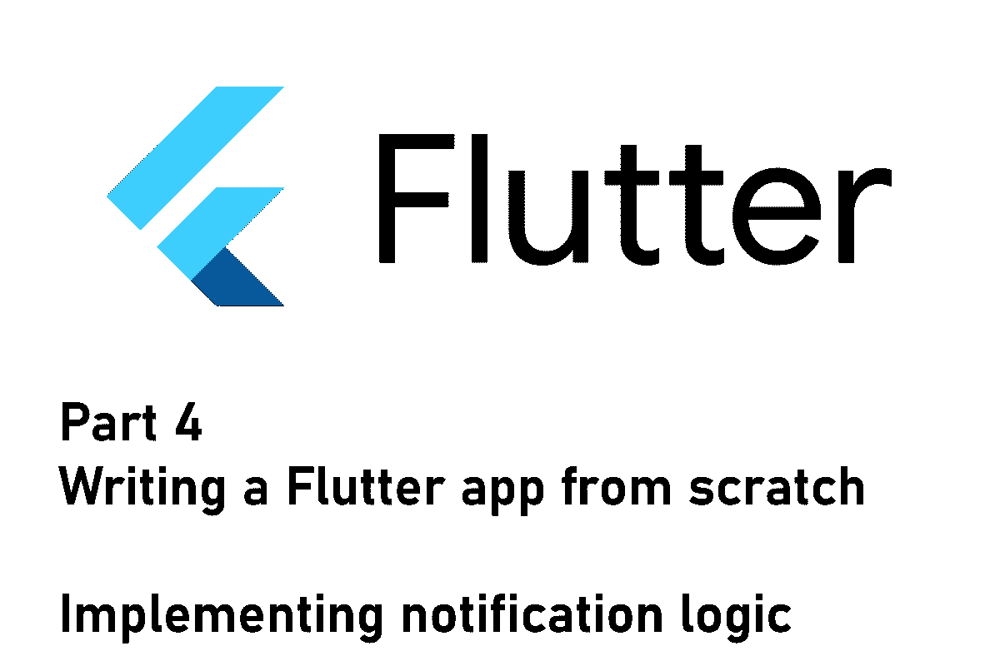
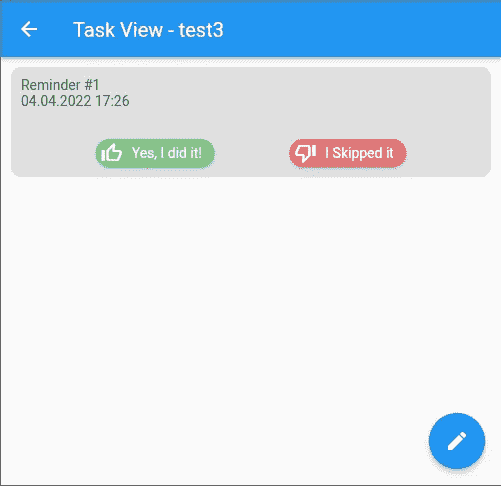
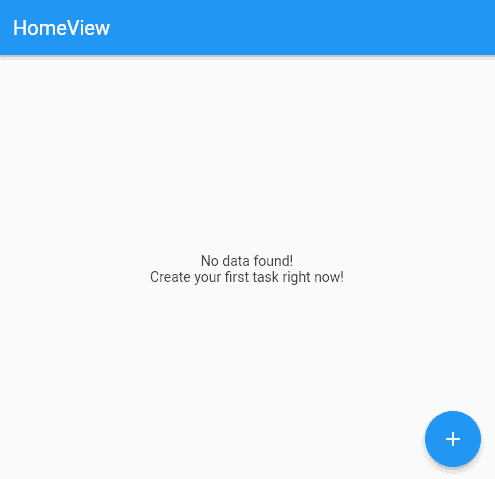

# Flutter 应用程序第 4 部分——实现逻辑和设计用户界面

> 原文：<https://levelup.gitconnected.com/flutter-app-from-scratch-part-4-implementing-logic-and-styling-the-user-interface-c08d2304b399>

## 终点线就在附近！

## 如何从头开始构建 Flutter 应用程序系列的第 4 部分。本文涵盖了通知逻辑的实现和用户界面的样式。

这是记录新的 Flutter 应用程序开发过程的系列文章的第四篇。在上一集中，我们将简单的后端与用户界面联系起来。我们还改进了应用程序，以便用户可以在应用程序中执行操作。
在本文中，我们将实现通知的逻辑部分，我们还将增强用户界面，使应用程序可用。

> 💡你更喜欢电子书而不是多媒体文章吗？现在就从我的 [Gumroad 商店](https://xeladu.gumroad.com/)免费获取[电子书](https://xeladu.gumroad.com/l/scratch)！

## 本地通知

这个应用程序的主要目的是创建任务，并在当天没有标记的情况下得到提醒。我们将使用包[flutter _ local _ notifications](https://pub.dev/packages/flutter_local_notifications)，它允许我们安排在任何我们想要的时间弹出通知。

## 实现通知逻辑

安装软件包后，我们需要初始化它。它需要一些特定于平台的设置，并在内部使用我们也需要初始化的[时区](https://pub.dev/packages/timezone)包。此外，我们需要注册一个处理程序，当用户点击一个通知时，这个处理程序就会被调用。

这段代码是为 Android 初始化插件的最简单的方法。我们通过将字符串“@mipmap/ic_launcher”传递给`AndroidInitializationSettings`类来使用默认的应用程序图标。`onSelectNotification`处理程序获取字符串有效载荷，并将其放入一个`StreamController<String>`。因此，如果用户点击一个通知，有效负载被保存，应用程序启动，用户被重定向到正确的子页面。`HomeView`页面包含一些处理这个逻辑的代码(见下文)。

## 安排通知

为了简单起见，通知将在每天的同一时间发送。当用户创建任务时，他分配一个开始日期和时间，这将是计算的基础值。
❗To 正确处理时区，我们将所有引用从`DateTime`更改为`tz.TZDateTime`。这种数据类型是时区敏感的，内置在 flutter_local_notifications 包中。否则，通知可能会在错误的时间送达。确保在您的文件中添加
`import ‘package:timezone/timezone.dart' as tz;`作为导入！

下面是安排通知的代码。

代码在当前日期之后寻找给定的`Task`的第一个`Reminder`对象。然后调用`zonedSchedule`方法，使用内部操作系统 API 调度通知。让我们来看看论点:

*   `task.id`是一个整数，用来标识一个通知。如果具有该 id 的通知已经存在，它将被覆盖。
*   `task.title`是将显示给用户的通知的标题。
*   `task.description`是将显示给用户的通知正文。
*   z .指定通知应送达的时区感知日期和时间。
*   `uiLocalNotificationDateInterpretation`和`androidAllowWhileIdle`应始终设置为这些值。
*   `payload`是要追加到通知中的任意字符串。用户看不到它。

## 应用程序启动时更新通知

为了限制计划通知的数量，应用程序只为每个任务计划一个通知。当应用程序启动时，会检查每个任务的通知。如果通知已送达，我们会在第二天安排新的通知。因此，如果你有 7 个任务，你最多有 7 个预定通知。如果应用程序不是每天都启动，则不会安排新的通知。

下面是应用程序启动时运行的代码，用于更新计划通知:

## 设计用户界面

用户需要在应用程序中标记一个提醒完成或跳过的可能性。因此，我们需要增强任务视图并提供给定的功能。

下面是修改后用户界面的截图:

任务的详细视图，带有标记为完成或跳过的选项

每个提醒都有两个按钮来设置状态。在后台，有一个提供者更新对象并触发页面的重新构建。代码如下所示。

首先，`singleTaskProvider`给我们用户想要改变的`Task`对象。然后我们通过寻找匹配的 id 得到用户点击的`Reminder`对象。我们用由`skipped`参数提供的新值创建对象的副本(当用户点击“我跳过了”时为真，当用户点击“是的，我做了”时为假)。旧对象从数据库中删除，新对象被插入。对`ref.refresh(singleTaskProvider(taskId))`的最后一个调用触发了小部件的重建。

这是一个简短的 gif 图片，展示了这款应用目前的样子:

当前应用程序状态的演示

## 添加一些单元测试

为了验证正确的功能，我们还为即将到来的提醒和通知的计算添加了一些单元测试。你可以在下面看到一些测试的例子。

这段代码验证了`ReminderService`为过去的事件创建了正确数量的`Reminder`对象(例如，用户几天没有使用应用程序)。一个`Reminder`安排在每天同一时间，未来总有一个`Reminder`。该对象将用于安排通知，正如您在上面的段落**中看到的，当应用程序启动**时更新通知。

## 结论

在本文中，我们实现了通知的逻辑部分，并增强了用户界面以使应用程序可用。

源代码可在 [GitHub](https://github.com/xeladu/flutter_app_example/tree/app-4) 上获得。你可以用它来构建自己的任务应用程序，甚至增强这个应用程序。随意使用代码，没有任何限制。

你的下一站是系列的第五部分，玩得开心🎉

 [## Flutter app 从头开始第 5 部分—让 UI 再次变得伟大！

### 如何从头开始构建 Flutter 应用程序系列的第 5 部分。这篇文章介绍了如何设计你的应用程序，以及在哪里…

levelup.gitconnected.com](/flutter-app-from-scratch-part-5-make-ui-great-again-a489b969d86c) 

如果你喜欢这篇文章，我会很高兴得到掌声👏(你知道可以拍几次吗？😎)另外，如果你还没有跟上我，我也很感激。

🌲|☕咖啡🎁[捐赠](https://www.paypal.com/donate/?hosted_button_id=JPWK39GGPAAFQ) |💻GitHub |🔔[订阅](https://xeladu.medium.com/subscribe)

顺便说一句:如果你还没有 Medium 会员资格，我推荐你使用[↓我的推荐链接◀](https://medium.com/@xeladu/membership) ，因为它会让你访问 Medium 上的所有内容，并以一小部分费用支持我，而不会为你带来任何额外费用。谢谢大家！✨

## 本系列的前几篇文章

 [## Flutter 应用程序第 3 部分——构建用户界面和管理状态

### 如何从头开始构建 Flutter 应用程序系列的第 3 部分。本文详细介绍了如何将 UI 与…

levelup.gitconnected.com](/flutter-app-from-scratch-part-3-building-the-user-interface-and-managing-state-dd2bb7dffbec)  [## Flutter app 从头开始第 2 部分—定义模型和建立数据库

### 如何从头开始构建 Flutter 应用程序系列的第 2 部分。这篇文章是关于模型定义和…

levelup.gitconnected.com](/flutter-app-from-scratch-part-2-define-models-and-set-up-database-78a67666527a)  [## Flutter app 从零开始第 1 部分—规划的功能、应用设计、应用框架

### 本文涵盖了计划中的应用程序特性、环境设置以及一个新的 Flutter 应用程序的第一个应用程序框架。

levelup.gitconnected.com](/flutter-app-from-scratch-part-1-planned-features-app-design-app-skeleton-c87f2c21f47a)