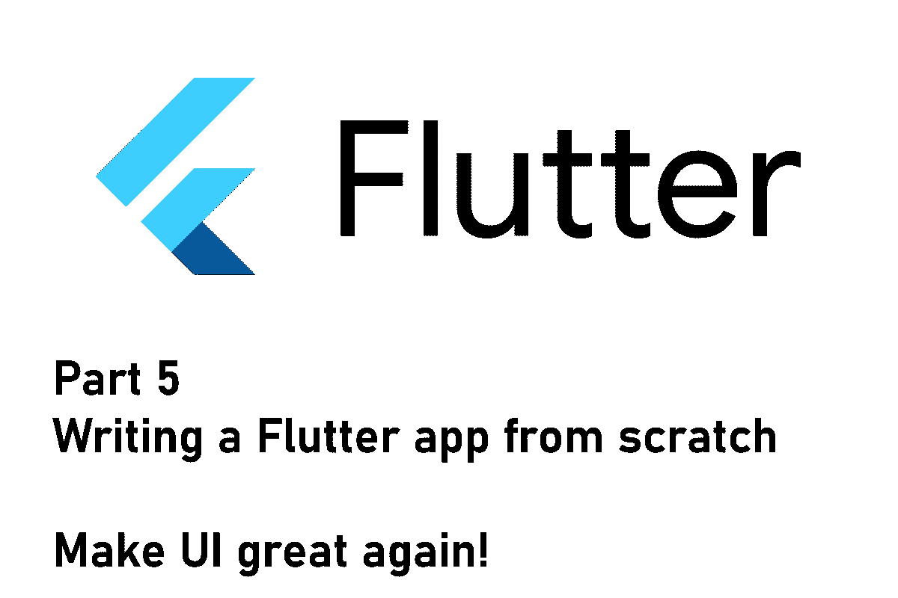
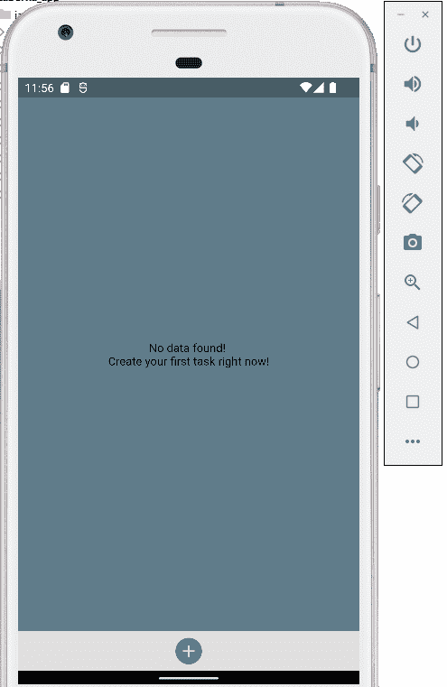
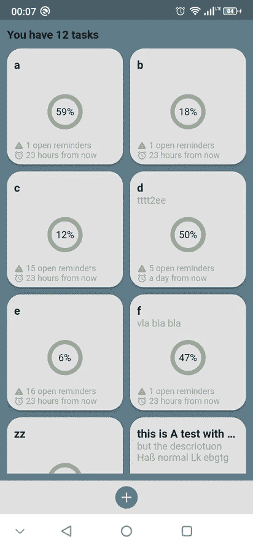
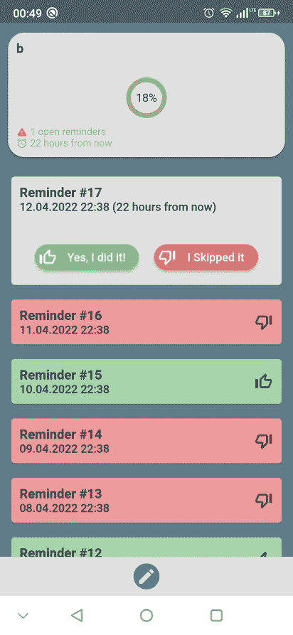
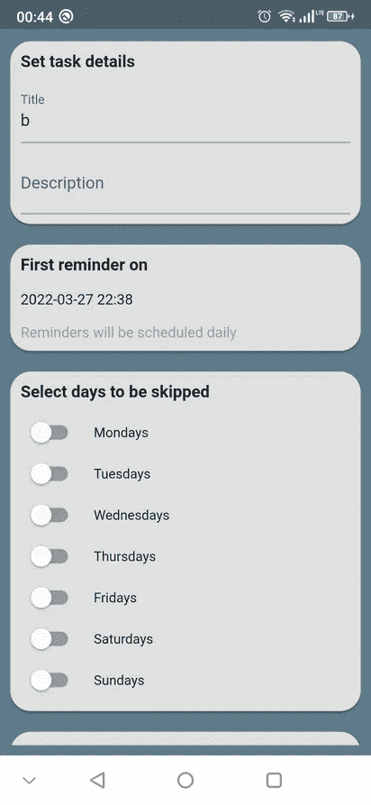

# Flutter app 从头开始第 5 部分—让 UI 再次变得伟大！

> 原文：<https://levelup.gitconnected.com/flutter-app-from-scratch-part-5-make-ui-great-again-a489b969d86c>

## 总有需要改进的地方！

## 如何从头开始构建 Flutter 应用程序系列的第 5 部分。这篇文章讲述了如何设计你的应用程序，以及从哪里获得灵感。

这是记录新的 Flutter 应用程序开发过程的系列文章的第五篇。在上一集中，我们实现了通知的逻辑部分，并增强了用户界面，使应用程序变得可用。

在这篇文章中，我们将修改用户界面，使其看起来不像只是一个演示应用程序(嗯，基本上是这样，但没有人需要知道这一点😎).

> 💡你更喜欢电子书而不是多媒体文章吗？现在就从我的 [Gumroad 商店](https://xeladu.gumroad.com/)免费获取[电子书](https://xeladu.gumroad.com/l/scratch)！

## 当前应用状态

这篇文章之后我们的应用程序的当前状态

## 获得灵感

如果你和我一样，在设计应用程序时，你不是很有创造力。我非常喜欢编码，但是我非常不擅长为一个应用程序创造独特的风格。这就是为什么我要尽可能多地获取灵感。我最近发现了一篇文章，里面有各种类型应用的免费 Flutter 应用模板。如果你需要一些想法，看看吧。

 [## 40+免费颤振模板 2022

### 你是一个有抱负的 Flutter 应用程序开发者吗？或者已经有经验的开发人员正在寻找一个好的模板来制作您的…

double-pablo.medium.com](https://double-pablo.medium.com/40-free-flutter-templates-2022-78766d34b9cd) 

其他灵感来源是谷歌和苹果应用商店中的著名应用。他们使用的 UI 指南被证明是非常直观和用户友好的。我建议检查它们，并采用它们的布局或风格的一部分。但是不要做一个模仿者，也要带来你自己的想法💡

我决定使用蓝色的主题颜色，圆角元素，直观的颜色，尽可能使用手势。

## 主页视图

我们应用程序的主视图屏幕

主屏幕上代表任务的圆角矩形是`TaskWidget`。它在顶部显示标题和描述。中间有一个进度指示器，告诉你有多少提醒被标记为“完成”。包装[百分比指示器](https://pub.dev/packages/percent_indicator)用于该目的。在底部，我们有关于打开提醒和下一个预定通知的提示。相对时间信息由 [timeago](https://pub.dev/packages/timeago) 包提供。

🔹要编辑任务，只需点击小工具。
🔹要删除任务，只需长按小工具并确认操作。
🔹导航栏允许创建新任务。

这里是`TaskWidget,`的代码。

`WrapperWidget`是一个带有圆角和阴影的`Container`小部件，它承载一个`ListTile`小部件来访问`onTap`和`onLongPress`方法。剩下的只是一个按垂直顺序排列元素的`Column`。

## 任务视图

显示所选任务详细信息的任务视图屏幕

在顶部，我们有一个`TaskSummaryWidget`(非常类似于一个`TaskWidget`)作为标题，在它的下面有一个自任务创建以来安排的所有提醒的列表。若要将提醒事项标记为完成或跳过，您可以使用按钮或从右向左推送(完成)和从左向右推送(跳过)。顶部的小部件将会立即更新，同时提醒已更改的内容。

导航栏路由到编辑页面。

下面是实现滑动手势的代码:

Flutter 提供了一个你可以使用的`Dismissible`小部件。属性告诉我们可以向哪个方向滑动。执行滑动时会触发`onDismissed`功能。属性很重要，这样 Flutter 就知道什么元素被滑动了。给它一个唯一的标识符。`background`属性包含一个当滑动`Dismissible`时显示的小部件。

## 任务编辑视图

带有文本字段、切换块和提升按钮的 TaskEditView

TaskEditView 非常简单。所有控件都应该是自我解释的。创建新任务或编辑现有任务。基本就是这样。

## 样式资源

将经常使用的资源收集到一个文件中是一种很好的做法。在我的例子中，我有文本样式和颜色的类。因此，如果我要改变外观和感觉，我只需改变整个应用程序的一个变量。这两个类如下所示:

## 保持`build()`方法小！

这与性能无关，而是关于代码的可理解性。如果您的小部件中的`build()`方法超过 80 行，您应该在函数中提取部分代码，或者如果代码在几个地方使用，在定制小部件中提取。

💡如果您担心性能，那么将代码提取到单独的小部件中，但是不要调用创建小部件的函数！

下面是这个 app 目前`HomeView`的一个不好的例子。

## 结论

在本文中，我向您展示了用户界面是如何改进的。如果你不是像我一样有创造力的人，寻找 UX 设计的灵感是很重要的。代码并不完美，但我希望您能对开发过程有所了解。

源代码可以在 [GitHub](https://github.com/xeladu/flutter_app_example/releases/tag/app-5) 上获得。读它，叉它，用它。没有任何限制😊

如果你喜欢这篇文章，我会很高兴得到掌声👏(你知道可以拍几次吗？😎)另外，如果你还没有跟上我，我也很感激。

🌲 [linktr.ee](https://linktr.ee/xeladu) | ☕ [咖啡](https://www.buymeacoffee.com/xeladu) |🎁[捐赠](https://www.paypal.com/donate/?hosted_button_id=JPWK39GGPAAFQ) |💻GitHub |🔔[订阅](https://xeladu.medium.com/subscribe)

顺便说一句:如果你还没有 Medium 会员，我推荐你使用[│我的推荐链接◀](https://medium.com/@xeladu/membership) ，因为它会让你访问 Medium 上的所有内容，并以一小部分费用支持我，而不会为你带来任何额外费用。谢谢大家！✨

## **本系列之前的文章**

 [## Flutter 应用程序第 4 部分——实现逻辑和设计用户界面

### 如何从头开始构建 Flutter 应用程序系列的第 4 部分。本文涵盖了通知的实现…

levelup.gitconnected.com](/flutter-app-from-scratch-part-4-implementing-logic-and-styling-the-user-interface-c08d2304b399)  [## Flutter 应用程序第 3 部分——构建用户界面和管理状态

### 如何从头开始构建 Flutter 应用程序系列的第 3 部分。本文详细介绍了如何将 UI 与…

levelup.gitconnected.com](/flutter-app-from-scratch-part-3-building-the-user-interface-and-managing-state-dd2bb7dffbec)  [## Flutter app 从头开始第 2 部分—定义模型和建立数据库

### 如何从头开始构建 Flutter 应用程序系列的第 2 部分。这篇文章是关于模型定义和…

levelup.gitconnected.com](/flutter-app-from-scratch-part-2-define-models-and-set-up-database-78a67666527a)  [## Flutter app 从零开始第 1 部分—规划的功能、应用设计、应用框架

### 本文涵盖了计划中的应用程序特性、环境设置以及一个新的 Flutter 应用程序的第一个应用程序框架。

levelup.gitconnected.com](/flutter-app-from-scratch-part-1-planned-features-app-design-app-skeleton-c87f2c21f47a)