# Flutter:异步 Redux 和 GraphQL

> 原文：<https://levelup.gitconnected.com/flutter-async-redux-graphql-7c0db2e4d2be>

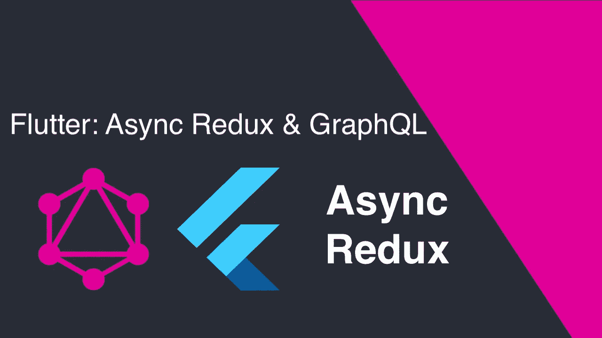

使用 Async Redux 和 GraphQL 开发 Flutter 应用程序。

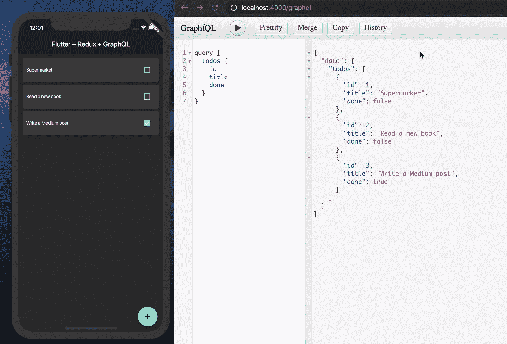

首先，如果您带着降落伞坠落到这里，这里将显示的只是验证一个想法的概念证明(PoC)。对你理解和提炼新知识可能会有用。

> 这是一个从葡萄牙语🇧🇷翻译成英语的版本。你可以在这里找到的原文：<https://medium.com/@oguibueno/flutter-async-redux-graphql-b581d8097b84>

# 摆动

它是一个用 Dart 开发的开源 SDK，Dart 是一种由 Google 创建的面向对象编程语言，其第一个版本于 2013 年推出，主要意图是取代 JavaScript。2018 年，2.0 版本发布，全面优化，多方面改进，其中之一是客户端对应用、web 和桌面的关注。

Flutter 不使用原生组件，所以都是图形引擎自己渲染的，比如按钮、文本、媒体、背景等。然而，它的灵感来自 React，其中的组件(也称为小部件)是声明式编写的，当然，它有一个热重载。

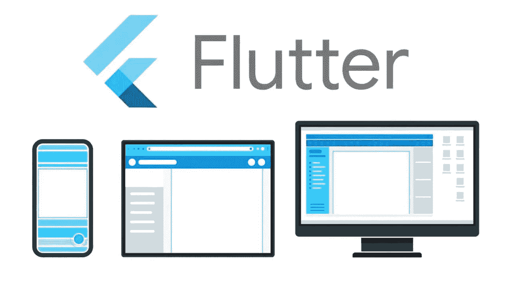

# 状态管理

在应用程序中，状态管理是数据(来自后端)或本地变化与前端用户界面元素的数据表示之间的接口。状态可以使来自不同组件的数据保持同步，因为每次状态更新都会再次呈现所有相关组件。状态管理也可以作为不同组件之间的通信手段。

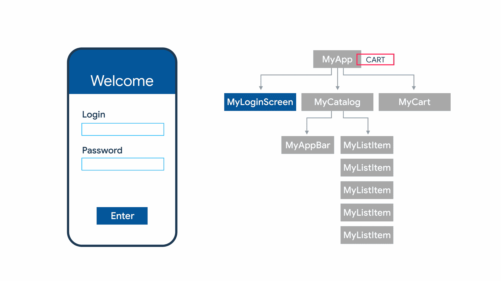

在 Flutter 中，有一些管理状态的选项，在下面的链接中，你可以找到 Flutter 团队自己推荐的那些。

 [## 状态管理方法列表

### 状态管理是一个复杂的话题。如果你觉得你的一些问题没有得到回答，或者…

颤振. dev](https://flutter.dev/docs/development/data-and-backend/state-mgmt/options) 

# 异步冗余

因为我已经使用过 Redux 和 React，所以我寻找一个允许我以同样的“方式”进行开发的库，因为我已经知道 Redux 作为状态管理器的强大功能。所以，我找到了一个名为 Flutter Redux 的库，但它有很多样板文件，最终让我寻找另一个。我最喜欢的一个叫做 Async Redux，非常容易理解和实现，有很多特性，文档也很棒！祝贺 Marcelo Glasberg 的出色工作，并感谢对这个应用程序的代码审查！

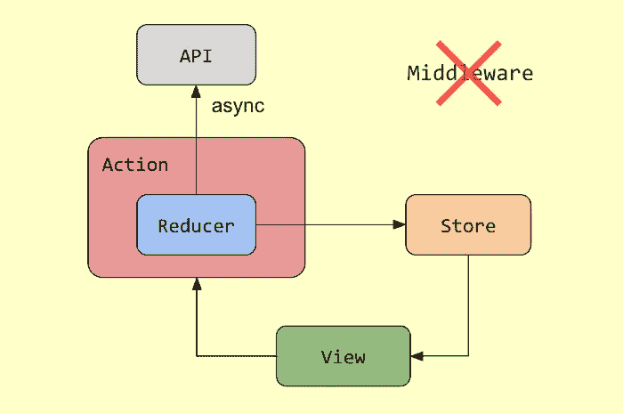

# GraphQL

这是一种由脸书在 2015 年开发并推出的 API 查询语言。其主要工具有:查询、变异和订阅。在这个例子中，我们将只使用查询和突变。

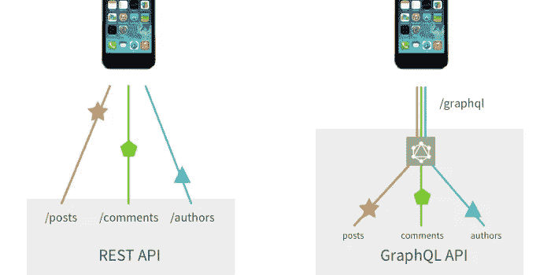

2019 年 4 月，我做了一个关于。NET Architecture trail，在 Florianópolis 的开发者大会上。我谈到了如何发展现有的 REST 架构，并在。网芯。下面我离开知识库:

[https://github.com/oguibueno/TDC2019](https://github.com/oguibueno/TDC2019)

# 把手举起来。

项目结构如下，业务和客户分离。业务拥有我们的状态管理器和对 API 的访问，客户端拥有我们的小部件，没有太多的逻辑和耦合。

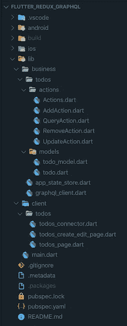

使用它们的库可以在**的 pubspec.yaml** 文件中找到。

> async _ redux:2 . 1 . 5
> graph QL:^2.1.0

首先，我们将在 main.dart 应用程序的根目录下“插入”Async Redux。这将使我们的整个应用程序能够“访问”我们状态的数据。

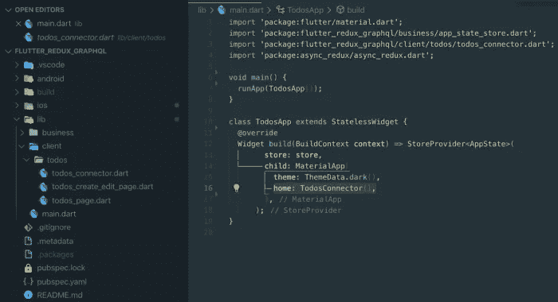

主条目将是**todo connector**，它作为我们的 **TodosPage** 和 **TodoModel** 的一种“插件”，这意味着我们的**小部件**不依赖于状态管理器。使我们的代码更加干净和模块化。

**AppState** 是 **Async Redux** 的关键部分，因为在那里我们可以访问关于我们状态的信息。整个应用程序只有一个 **AppState** 。

第 13 行和第 14 行的 **copy** 方法负责生成新状态，在新旧状态之间进行“磨合”。第 16 行的
**todoList** 用空的 **Todo** 数组初始化。

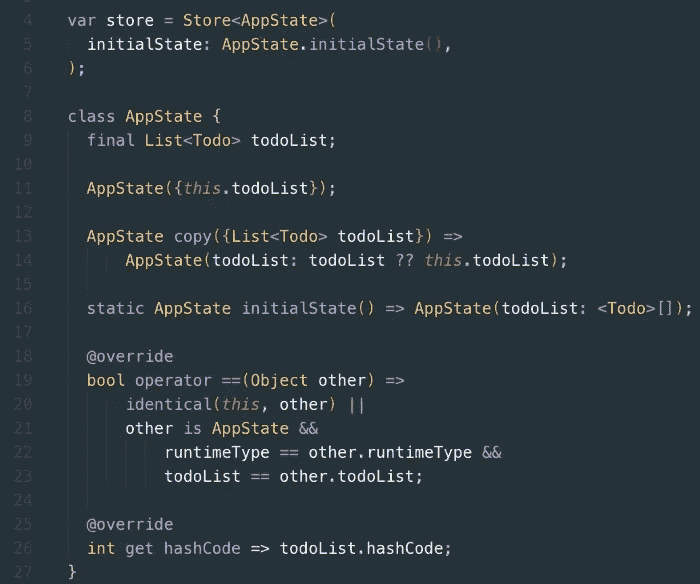

这是 TodosPage 可以做的所有动作被映射的地方，从而将它注入到它的构造函数中。

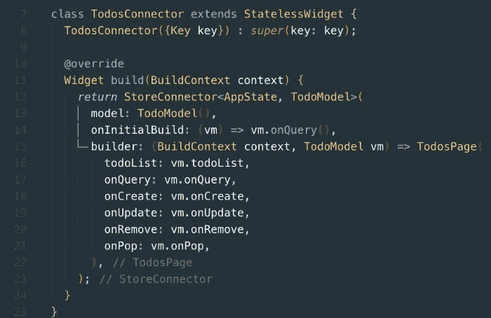

对于打开应用程序时包含数据的清单，我们将在第一次构建小部件时使用 **onInitialBuild** 在 **GraphQL** API 中执行查询。

正是在**to model**中，我们将必要的动作映射到 **dispatch** 。它也被映射到这里，我们希望在这个上下文中公开的数据来自我们的状态。在这种情况下，我们有一个名为 **todoList** 的属性，它是从来自 Store() 的 **state.todoList** 填充的。**调度**和**状态**都是由 **Async Redux** 本身注入的，这大大减少了代码量，使其更加干净易读。

 [## async_redux | Flutter 包

### Async Redux 是 Redux 的一个特殊版本，它易于学习，易于使用，易于测试，没有样板文件

公共开发](https://pub.dev/packages/async_redux#connector) 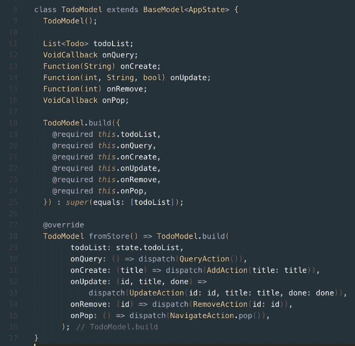

我们需要定义一个异步的**缩减器**，所以我们将其定义为 async。既然对 **GraphQL** 端点的调用是 **Future** ，那么我们必须**在第 29 行等待**这个外部查询方法。

[https://pub.dev/packages/async_redux#async-reducer](https://pub.dev/packages/async_redux#async-reducer)

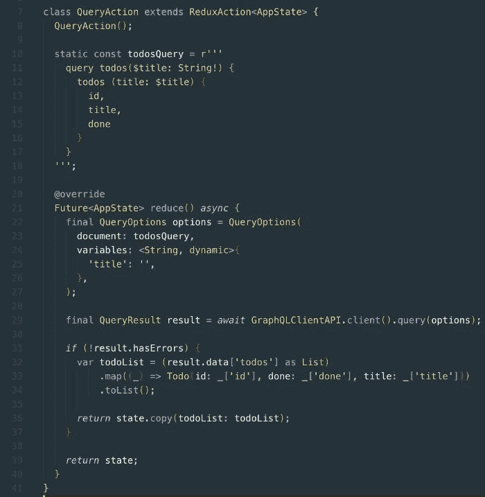

**QueryOptions** 是一个发送到 **GraphQL** 的对象，在本例中包含一个查询，位于第 10 行。

**GraphQLClientAPI** 是我们 API 的配置，我在第 7 行放了 Android 模拟器的 URL，在第 8 行放了 iOS 模拟器的 URL。

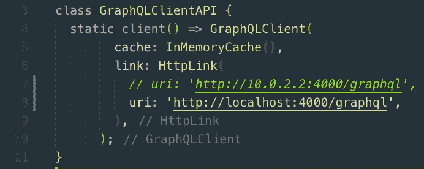

如果请求没有错误，结果被转换成一个列表，映射到 **Todo** 类型，因此，我们更新我们的状态，生成一个 **state.copy** 。

这是我们的模型 **Todo** 。

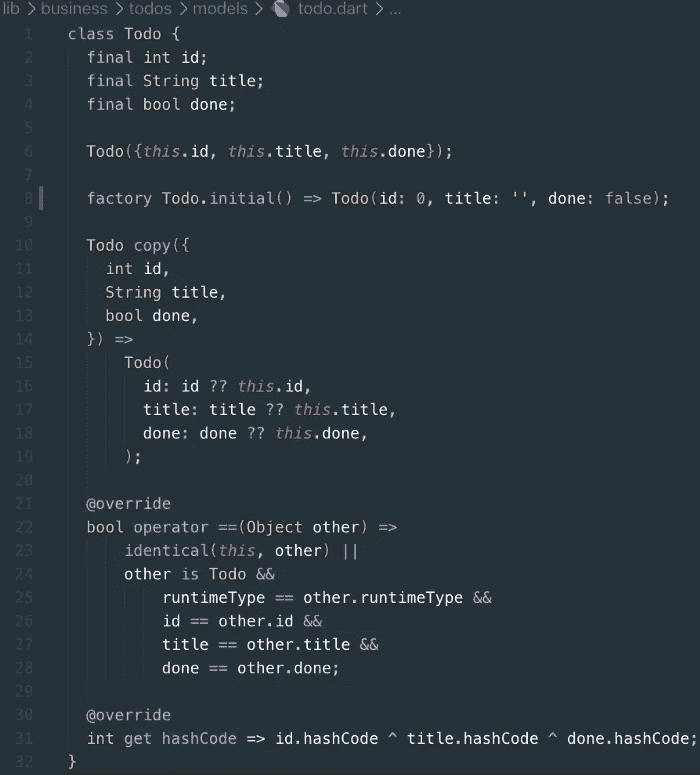

在请求 API 之后，**缩减器**将创建一个具有新状态的新副本，并在其中进行更改。当我们的 **TodosPage** 通过 **TodoModel** 与 **StoreConnector** 相连接，并且 **todoList** 被注入到 **TodosPage** 的构造中时，我们用来自 API 的数据填充 ListView，从而在第 31 行组装卡片。

> PS:如果不想更新状态，就返回 null。

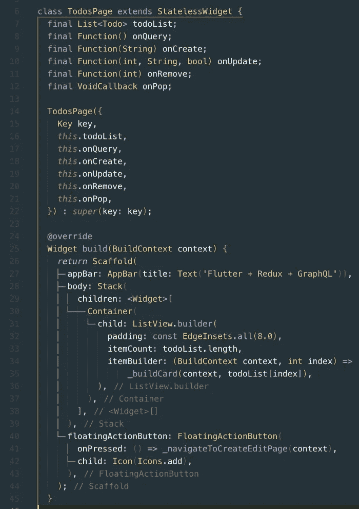

我们的主清单如下所示:

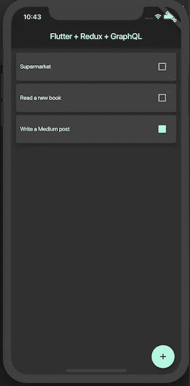

**GraphQL** API 是用**节点**和 **Express** 构建的。上例所示的端点，使用了查询所有在 ***模式内*下面的**。

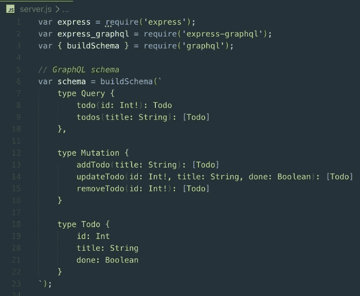

在定义了**模式**之后，第 45 行定义了查询，它消耗了 **todosMock** ，一个用 3 个条目初始化的数组。定义根之后，它被注入到 **Express** app 中，然后在端口 4000 上的端点/graphql 处公开。

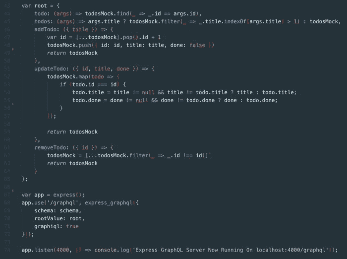

在 **GitHub** 上，你会找到这个应用的完整 **CRUD** 。

谢谢！

特别感谢[Marcelo Glasberg](https://medium.com/u/c2db527bc802?source=post_page-----7c0db2e4d2be--------------------------------),[**Async Redux**](https://pub.dev/packages/async_redux)的创造者，他非常细心，并亲自审阅了本出版物中显示的颤振代码。

# 开源代码库

[颤振应用库](https://github.com/oguibueno/flutter_redux_graphql)

[带 GraphQL 的节点 API 库](https://github.com/oguibueno/node_graphql)

# 联系人

[领英](https://www.linkedin.com/in/oguibueno/)

[推特](https://twitter.com/oguibueno)

# 有用的链接

 [## 颤振介绍:基础知识

### 斯坦尼斯拉夫·特莫萨《颤振入门:基础知识》我一直听说颤振有多神奇，我…

www.freecodecamp.org](https://www.freecodecamp.org/news/an-introduction-to-flutter-the-basics-9fe541fd39e2/)  [## 状态管理

### 文档开发数据和后端状态管理状态管理如果您已经熟悉…

颤振. dev](https://flutter.dev/docs/development/data-and-backend/state-mgmt/intro)  [## 简单的应用状态管理

### 现在，您已经了解了声明式 UI 编程以及暂时状态和应用程序状态之间的区别，您已经准备好…

颤振. dev](https://flutter.dev/docs/development/data-and-backend/state-mgmt/simple)  [## AsyncRedux para 颤振:O Redux sem 样板

### 特别是对于父母、孩子、父母来说。

medium.com](https://medium.com/flutterando/async-redux-pt-brasil-e783ceb13c43)  [## GraphQL:一种 API 查询语言。

### 学习准则社区规范行为准则基金会景观学习准则社区规范行为准则基金会…

graphql.org](https://graphql.org/)  [## 使用 Node.js 和 Express 创建 GraphQL 服务器

### 这篇文章首先在 CodingTheSmartWay.com 上发表。

medium.com](https://medium.com/codingthesmartway-com-blog/creating-a-graphql-server-with-node-js-and-express-f6dddc5320e1)