# Flutter —认证

> 原文：<https://levelup.gitconnected.com/flutter-authentication-adb8df7cf673>


[加入媒体](/@simbu/membership)查看我所有的[文章](https://medium.com/@simbu/simbus-articles-d9b999b115a7)。

> **认证**(来自希腊语:αὐθεντικός·authentikos，“真实的，真实的”，来自αὐθέντης·奥森特斯，“作者”)
> 
> [维基](https://en.wikipedia.org/wiki/Authentication)

如果我相信我知道你是谁，那么我可以给你访问你的个人申请数据。

身份验证可能是应用程序必须处理的最大的交叉问题。

将它作为一个特性添加到 [DigestablePrologue](https://gitlab.com/simbu-mobile/digestableprologue) 中，通过更新一组代码，我们可以多次提取和重用它，并减少维护。

让我们从一个高层次的、有意模糊的业务需求开始:

> 应用程序将能够使用现代身份认证来保护对屏幕和 API 的访问
> 
> 命题部的朱莉娅

在最初的对话之后，我们决定在一定程度上接受需求:

*   向上滑动登录屏幕。
*   使用微软 AD 或谷歌 Firebase 进行认证。
*   在设置中注销。

然后，我们举办了一个研讨会，通过示例创建规范:

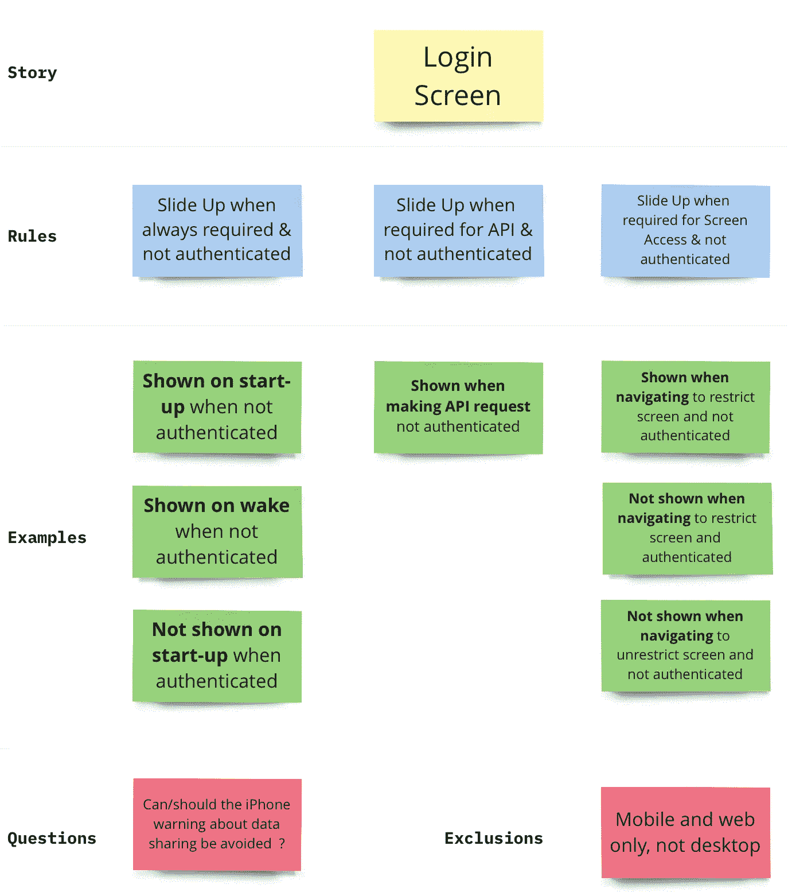

登录向上滑动规范

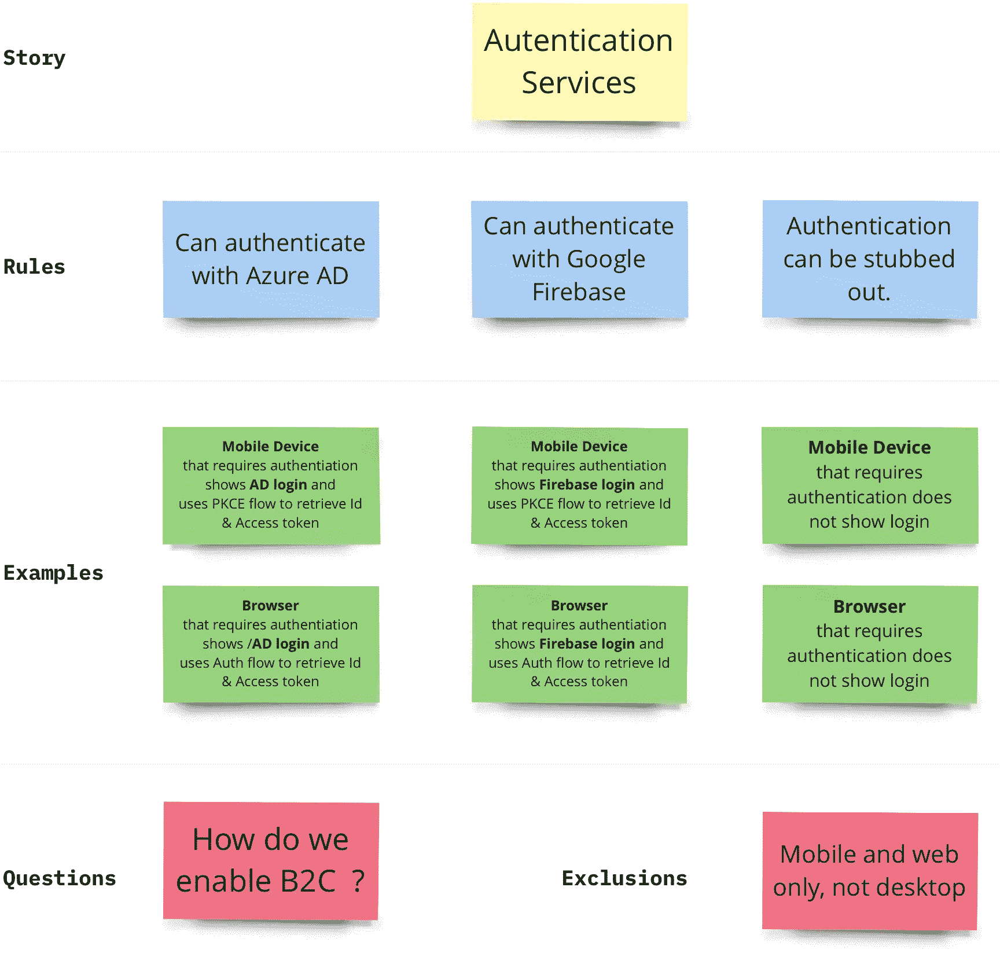

授权服务规范

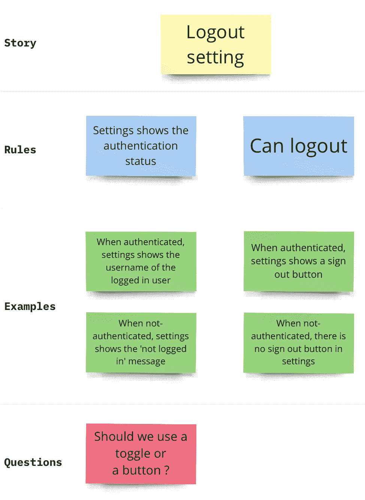

注销设置规范

并将它们转换成可执行的规范:

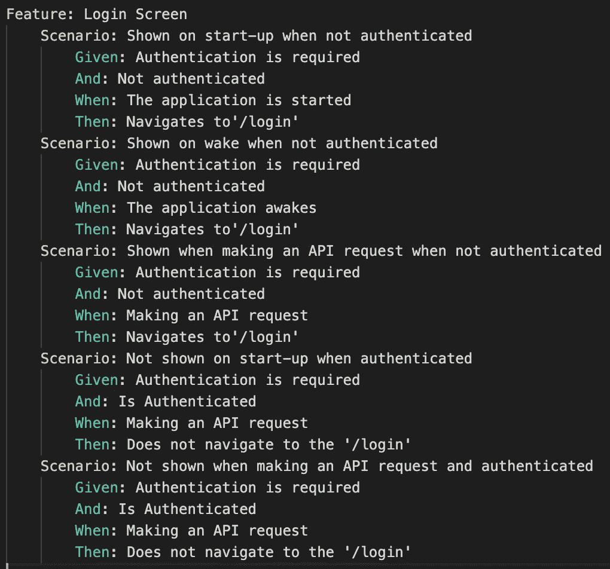

登录屏幕功能测试

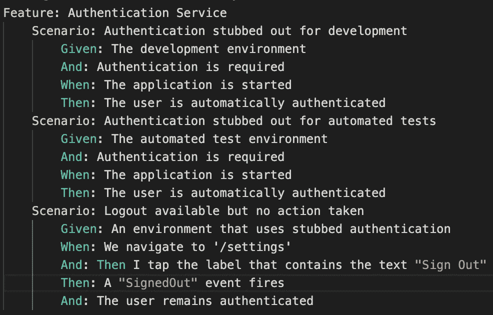

认证服务功能测试

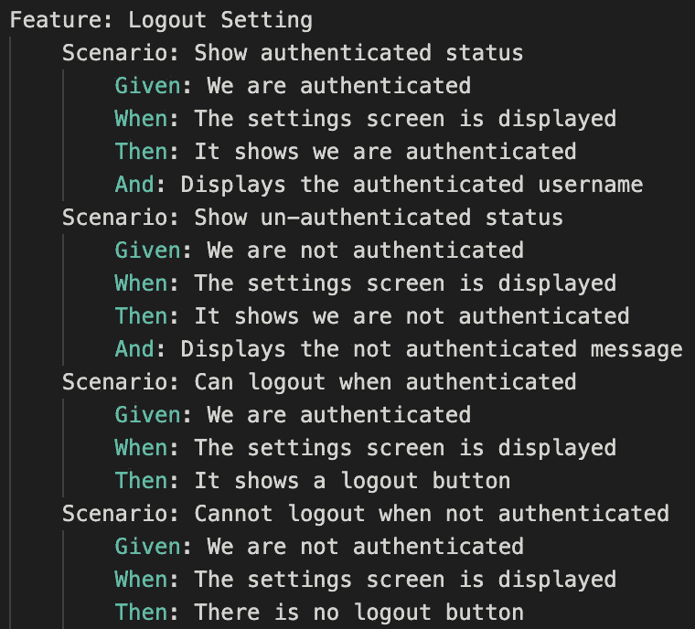

注销设置功能测试

为了减少这篇文章的长度，我已经部分实现了注销设置，跳过了即将添加的实现 AD & Firebase 认证服务。

结果，特性测试的结果不再完全反映最初的规格，但是一旦你陷入细节中，范围或方向的改变是正常的。

我发表的所有关于身份验证和数据访问的文章将很快被汇总成一篇摘要文章，即一个迷你系列。

## 哒哒

该环境是从 app_config.json 文件中读取的，该文件是在应用程序启动时加载的，并由用于 live 和 UAT 的 [CodeMagic](https://codemagic.io) 集成构建注入:

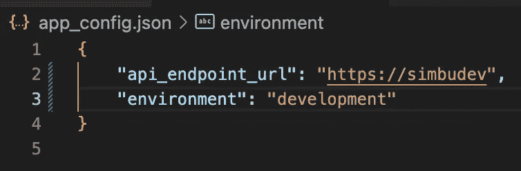

基于环境选择身份验证服务:

```
AuthenticationServiceStateNotifier selectAuthenticationServiceByEnvironment() {
  var environment = GlobalEnvironmentValues.instance.environment;

  AuthenticationService authenticationService = environment == Environments.live
      ? LiveAuthenticationService()
      : environment == Environments.uat
          ? UatAuthenticationService()
          : StubbedAuthenticationService();

  return AuthenticationServiceStateNotifier(authenticationService);
}

final authenticationServiceProvider = StateNotifierProvider<
    AuthenticationServiceStateNotifier, AuthenticationService>(
  (ref) => selectAuthenticationServiceByEnvironment(),
);
```

当应用程序启动时，它会检测存根验证服务并自动验证用户:

```
if (ref.read(authenticationServiceProvider).typeName ==
        AuthenticationService.authenticationServiceTypeNameStubbed) {
        ref.read(authenticationProvider.notifier).setIsAuthenticated(true);
}
```

设置屏幕是使用一个很棒的包 [settings_ui](https://pub.dev/packages/settings_ui) 添加的，它允许用户注销，并调用认证服务上的注销方法:

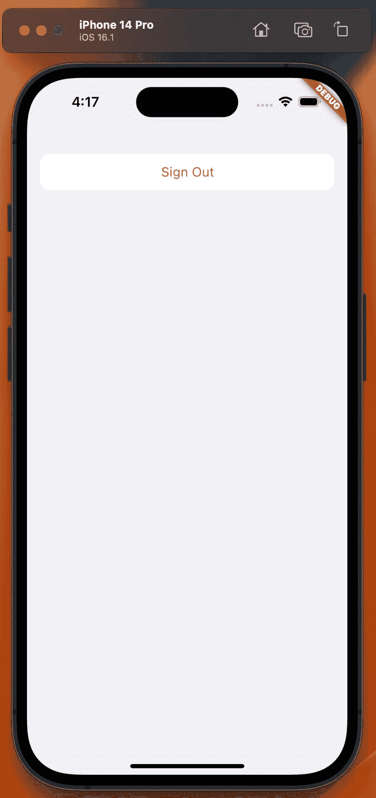

注销设置

所有这些都包含在我们的自动化功能测试中:

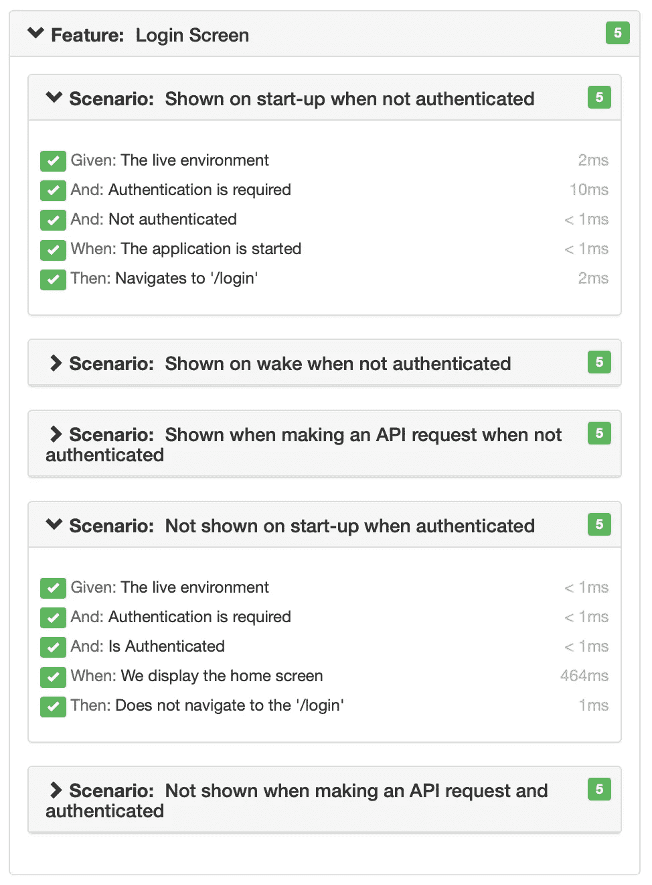

登录功能测试报告

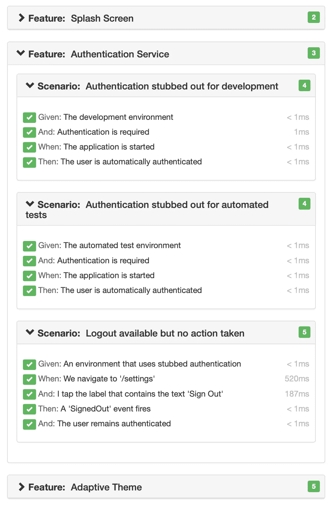

认证功能测试报告

在未来的帖子中，当我们添加 UAT 和实时环境时，它将在未经身份验证时路由到登录屏幕，并调用真正的身份验证服务来获取访问令牌，这些令牌将由 [Flutter Data](https://flutterdata.dev) 用来发出安全的 API 请求。

登录屏幕和认证服务已添加到[digestable prolog](https://gitlab.com/simbu-mobile/digestableprologue)和 [DigestableMe](https://gitlab.com/simbu-mobile/digestibleme) 的设置屏幕。

## 经验值

## 引发导航事件

为了响应导航，我在 GoRouter 上增加了一个观察者

```
MaterialApp.router(
	...
    navaigationObservers: [
       NavigationEventsObserver(ref.read(eventStoreProvider))
    ],
	...
)
```

每次导航发生时，它都会在事件总线上引发一个导航事件:

```
/// Raises Nativigated events when the GoRouter navigates.
class NavigationEventsObserver extends NavigatorObserver {
  final EventStore eventStore;
  NavigationEventsObserver(this.eventStore);

  @override
  void didPush(Route<dynamic> route, Route<dynamic>? previousRoute) {
    raiseNavigatedEvent(route.settings.name ?? "");
  }

  @override
  void didPop(Route<dynamic> route, Route<dynamic>? previousRoute) {
    raiseNavigatedEvent(route.settings.name ?? "");
  }

  @override
  void didReplace({ Route<dynamic>? newRoute, Route<dynamic>? oldRoute }) {
    raiseNavigatedEvent(newRoute?.settings.name ?? "");
  }

  void raiseNavigatedEvent(String routeName) {
    even(fn)tStore.bus.fire(Navigated(routeName));
  }
}
```

然后，测试可以用它来证明一个导航动作已经发生，目前事件存储只保存最后一个导航事件。

很可能我会扩展它，通过监听事件并记录它们来添加应用程序监控。

## Flutter 应用生命周期

为了在唤醒时执行所需的身份验证，我需要用一个覆盖来捕获应用程序状态([applifecyclast](https://api.flutter.dev/flutter/dart-ui/AppLifecycleState.html))。

```
@override
  void didChangeAppLifecycleState(AppLifecycleState state) {
    ref.read(appLifecycleStateProvider.notifier)
		.setLifecycleState(state);
    ref.read(authenticationServiceProvider.notifier)
		.checkAuthenticated();
  }
```

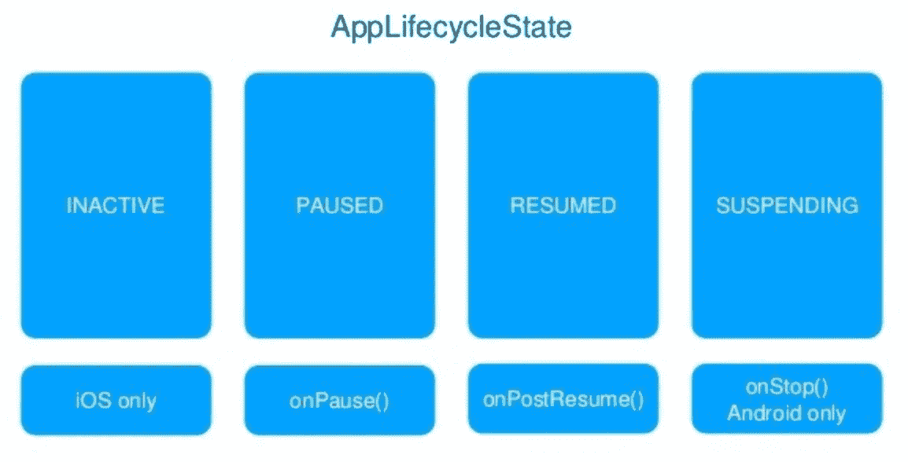

可观察的生命周期事件(AppLifecycleState):

*   **非活动** —应用程序处于非活动状态，不接收用户输入。这个事件只在 iOS 上有效，因为在 Android 上没有对应的事件
*   **暂停** —应用程序当前对用户不可见，不响应用户输入，在后台运行。这相当于 Android 中的 onPause()
*   **恢复** —应用程序可见并响应用户输入。这相当于 Android 中的 onPostResume()
*   **暂停** —应用程序暂时暂停。这相当于 Android 中的 onStop 它不会在 iOS 上触发，因为在 iOS 上没有对应的事件

## 特性测试支持你

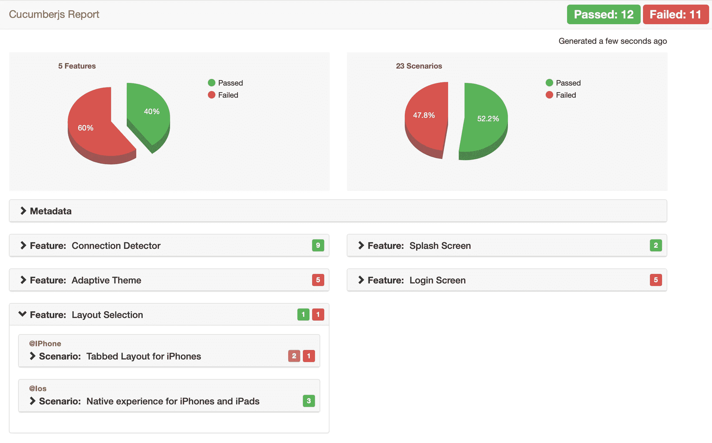

功能测试让我们知道我们已经破坏了其他功能

这很好，我做了一些相当大的改变，但我知道我需要修复什么来避免任何回归错误。

测试契约确保了应用程序仍然能够完成早期功能的目标。

## 功能测试认证

事实证明，通过特性测试非常棘手，但是为了确保身份验证按计划进行，让它们就位是值得的。

主要问题是环境是在测试步骤运行之前从文件加载的，这意味着我们已经运行了逻辑来检查身份验证并重定向到登录屏幕。

在几次通过代码改变环境的尝试失败后，我选择了一套独立的特性测试:


加载实时配置值文件的 Gherkin 特性测试配置。

加载不同的环境配置文件:


实时配置值文件

这需要更多的维护，但也是必要的，因为我们将在集成和部署构建中注入配置文件，以保护机密值。

## 使用事件来解决难以实现的功能测试步骤

一些登录功能步骤很难测试，因为该功能将在使用微应用 [DigestablePrologue](https://gitlab.com/simbu-mobile/digestableprologue) 的父应用 [DigestableMe](https://gitlab.com/simbu-mobile/digestibleme) 中实现:

```
When: Making an API request
```

这意味着我们不能在[digestable prolog](https://gitlab.com/simbu-mobile/digestableprologue)中导航到屏幕或发出 API 请求。

这是一个耦合问题，我们可以使用事件总线来解决。

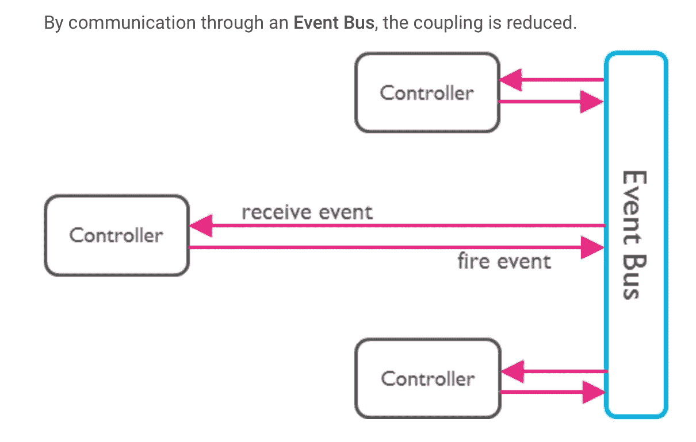

应用程序现在只是监听事件并采取适当的行动，允许我们只在步骤中引发事件，而不是实际的导航或 API 调用。

何时:生成 API 请求事件:API 请求

使用 EventBus 还有其他好处，我们可以在以后添加，比如记录引发的事件。

## 规程—实施特征步骤

使用 Flutter Gherkin 最繁琐的部分是创建所有的步骤方法，我将尝试使用构建器来自动完成这一工作，创建包含要填写的基本步骤的文件。

与此同时，我使用可视化代码中的突出显示来手动执行这些操作，以规范所需的步骤，例如:

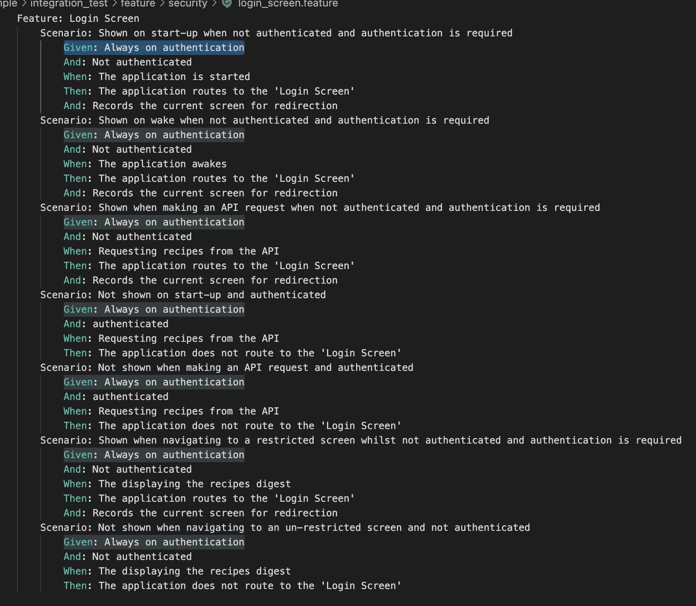

对此:

```
Given: Always on authentication
And: Not authenticated
And: authenticated

When: The application is started
When: The application awakes
When: Making an API request 
When: Displaying a restricted screen
When: Displaying an unrestricted screen

Then: The application routes to the 'Login Screen'
And: Records the current screen for redirection
```

然后将框架方法添加到 step 文件中

## 不重要的

## 路线授权

用自定义属性赋予路由角色，那么就可以实现基于非角色，每个人都有，但是可以扩展。

没有实现与登录/id/认证的限制屏幕，因为它的一些不同的东西，它的授权和路线警卫，需要时通过 GoRouter 重定向作为警卫。

## 链接

*   [消息命名约定](https://jimmybogard.com/message-naming-conventions/)
*   [如何在事件驱动架构中命名事件](https://richygreat.medium.com/how-to-name-events-in-event-driven-architecture-cc962d93ed60%0A)
*   [飞镖:接口](https://medium.com/jay-tillu/interface-in-dart-5da3b139a3ea)
*   [Flutter App 生命周期](https://medium.com/pharos-production/flutter-app-lifecycle-4b0ab4a4211a)
*   [应用循环地产](https://api.flutter.dev/flutter/dart-ui/AppLifecycleState.html)

## 包装

*   [事件 _ 总线](https://pub.dev/packages/event_bus)
*   [设置 _ui](https://pub.dev/packages/settings_ui)

[订阅](https://medium.com/@simbu/membership)查看所有[文章](/@simbu/flutter-digestableme-articles-4b39de2d82fc)，或者查看[代码](/@simbu/flutter-digestableme-code-ecb5027fb7b1)。