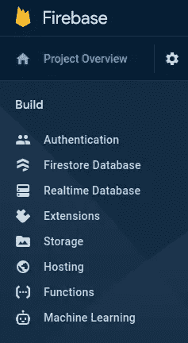
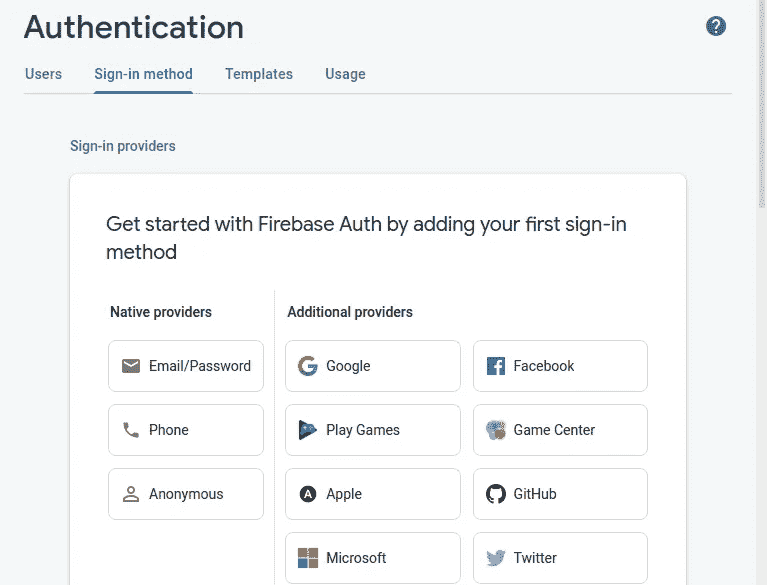
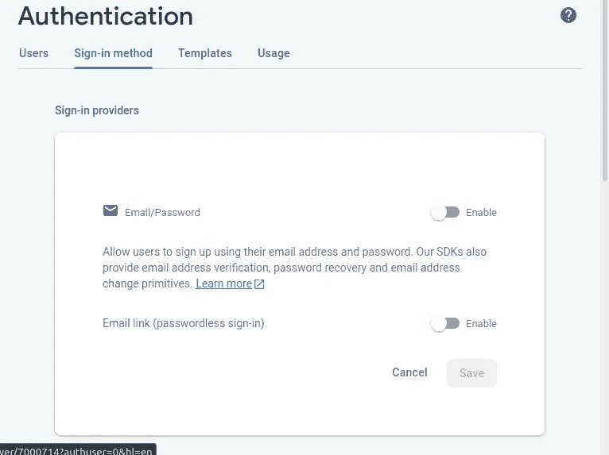

# 基于 Firebase 的 Flutter 认证。

> 原文：<https://levelup.gitconnected.com/flutter-authentication-with-firebase-b00084e2c0a3>


Artur Shamsutdinov 在 [Unsplash](https://unsplash.com?utm_source=medium&utm_medium=referral) 上拍摄的照片

在过去的一个月里，我一直在玩旋舞和火焰基地，我不得不同意你们所有人的观点，旋舞和火焰基地是这里最好的组合。我将向您介绍如何在您的下一个项目中使用 firebase 身份验证的所有步骤。

# 设置 firebase

为了使用身份验证服务，您必须首先设置 firebase。首次登录或注册您的 [firebase 账户](https://firebase.google.com/)。


Firebase 新项目

然后转到 firebase 控制台，创建一个新项目。按照提示操作，您就已经创建了新的 firebase 项目。

在您的新项目中，单击 authentication 选项卡。



Firebase 选项卡

Firebase 支持许多身份验证方法和提供商，但此时我们将使用电子邮件和密码方法。



身份验证提供商

单击电子邮件和密码提供商并启用它。



电子邮件和密码提供商。

这就是您现在设置身份验证所需做的全部工作。

# 安装 Firebase CLI

为了配置 firebase 项目供 flutter 使用。您需要安装 flutter cli。

要安装 cli，您的计算机上需要有 node.js，因为 cli 是使用 npm 安装的。

```
npm install -g firebase-tools
```

如果你在 linux 上遇到权限问题，记得使用 sudo

接下来安装 flutterfire cli，使用

```
dart pub global activate flutterfire_cli
```

FlutterFire CLI 从 Firebase 项目和选定的项目应用程序中提取信息，以生成特定平台的所有配置。

在应用程序的根目录下运行 configure 命令，用 flutter 配置 firebase

```
flutterfire configure
```

Flutterfire configure 命令将引导您选择想要使用的平台，并允许您选择 firebase 项目。

# 向 Flutter 添加 Firebase 依赖项

要在 firebase 项目中使用 flutter，您需要在您的 *pubsec.yaml* 文件中添加以下依赖项。

pubsec.yaml

# 设置 main.dart

您必须将主函数改为异步函数，并初始化 firebase。要了解 widgetsfutterbinding . ensure initialized()是什么，您可以从[堆栈溢出](https://stackoverflow.com/questions/63873338/what-does-widgetsflutterbinding-ensureinitialized-do)或 [flutter 文档](https://api.flutter.dev/flutter/widgets/WidgetsFlutterBinding/ensureInitialized.html)中阅读这个答案。

*main.dart* 文件的完整外观

主.镖

我们导入了 *firebase_auth* 包，并创建了一个 User 类型的变量 *result* ，它通过调用当前用户属性来检查是否有用户。在的 home 参数中，有一个已登录的用户，如果有，他将被定向到主页，如果没有，他将被定向到注册屏幕。

向主页传递一个 name 参数，该参数将包含用户显示名称，这是 firebase_auth 中的一个属性。

# 创建主屏幕

我们创建了一个简单的主屏幕，只通过名字来问候用户。

在主页中，我们希望传递一个用户参数，以便在文本中显示它。

# 创建注册屏幕

`GlobalKey`用于标识该表单，我们还创建了一个对子表单`Users`的引用，并创建了将被附加到`textformfield.`的`TextEditingController`

我们创建了四个`textformfields`,每个字段都包含自己的验证。之后，我们创建一个`ElevatedButton`小部件，作为提交按钮:

方法`validate()`将检查是否所有字段都被验证，然后在方法`registerToDb()`中，我们将数据添加到 Firebase 身份验证中。这是最重要的部分:

因此，首先我们调用方法`createUserWithEmailAndPassword`，它将在 firebase 身份验证中创建用户，我们还将电子邮件和密码传递给这个方法。要访问电子邮件的值和密码，我们需要使用`TextEditingController`上的属性`text`。由于`createUserWithEmailAndPassword`返回一个`Future<AuthResult>`，那么我们将使用方法`then()`，该方法将接受一个回调，该回调将包含一个类型为`AuthResult`的变量，并且由于类`AuthResult`包含类型为`FirebaseUser`的变量`user`，那么我们可以通过执行`result.user.displayname.`来检索显示名称

> 注意:不要忘记处理文本编辑控制器

# 创建登录屏幕

我们创建了一个简单的登录屏幕，只有电子邮件和密码字段以及一个登录按钮。

在提升的按钮内部，在验证之后，我们调用方法`loginToDb()`

所以这里我们使用方法`signInWithEmailAndPassword`来登录用户，并且我们也将`email`和`password`作为参数传递。在这个异步方法完成后，我们导航到`home`页面，如果这个方法抛出任何错误，那么它将被`catchError`捕获，并由`alertdialog`显示在屏幕上。

我希望你喜欢这篇文章。

快乐编码。🎉🎉