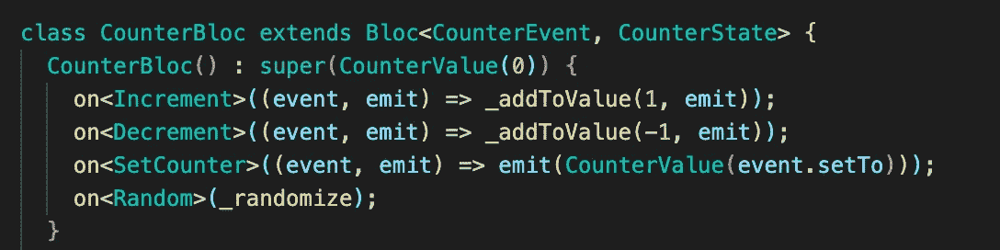

# Flutter Bloc v8.0 已经发布，它将永远改变你处理状态的方式

> 原文：<https://levelup.gitconnected.com/flutter-bloc-v8-0-is-here-and-will-change-the-way-you-handle-state-forever-72ddb4da9e1d>



新集团

*如果您想直接阅读变更，* [*这里是迁移的链接。*](https://github.com/felangel/bloc/issues/2526)

自从 Flutter 进入移动开发领域以来，它的状态管理一直是一个热门话题。应用程序是基于状态构建的，不使用状态管理解决方案很难扩展，也很难测试。

Flutter Bloc 是第一个获得支持的状态管理解决方案(提供商也在其中，这是值得称赞的)——但像所有 MVP 一样，1.0 版本有点粗糙。经过 7 个版本，Bloc 变得越来越好，直到它成为状态管理解决方案的精彩生态系统:功能丰富，易于测试，促进可伸缩的架构。

但是，唉，Flutter Bloc 的最大问题似乎是无法解决的食物问题:*有一大堆锅炉板。*

Cubit 是第一个修复:完全移除事件——现在，你可以调用 cubit 上的一个方法，比如`cubit.method`,而不是调用`Bloc.add(Event)`,允许我们完全放弃事件，将样板文件减少三分之一。

然而，Cubit 并不是一个完美的解决方案:事件仍然非常有用，并且允许扩展或监控。在我的应用程序中，90%的时间我使用 cubits 另外 10%的时间我需要功能更丰富的东西。

下面是一个不能使用 cubit(pseudocode)的例子:

```
class FooState extends State<Foo> {
   final ScrollController _scrollController = ScrollController(); initState() {
      super.initState();
      _scrollController.addListener(_infiniteScroll);
    } void _infiniteScroll() {
       if (_scrollController.atBottom()) {
          cubit.fetchMorePosts();
       }
   }
}
```

我们遇到了真正的问题。如果用户过度滚动，(这几乎每次都会发生)滚动控制器会说它在底部…一遍又一遍，一遍又一遍。根据滚动距离的不同，你可能会给`fetchMorePosts`打 100 多次电话！这不是我们想要的；就打一次然后等着。

您可以潜在地向腕关节添加状态，比如:

```
class MyCubit extends Cubit<PostState> {
   bool isFetching = false; Future<void> fetchMorePosts() {
      if (isFetching) return;
      isFetching = true;
      final newPosts = await _fetch();
      isFetching = false;
      emit(PostState(newPosts));
   }
}
```

但是这导致更多的代码维护和大量的调试。一个更简单的处理方法？使用带有`transformEvents.`的块

```
@override
Stream<FetchEvent> transform(Stream<FetchEvent> events) {
  return (events as Observable<FetchEvent>)
      .debounce(Duration(milliseconds: 500));
}
```

Boom —解决了过卷问题。

Bloc 还允许我们保持更高水平的可观察性，即能够观察输入事件，而不仅仅是输出状态。

## 输入 v8

好的，很明显 Bloc 仍然有用，我们不应该完全放弃 Cubit。事件对于可观察性很有用，并且有很好的用例。

我们应该尽可能地限制样板文件，但是从 bloc 的概念来看，bloc 样板文件中有一部分没有被触及……直到 v8。

`mapEventToState`。

`mapEventToState`在每个单个块中具有几乎完全相同的代码:

```
@override
Stream<State> mapEventToState(Event event) async* {
  if (event is EventA) {
    yield* _mapEventAToState(event);
  } else if (event is EventB) {
    yield* _mapEventBToState(event);
  }
}

Stream<State> _mapEventAToState(EventA event) async* {...}
Stream<State> _mapEventBToState(EventB event) async* {...}
```

如果您不熟悉 bloc，`mapEventToState`是一个接受输入事件并输出状态的函数！我得说它的名字很贴切。

尽管命名很恰当，但是代码越多，出错的机会就越多，这里有很多地方会出错。众所周知，流是很难理解的概念，比 async-await 更难理解，并且需要编程技巧来优雅地处理。愚蠢的长`if else if else if else`在许多事件中变得太难维持，并且很容易在杂草中丢失事件。

修复？新的`on<Event>` 方法。

`on<Event>`阻塞方法只有一个必需的参数:一个带有签名的回调`FutureOr<void> Function<Event>(Event, Emitter<State>) handler`。`on<Event>`分解起来，采取的方法是:

*   传递两个参数:输入事件和发射器。如果你用过`cubit`，你可能对发射器很熟悉(如果没有，不用担心！很快就清楚了)。
*   可以是异步或同步——没关系(这是`FutureOr`部分！)

每个事件类型只能调用`on<Event>`一次，否则它会抛出一个状态错误。最好在构造函数里做，然后就忘了。

目前，只要你使用版本``7.2.0-dev.1`，v8 就可以向后兼容 v7。下面是在`pubspec.yaml`中的样子:

```
bloc: ^7.2.0-dev.1
```

**注意:**这是一个开发版本！虽然它在我的测试中相当稳定，但如果你运行的是生产应用，你可能希望等待迁移达到稳定，这样你就处于最没有错误的状态，以避免意外的行为。

## 运行中的 v8

下面是典型的反例:

```
abstract class CounterEvent {}class Increment extends CounterEvent {}class Decrement extends CounterEvent {}class SetCounter extends CounterEvent {
 final int setTo; SetCounter({required this.setTo});
}class CounterBloc extends Bloc<CounterEvent, int> {
CounterBloc() : super(0) {
   on<Increment>((event, emit) => emit(state + 1));
   on<Decrement>((event, emit) => emit(state - 1));
   on<SetCounter>((event, emit) => emit(event.setTo));
 }
}
```

看不到`mapEventToState`！构造函数设置了一组“监听器”，监听输入事件。当给定输入事件时，它调用回调。

不过，碰巧我的计数器应用程序的客户端也想要一个“随机”特性。下面是他希望我构建的:用户可以指定一个范围，将从该范围中选择一个随机整数。他希望从他的微服务团队构建的随机整数 API 中获取整数，因此我们需要进行 API 调用。(傻管理——他们不知道`dart:math`图书馆吗？)

首先，我们需要定义一个状态:

```
class Random extends CounterEvent {
  final int from;
  final int to; Random({required this.from, required this.to});
}
```

就这么简单。我们不会对显示层进行编码，但是用`context.read<CounterBloc>().add(Random(from: 10, to: 30));`很容易调用。用`context.watch<CounterBloc>().state`听状态也很容易。

接下来，我们需要一个加载状态，因为我们希望用户知道我们正在生成一个数字。让我们写下一些状态:

```
abstract class CounterState {}class CounterValue extends CounterState {
  final int value;

  CounterValue(this.value);
}class CounterLoading extends CounterState {}
```

两个简单的状态；一个有我们的价值，一个正在加载。

现在，我们需要重写我们的块，如下所示:

```
class CounterBloc extends Bloc<CounterEvent, CounterState> {
  CounterBloc() : super(CounterValue(0)) {
    on<Increment>((event, emit) => emit(state + 1));
    on<Decrement>((event, emit) => emit(state - 1));
    on<SetCounter>((event, emit) =>     emit(CounterValue(event.setTo)));
  }
}
```

啊哦，错误！让我们将 increment 和 decrement 重写到一个私有的 helper 函数中(就像您在`mapEventToState`中所做的一样，但是这次我们不需要一个很长的 if-else 链来找到正确的事件):

```
CounterBloc() : super(CounterValue(0)) {
  on<Increment>((event, emit) => _addToValue(1, emit));
  on<Decrement>((event, emit) => _addToValue(-1, emit));
  on<SetCounter>((event, emit) => emit(CounterValue(event.setTo)));
 }void _addToValue(int toAdd, Emitter<CounterState> emit) {
  if (state is CounterValue) {
   emit(CounterValue((state as CounterValue).value + toAdd));
  }
}
```

如果我们在装货，我们什么也不做。如果我们没有加载，我们执行所需的加法/减法！几乎没有样板文件。

差不多完成了…让我们用随机方法:

```
Future<void> _randomize(Random event, Emitter<CounterState> emit) async {
  emit(CounterLoading());

  final int randomInt = await callApi(event.from, event.to); emit(CounterValue(randomInt));
}
```

这是最好的状态管理:当 API 调用正在调用时，用户将看到一个加载状态。当调用完成时，用户将看到生成的随机整数。集团的魔力，现在在容易阅读的方法！

最后，让我们注册处理程序。谢天谢地，我们刚刚写的方法和`on<Event>`函数有相同的签名，所以我们可以像这样注册它:`on<Random>(_randomize);`

就是这样！我们完了。我们拥有 bloc 的魔力，而不必处理流，或者说`mapEventToState`。我们减少了一大块样板文件，但仍然有可响应的、可测试的状态。

下面是完整的代码，不包括 api 调用函数:

```
abstract class CounterEvent {}class Increment extends CounterEvent {}class Decrement extends CounterEvent {}class SetCounter extends CounterEvent {
   final int setTo;

   SetCounter({required this.setTo});
 }class Random extends CounterEvent {
    final int from;
    final int to;

    Random({required this.from, required this.to});
} abstract class CounterState {}class CounterValue extends CounterState {
   final int value; CounterValue(this.value);
}class CounterLoading extends CounterState {}class CounterBloc extends Bloc<CounterEvent, CounterState> {
  CounterBloc() : super(CounterValue(0)) {
     on<Increment>((event, emit) => _addToValue(1, emit));
     on<Decrement>((event, emit) => _addToValue(-1, emit));
     on<SetCounter>((event, emit) => emit(CounterValue(event.setTo)));
     on<Random>(_randomize);
  } void _addToValue(int toAdd, Emitter<CounterState> emit) {
   if (state is CounterValue) {
     emit(CounterValue((state as CounterValue).value + toAdd));
   }
 } Future<void> _randomize(Random event, Emitter<CounterState> emit)    async {
   emit(CounterLoading()); final int randomInt = await callApi(event.from, event.to); emit(CounterValue(randomInt));
  }
}
```

无功的、可测试的状态不是很美吗？

你怎么想呢?你会从其他状态管理解决方案切换到 Flutter Bloc 吗？你认为集团还是黑暗时代吗？

我欢迎提问和评论！感谢阅读！