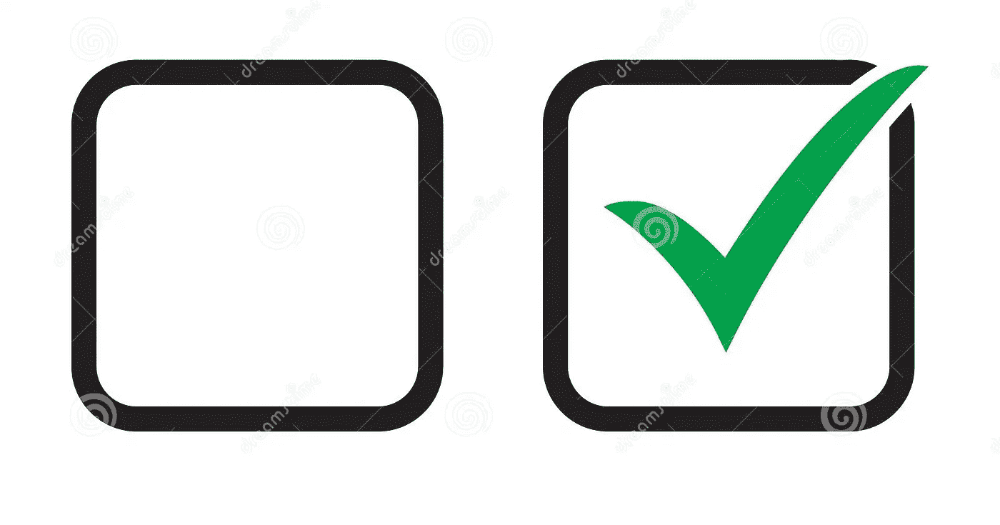

# 不带 setState()的 Flutter 复选框

> 原文：<https://levelup.gitconnected.com/flutter-checkbox-without-setstate-ec8181cda32f>

我们都在 Flutter 中使用过复选框，我们可以通过点击它来选中/取消选中。



看看下面的代码，它有一个复选框，一些文本框和一个按钮。

```
class MyForm extends StatefulWidget {

  const MyForm({Key? key}) : super(key: key);

  @override
  State<MyForm> createState() => _MyFormState();
}

class _MyFormState extends State<MyForm> {

  bool checked = false;

  @override
  Widget build(BuildContext context) {
    return Scaffold(
      appBar: AppBar(
        title: const Text("My Form"),
      ),
      body: Padding(
        padding: const EdgeInsets.all(16),
        child:  Column(
          mainAxisAlignment: MainAxisAlignment.center,
          children: <Widget>[
            const Text(
              'Fill all the fields',
            ),
            const SizedBox(height: 10,),
            const TextField(
              decoration: InputDecoration(
                border: OutlineInputBorder(),
                labelText: "Name",
              ),
            ),
            const SizedBox(height: 10,),
            const TextField(
              decoration: InputDecoration(
                border: OutlineInputBorder(),
                labelText: "Email",
              ),
            ),
            const SizedBox(height: 10,),
            const TextField(
              decoration: InputDecoration(
                border: OutlineInputBorder(),
                labelText: "Phone",
              ),
            ),
            const SizedBox(height: 10,),
            Row(
              mainAxisAlignment: MainAxisAlignment.spaceBetween,
              children: [
                const Text("Indian"),
                Checkbox(
                    value: checked,
                    onChanged: (changedValue){
                      setState(() {
                        checked = changedValue!;
                      });
                    }
                )
              ],
            ),
            const SizedBox(height: 10,),
            ElevatedButton(onPressed: (){},
                child: const Text("Submit"))
          ],
        ),
      ),
    );
  }
}
```

每当复选框被点击时，我调用一个 setState()方法。这将通过重建小部件树来更新复选框的状态。build 方法中的所有小部件都会被调用。这是不必要的，而且也不是仅仅为了更新一个复选框而重新构建整个表单的有效方法。

我们可以使用任何状态管理方法来解决这个问题，但是它需要大量的样板代码，对于小项目来说这不是一个好的方法。

别担心。让我们看看如何使用一个非常简单的方法在没有 setState()的情况下管理 Checkbox。

将复选框包装在 StreamBuilder 中，如下所示

```
StreamBuilder(
  initialData: false,
  builder: (BuildContext context, AsyncSnapshot<bool> snapshot ){
  return Checkbox(
      value: snapshot.data,
      onChanged: (changedValue){

      }
  );
}),
```

在 _MyFormState 类中添加这些行

```
final StreamController<bool> _checkBoxController = StreamController();
Stream<bool> get _checkBoxStream => _checkBoxController.stream;
```

在 onChanged attributes 方法中添加下面一行

```
_checkBoxController.sink.add(changedValue!);
```

通过重写 dispose()方法关闭控制器。

```
@override
void dispose() {
  _checkBoxController.close();
  super.dispose();
}
```

最终代码如下。

```
class MyForm extends StatefulWidget {

  const MyForm({Key? key}) : super(key: key);

  @override
  State<MyForm> createState() => _MyFormState();
}

class _MyFormState extends State<MyForm> {

  final StreamController<bool> _checkBoxController = StreamController();
  Stream<bool> get _checkBoxStream => _checkBoxController.stream;

  @override
  void dispose() {
    _checkBoxController.close();
    super.dispose();
  }

  @override
  Widget build(BuildContext context) {
    return Scaffold(
      appBar: AppBar(
        title: const Text("My Form"),
      ),
      body: Padding(
        padding: const EdgeInsets.all(16),
        child:  Column(
          mainAxisAlignment: MainAxisAlignment.center,
          children: <Widget>[
            const Text(
              'Fill all the fields',
            ),
            const SizedBox(height: 10,),
            const TextField(
              decoration: InputDecoration(
                border: OutlineInputBorder(),
                labelText: "Name",
              ),
            ),
            const SizedBox(height: 10,),
            const TextField(
              decoration: InputDecoration(
                border: OutlineInputBorder(),
                labelText: "Email",
              ),
            ),
            const SizedBox(height: 10,),
            const TextField(
              decoration: InputDecoration(
                border: OutlineInputBorder(),
                labelText: "Phone",
              ),
            ),
            const SizedBox(height: 10,),
            Row(
              mainAxisAlignment: MainAxisAlignment.spaceBetween,
              children: [
                const Text("Indian"),
                StreamBuilder(
                    stream: _checkBoxStream,
                    initialData: false,
                    builder: (BuildContext context, AsyncSnapshot<bool> snapshot ){
                      return Checkbox(
                          value: snapshot.data,
                          onChanged: (changedValue){
                            _checkBoxController.sink.add(changedValue!);
                          }
                      );
                    }),
              ],
            ),
            const SizedBox(height: 10,),
            ElevatedButton(onPressed: (){},
                child: const Text("Submit"))
          ],
        ),
      ),
    );
  }
}
```

就这样，我们消除了 setState()。同样的方法也可以用于单选按钮、开关等。

如果你觉得这有帮助，就鼓掌吧。

从以下网址获取源代码

[](https://github.com/jarinrocks/Flutter-Checkbox-without-setState) [## GitHub-jarin rocks/Flutter-Checkbox-without-setState:一个示例项目，演示如何…

### 一个示例项目，演示如何在不使用 setState() - GitHub 的情况下改变 flutter 复选框的状态…

github.com](https://github.com/jarinrocks/Flutter-Checkbox-without-setState)