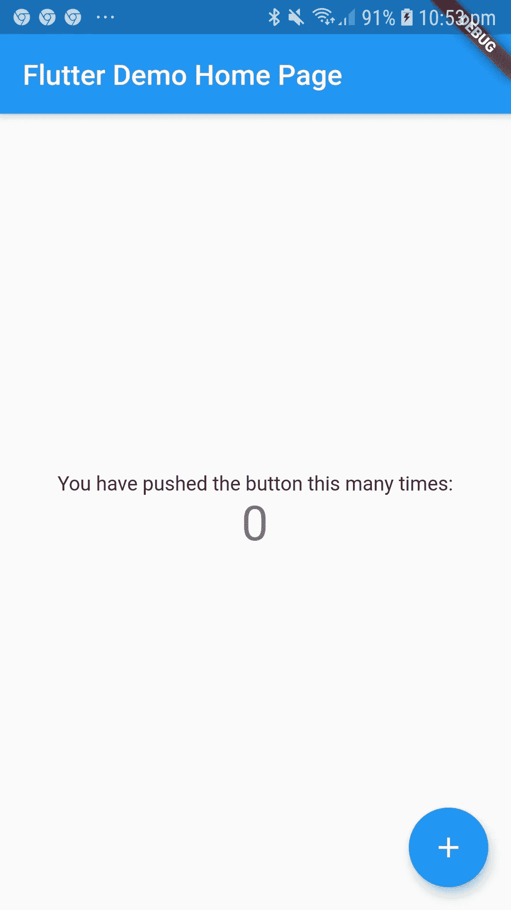

# Flutter:状态管理和子更新父状态

> 原文：<https://levelup.gitconnected.com/flutter-child-updating-parent-state-e68401eed36a>

安德拉·里基茨在 [Unsplash](https://unsplash.com?utm_source=medium&utm_medium=referral) 上的照片

# 故事

颤振状态管理在某种程度上非常类似于 ReactJS(对于熟悉它的人来说)。有几种不同类型的状态。让我们用[飘起的公文](https://flutter.dev/docs/development/data-and-backend/state-mgmt/ephemeral-vs-app)开始对话。根据该文件，有两种不同类型的状态。

> 第一个叫短命状态(绕口令给你？)或者我们把它叫做本地状态，另一个叫做应用状态。

在本文中，我们将讨论应用程序状态。如果你没有阅读上面的链接，那么让我描述一下。这是应用程序启动所需的信息，也是模块的许多部分(如登录、购物车等)所需的信息。如果你来自 Android 世界，这是共享的偏好，在 iOS 中稍微复杂一点。

几乎从应用程序的所有部分都可以轻松访问 Android 的共享偏好。另一方面，Flutter 中的应用程序状态更加棘手。你需要在父和子之间有一个层次的交互，因为应用程序的状态是由最高级别的小部件保持的，并且它将被那个小部件的子部件操纵。

我知道你可能认为这很疯狂。我最终需要从父代传递给子代多少个对象。还有调试过程呢。Flutter 为上述问题提供了一个名为“[简单应用状态管理](https://flutter.dev/docs/development/data-and-backend/state-mgmt/simple)”的答案。请仔细阅读简单的(就像你是调查骗子政客的城堡系列中的凯特上尉)

然而，我们不会讨论政治家(也就是一个简单的应用程序状态管理)。让我们假设我们唯一的武器是一把小口径的踝枪，它可能无法在以后解决更大的问题。这对于简单的应用程序来说已经足够好了，例如当按钮被点击时改变数字的应用程序。这是一个想法！让我们从那个开始。

# 让我们做一些代码

上面的屏幕截图来自我们第一次创建一个 Flutter 项目时生成的代码。我不会把代码放在本文中，因为您可以自己生成它。让我们转到 **_MyHomePageState** 类，您可以看到 **FloatingActionButton** 小部件，它制作了一个中间带有添加图标的蓝色圆形按钮:

如你所见，该数字保存在名为 **_counter 的状态中。**我们将把 **FloatingActionButton** 移出 **_MyHomePageState** 类，并传递参数来更新 **_counter** 状态。

1.  使 FloatingActionButton 成为 _MyHomePageState 的子级

重构之后，代码会如上所示。IDE 会抱怨不存在的 **_incrementCounter** 。让我们在调用 **MyButton 时将函数作为参数传递。**

2.将 incrementCounter 作为参数传递给 child

让我们看看我们做了什么。我们在名为 **updateCounter** 的 **MyButton** 类中创建了一个新的类变量。该变量代表 **_MyHomePageState** 类中的 **incrementCounter** 。我们使用 namespace 参数将函数从父节点传递给子节点。当我们保存并刷新应用程序并单击浮动按钮时，它将始终显示 10。如果你有兴趣，看看 dart 语言中的[可选参数](https://dart.dev/guides/language/language-tour#optional-parameters)的参数语法。

3.将 _counter state 的值发送给子级以增量方式更改状态

我们在 **MyButton** 类上创建了第二个可选参数，这样父类可以传递 **_counter** 状态的当前值。就是它的值父状态的 **_counter** 发送给子并操纵然后在 **updateCounter** 中更新。

# 下一步是什么？

原来如此。从子节点操纵父节点状态是最容易的。它适用于大多数场景，但是当应用程序越来越大时，您会将登录信息从最高的山峰传递到最深的海洋吗？那是以后的事了。

感谢您的阅读。如果你有问题，请告诉我。

> 分享是关爱，像爱自己一样爱你的邻居。