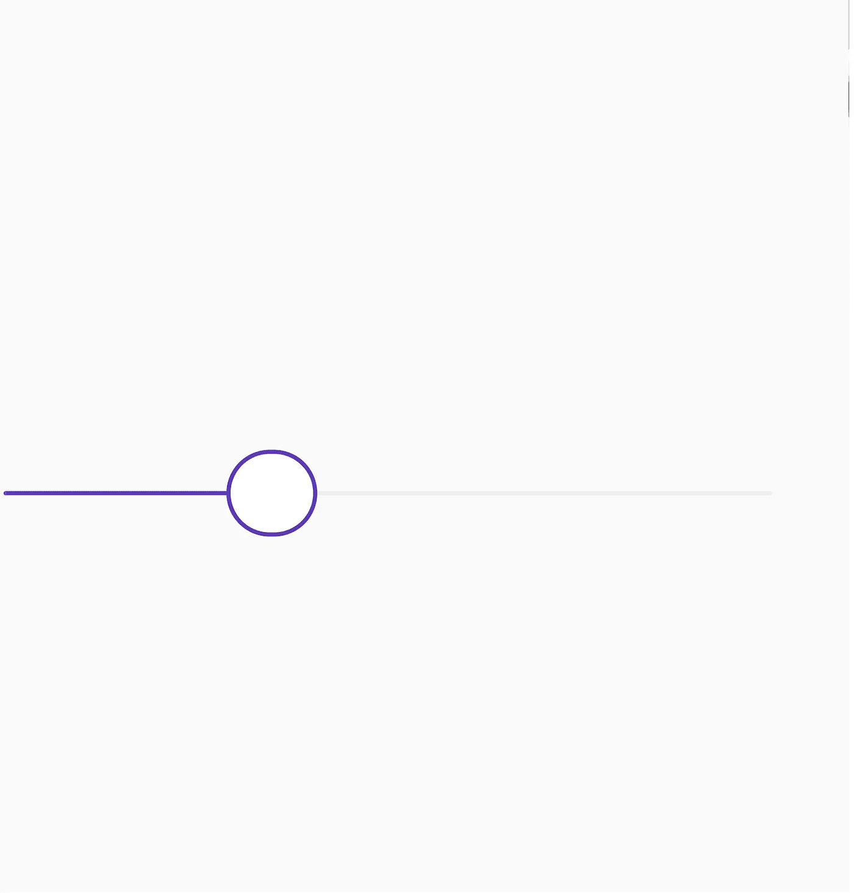
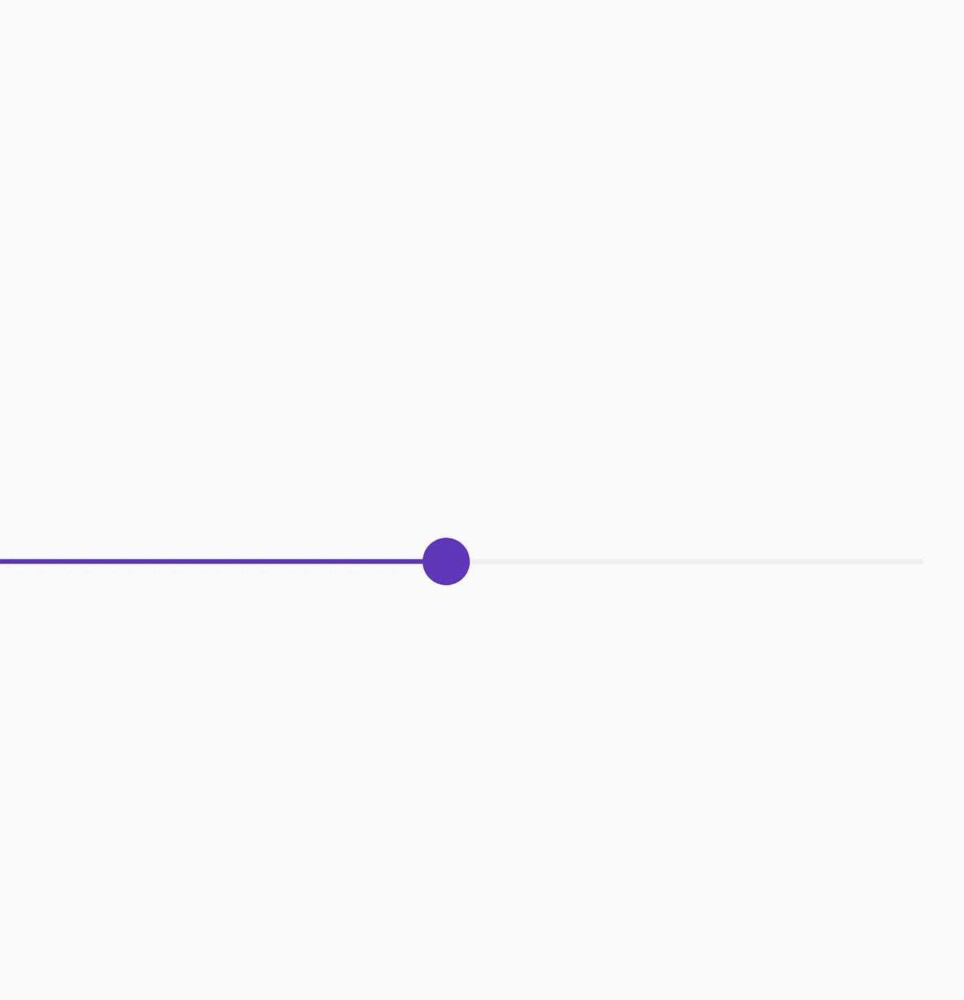

# 自定义微调拇指在颤振(第 1 部分)

> 原文：<https://levelup.gitconnected.com/flutter-custom-spinner-thumb-aabd4ce43dda>

欢迎来到本教程建立一个自定义的微调控制滑块。

你可以在 [Instagram](https://www.instagram.com/theboringdeveloper/) 上和我联系

## 让我们从看到我们的最终目标开始

最终目标

现在首先让我们看看我们通常如何修改滑块的拇指形状。

下面是代码的输出:

让我们努力达到我们的最终目标。

正如你从上面看到的，编辑拇指形状的通常方式只允许我们改变半径。

下面是上面代码的输出。

这是我们需要的颜色-

让我们将滑块更新为新的颜色。

下面是上面代码的输出。

现在我们需要尝试改变拇指的形状。

为此，我们需要创建自己的 shape 类并扩展 SliderComponentShape。

现在让我们看看我们在上面的代码中做了什么

1.  创建了一个名为- CircleThumbShape 的类
2.  用 SliderComponentShape 扩展了上面的类
3.  创建了一个构造函数来获取拇指半径的值
4.  我们从 getPreferredsize()方法返回 Size，这是 Size.fromRadius()所做的，*创建一个正方形[Size]，它的[宽度]和[高度]是给定的*的两倍

现在在 paint()方法中，我们绘制我们的拇指。

现在让我们看看我们在上面的代码中做了什么。

在前面的代码片段中，我们只对 paint()方法进行了更改。

1.  我们使用 context.canvas 获得画布
2.  创建一个绘制对象来绘制拇指圆圈内的区域，我们设置颜色和样式
3.  创建一个 paint 对象来绘制拇指圈的边框，我们设置颜色、样式和 strokeWidth。
4.  之后，我们用填充颜料在画布上画出白色的圆圈
5.  然后，我们使用 borderPaint 绘制边界

现在，我们将拇指形状更改为我们创建的新形状。

以上代码的结果。

万岁！我们做到了。

要创建更复杂的旋转器，我们需要学习更多关于在画布上绘图的知识。

查看本博客:
[https://medium . com/flutter-community/paths-in-flutter-a-visual-guide-6c 906464 DCD 0](https://medium.com/flutter-community/paths-in-flutter-a-visual-guide-6c906464dcd0)

我将会发布更多关于 flutter 的消息，敬请关注:)

谢谢:)

我希望结局比《得到》更好。

 [## Gursheesh Singh -印度昌迪加尔|职业简介| LinkedIn

### 查看 LinkedIn 上 Gursheesh Singh 的专业资料。LinkedIn 是世界上最大的商业网络，帮助…

www.linkedin.com](https://www.linkedin.com/in/gursheesh-singh-a66545154/)  [## 古尔谢辛赫

### 欢迎回到 Instagram。登录查看您的朋友、家人和兴趣爱好捕捉和分享了什么…

www.instagram.com](https://www.instagram.com/igursheesh/)