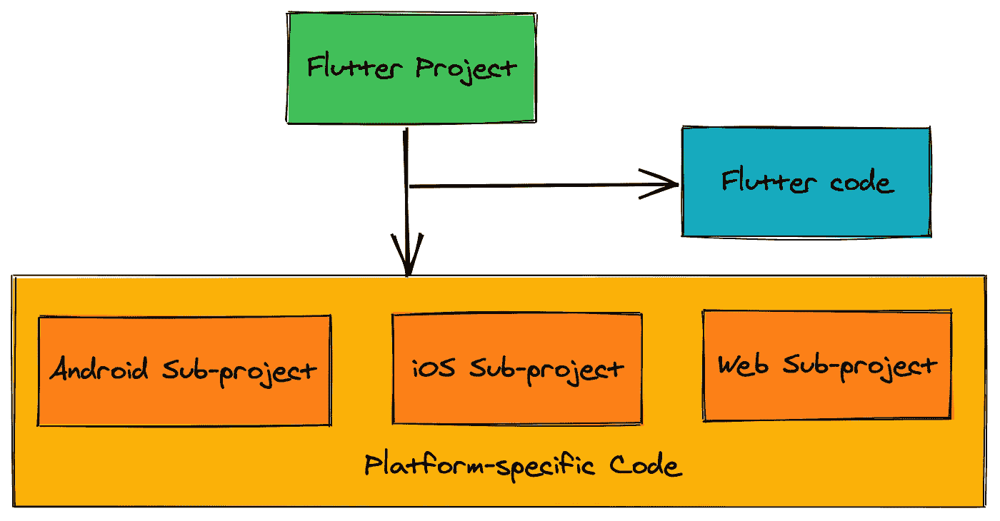
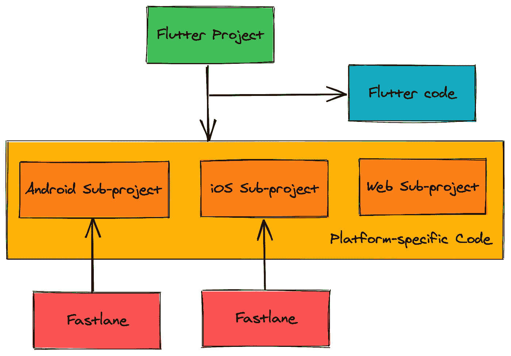
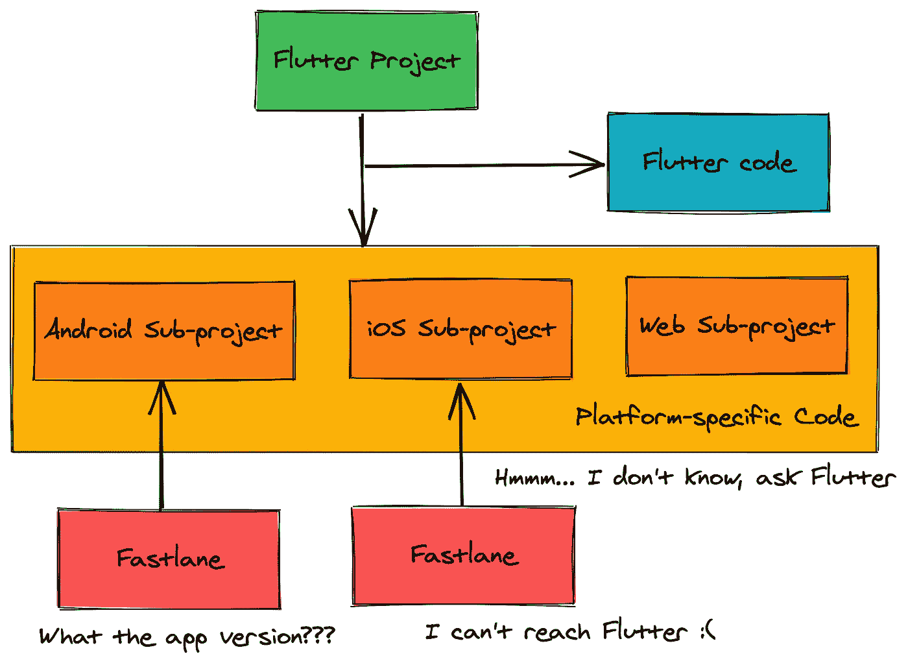

# 颤振+浪子技巧:集中式项目元数据管理

> 原文：<https://levelup.gitconnected.com/flutter-fastlane-tips-centralized-project-metadata-management-6de3fec21d37>

## 永远不要再发布错误的版本

照片由[阿迪·戈尔茨坦](https://unsplash.com/@adigold1?utm_source=unsplash&utm_medium=referral&utm_content=creditCopyText)在 [Unsplash](https://unsplash.com/s/photos/together?utm_source=unsplash&utm_medium=referral&utm_content=creditCopyText) 上拍摄

# Flutter:一个跨平台应用框架

Flutter 是谷歌的下一代跨平台(Android、iOS、Web、桌面等)应用框架，具有原生性能(不像 React Native 有 JS 桥)。

# 浪子:一个应用自动化框架

浪子是一个框架，帮助自动上传应用程序包，变更日志，截图和许多更有用的项目到市场(如苹果应用商店，谷歌 Play 商店)。

# 浪子的目标是 Android/iOS，而不是 Flutter

由于浪子在颤振之前就开始了，颤振不是它的计划的一部分。

幸运的是，除了一些元数据同步问题，浪子和 Flutter 配合得很好。

典型的颤振项目如下所示:

要将浪子添加到颤振项目中，我们需要将浪子添加到每个单独的子项目中:

尽管这种方法可行，但它引入了一个问题:

*   为了确保所有平台都有相同的元数据(例如版本信息)，Flutter 在 Flutter 项目级别定义了所有元数据，并在编译时传递到子项目级别。
*   作为子项目的一部分，浪子不能直接访问上一级的 Flutter 项目中定义的元数据。

例如，浪子需要一个版本代码来标识要上传的相应元数据(例如，变更日志、屏幕截图等)，但由于以下问题，它无法访问该代码:

因此，许多项目不得不在浪子脚本中硬编码一个版本，并手动与 Flutter 项目同步。

许多有经验的开发人员可能已经嗅到了危险:当一个数字存在于两个地方时，它们在某些时候会不匹配，结果是向用户发布一个过时的应用程序。呜呜:(

当我突然意识到我在合并一个变更后忘记了修改版本号时:(

这个问题的解决方案很简单:授予浪子访问 Flutter 项目元数据的权限。

多亏了`flutter_version`浪子插件，我们可以在几行代码内实现这一点。

## 步骤 1:将 flutter_version 插件列为依赖项

按照浪子惯例，要添加一个插件，我们需要在一个`Pluginfile`中定义它:

为了确保插件正常工作，在`Pluginfile`中做了修改后运行`bundle install`。

## 第二步:在浪子脚本中使用 flutter_version 插件

插件安装完成后，我们可以使用`Fastfile`中的`futter_version`来访问 Flutter 项目元数据。例如，版本信息:

注意:`flutter_version`支持一个可选的输入`pubspec_location`，它定义了一个自定义的颤振项目元数据文件的位置，如果不是在一个传统的颤振项目设置中。目前，`flutter_version`返回版本代码和版本名称。如果`pubspec.yaml`中定义的版本是`1.0.6+15`，那么`version_code`就是 15，`version_name`就是`1.0.6`。

## 步骤 3(可选):将浪子执行添加到工作流脚本中

由于从 CI/CD 中的 GitHub 注册表下载包是一个重要的设置，请使用下面的 GitHub 操作脚本作为起点:

感谢阅读和快乐的黑客！

感谢对库的各种贡献。让我们一起让跨平台的 app 开发体验更好；)

# 参考

*   一个使用`flutter_version` : [样本库](https://github.com/tianhaoz95/photochat)的示例项目。
*   GitHub 包注册表中的`flutter_version`插件:[包主页](https://github.com/tianhaoz95/fastlane-plugin-flutter_version/packages/143774)
*   `flutter_version`源代码:[资源库](https://github.com/tianhaoz95/fastlane-plugin-flutter_version)