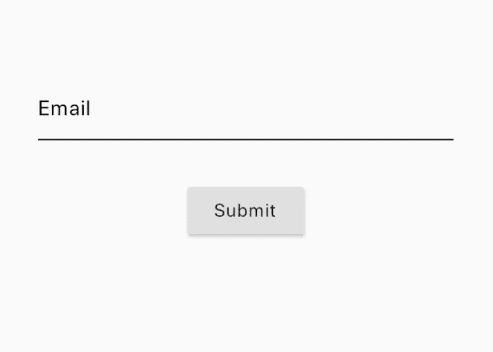
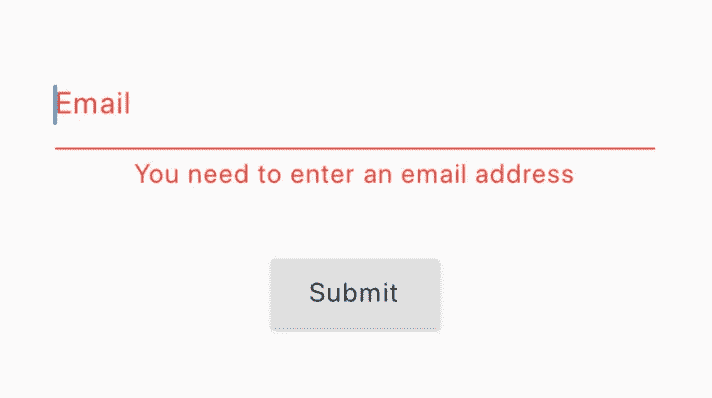
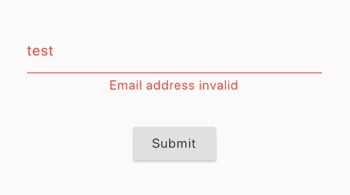
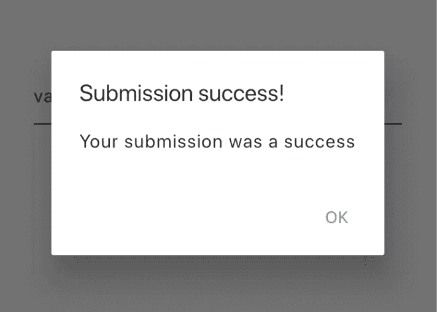

# 用 BLoC 模式验证颤振场

> 原文：<https://levelup.gitconnected.com/flutter-field-validation-using-bloc-pattern-19188076721d>

验证字段是应用程序中的常见做法，无论是简单地检查它是否为空，还是根据特定标准确定输入或选择的值是否有效。从最终用户的角度来看，验证错误有时是不明确的。因此，重要的是应用程序要让用户确切地知道为什么出错了！

用于 Flutter 的 [BLoC](https://bloclibrary.dev/) 包提供了一种奇妙的状态管理方法，既方便了可测试代码，也方便了可维护代码。

我们将使用这个 BLoC 模式向这个非常简单的 Flutter UI 添加一些验证逻辑，它包含一个电子邮件字段和一个提交按钮。

在这种情况下，如果满足以下两个条件，此电子邮件字段将被视为有效:

1.  它不是空的
2.  它符合我们的电子邮件验证正则表达式

这些验证步骤将在集团内部进行。然而，由于它们的一般性质，我们将把这个逻辑分离到一个 Mixin 中，以便我们可以在其他 BLoCs 中重用它。(电子邮件验证正则表达式可以在[这里找到](https://stackoverflow.com/questions/16800540/validate-email-address-in-dart))

该字段的值将通过这些函数进行验证，如果它由于某种原因无效，我们希望在我们的 UI 上显示一个错误。然而，我们不希望 BLoC 确切地指示 UI 应该呈现什么，相反，它应该只通知 UI 发生了错误，然后它可以相应地处理这个错误。

因此，我们将创建一个枚举来表示字段的状态，然后可以将它添加到 BLoC 的状态中，这个枚举将只包含 2 个值；*空*或*无效*。

为了开始创建块，我们将创建 UI 将要发出的事件和它将接收回来的状态。

在这种情况下，唯一需要的事件是一个简单的 submit 事件，它将把电子邮件字段中输入的文本发送到 BLoC。

该状态将保存由 *FieldError* enum 表示的电子邮件字段的错误(如果适用)和一个布尔值，以指示提交事件是否成功。最后，一个 *isBusy* boolean 用于通知 UI 该块正在处理数据。在整个应用程序中，这是一个有用的标志，因此通常被抽象为状态可以继承的基类。

我们现在将构建 BLoC 本身，它将处理从 UI 发出的事件，并返回状态供 UI 响应。

这个块首先产生一个状态，表明它正忙于处理数据，这样 UI 就可以通知用户一个操作正在发生。在这之后，它继续使用 mixin 中的方法验证电子邮件是否为空以及是否匹配验证正则表达式。如果该块确定电子邮件无效，它将相应地产生 *FieldErrors* ，否则产生成功状态。

最后，是时候把这个和 UI 绑在一起了！

乍一看，这里好像发生了很多事情！所以我们来分解一下。

首先，submit 按钮现在向 BLoC 发出一个事件，并通过控制器为 email 字段保存的当前文本进行发送。单击此按钮将触发程序块执行验证逻辑。

每当集团中产生一个新的国家时，集团构建器都将进行重建。因此，它首先检查状态是否繁忙，如果是，它会向用户显示一个进度指示器，以改善应用程序的响应感觉，因为它向用户指示操作正在进行。

但是，如果状态不忙，构建器将呈现如前面所示的表单，但有一个很大的不同…现在，如果状态中有一个验证错误，电子邮件字段的外观将会改变！该字段将显示为红色以指示问题，并且使用一个方便的函数来评估使用我们创建的枚举应该在字段下方显示什么错误文本！这个新的文本字段也可以很容易地抽象成自己的可重用小部件。

最后，BLoC 侦听器的目的是简单地侦听状态是否表明提交成功，并向用户发出一个警告对话框，告诉他们已经提交了一封有效的电子邮件！

…就是这样！我们现在在应用程序中使用 BLoC 模式进行字段验证！

如果你喜欢这篇文章，我也发表了[另一篇](/a-practical-approach-to-caching-remote-data-using-hive-in-flutter-b2bcff5bfdef)关于在 Flutter 中有效利用存储库模式的文章。

该解决方案的回购可在:【https://github.com/luketg8 验证 _ 示例找到

[https://www.linkedin.com/in/luketg8/](https://www.linkedin.com/in/luketg8/)