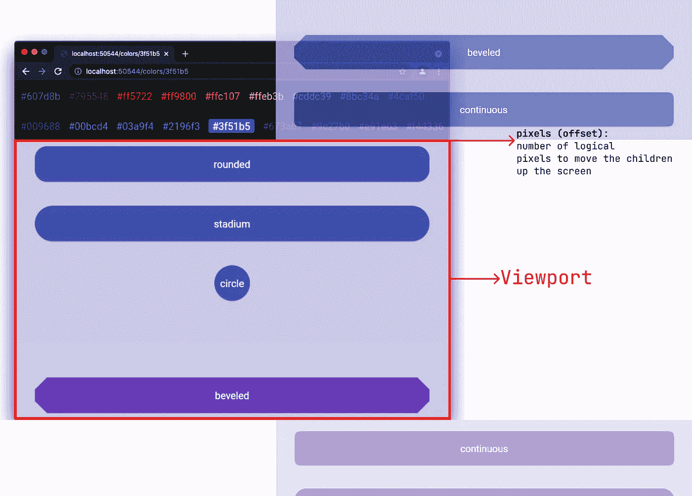
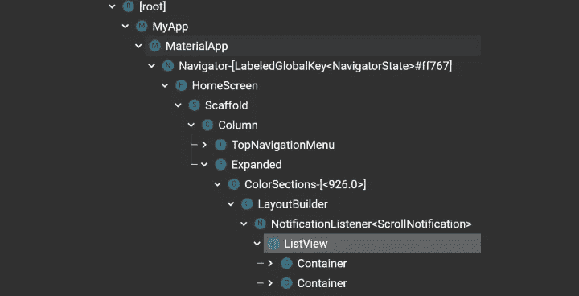
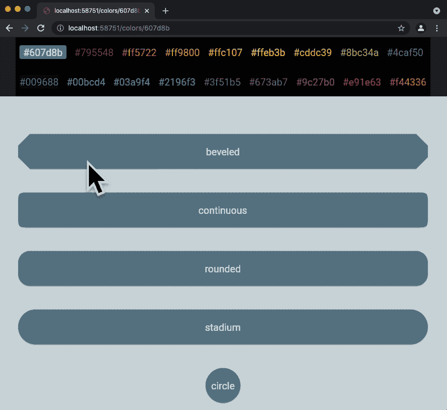
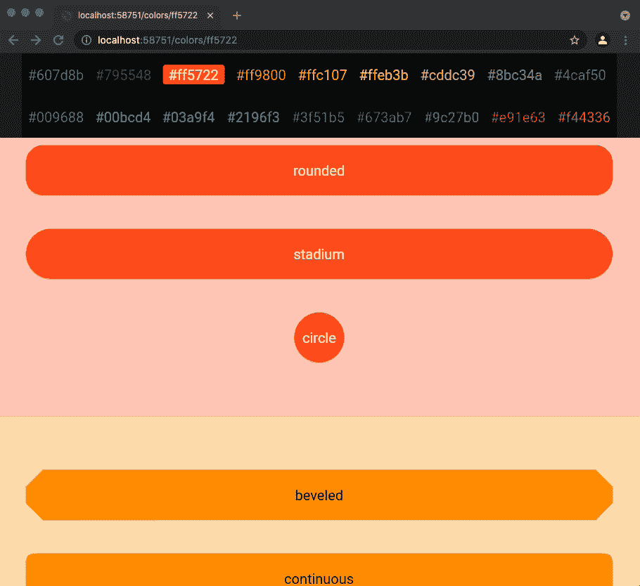
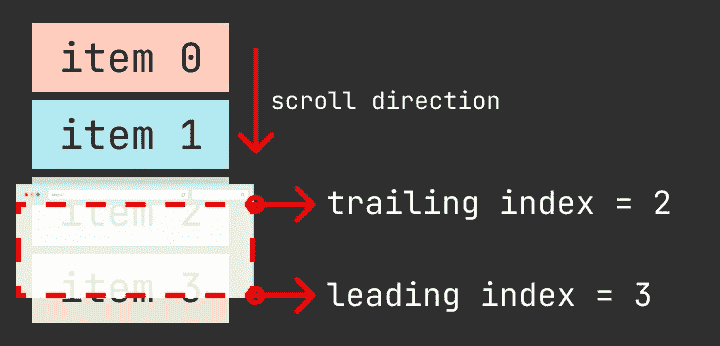
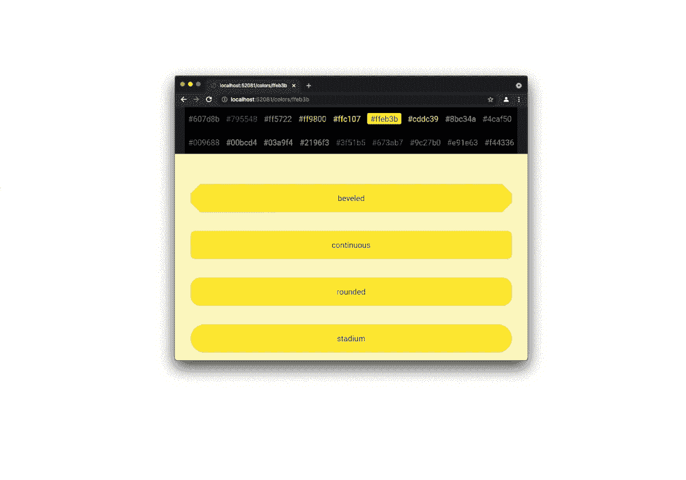
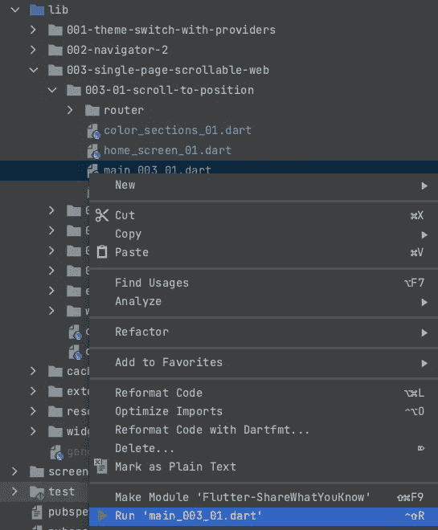
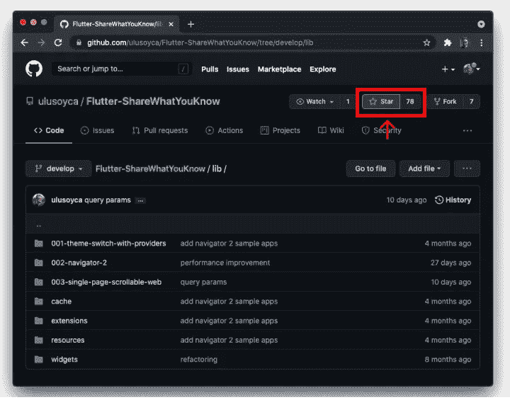

# Navigator 2.0 下单页可滚动网站的抖动——第二部分:滚动到位置

> 原文：<https://levelup.gitconnected.com/flutter-for-single-page-scrollable-websites-with-navigator-2-0-part-2-scroll-to-position-4c09cbc9d975>



在本系列的[第一部分中，](https://ulusoyca.medium.com/flutter-navigator-2-0-for-authentication-and-bootstrapping-part-1-introduction-d7b6dfdd0849)我们讨论了在**单页可滚动网站** (SPSW)中构建可滚动小部件时的选项，并解释了我们将构建的示例应用程序。在本文中，我们将探索使用一个`[ListView](https://api.flutter.dev/flutter/widgets/ListView/ListView.builder.html)`来构建一个 SPSW，它的各个部分是延迟构建的(按需)，并且具有相同的高度。

*   [第 1 部分:简介](https://ulusoyca.medium.com/flutter-for-single-page-scrollable-websites-with-navigator-2-0-part-1-introduction-c219b471bbec)
*   **第 2 部分:滚动到位置**
*   [第 3 部分:滚动到第](https://ulusoyca.medium.com/flutter-for-single-page-scrollable-websites-with-navigator-2-0-part-3-scroll-to-page-30b6c43bd41)页
*   [第 4 部分:确保可见](https://ulusoyca.medium.com/flutter-for-single-page-scrollable-websites-with-navigator-2-0-part-4-ensure-visible-145eba88d742)
*   [第 5 部分:滚动至索引](https://ulusoyca.medium.com/flutter-for-single-page-scrollable-websites-with-navigator-2-0-part-5-scroll-to-index-c38ed06ddf08)
*   [第六部分:导航](https://ulusoyca.medium.com/flutter-for-single-page-scrollable-websites-with-navigator-2-0-part-6-navigation-16b4f5a1981f)
*   第 7 部分:查询参数



# 主屏幕

`HomeScreen`有一个由两个主要部分组成的`[Column](https://api.flutter.dev/flutter/widgets/Column-class.html)`:一个*粘性顶部导航菜单*和一个扩展的*可滚动列表*。我们提供`colors`、`colorCodeNotifier`和`shapeBorderTypeNotifier`到`HomeScreen`作为构造器参数。

注意，虽然`shapeBorderTypeNotifier`和`colorCodeNotifier`是`[ValueNotifier](https://api.flutter.dev/flutter/foundation/ValueNotifier-class.html)`的实例，但是我们将它们作为`[ValueNotifier](https://api.flutter.dev/flutter/foundation/ValueNotifier-class.html)`的父类`[ValueListenable](https://api.flutter.dev/flutter/foundation/ValueListenable-class.html)`传递。这是一个很好的实践，因为虽然`[ValueNotifier](https://api.flutter.dev/flutter/foundation/ValueNotifier-class.html)`实例可以通知它们的侦听器，但是`[ValueListenable](https://api.flutter.dev/flutter/foundation/ValueListenable-class.html)`实例不能。在`HomeScreen`小部件中，我们不会通知监听器，但是它的子部件会通知监听器。因此，在`HomeScreen`中包含它们的类型`[ValueListenable](https://api.flutter.dev/flutter/foundation/ValueListenable-class.html)`更安全。

# 顶部导航菜单

`TopNavigationMenu`小部件以水平方式包装所有的`[NavigationMenuButton](https://github.com/ulusoyca/Flutter-ShareWhatYouKnow/blob/develop/lib/003-single-page-scrollable-web/widgets/navigation_menu_button.dart)`小部件。运行次数因屏幕宽度而异。

这个小部件监听并通知`colorCodeNotifier`:

*   它*监听*来自不同来源的颜色代码值，如果当前颜色代码与按钮文本相同，则填充按钮的背景。


*   它*通知*用户按钮按下时的颜色代码监听器。当用户点击一个颜色按钮时，按钮的`Color`被转换成一个`String`十六进制颜色代码，并通知`colorCodeNotifier`的监听器。



我们先来分析一下`[NavigationMenuButton](https://github.com/ulusoyca/Flutter-ShareWhatYouKnow/blob/develop/lib/003-single-page-scrollable-web/widgets/navigation_menu_button.dart)`。它是一个`[StatelessWidget](https://api.flutter.dev/flutter/widgets/StatelessWidget-class.html)`，包括一个`[TextButton](https://api.flutter.dev/flutter/material/TextButton-class.html)`或一个`[ElevatedButton](https://api.flutter.dev/flutter/material/ElevatedButton-class.html)`，这取决于`selected`参数。

*   如果`selected`是`false`，那么它就是一个文本颜色与`color`参数相同的`[TextButton](https://api.flutter.dev/flutter/material/TextButton-class.html)`。
*   如果`selected`是`true`，那么它就是一个背景颜色与`color`参数相同的`[ElevatedButton](https://api.flutter.dev/flutter/material/ElevatedButton-class.html)`。我们根据颜色的估计亮度将文本颜色设置为黑色或白色。

`TopNavigationMenu`是一个`[StatefulWidget](https://api.flutter.dev/flutter/widgets/StatefulWidget-class.html)`。它监听`colorCodeNotifier`，每当它的值被更新时，就调用`[setState](https://api.flutter.dev/flutter/widgets/State/setState.html)`方法，以便根据新的`selected`状态重建`NavigationMenuButton`小部件。文本值等于`colorCodeNotifier`中十六进制色码值的按钮为`selected`按钮。

转念一想，`TopNavigationMenu` widget 可以是一个无状态的 widget，因为 Flutter 的`[ValueListenableBuilder](https://api.flutter.dev/flutter/widgets/ValueListenableBuilder-class.html)` widget 可以帮助内容与`[ValueListenable](https://api.flutter.dev/flutter/foundation/ValueListenable-class.html)`保持同步。在我们的例子中，我们将用一个代表`colorCodeNotifier`的`[ValueListenableBuilder](https://api.flutter.dev/flutter/widgets/ValueListenableBuilder-class.html)`来包装内容。每当`colorCodeNotifier`保存的值被更新时，提供给`builder`字段的小部件被重建。

# 颜色部分

`ColorSections`是一个可滚动的小部件，列出了所有的颜色部分。这个小部件监听颜色代码的变化，并通知颜色代码监听器:

*   它*监听*来自不同来源的颜色代码值，如果值更新的来源是**而不是**滚动，则滚动到相应的颜色部分。
*   当第一个可见部分(`trailingIndex`)改变时，以及当一个成形按钮被按下时，它*通知*色码监听器。

在下面的录音中，当点击一个异形按钮时，所有的`ColorCode`听众都会得到通知。`ColorSections`小部件中的监听器将触发滚动到具有异形按钮的部分。



我们使用`[ListView.builder](https://api.flutter.dev/flutter/widgets/ListView/ListView.builder.html)`构造函数来构建`[ListView](https://api.flutter.dev/flutter/widgets/ListView/ListView.html)`。不是一次构建所有的列表项(颜色部分)，而是当它们在屏幕上可见时构建。显然，从性能的角度来看，这是有帮助的，但是正如在本系列的介绍部分中提到的那样，这是有代价的。

由于所有的项目都不是一次放出来的(懒人建造)，所以我们无法知道所有项目的偏移量，除非我们在建造之前就有了它们的大小信息。因此，当从`TopNavigationMenu`中选择一个颜色代码时，如果各部分具有不可预测的高度，我们无法跳转到相应的颜色部分。

在这个例子中，我们根据这个公式假设所有的列表项具有相同的高度:如果可用高度(可见的 listview 区域，viewport 高度)小于`_minItemHeight` (700 px)，则等于`_minItemHeight`，否则为可用高度。

## 收听颜色代码更新

在`ColorSections`中，我们听`colorCodeNotifier`滚动到一个颜色段。请注意，`colorCodeNotier`值可以从不同的源进行设置。如果颜色因滚动事件而更新，我们将**而不是**以编程方式滚动到某个部分。

当`colorCodeNotifier`保存的值发生变化并且变化的来源是**而不是** *滚动*时，我们执行以下操作:

1.  从`colors`列表中找到颜色代码的索引
2.  通过将索引乘以项目高度来计算滚动偏移量。我们可以通过点击按钮从`ColorSections` ' `[context](https://api.flutter.dev/flutter/widgets/BuildContext-class.html)`的`[size](https://api.flutter.dev/flutter/widgets/BuildContext/size.html)`属性中获取可用的高度信息，因为`ColorSections`小部件已经布局好了。因此，框架可以决定它的大小。
3.  调用`[ScrollController.animateTo](https://api.flutter.dev/flutter/widgets/ScrollController/animateTo.html)`方法以编程方式滚动到该节。

## 通知颜色代码更新

当用户滚动时，我们希望随着第一个可见的颜色代码部分(`trailingIndex`)的改变来更新`colorCodeNotifier`监听器。请注意，当我们设置`colorCodeNotifier`通知程序值时，我们将其源字段设置为`fromScroll`。



`[Scrollable](https://api.flutter.dev/flutter/widgets/Scrollable-class.html)`小部件用`[ScrollNotificaton](https://api.flutter.dev/flutter/widgets/ScrollNotification-class.html)`通知它们的祖先滚动事件。一个`[ScrollNotificaton](https://api.flutter.dev/flutter/widgets/ScrollNotification-class.html)`将在树中向上遍历，直到一个`[NotificationListener](https://api.flutter.dev/flutter/widgets/ScrollNotification-class.html)`处理它。`[NotificationListener](https://api.flutter.dev/flutter/widgets/ScrollNotification-class.html)`小部件不必是源`[Scrollable](https://api.flutter.dev/flutter/widgets/Scrollable-class.html)`小部件的父部件，但它必须是将`[Notification](https://api.flutter.dev/flutter/widgets/Notification-class.html)`类型指定为`[ScrollNotificaton](https://api.flutter.dev/flutter/widgets/ScrollNotification-class.html)`的祖先小部件。

在我们的例子中，我们用一个`[NotificationListener](https://api.flutter.dev/flutter/widgets/ScrollNotification-class.html)`小部件包装了`[ListView](https://api.flutter.dev/flutter/widgets/ListView/ListView.html)`小部件，它的`[onNotification](https://api.flutter.dev/flutter/widgets/NotificationListener/onNotification.html)`回调属性将由两个滚动事件源调用:

1.  按下`TopNavigationMenu`中的一个彩色按钮导致程序滚动
2.  用户通过触摸、触控板或鼠标事件生成的滚动。

我们需要区分滚动事件源，并只为用户生成的*事件通知`colorCodeNotier`监听器。因此，我们使用`is`操作符检查`[runtimeType](https://api.flutter.dev/flutter/dart-core/Object/runtimeType.html)`，如果`[Type](https://api.flutter.dev/flutter/dart-core/Type-class.html)`是`[UserScrollNotification](https://api.flutter.dev/flutter/widgets/UserScrollNotification-class.html)`，就处理通知。*

当我们接收到`[UserScrollNotification](https://api.flutter.dev/flutter/widgets/UserScrollNotification-class.html)`时，我们从通知中获得偏移量(`[pixels](https://api.flutter.dev/flutter/widgets/ScrollMetrics/pixels.html)`)，并通过将偏移量除以列表项高度来计算第一个可见索引(尾部索引)。我们可以从`[context](https://api.flutter.dev/flutter/widgets/BuildContext-class.html)`中获得可用的高度信息，因为`ColorSections`小部件已经在用户滚动时布局好了。

> [pixels](https://api.flutter.dev/flutter/widgets/ScrollPosition/pixels.html) 是在轴的相反方向上偏移子节点的像素数。例如，如果轴方向是向下的，那么像素值代表将子*在屏幕上向上*移动的逻辑像素的数量…

通过在`[onNotification](https://api.flutter.dev/flutter/widgets/NotificationListener/onNotification.html)`方法中返回`true`，我们停止了小部件树中`[UserScrollNotification](https://api.flutter.dev/flutter/widgets/UserScrollNotification-class.html)`的冒泡。

如前所述，在构建过程中，我们无法从`[BuildContext](https://api.flutter.dev/flutter/widgets/BuildContext-class.html)`中获取物品高度。如果我们这样做，我们将得到以下错误:

> 这个渲染对象的大小还没有确定，因为框架还在构建小部件的过程中，这意味着这个帧的渲染树还没有确定。size getter 只能从 paint 回调或交互事件处理程序(如手势回调)中调用。
> 
> 如果您在构建期间需要一些大小信息来决定构建哪些小部件，可以考虑使用 LayoutBuilder 小部件，它可以告诉您树中给定位置的布局约束。

因此，我们在`[LayoutBuilder](https://api.flutter.dev/flutter/widgets/LayoutBuilder-class.html)`小部件的帮助下确定截面高度并计算`[ScrollController](https://api.flutter.dev/flutter/widgets/ScrollController-class.html)`的初始偏移。

# 部分

在`ShapedBorderListView`中，我们列出了具有以下`[ShapeBorder](https://api.flutter.dev/flutter/painting/ShapeBorder-class.html)`类别的 5 个按钮:`[BeveledRectangleBorder](https://api.flutter.dev/flutter/painting/BeveledRectangleBorder-class.html)`、`[RoundedReactangleBorder](https://api.flutter.dev/flutter/painting/RoundedRectangleBorder-class.html)`、`[ContinousRectangleBorder](https://api.flutter.dev/flutter/painting/ContinuousRectangleBorder-class.html)`、`[StadiumBorder](https://api.flutter.dev/flutter/painting/StadiumBorder-class.html)`和`[CircleBorder](https://api.flutter.dev/flutter/painting/CircleBorder-class.html)`。

我们将`[physics](https://api.flutter.dev/flutter/widgets/ScrollView/physics.html)`属性设置为`[NeverScrollableScrollPhyscis](https://api.flutter.dev/flutter/widgets/NeverScrollableScrollPhysics-class.html)`，这样`ShapedBorderListView`就不允许滚动了。相反，用户滚动事件会被父`ColorSections`拦截。

当用户点击列表中的按钮时，我们相应地设置`colorCodeNotifier`和`shapeBorderTypeNotifier`中的值，并通知它们的监听器。

您可能想知道为什么没有与点击手势时显示对话框相关的代码。这是因为显示对话框页面是由`[Router](https://api.flutter.dev/flutter/widgets/Router-class.html)`小部件以声明方式处理的。我们将在本系列的导航部分详细讨论它。

# 调整浏览器窗口的大小

当我在这个系列工作时，我面临的最具挑战性的问题之一是浏览器窗口调整大小时`[ScrollController](https://api.flutter.dev/flutter/widgets/ScrollController-class.html)`的不一致行为。这就是这个系列在草稿模式下等待很久的原因。

为了提高性能，我避免了重新构建和重新创建`ColorSections`小部件以及在 build 方法中实例化`[ScrollController](https://api.flutter.dev/flutter/widgets/ScrollController-class.html)`。然而，当浏览器窗口大小改变时，滚动控制器不能跳到正确的偏移量，除非当前偏移量再次设置为 0。



我意识到在 Flutter 库中有两个打开的 PRs([# 85221](https://github.com/flutter/flutter/pull/85221)和 [#82687](https://github.com/flutter/flutter/pull/82687) )来解决这个问题。`[ScrollMetricsNotification](https://github.com/flutter/flutter/pull/85221/files#diff-a4c79fceeb99d44f8b40468a40157b0db9d92c97a0bfe25b088dc8a9a12b160dR974)`在`[Scrollbar](https://github.com/flutter/flutter/pull/82687/files#diff-7ea53e627d4729db3a54ab440e8f6d2610cbfc44ac4f9718daef49b2b4645f2dR1494)`中引入并整合。希望这是解决这个问题的正确方向。

```
[[ScrollMetricsNotification](https://github.com/flutter/flutter/pull/85221/files#diff-a4c79fceeb99d44f8b40468a40157b0db9d92c97a0bfe25b088dc8a9a12b160dR974)] A notification that a scrollable widget's [ScrollMetrics] has changed.

For example, when the content of a scrollable is altered, making it larger or smaller, this notification will be dispatched. Similarly, if the size of the window or parent changes, the scrollable can notify of these changes in dimensions.

The above behaviors usually do not trigger [ScrollNotification] events, so this is useful for listening to [ScrollMetrics] changes that are not caused by the user scrolling.
```

在这个功能登陆之前，我找到了两种解决这个问题的方法:

1.  第一个是有性能成本的。每次窗口大小改变时，我都会重新创建`_ColorSectionsState`状态和`[ScrollController](https://api.flutter.dev/flutter/widgets/ScrollController-class.html)` 。然后还有另一个问题:当浏览器窗口高度改变时，小部件不会调用`ColorSections`的`build`方法，因为 Flutter 故意这样做是为了提高性能。为了强制重新创建状态，我向`_ColorSections`小部件添加了一个`[ValueKey](https://api.flutter.dev/flutter/foundation/ValueKey-class.html)`，这样每当窗口高度改变时，框架都会创建一个新的`_ColorSectionsState`。
2.  第二个解决方案是使用一个`[PageView](https://api.flutter.dev/flutter/widgets/PageView-class.html)`。这个小部件有一个扩展了`[ScrollController](https://api.flutter.dev/flutter/widgets/ScrollController-class.html)`的`[PageController](https://api.flutter.dev/flutter/widgets/PageController-class.html)`。显然，`[PageController](https://api.flutter.dev/flutter/widgets/PageController-class.html)`更好地适应了视窗大小的变化，并且在调整浏览器窗口大小时没有任何问题。

# 结论

在本文中，我们探索了使用`[ListView](https://api.flutter.dev/flutter/widgets/ListView/ListView.builder.html)`小部件构建单页可滚动网站的各个部分。在本系列的第三部分中，我们将使用`[PageView](https://api.flutter.dev/flutter/widgets/PageView-class.html)`小部件构建一个类似的 UI。

您可以通过右键单击项目源代码中的`main_003.01.dart`文件来运行示例应用程序。



如果你喜欢这篇文章，请按下拍手按钮，并**星**的 [Github 库](https://github.com/ulusoyca/Flutter-ShareWhatYouKnow)的样本应用。

