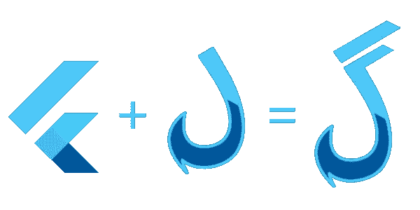
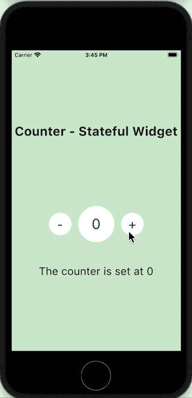
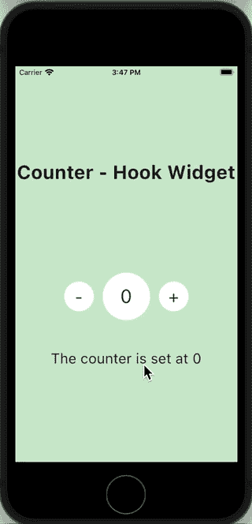

# 为了更好的应用性能，在有状态窗口小部件上摆动钩子窗口小部件

> 原文：<https://levelup.gitconnected.com/flutter-hook-widgets-over-stateful-widgets-for-better-app-performance-938861d5ea94>



Flutter 中的一切都是由小部件组成的。在本文中，我们将探索不同类型的窗口小部件*(无状态和有状态)*，还将研究*钩子窗口小部件*，它是无状态窗口小部件的扩展。我们还将探究其中的差异，看看如何在有状态窗口小部件上使用钩子窗口小部件来提高应用程序的性能。

***什么是颤振中的 widget？***

> Flutter widgets 是使用现代框架构建的，其灵感来自于 [React](https://reactjs.org/) 。中心思想是用小部件构建用户界面。小部件描述了在给定当前配置和状态的情况下，它们的视图应该是什么样子。

如果 UI 上的任何操作需要重新构建小部件，那么这就是您应该使用有状态小部件的地方。但是如果小部件只显示数据，UI 上的任何动作都不需要重新构建小部件，那么可以使用无状态小部件。

***无状态窗口小部件*** 是易于使用的窗口小部件，在添加逻辑方面你真的不能对它们做太多，因为顾名思义，它们是无状态的。一旦构建了 UI，UI 中的任何操作都不能触发小部件的重新构建。

但是当我们谈论 ***有状态小部件*** 时，有很多事情在幕后发生，UI 中的任何变化都会触发小部件的重建。

让我们考虑计数器应用程序的例子，

## 1.使用有状态小部件的计数器应用程序

在这个应用程序中，我可以通过点击“-”和“+”按钮来更改计数器值。每次点击都会改变 UI 并重新构建小部件来更新计数器的值。我将存储计数器的值，并在 UI 中的两个地方显示它



上面屏幕的代码是

请注意，我在更新计数器值的任何地方都大量使用了 setState。这是因为我通知小部件更新变量的值，并用更新后的值重新构建小部件。

如果我不包含 setState，那么计数器值将得到更新，但 UI 不会被重新构建，结果是 UI 根本不会改变，您将只能在 UI 中看到旧的计数器值。

虽然这是一种管理状态的简单技术，但在构建复杂的小部件时，有状态小部件可能不是最佳选择。这是因为持续重建小部件会降低应用程序的性能，并导致应用程序在重建期间消耗大量资源。

这时你应该考虑使用钩子小部件，它是无状态小部件的扩展。

## 2.使用挂钩小工具的计数器应用程序


> 钩子是一种管理`Widget`生命周期的新型对象。它们的存在只有一个原因:通过删除重复项来增加小部件之间的代码共享*。*

当使用钩子时，我们只使用一个类，这使得维护代码变得容易。 [flutter_hooks](https://pub.dev/packages/flutter_hooks) 为我们提供了可重用钩子的列表，其中包括:

*   [**使用效果**](https://pub.dartlang.org/documentation/flutter_hooks/latest/flutter_hooks/useEffect.html) **—** *对副作用有用，可选择取消副作用。*
*   [**useState**](https://pub.dartlang.org/documentation/flutter_hooks/latest/flutter_hooks/useState.html)**—***创建一个变量并订阅它。*
*   [](https://pub.dartlang.org/documentation/flutter_hooks/latest/flutter_hooks/useMemoized.html)****—***缓存复杂对象的实例。***
*   **[**use animation controller**](https://pub.dartlang.org/documentation/flutter_hooks/latest/flutter_hooks/useAnimationController.html)**—***创建一个* `*AnimationController*` *，它将被自动处理。***
*   **[**useTextEditingController**](https://pub.dev/documentation/flutter_hooks/latest/flutter_hooks/useTextEditingController-constant.html)**—***创建一个* `*TextEditingController*` *。***
*   **[**usetab controller**](https://pub.dartlang.org/documentation/flutter_hooks/latest/flutter_hooks/useTabController.html)**—***创建并处置一个* `*TabController*` *。***

**对于同一个反例，当我们使用钩子时，应用程序以同样的方式运行。然而，主要的区别是我们将对计数器变量使用`useState` 钩子，以确保 UI 中的任何变化都会被通知。**

```
final count = useState(0);
```

*   ****count** 变量是 **ValueNotifier** 的实例。**
*   ****使用状态** —挂钩**
*   **0——`initialData`**

**要访问变量 count 的值，使用`count.value`**

> **每当 **ValueNotifier.value** 更新时，它会将调用者 HookWidget 标记为需要构建。在第一次调用时，它将[值通知器](https://api.flutter.dev/flutter/foundation/ValueNotifier-class.html)初始化为`initialData`。`initialData`在后续通话中被忽略。**

**当钩子小工具第一次呈现时，ValueNotifier 被设置为`initialData`，随着值的变化，后续调用将使用更新后的值。**

****

**在上面的小部件中，计数值最初被设置为 0，它来自于在初始化钩子时设置的`initialData`。随着计数器不断更新，value notifier . value**(count)**发生变化，小部件重新构建。**

> **在重建期间，性能的影响可以忽略不计，因为钩子允许您消除对 initState、dispose 和 setState 的需要，因为与状态相关的所有内容都是用 build 方法中的钩子函数初始化的。**

## **useEffect()**

**为了在小部件的 initState 期间加载数据，或者处理数据，我们使用 useEffect()钩子。**

**就像 initState 和 dispose 一样， ***useEffect()*** 将被**

*   **在小部件的生命周期中只调用一次，**
*   **return 语句将在小部件被释放时执行，**
*   **const []意味着在小部件没有被释放之前，不要调用效果。可以有一个参数列表，当其中一个参数改变时，useEffect 会再次调用回调。**

**下面是带挂钩的计时器小部件的代码:**

**下面是带有状态小部件的计时器的代码:**

**钩子是维护简单逻辑的一种简单方法，我在大多数项目中都使用过它。它避免了复杂的逻辑，促进了更好的应用程序性能。如果你想了解更多关于钩子的知识，Flutter docs 在 https://pub.dev/packages/flutter_hooks 提供了大量的资源**

**如果你觉得有帮助的话，欢迎留下评论和分享！**

# **分级编码**

**感谢您成为我们社区的一员！在你离开之前:**

*   **👏为故事鼓掌，跟着作者走👉**
*   **📰查看[升级编码出版物](https://levelup.gitconnected.com/?utm_source=pub&utm_medium=post)中的更多内容**
*   **🔔关注我们:[Twitter](https://twitter.com/gitconnected)|[LinkedIn](https://www.linkedin.com/company/gitconnected)|[时事通讯](https://newsletter.levelup.dev)**

**🚀👉 [**加入升级达人集体，找到一份惊艳的工作**](https://jobs.levelup.dev/talent/welcome?referral=true)**