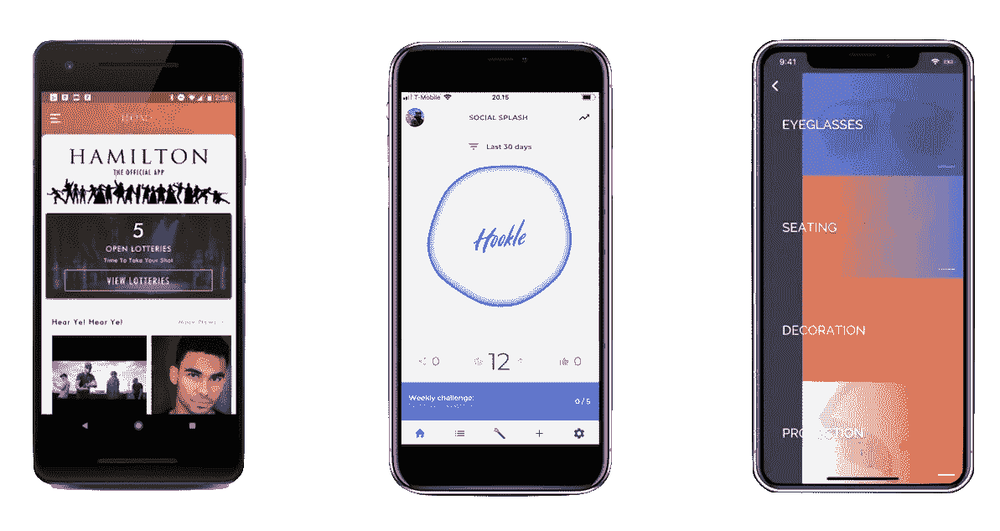
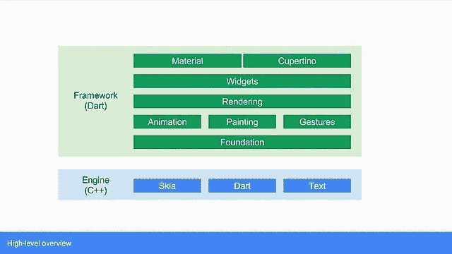
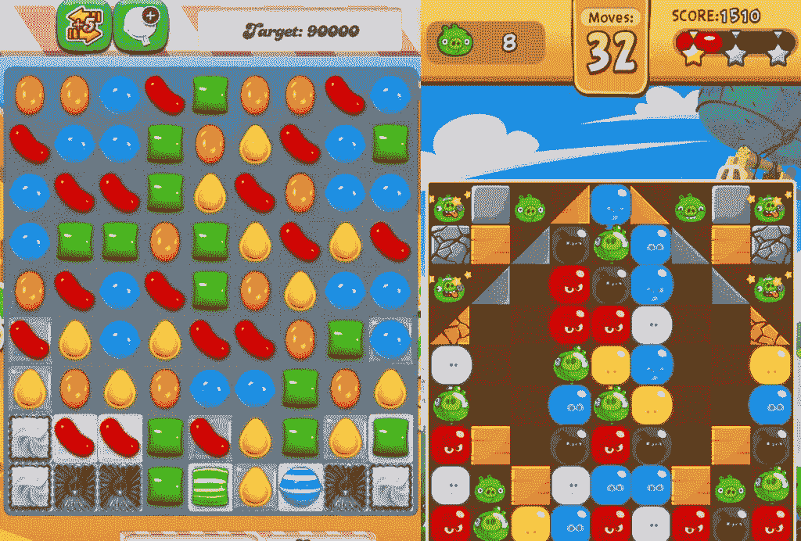

# 我们的飞镖之旅

> 原文：<https://levelup.gitconnected.com/flutter-how-it-got-right-4865de34852>

## Flutter 允许我们关注最重要的事情

颤振应用展示

我是 [Tanibox](http://tanibox.com) 的创始人之一，还有 [Asep](https://medium.com/u/ad05684425cf?source=post_page-----4865de34852--------------------------------) 和他的妻子。作为董事会成员，我的职责通常是提供建议和指导。有一段时间，我们改变了我们的商业模式，需要创建一个可以在 Android 和 iOS 上运行的应用程序。当我们试图找出如何做到这一点时，我参与了进来。

起初，我们认为我们应该为每个平台单独创建一个本地应用程序。两个星期后，它没有工作。迭代对我们来说太慢了，我们知道我们真的需要在内部构建它。唯一可行的选择是使用 React Native。但是我们不喜欢将*回归到 Javascript 的想法。*

# 颤动是我们的救命稻草

我和 Asep 过去已经编写了许多原生 iOS 和 Android 应用程序。我们一致认为，最昂贵的投资是在用户界面和互动，因为它通常变化很快，所以我们想优化这一部分。我们最终聘请了一位经验丰富的移动工程师来编写我们的应用程序，并向他提出了探索 Flutter 的挑战。这一直很有效。这是我们到目前为止学到的:

## 一种编写用户界面的敏捷方法

在两个平台上各自的 UI 框架中编写应用程序的问题是需要时间、金钱和专业知识。每个平台都有自己的行为，每个公司都有自己的品牌和用户界面指南，这些指南可能与平台所有者提出的指南一致，也可能不一致。这也花费了**大部分**的开发时间。我们只是一个小公司，我们想快速测试我们的产品。

颤振建筑

颤振框架是在颤振引擎之上编写的。该引擎负责三个平台渲染器的抽象:Android、iOS 和 Fuchsia。该框架专注于 UI 小部件呈现。它基于 Skia 实现了自己的渲染栈。它不使用 iOS 的`UIView`或者 Android 的`View`类。

糖果粉碎传奇 vs 愤怒的小鸟:爆炸

游戏引擎这么做已经很久了。每个游戏引擎都有自己的 UI 渲染库，这使得游戏开发者能够在所有平台上使用自己的品牌、风格和交互来构建 UI。游戏甚至不遵守“UI 准则”，因为它们需要脱颖而出。

现在的应用程序倾向于围绕品牌而不是平台来设计。如果人们已经熟悉了一个平台上的应用程序，他们希望它在另一个平台上表现相同。品牌一致性很重要。这是我们想要达到的目标。

Flutter 还处理自己的动画和手势。这使得 Flutter 在 UI 小部件如何组成以及用户如何以类似的方式与它们交互方面拥有完全的自由。Flutter 使我们能够基于我们的品牌来编写我们的 UI。颤振的制作方式符合我们的要求。

事实证明，在集成到后端之前，我们花了大量的时间来构建和调整 UI。总有一些“东西”需要快速调整。Flutter 支持调试构建期间的热重载。这意味着开发人员可以调整和运行，并看到结果。这使得我们能够快速迭代两个平台的 UI。在释放模式下，flutter 会吐出 [AOT 编译的代码](https://en.wikipedia.org/wiki/Ahead-of-time_compilation)。

## 与后端保持一致的通信方式

我们的后端是用 Go 编写的，它公开了一个 RESTful API。为了让它有效地工作，我们创建了 SDK 来无缝地访问服务器端点。如果我们要在 Android 和 iOS 中分别实现它们，我们将需要创建两个不同的库，因为它们对 HTTP 和 JSON 进行不同的编组和解组。

感谢 Dart 的 [HTTP](https://pub.dartlang.org/packages/http) 包、[build _ value](https://pub.dartlang.org/packages/built_value)和[build _ collection](https://pub.dartlang.org/packages/built_collection)，我们能够编写具有不可变数据结构的异步客户端 SDK。Android 和 iOS 应用程序以及 web 应用程序都使用这个 SDK，因为后来我们决定使用 Angular Dart 编写我们的仪表板，以便能够进一步利用我们共享的 Dart SDK。

就在最近，dart 团队甚至[宣布 gRPC 支持 Dart](https://medium.com/dartlang/announcing-official-grpc-support-for-dart-6c9b50357af6) 。这太棒了，因为这将实现更好的集成，因为我们计划在不久的将来在我们的服务中使用 gRPC。

## 静态类型语言

我们强烈主张尽可能使用静态类型语言。我们喜欢用事物的类型来表达它。这就是我们最初决定不使用 React Native 的原因。

Dart 并不完美，但它有我们需要的东西:一种结合了编译时类型检查和运行时类型检查的静态类型语言。它内置了异步使用 future 和`async-await`的机制。它在处理事件和网络数据包方面帮助巨大。

Dart 类似于 Java。我们的 Dart API SDK 是由我们的后端工程师编写的。我们并没有真正按照层来分隔工程师，拥有 Dart 这样的语言使我们的后端工程师可以在纯 Dart 中为所有三个平台创建一个 SDK。这种语言很容易掌握，为我们节省了大量时间。

# 但是颤动也让我们痛苦

而 Flutter 节省了我们的时间和金钱投资。这也是一种风险。这条推文显示了我在帮助亚马逊 Cognito 团队工作时的沮丧。

我心慌意乱

## Dart 标准库中可能的错误

*编辑:这个已经搞定了。* 我们当时没有使用稳定通道，因为从 Dart 1 到 Dart 2 的变化很大，我们**确实**需要 Dart 2 的特性。有一个特别让我恼火的 bug 是 dart dev 频道在 0.54 版本之前的`modpow(x^y mod N)` bug。Amazon Cognito 正在利用 SRP 和 RSA 来认证和验证令牌，我需要正确的`modpow`实现的`BigInt`。我从其他人那里收集代码。谢天谢地，Google 有 dart 代码处理简单的 RSA。我看着它们，发现我的代码是正确的，但是 Dart 实现有问题。

## 文献稀缺

*编辑:这是在进步，但还是有欠缺。* 当我第一次使用谷歌自己创建的库时，比如`built_value`和`built_collections`，文档几乎为零。在许多场合，我需要偷看 GitHub 上的源代码，以了解发生了什么以及如何使用它。谢天谢地，谷歌发布源代码的标准中有很多例子。

## 需要自己动手建造东西

在我编写这个应用的时候，还没有针对 Dart 的 Amazon Cognito SDK，所以我需要遵循他们的文档，使用 raw `curl`进行测试，查看用其他语言编写的源代码，然后在 Dart 中重新实现它。

我们不能依赖为 Dart 编写的库的可用性。Cognito 就是一个例子。对我来说，这是有趣的部分。但是对其他人来说，这可能是不可行的。我花了很多时间和咖啡来弄清楚 Dart 中这些东西是如何工作的，一旦我能弄清楚它们，我就得到回报。只需很小的改动，它就可以在所有三个平台上使用。

# 结论

使用前沿技术会有风险，但是使用 Flutter 和 Dart 的风险是值得投资的。事实上，我们使用 dev 频道只是让我们觉得我们在与谷歌的 Flutter 和 Dart 团队一起工作，并始终跟踪问题。

我们设法用一个客户端开发人员和一个后端开发人员在 3 周内构建了我们的第一个原型。如果我们用它们各自的 IDE 和语言编写它们，这是不可能的。

如果你想知道我们正在制作什么样的应用程序，我们的首席执行官将在未来几个月我们的产品准备就绪时宣布。敬请关注。