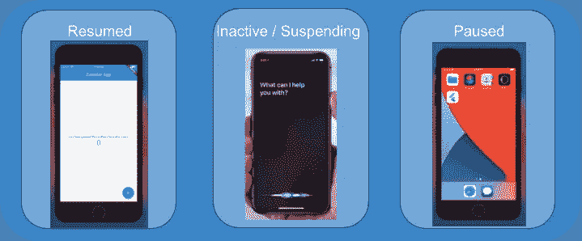

# Flutter:如何利用应用程序生命周期(在应用程序启动、关闭和间隔时运行功能)

> 原文：<https://levelup.gitconnected.com/flutter-how-to-utilize-app-life-cycle-run-function-on-app-bootup-close-and-on-interval-cacc8d147166>



Flutter 应用生命周期——如何利用

**一个 TL；dr 可以在这篇文章的底部找到。**

你在手机上使用的大多数(如果不是全部)应用程序都出于各种原因利用应用程序生命周期——也许你想显示用户在关闭应用程序时离线，或者也许你想在会话结束时提交一些关键数据。App lifecycle 是一个强大的工具，你应该 100%把它放在你的 Flutter toolbelt 中。

**用例**

以下是应用生命周期的一些使用案例:

*   报告数据分析(用户看屏幕的时间、点击次数等。)
*   清除系统中的会话数据
*   离线/在线报告

**其他**

本教程旨在易于学习——我保证你可以在不到 5 分钟的时间内(通过学习本教程)为你的应用添加生命周期，并且能够完全控制应用的状态。

这个简单项目的完整回购可以在这里找到[。](https://github.com/antholeole/flutter_lifecycle)

TL；博士垫底。

我们将构建一个计数器应用程序，当用户在线或离线时通知应用程序的其他用户，并在应用程序关闭时向服务器报告数据。

## 步骤 1)设置

首先，我们将运行`flutter create`命令来生成计数器项目。我总是清除评论，把主页放到另一个文件里。

下一件我们想要做的事情是在树中添加一个定制的小部件:我们称它为`LifeCycle`。现在，它将是一个基本的、有状态的小部件，只通过管道传递给一个子部件:

```
import 'package:flutter/material.dart';class LifeCycle extends StatefulWidget {
 final Widget child; const LifeCycle({@required this.child}); @override
 _LifeCycleState createState() => _LifeCycleState();
}class _LifeCycleState extends State<LifeCycle> {
 @override
 Widget build(BuildContext context) {
  return widget.child;
 }
}
```

我们需要做的就是用这个小部件包装应用程序，然后我们就完成了设置:`LifeCycle(child: MyHomePage())`。

## 步骤 2)获取生命周期

为了让生命周期小部件能够观察应用的生命周期，需要做的就是在状态结束时使用`WidgetsBindingObserver`:

```
class _LifeCycleState extends State<LifeCycle> with WidgetsBindingObserver {
```

(额外收获:小部件绑定不仅公开了生命周期方法，还公开了大量“值得一提”的方法。这是关于那个的文件

现在把`init`和`dispose`改成这样:

```
@override
void initState() {
WidgetsBinding.instance.addObserver(this);super.initState();
}@override
void dispose() {
WidgetsBinding.instance.removeObserver(this);
super.dispose();
}
```

这告诉小部件开始和停止监听小部件绑定。

我们现在可以通过在小部件中添加一个覆盖来观察生命周期，如下所示:

```
@override
**void** didChangeAppLifecycleState(AppLifecycleState state) {
  print('state = $state');
}
```

该方法采用一个名为`AppLifecycleState`的参数。这是一个对应于应用程序生命周期的每个“状态”的枚举，用外行的话来说就是这些状态。

*   `inactive`/`suspending`—app 正在向后台移动。该应用程序仍处于打开状态，但它不接收输入。这也是暂停的途径，因此应用程序从活动到非活动再到暂停。也许对“离开”状态有用。android 和 iOS 的非活动触发器，但只在 iOS 暂停——尽管它们在功能上是相同的。
*   `paused` —不再向用户显示该应用程序。也许用户换了应用或者关掉了手机。这是触发的最后一个生命周期方法，这是您想要提交数据的地方。
*   `resumed` —应用可见。这是一个“实时”状态，用户正在使用应用程序。应该注意，使用这种方法，初始应用程序打开时不会调用`didChangeAppLifecycle`——这是因为这个小部件需要挂载。相反，您可以使用 initState 来打开初始应用程序。

## 步骤 3)报告生命周期数据(应用使用时间)

如果你记得，我们要记录两件事:应用程序使用时间，以及计数器点击(定期)。为了报告应用程序的使用时间，我们需要采用正确的生命周期方法。对于我们的例子，它将被暂停和恢复，init 应用程序的 initState 打开。

我们将创建一个名为`_startTime`的私人成员，这将是应用程序打开的时间。我们将有:

```
DateTime _startTime;@overridevoid initState() {
  WidgetsBinding.instance.addObserver(this);
  _startTime = DateTime.now();
  super.initState();
}
```

记录营业时间。然后，在`didChangeAppLifecycleState`中，我们将进入暂停和恢复的生命周期。暂停时，我们将报告数据，恢复时，我们将重置计时器。

```
@override
void didChangeAppLifecycleState(AppLifecycleState state) {
  switch (state) {
  case AppLifecycleState.paused:
    _reportData(DateTime.now().difference(_startTime));
    return;
  case AppLifecycleState.resumed:
    _startTime = DateTime.now();
    return;
  default:
    return;
  }
 }
```

现在，`_reportData`在我们每次关闭应用程序时都会被记录，计时器也会重置！厉害！

## 步骤 4)定期报告数据(计数器点击次数)

如何报告计数器点击量？我们可以将它放入`paused`生命周期方法中，但是，让我们试着每 10 秒报告一次。为此，我们将在`LifeCycle`小部件的`initState:`中设置一个计时器

```
_reportClicks = Timer.periodic(Duration(seconds: 10), (_) => _reportClicksToServer());
```

_reportClicksToServer 可以是任何函数。我们需要做的最后一件事是确保我们正确地处理了计时器。在处置:`_reportClicks.cancel();`！

我们应该做的最后一件事是找到一种方法来获得这个小部件的计数器点击。我将把这留给你——它可以是任何更高阶的状态管理。[如果您正在尝试寻找适合您的更高阶状态管理，请看一下这篇文章](/flutter-state-management-in-2021-when-to-use-what-98722093b8bc)(在这种情况下，为了简单起见，我会使用继承的小部件甚至是单例)。

就是这样！由于 WidgetsBindingObserver，Flutter 中的应用程序生命周期非常简单。

**TL；dr:** 创建一个小部件并使用`WidgetsBindingObserver` mixin。这将允许您访问`didChangeAppLifecycleState`方法，每次生命周期改变时都会调用该方法。它被具有当前生命周期状态值的枚举参数调用。对于间歇呼叫，您可以使用`Timer.periodic(Duration(..), (_) => function)`