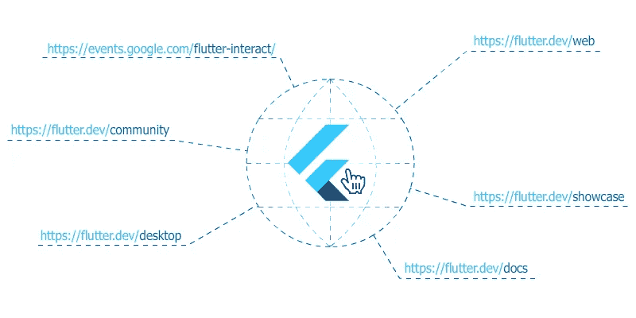

# 在 Web 和手机上打开 Flutter 超链接的指南

> 原文：<https://levelup.gitconnected.com/flutter-hyperlinks-d2eee3fd24f>

## 本教程介绍了在 Flutter 中打开超链接的 3 个选项，以及如何针对 web 和移动平台



从一开始，超链接(或简单的链接)就是网络不可或缺的一部分。在我与 Flutter 和 Dart 的旅程开始时，我需要发现如何打开链接。

web 的 Flutter 不允许导入 [url_launcher](https://pub.dev/packages/url_launcher) 包。如果你需要打开一个链接，你必须使用 **dart:html** 包或者 **dart:js** (这需要更多的努力)。

在 2019 年 12 月 12 日之前，本文提供的方法是在 Flutter web app 中打开链接的唯一选项。在[**Flutter Interact 2019**](https://developers.google.com/events/flutter-interact)**上宣布了对几个包的 web 支持，包括 [url_launcher](https://pub.dev/packages/url_launcher) 包。这些选项在某些用例中仍然可行。**

**由于 Flutter 的开发频道允许针对网络平台，所以在开放链接方面没有太大的变化。如果计划只针对 web，您仍然可以使用上述软件包。如果你计划瞄准网络和手机，你需要使用 [universal_html](https://pub.dev/packages/universal_html) 包。**

**让我们浏览一下选项:**

****1。**用 **dart:html** 打开一个链接如下:**

```
import 'dart:html' as html;void htmlOpenLink() {
 String url = '[https://flutter.dev'](https://flutter.dev/web');
 html.window.open(url, '_blank');
}
```

****2。**使用 **dart:js** 打开一个链接，如下所示:**

**首先编辑`web`文件夹中的`index.html`文件(位于您的 Flutter 项目的根级别)。**

```
<!DOCTYPE html>
<html>
  <head>
    <meta charset="UTF-8">
    <title>hyperlinks_demo</title>
 **<script type="application/javascript">
      function openLink(url, target) { 
        window.open(url, target); 
      } 
    </script>**
  </head>
  <body>
    <script src="main.dart.js" type="application/javascript"></script>
  </body>
</html>
```

**然后您就有了打开链接的函数:**

```
import 'dart:js' as js;void jsOpenLink() {
  String url = '[https://flutter.dev'](https://flutter.dev/web');
  js.context.callMethod('openLink', [url, '_blank']);
}
```

**如你所见，这比上一个例子更难实现，但实际上做了同样的事情。然而，在 JS 函数`openLink`中，如果需要，可以添加更多的功能。**

****3。**如果你计划面向多个平台(网络和移动)，那么方法就是使用`universal_html`包和`url_launcher`。**

```
import 'package:url_launcher/url_launcher.dart';
import 'package:universal_html/html.dart' as html;
import 'package:flutter/foundation.dart';void openLink() async {
  String url = '[https://flutter.dev'](https://flutter.dev/web');    
  if(**kIsWeb**) {
    html.window.open(url, '_blank');
  } else {
    if(await canLaunch(url)) {
      launch(url);
    }
  }
}
```

**对上述代码的一个(不那么)快速的解释:**

*   **我们已经导入了所需的包(`url_launcher` -将使我们能够在移动设备上打开链接，`universal_html` -将使我们能够从网络浏览器上打开链接，`foundation`将帮助我们决定我们的代码是否在网络浏览器中运行)**
*   **我们已经定义了想要打开的`url`**
*   **我们使用`kIsWeb`检查代码是否在 web 浏览器中运行，如果是，那么我们使用`window.open`方法。**
*   **否则，我们检查是否可以使用`async` 方法`canLaunch`来启动`url`(我们仍然可以在桌面或其他类型的设备上)。我们这样做的原因是为了它的布尔结果。如果它返回`true`，那么我们调用`launch`方法，它将在我们所在的设备上施展魔法。**

**如果你只想瞄准网络平台，选项 **1** 和 **2** 也不错。**

**如果你想瞄准所有的平台，那么选择 **3** 将是一个不错的选择。**

## **iOS 和 Mao 上的 Safari 问题**

**如果在等待一个**异步**操作结束后调用 **openLink** 函数中的任何一个(调用不同步)，上述方法在 Safari (iOS 和 macOS)上不起作用。**

**解决方案是检测我们是否在 Safari 上，如果是，只需更改`window.location.href`。例 2 变成了:**

```
<!DOCTYPE html>
<html>
  <head>
    <meta charset="UTF-8">
    <title>hyperlinks_demo</title>
<script type="application/javascript">
      **function openLink(url, target, isAsync=false) {
        var is_safari = /^(?!.*chrome).*safari/i.test(navigator.userAgent.toLowerCase());
        if (is_safari && isAsync) {
          window.location.href = url;
        } else {
          window.open(url, target);
        } 
      }** </script>
  </head>
  <body>
    <script src="main.dart.js" type="application/javascript"></script>
  </body>
</html>
```

**我们无法在新标签页中打开链接，尽管我们仍然可以打开链接。如果没有这一点，当我们点击链接时，我们的应用程序将不会有任何反应。**

## **链接目标选项**

**在上面的例子中，我们使用了`_blank`作为`url`的目标窗口。**

**我将花一点时间详细说明在 web 浏览器中打开链接时的目标选项:**

*   ****_blank** -指定一个新窗口**
*   ****_self** -指定当前窗口中的当前帧**
*   ****_parent** -指定当前帧的父帧**
*   ****_top** -指定当前窗口中的顶层框架**
*   **存在的窗口的自定义目标名称**

**既然你已经对在 Flutter 中打开链接有了深入的了解，你也可以在将要打开这些链接的小部件上放置一个 [CustomCursor](https://medium.com/@constanting/customcursor-for-flutter-b6f252c0dcbb) ，这样会更简单。**

**[](https://medium.com/flutter-community/customcursor-for-flutter-b6f252c0dcbb) [## 颤振腹板的自定义光标

### 如何在 web 应用程序中自定义光标

medium.com](https://medium.com/flutter-community/customcursor-for-flutter-b6f252c0dcbb) 

你也可以看看一种特殊的链接，即[专用链接](https://medium.com/@constanting/specialized-links-882dfbfca2d3)，它可以让你发送电子邮件、短信，甚至打电话。

[](https://medium.com/@constanting/specialized-links-882dfbfca2d3) [## 专门的超链接

### 在 Dart 中展示

medium.com](https://medium.com/@constanting/specialized-links-882dfbfca2d3) 

就这些！**