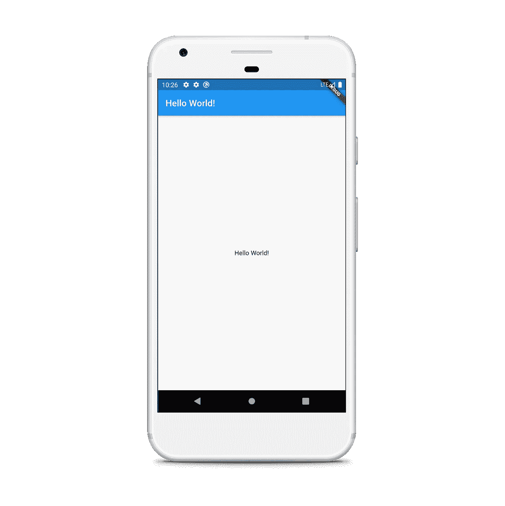
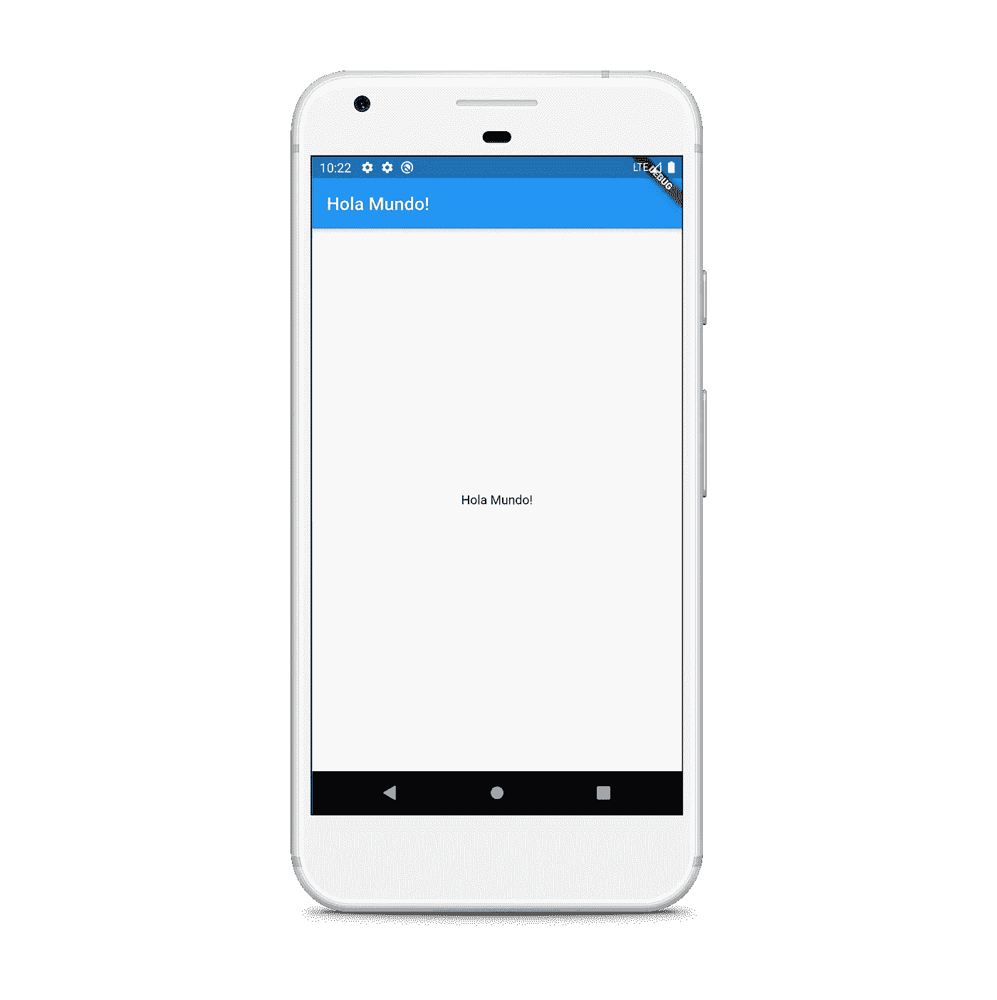
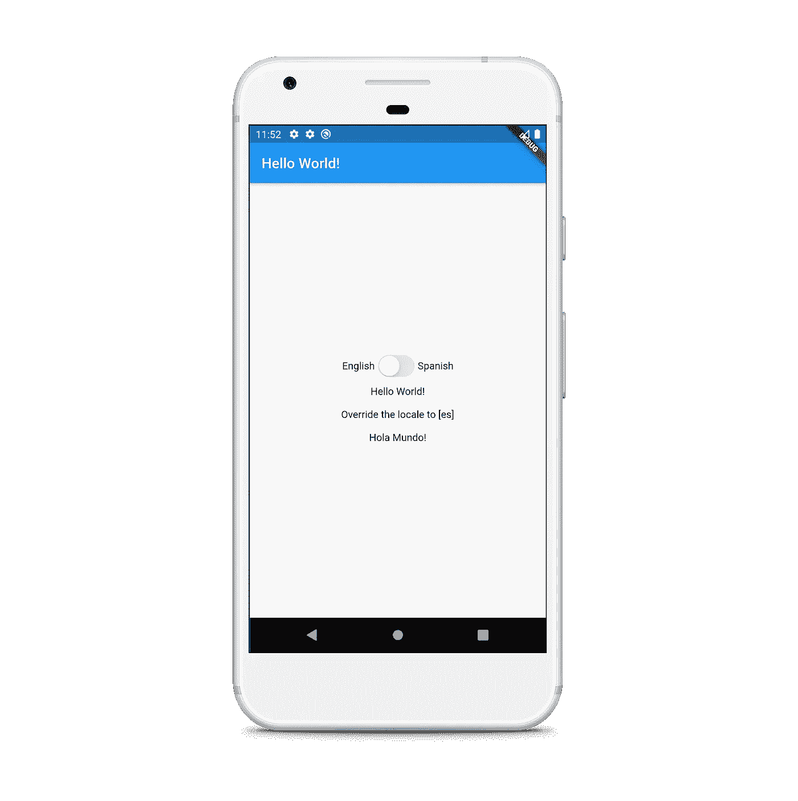
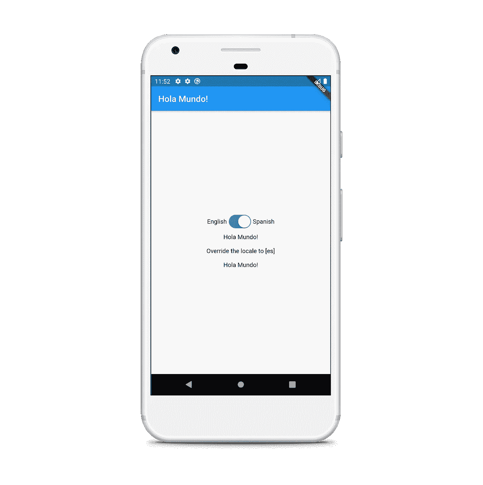
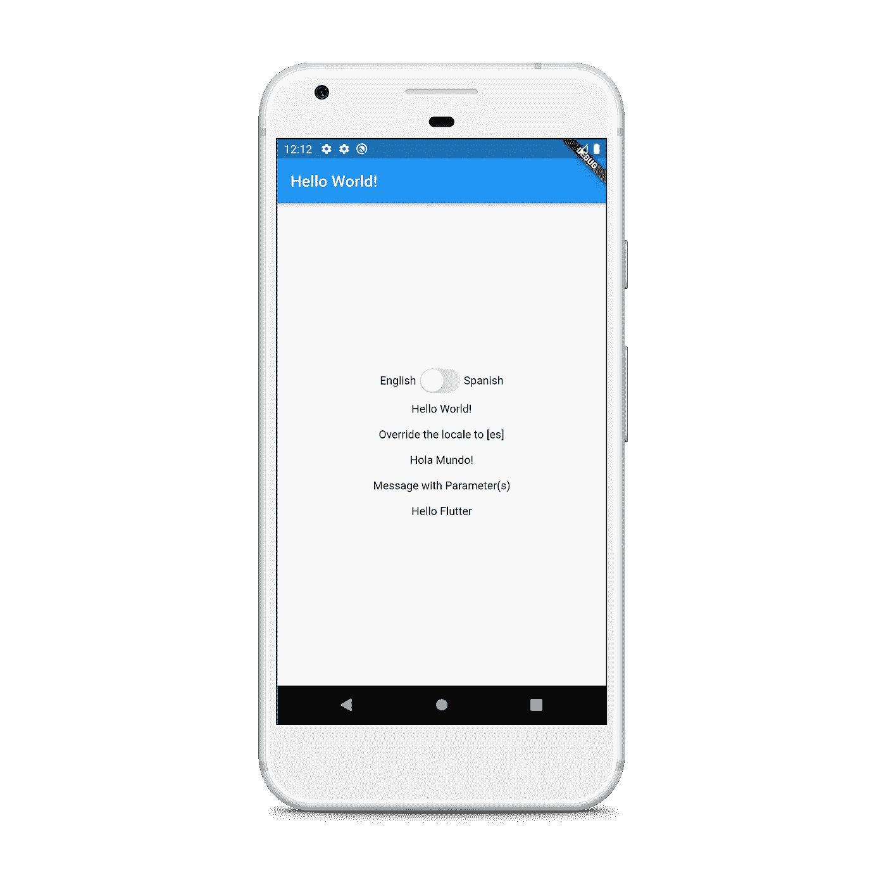
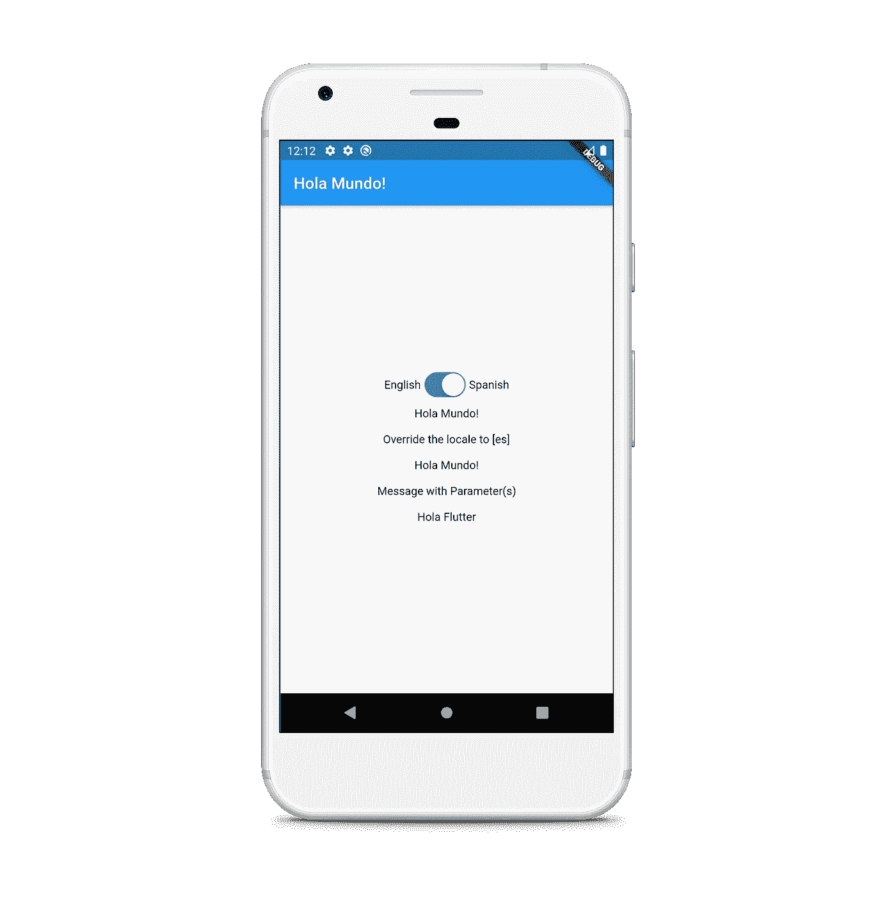

# 颤振国际化做得好吗

> 原文：<https://levelup.gitconnected.com/flutter-internationalization-done-right-91d77832d000>

以简单的方式国际化 Flutter 应用程序


当你考虑在多个地理位置部署应用程序时，你应该*国际化*你的应用程序，让用户在使用时有宾至如归的感觉。Flutter 现在附带了一个本地化工具，这使得开发人员可以非常容易地在应用程序中集成多种语言。

在这篇文章中，我们将看看如何以一种非常简单的方式国际化我们的 Flutter 应用程序。所以让我们开始吧！

# 入门指南

让我们从创建一个新的 Flutter 项目开始。我们将在本文中讨论以下几点:

*   使用两种不同的语言环境，在本例中是英语和西班牙语
*   覆盖应用程序某些部分的设备默认区域设置
*   让用户能够从应用程序中更改区域设置
*   将参数传递给区域设置消息

> 注意:这个例子很简单，这样我们可以更关注国际化和本地化方面。

## 更新 pubspec.yaml 文件

更新`pubspec.yaml`以包括`flutter_localizations`、`intl`和`provider`包。

```
dependencies:
  flutter:

  # Internationalization support.
  **flutter_localizations:
    sdk: flutter**
  **intl: 0.16.1
  provider: ^4.3.2+2**flutter:
# Adds code generation (synthetic package) support
**generate: true**
```

## 创建 l10n.yaml 文件

在项目的根目录下创建一个新的`l10n.yaml`配置文件。它用于定制生成本地化类的工具，这些类将被导入到我们的应用程序中。

将以下内容添加到文件中:

让我们一个一个地看一下:

*   `arb-dir`:将包含`.arb`格式消息目录的目录。每个`locale`将有一个消息目录。这将作为本地化工具的输入目录。
*   `template-arb-file`:定义应用程序中所有消息以及元数据信息的消息目录。该文件必须在`arb-dir`中创建。
*   `output-localization-file`:定义将由本地化工具生成的主`dart`类文件。

> 还有一些配置选项，但这些是您大多数时候需要的选项。

## 创建模板 ARB 文件

按照上面的说明创建`arb-dir`目录和`template-arb-file`。`template-arb-file`是一个 ARB 格式的消息目录，用于定义应用程序支持的所有消息。

> 注意:所有 arb 文件的文件名不能包含下划线，除了用于描述语言环境。

让我们从在新文件`app_en.arb`中添加英文消息目录开始:

在这里，我们使用`@@locale`将英语定义为区域设置，后跟用于本地化的语言代码。

`helloWorld`行定义了应用程序 helloWorld 消息的英文翻译，即“Hello World！”。

跟在`@helloWorld`后面的 JSON 对象包含了对消息的描述，旨在帮助翻译人员。它也成为为消息生成的方法中的注释。

模板目录中每条消息的名称将成为应用程序用来检索该消息的本地化值的 Dart 方法的名称，这意味着它们必须是有效的 Dart 方法名称。

我们可以使用工具生成的`AppLocalizations`类来查找消息的事务，如下所示:

```
Text(AppLocalizations.of(context).**helloWorld**)
```

同样，让我们也创建`app_es.arb`:

在这里，我们不需要包括额外的信息，因为它将从英文目录。

## 集成自动生成的本地化类

打开`main.dart`并添加以下代码:

现在让我们来看一下代码。第二行导入将由本地化工具生成的`AppLocalizations`类。`localiationsDelegates`和`supportedLocales`是根据我们之前定义的消息目录和模板自动生成的。现在您已经准备好本地化您的应用程序了。这么简单，不是吗？

现在，应用程序可以查找本地化消息，如上所示:

```
Text(AppLocalizations.of(context).**helloWorld**)
```

我们将用它来显示在我们的`appBar`和屏幕中央。我们的`home_page.dart`会是这样的:

当您运行应用程序时，如果您的默认`locale`是英语，您将看到以下输出:



英语区域设置

当您将设备`locale`更改为西班牙语时，您将看到以下输出:



西班牙语言环境

## 覆盖设备默认区域设置

在某些情况下，你可能希望你的应用程序的某些部分有一个不同的`locale`。`Localizations`小部件有一个工厂构造器`Localizations.override`，当你的应用需要被本地化到一个不同于为你的设备配置的`locale`时使用。

打开`home_page.dart`并将其更新为以下内容:

`Localizations.override`取当前的`BuildContext`，新的`locale`和新的`locale`生效的`child`。这里我们将`es`指定为`child`的新`locale`。

注意我们如何使用`Builder`来获得正确的`BuildContext`。如果你提供了一个错误的`context`，那么新的`locale`将不会生效。

如果您现在运行应用程序，将设备`locale`设置为英语，您将看到以下内容:


覆盖西班牙语区域设置

正如你所看到的，除了我们使用`Localizations.override`的地方，应用程序的所有其他部分都有英文`locale` 。

## 让用户能够从应用程序中更改区域设置

仅仅让我们的应用程序响应不同的`locale`是不够的，我们还希望让用户能够在需要时选择应用程序中的语言。我们将通过一个简单的例子来使用`provider`包。

创建一个新的`app_locale.dart`文件并添加以下代码:

如果你熟悉`provider`包，这肯定是显而易见的。这里我们定义了一个`Locale`,当它被改变时，我们通知这个类的监听器。

接下来，我们将在我们的`home_page.dart`中添加一个`CupertinoSwitch`，让用户手动更改语言。我们将使用我们创建的`AppLocale`类来更改应用程序的语言环境。

这里，当`CupertinoSwitch`的值改变时，我们访问我们创建的`provider`并用适当的参数调用`changeLocale`方法，并将其更新为一个新值。

让我们转到`main.dart`并使用`Consumer`小部件更新应用`locale`。

这里我们使用`ChangeNotifierProvider`向它的后代提供`AppLocale`的实例。接下来，我们使用`Consumer`来访问`locale`，并使用`locale.locale`将其分配给`MaterialApp`小部件的`locale`。

下面是当`locale`是英语时的输出:



用户将`locale`改为西班牙语时的输出:



> 请注意，被覆盖的区域设置独立于设备的区域设置或用户选择的区域设置。

## 向消息传递参数

有时您可能想要使用应用程序值，如信息中的用户名。在这种情况下，我们可以使用**占位符在目录中定义消息参数。**这些是用花括号括起来的参数名。这些占位符成为生成的`AppLocalizations`类中的位置方法参数。占位符名称必须是有效的 Dart 方法参数名称。

每个占位符必须在`placeholders`对象中定义。例如，将带有`userName`参数的 hello 消息定义为:

同样，我们可以在`app_es.arb`中将其西班牙语目录定义为:

当没有参数被传递时，`example`字符串将被用作**默认的**参数。

完成后，转到`home_page.dart`并添加以下内容:

这里，我们只是添加了一个新的`Text`小部件，并调用工具将生成的`hello`方法，参数为 *Flutter* 。

最终输出将是:



最终英语输出



最终西班牙语输出

我们也可以通过使用多个花括号和它们在`placeholders`对象中的对应对象来拥有多个参数，比如:

```
"greeting": "{hello} {world}",
"@greeting": {
  "description": "A message with a two parameters",
  "placeholders": {
    "hello": {},
    "world": {}
  }
},
```

参数可以通过以下方式传递:

```
AppLocalizations.of(context).**greeting(‘Hello’, ‘World’)**
```

# 结论

在本文中，我们了解到借助 Flutter 提供的新本地化工具，国际化和本地化我们的 Flutter 应用程序是多么容易。

我们还看到了如何使用这种新技术让用户控制更改应用程序语言，以及如何向消息目录传递参数。

如果您有兴趣深入了解，请查看官方的国际化用户指南。

完整的源代码可以在下面的链接中找到:

[](https://github.com/harshshinde07/Internationalization-Flutter) [## harshshinde 07/国际化-扑动

### 展示国际化的新颤振应用。

github.com](https://github.com/harshshinde07/Internationalization-Flutter) 

## 感谢您阅读这篇文章。如果你喜欢这篇文章或者学到了新的东西，尽可能多地鼓掌以示支持。👏

## 这真的激励我继续写更多！:)

## 如果有错误，请随时纠正。

## 我们来连线:

*   [GitHub](https://github.com/harshshinde07/)
*   [领英](https://www.linkedin.com/in/harshshinde07/)