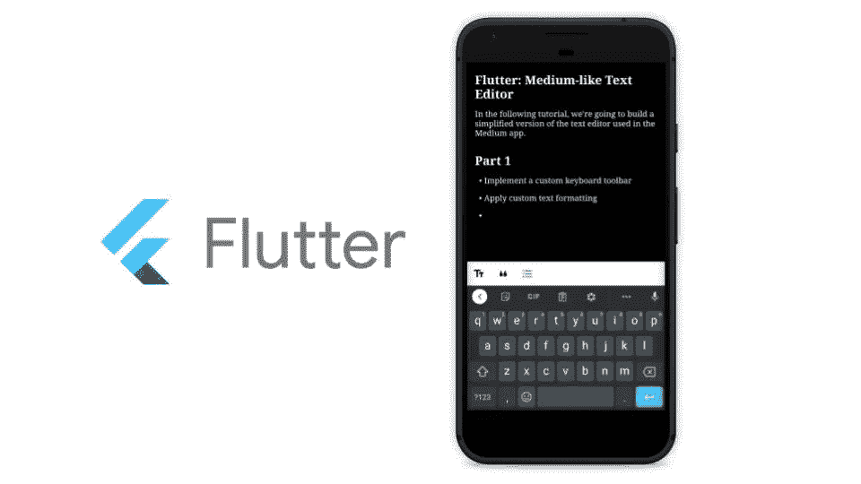
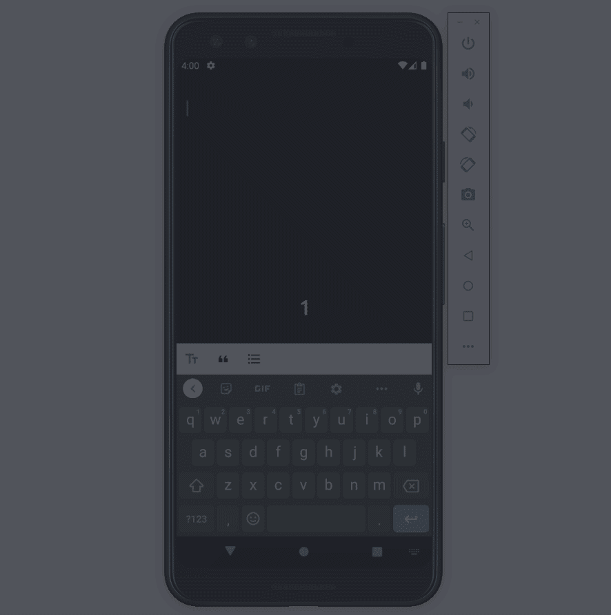
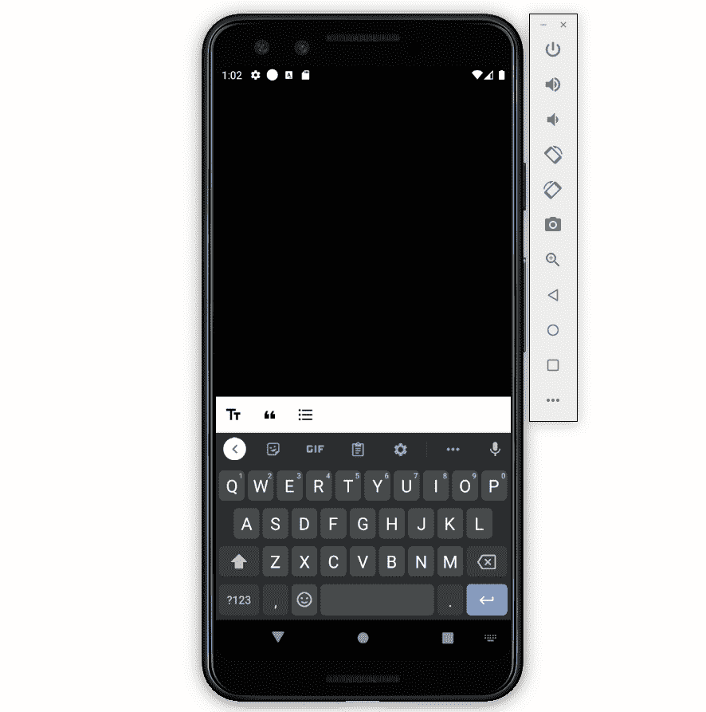

# Flutter:类似中型的文本编辑器

> 原文：<https://levelup.gitconnected.com/flutter-medium-like-text-editor-b41157f50f0e>

## 颤振教程

## 构建在中型移动应用程序中使用的文本编辑器的简化版本



在接下来的教程中，我们将构建一个简化版本的文本编辑器，用于中型移动应用程序的*“新故事”*部分。**之后，你的应用应该是这样的:**



行动的最终结果

## 媒体应用程序中“新故事”部分的简短分析

如果你导航到 Medium 应用程序的“新故事”部分，你会注意到键盘工具栏出现在屏幕底部，即使键盘不可见。当键盘出现时，工具栏向上移动，显示在键盘上方。如果您创建了两个文本块，您会发现尝试从多个块中选择文本将会失败。一次只能对一个文本块这样做。所以我们可以看到，Medium 很可能使用了`TextFields`中的一个`ListView`，不同的样式。

# 开始之前

首先，让我们创建一个新的 Flutter 项目

```
flutter create medium_text_editor
```

现在，我们将下面的包添加到`dependencies:`中的`pubspec.yaml`

```
provider: ^4.1.3
community_material_icon: ^5.3.45
keyboard_visibility: ^0.5.6
```

并安装软件包

```
flutter packages get
```

# 第 1 部分:使用键盘工具栏进行文本格式化

> 保持简单，专注于重要的事情。
> 不要让自己不知所措。
> ——孔子——

在第一部分中，我们将保持实现尽可能简单。我们将着重于显示一个键盘工具栏，它可以在单击按钮时改变文本字段的文本格式。

## 文本格式

我们将只实现标题、纯文本、项目符号和引号作为文本格式选项。让我们为每个选项指定文本样式和填充。

text_field .镖

***注意:*** *我们使用了 Unicode 字符* `*\u2002*` *作为项目符号的前缀。*

## 可定制的键盘工具栏

接下来，我们将构建将显示在键盘上方的键盘工具栏。工具栏只是`IconButtons`中的一个`Row`，用于设置点击时选择的格式类型。

***注意:*** *我们不会使用*[*keyboard _ actions*](https://pub.dev/packages/keyboard_actions)*包，因为它不太灵活，会导致很多奇怪的实现。*

工具栏.镖

## 连接键盘工具栏和文本格式

目前，状态管理非常简单，只需要更新选择的文本类型。因为在第二部分中会变得更加复杂，为了简单起见，我们将使用`Provider`框架。

***注:****`*EditorProvider*`*通告程序以后会更有用。**

*状态管理. dart*

*既然我们已经定义了我们的`ChangeNotifier`，我们需要使用`ChangeNotifierProvider.`来初始化我们的状态*

*要在键盘上方显示工具栏，我们只需使用`Stack`，并用`bottom: 56`定位我们的`SmartTextField`，用`bottom: 0.`定位我们的`Toolbar`。如果键盘可见，`Scaffold`的`resizeToAvoidBottomInset`属性将自动调整布局，使工具栏显示在上方。*

*text_editor .镖*

## *风格很重要*

*因为如果事情看起来不那么糟糕，编码总是更令人愉快，所以我们修改了`main.dart`中的主题。*

*主.镖*

*哒哒🎉*

**

# *第 2 部分:从单行编辑器到全文编辑器*

*既然我们已经实现了单个`TextField`案例，那么是时候构建一个全功能的文本编辑器了。*

## *丰富国家管理*

*如前所述，我们需要一个`TextFields`的`ListView`。因此，我们将在`EditorProvider`中存储三个列表:*

*   *`List<SmartTextType>`包含每个块的格式样式*
*   *`List<TextEditingController>`包含我们可以用来监听用户输入的每个块的控制器*
*   *`List<FocusNode>`为每个块包含一个`FocusNode`，我们将使用它来管理`TextFields`的焦点*

*为了简单和可读性，我们创建了以下五个 getters，我们将在代码的多个部分使用它们:*

*   **长度:*返回文本块的数量*
*   **焦点:*返回具有当前焦点的块的索引*
*   **nodeAt:* 返回某个索引处的`FocusNode`*
*   **textAt:* 返回某个索引处的`TextEditingController`*
*   **typeAt:* 返回某个索引处的`SmartTextType`*

*此外，我们将添加一个`setFocus()`方法，用于在用户将焦点切换到另一个文本块时更新键盘工具栏，并添加一个`insert()`方法，用于添加一个新的文本块。*

*好了，让我们使用下面的实现来更新我们的`EditorProvider`:*

*状态管理. dart*

*既然我们更改了`EditorProvider`来存储文本块列表，我们需要更新我们的`TextEditor`来显示`SmartTextFields`列表。为此，转到`TextEditor`的实现，在第 31 行用下面的代码替换`Consumer`。*

```
*Consumer<EditorProvider>(
  builder: (context, state, _) {
    return ListView.builder(
      itemCount: state.length,
      itemBuilder: (context, index) {
        return Focus(
          onFocusChange: (hasFocus) {
            if (hasFocus) state.setFocus(state.typeAt(index));
          },
          child: SmartTextField(
            type: state.typeAt(index),
            controller: state.textAt(index),
            focusNode: state.nodeAt(index),
          )
        );
      }
    );
  }
)*
```

****注:*** *我们使用了* `*Focus*` *小部件来轻松监听焦点变化并更新* `*EditorProvider*`的 `*selectedType*`*

## *创建和删除文本块*

*好了，现在我们已经更新了状态管理和文本编辑器来存储和显示文本块列表，我们需要实现创建和删除块的逻辑。如果用户按 enter，我们需要创建一个新的`TextField`并将焦点切换到它上面。如果用户按 backspace 键删除一个文本块，我们需要删除该文本或将其与上面的文本块合并。*

*我们将首先检查如何处理这两个事件的逻辑和代码片段。之后，我将向您展示您需要复制到`EditorProvider`的`insert`方法中的完整代码。所以请容忍我！*

***处理移除事件***

*为了检测 remove 事件，我们将使用一个小技巧。我们使用零宽度空格 Unicode 字符`\u200B`作为新行开始的参考*

```
*final TextEditingController controller = TextEditingController(
  text: '\u200B' + (text?? '')
);*
```

*如果用户随后按下退格键并移除起始字符，即`\u200B`，我们检测到移除事件，删除聚焦的文本块，并将焦点移动到上面的文本块。*

```
*if (!controller.text.startsWith('\u200B')) {
  final int index = _text.indexOf(controller);
  if (index > 0) {
    textAt(index-1).text += controller.text;
    nodeAt(index-1).requestFocus();
    _text.removeAt(index);
    _nodes.removeAt(index);
    _types.removeAt(index);
  }
}*
```

****注:*** *我们通过* `*+= controller.text*` *将两个文本块的文本连接起来，这样用户可以很容易地将两个独立的块合并成一个。**

***处理输入事件***

*接下来，我们需要检测用户何时按下了回车键。由于我们的`TextFields`使用多行键盘类型(即`keyboardType: TextInputType.multiline`，我们可以检查`TextEditingController`是否包含代表换行符的 Unicode 字符`\n`。如果是这样，我们将分割文本，并将`\n`字符之后的部分移动到我们在移动中创建的下一个文本块。这种方法非常重要，因为它允许用户将现有的文本块分成两部分。在这里，您可以看到上述逻辑的实现。*

```
*if(controller.text.contains('\n')) {
  final int index = _text.indexOf(controller);
  List<String> _split = controller.text.split('\n');
  controller.text = _split.first;
  insert(
    index: index+1,
    text: _split.last
  );
  nodeAt(index+1).requestFocus();
}*
```

*在一个项目符号点上按下 enter，很直观的是下面又出现了一个。因此，我们稍微修改了对`insert`函数的调用，如您在下面的代码片段中所见。*

```
*insert(
  index: index+1,
  text: _split.last,
  type: typeAt(index) == SmartTextType.BULLET
    ? SmartTextType.BULLET
    : SmartTextType.T
);*
```

***实施***

*结合上述步骤，我们得到了下面的`TextEditingController`和`Listener`的实现，我们可以将它们粘贴到`EditorProvider.`的`insert`函数的开头*

*addListener*

## *隐藏键盘工具栏*

*虽然我们只实现了中型移动应用程序的文本编辑器的简化版本，但有一点我们可以很容易地改进。在中型应用程序中，工具栏在底部可见，即使键盘不可见。这当然不是问题，但从设计的角度来看，不是很吸引人。但是好消息是，使用 [keyboard_visibility](https://pub.dev/packages/keyboard_visibility) 包很容易修复。*

*首先，通过将 keyboard_visibility 包导入到`text_editor.dart`*

```
*import 'package:keyboard_visibility/keyboard_visibility.dart';*
```

*然后将以下内容添加到`_TextEditorState`:*

```
*bool showToolbar = false;[@override](http://twitter.com/override)
void initState() { 
  super.initState();
  KeyboardVisibilityNotification().addNewListener(
    onChange: (isVisible) {
      setState(() {
        showToolbar = isVisible;
      });
    },
  );
}[@override](http://twitter.com/override)
void dispose() { 
  KeyboardVisibilityNotification().dispose();
  super.dispose();
}*
```

*然后，同样在`_TextEditorState`中，用下面的 if 语句包装第二个`Positioned`小部件:*

```
*if (showToolbar) Positioned(
  bottom: 0,
  ...*
```

***而且，就是这样！***

# *完整代码*

*你可以在这里找到最终代码[。](https://github.com/neuencer/Flutter_Medium_Text_Editor)或者查看一下[Peter Aleksander biz JAK](https://medium.com/u/8b8d99eb72aa?source=post_page-----b41157f50f0e--------------------------------)repository 他把我的想法转换成了一个可用的 flutter 库。*