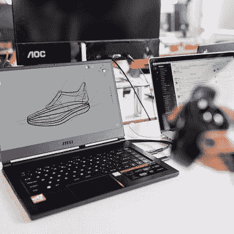

# Flutter Mockito 软件包备忘单

> 原文：<https://levelup.gitconnected.com/flutter-mockito-package-cheat-sheet-ef49254ec62a>

## 莫奇托小抄

## 这篇文章是关于 Mockito 包提供的嘲笑的可能性的。我们将研究如何设置模拟、验证调用以及要避免的陷阱。

由[格伦·卡斯滕斯-彼得斯](https://unsplash.com/@glenncarstenspeters?utm_source=medium&utm_medium=referral)在 [Unsplash](https://unsplash.com?utm_source=medium&utm_medium=referral) 上拍摄的照片

我最近发表了一篇关于用 Flutter 应用程序中的 [Mockito 包](https://pub.dev/packages/mockito)进行单元测试的文章。

 [## 如何在你的 Flutter 应用中模拟依赖关系进行测试

### 这里有一个关于如何用 mocksito 包创建 mock，设置它们，并在你的测试中使用它们的教程…

levelup.gitconnected.com](/how-to-mock-dependencies-in-your-flutter-app-for-testing-54c49251740a) 

这篇后续文章是一个备忘单，可以帮助您快速找到如何使用这个包的示例。我还更新了原始帖子的 GitHub 库，现在它包含了作为工作测试类的备忘单。

> 如果您想深入测试颤振应用，请查看📙[我的免费电子书](https://xeladu.gumroad.com/l/ftg)有更多细节！

## 最终提示

✅总是使用`thenAnswer()`，从不使用`thenReturn()`[解释](https://pub.dev/packages/mockito#a-quick-word-on-async-stubbing)
【✅】如果你验证一个 mock，调用计数器被重置！
✅如果有多个匹配的设置，最后一个设置获胜！

## 源代码

你可以在 [GitHub](https://github.com/xeladu/flutter_dependency_mocking) 上找到源代码。

[***通过我的推荐链接加入成千上万的媒体会员，想看多少文章就看多少***](https://medium.com/@xeladu/membership) ！

 [## 通过我的推荐链接加入 Medium-xela du

### 成为会员，获得 xeladu 和所有媒体作家的全部内容！您的会员资格只需 5 美元一张…

medium.com](https://medium.com/@xeladu/membership) 

点击 [**这里**](https://xeladu.medium.com/subscribe) 把我所有的新文章发到你的邮箱里🔔如果你浏览我的口香糖商店，你可能会找到你喜欢的东西🏬

xeladu

## 测试你的 Flutter 应用

[View list](https://xeladu.medium.com/list/test-your-flutter-app-aabad9825b7f?source=post_page-----ef49254ec62a--------------------------------)6 stories

[塞拉多](https://xeladu.medium.com/?source=post_page-----ef49254ec62a--------------------------------)

## 适合初学者的颤振文章

[View list](https://xeladu.medium.com/list/flutter-articles-for-beginners-a040ea777956?source=post_page-----ef49254ec62a--------------------------------)24 stories