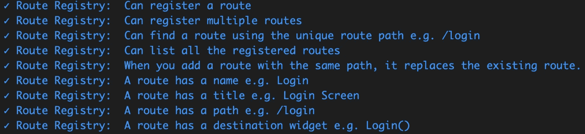
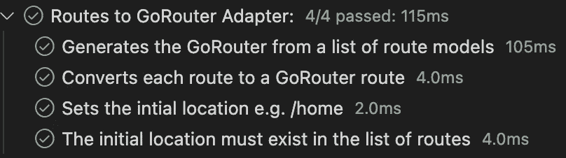
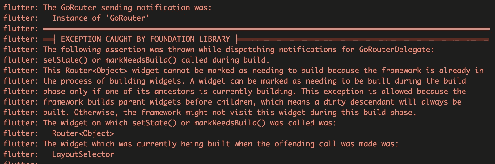

# 颤动-使用 GoRouter 导航

> 原文：<https://levelup.gitconnected.com/flutter-navigate-with-gorouter-691f58ee46bf>


[加入媒体](/@simbu/membership)查看我所有的[文章](https://medium.com/@simbu/simbus-articles-d9b999b115a7)。

当我意识到我需要在没有被认证时自动重新路由到登录屏幕时，我已经完成了添加认证的工作。

在几次使用服务/事件添加这种功能的尝试失败后，我转向了路由和 GoRouter，因为它可以基于应用程序状态处理重定向。

它是最灵活、功能最丰富的路由选项，具有许多关键功能:

*   Web 查询参数访问，与浏览器历史 API 集成
*   深度链接—在 iOS 和 Android 上通过 URL 显示屏幕
*   过渡动画
*   重定向—状态更改的链接路由
*   命名路线
*   错误处理 MaterialApp & CupertinoApp 的默认屏幕

## 哒哒

我现在在应用程序启动时注册路线:

```
var routeRegistry = ref.read(routeRegistryProvider);

routeRegistry.add(ARoute("Home", "Landing Page", "/", const LayoutSelector()));

routeRegistry.add(ARoute("Login", "Login Screen", "/login", const Login()));
```



RouteRegistry 单元测试

并用新的适配器 routes 或 RouterAdapter 将它们连接起来:

```
CupertinoApp cupertinoApp(BuildContext context) {
  var routeModels = ref.watch(routeRegistryProvider).routeList;
  return CupertinoApp.router(
    title: "Prologue",
    theme: ref.watch(themeProvider).cupertinoThemeData,
    routerConfig: RoutesToGoRouterAdapter(routeModels, "/", redirect: routeRedirectPolicy).goRouter,
  );
}
```



RoutesToGoRouterAdapter 单元测试

重定向配置为对 IsAuthenticated 标志中的状态更改做出反应，并在未通过身份验证时重定向到登录屏幕:

```
FutureOr<String?> routeRedirectPolicy(context, state) {
  if (ref.watch(authenticationProvider).isAuthenticated)
  {
    return null;
  }
  var loginRoutePath = "/login";
  ref.watch(eventStoreProvider).bus.fire(Navigated(loginRoutePath));
  return loginRoutePath;
}
```

## 经验值

## goro outer

我在 BuildContext 中添加了一些助手扩展作为语法糖:

```
// Usage
// context.navPush("/login")   Go Fwd (Add to stack)
// context.navGo("/login").    Replace stack
// context.pop()               Go back (Remove from stack)
extension GoRouterExtension on BuildContext {
  void navPush(String routeName){
    GoRouter.of(this).push(routeName);
  }

  void navGo(String routeName){
    GoRouter.of(this).go(routeName);
  }

  void navPop(){
    GoRouter.of(this).pop();
  }
}
```

小部件中的路由需要在响应 UI 动作(如按钮点击)时发生，而不是在为显示而构建小部件时发生。

在第一次尝试重定向到登录屏幕时，我将代码添加到小部件构建方法中:

```
@override
  Widget build(BuildContext context, WidgetRef ref) {

    if (!ref.watch(authenticationProvider).isAuthenticated){
      context.navPush("/login");
    }
```

我得到了这个错误:



这是有意义的，除非无效的 UI 被构建，否则状态不会改变，否则我们会冒循环的风险。

然后我发现了这个方法，这个方法有效，但并不理想:

```
WidgetsBinding.instance.addPostFrameCallback((_) {
      if (!ref.watch(authenticationProvider).isAuthenticated) {
        context.navPush("/login");
      }
    });
```

我发现处理它的最好方法是使用内置的 GoRouter 重定向:

```
redirect: routeRedirectPolicy
```

其中，routeRedirectPolicy 是一个函数，可以访问上下文、导航状态和 Riverpod ref，如果不需要重定向，则返回重定向路由或 null:

```
FutureOr<String?> routeRedirectPolicy(context, state) {
  if (ref.watch(authenticationProvider).isAuthenticated)
  {
    return null;
  }
  var loginRoutePath = "/login";
  ref.watch(eventStoreProvider).bus.fire(Navigated(loginRoutePath));
  return loginRoutePath;
}
```

通过可配置的路由重定向和错误处理，我现在完成了身份验证和数据访问，这样做的好处是减少了耦合，减少了小部件中的应用程序逻辑代码，并且避免了访问构建外部的上下文和导航的需要()。

## 链接

*   [颤振导航和路由](https://docs.flutter.dev/development/ui/navigation)
*   [与 Go 路由器和提供商的颤振认证流程](https://blog.ishangavidusha.com/flutter-authentication-flow-with-go-router-and-provider)