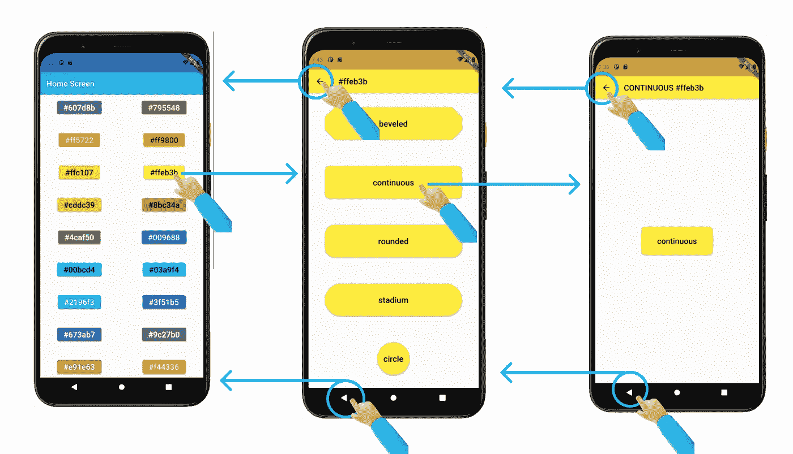

# 用于认证和引导的 Flutter Navigator 2.0 第 2 部分:用户交互

> 原文：<https://levelup.gitconnected.com/flutter-navigator-2-0-for-authentication-and-bootstrapping-part-2-user-interaction-5dc043e7e44a>

*   [第一部分:简介](https://ulusoyca.medium.com/flutter-navigator-2-0-for-authentication-and-bootstrapping-part-1-introduction-d7b6dfdd0849)
*   **第二部分:用户互动**
*   [第 3 部分:认证](https://ulusoyca.medium.com/flutter-navigator-2-0-for-authentication-and-bootstrapping-part-3-authentication-93dbcb5f0f0a)
*   [第 4 部分:引导](https://ulusoyca.medium.com/flutter-navigator-2-0-for-authentication-and-bootstrapping-part-4-bootstrapping-6ff60c845331)
*   [第 5 部分:网络](https://ulusoyca.medium.com/flutter-navigator-2-0-for-authentication-and-bootstrapping-part-5-web-eeb4835804df)

在本系列的[第一部分中，](https://ulusoyca.medium.com/flutter-navigator-2-0-for-authentication-and-bootstrapping-part-1-introduction-d7b6dfdd0849)我们简要介绍了 Navigator 2.0 API，并解释了我们将逐步构建的示例应用程序。在本文中，我们将介绍`[Router](https://api.flutter.dev/flutter/widgets/Router-class.html)`小部件和[页面 API](https://api.flutter.dev/flutter/widgets/Navigator-class.html) 。然后我们将解释如何根据应用程序状态的变化来构建导航堆栈。我们将关注以下导致应用状态变化的用户交互:

*   通过按列表中的按钮选择颜色和形状边框类型
*   按下应用程序栏中的后退按钮
*   按下系统返回按钮(仅限 Android)

在介绍`[Router](https://api.flutter.dev/flutter/widgets/Router-class.html)`小部件和[页面 API](https://api.flutter.dev/flutter/widgets/Navigator-class.html) 之前，我们先快速回顾一下在引入 Navigator 2.0 API 之前我们已经知道的东西，即`[Overlay](https://api.flutter.dev/flutter/widgets/Overlay-class.html)`小部件、`[Navigator](https://api.flutter.dev/flutter/widgets/Navigator-class.html)`小部件和`[Route](https://api.flutter.dev/flutter/widgets/Route-class.html)`类。

# 覆盖部件

在 Flutter 应用程序的整个导航系统中，我们有一个`[Overlay](https://api.flutter.dev/flutter/widgets/Overlay-class.html)`小部件。`[Overlay](https://api.flutter.dev/flutter/widgets/Overlay-class.html)`小部件是一个特殊的`[Stack](https://api.flutter.dev/flutter/widgets/Stack-class.html)`小部件，我们在应用程序的小部件树中多次使用。`[Overlay](https://api.flutter.dev/flutter/widgets/Overlay-class.html)`小部件的子部件浮动在其他小部件上。

`[Overlay](https://api.flutter.dev/flutter/widgets/Overlay-class.html)`小工具有一个`[OverlayEntry](https://api.flutter.dev/flutter/widgets/OverlayEntry-class.html)`对象列表。我们通过`[OverlayEntry](https://api.flutter.dev/flutter/widgets/OverlayEntry-class.html)`的`[builder](https://api.flutter.dev/flutter/widgets/OverlayEntry/builder.html)`属性向`[Overlay](https://api.flutter.dev/flutter/widgets/Overlay-class.html)`小部件提供子小部件。

要在`[Overlay](https://api.flutter.dev/flutter/widgets/Overlay-class.html)`中插入或删除一个`[OverlayEntry](https://api.flutter.dev/flutter/widgets/OverlayEntry-class.html)`，我们需要在小部件树中找到离小部件最近的`[Overlay](https://api.flutter.dev/flutter/widgets/Overlay-class.html)`。在许多情况下，最接近的`[Overlay](https://api.flutter.dev/flutter/widgets/Overlay-class.html)`是由`[Navigator](https://api.flutter.dev/flutter/widgets/Navigator-class.html)`小部件创建的。因此，我们不需要在应用程序中构建一个`[Overlay](https://api.flutter.dev/flutter/widgets/Overlay-class.html)`小部件。

一种在滑块控件上显示数值指示器的方法

# 导航器部件

`[Navigator](https://api.flutter.dev/flutter/widgets/Navigator-class.html)`小部件通常放在小部件树的顶部附近。它使用堆栈规则管理路由。每个`[Route](https://api.flutter.dev/flutter/widgets/Route-class.html)`都有自己的`[OverlayEntry](https://api.flutter.dev/flutter/widgets/OverlayEntry-class.html)`对象列表，这些对象由`[Navigator](https://api.flutter.dev/flutter/widgets/Navigator-class.html)`小部件的`[Overlay](https://api.flutter.dev/flutter/widgets/Overlay-class.html)`小部件管理。

在引入 Navigator 2.0 API 之前，路线一直以强制的方式从`[Navigator](https://api.flutter.dev/flutter/widgets/Navigator-class.html)`小部件中推送和弹出。

# 途径

虽然很多时候我们说一切都是 Flutter 里的 widget，`[Route](https://api.flutter.dev/flutter/widgets/Route-class.html)`不是 widget。这是一个由`[Navigator](https://api.flutter.dev/flutter/widgets/Navigator-class.html)`小部件管理的条目。在 Flutter 框架中，我们可以对两种类型的`[Route](https://api.flutter.dev/flutter/widgets/Route-class.html)`进行分组:在过渡时替换整个屏幕的路径，以及窗口小部件覆盖在前一个路径上的弹出路径。

路由可以有`[RouteSettings](https://api.flutter.dev/flutter/widgets/RouteSettings-class.html)`对象，它可能有一个`[name](https://api.flutter.dev/flutter/widgets/RouteSettings/name.html)`(否则是匿名的)和`[arguments](https://api.flutter.dev/flutter/widgets/RouteSettings/arguments.html)`，后者有时很有用。

如前所述，每个`[Route](https://api.flutter.dev/flutter/widgets/Route-class.html)`都有自己的`[OverlayEntry](https://api.flutter.dev/flutter/widgets/OverlayEntry-class.html)`对象列表。假设我们的主页上有一个标签栏或底部导航栏。如果我们在其中一个选项卡中添加一个`[OverlayEntry](https://api.flutter.dev/flutter/widgets/OverlayEntry-class.html)`，当您在选项卡之间切换时，它仍然可见，因为`[OverlayEntry](https://api.flutter.dev/flutter/widgets/OverlayEntry-class.html)`被添加到主屏幕顶部的当前路线的`[OverlayEntry](https://api.flutter.dev/flutter/widgets/OverlayEntry-class.html)`列表中。当我们在选项卡之间切换时，我们应该添加或删除`[OverlayEntry](https://api.flutter.dev/flutter/widgets/OverlayEntry-class.html)`,或者在主屏幕中为每个选项卡设置单独的路径。

颤振框架中的路线

# 页

在命令式 API 中，`[Route](https://api.flutter.dev/flutter/widgets/Route-class.html)`对象是通过调用`[Navigator](https://api.flutter.dev/flutter/widgets/Navigator-class.html)`小部件的静态方法来处理的，比如`[push](https://api.flutter.dev/flutter/widgets/Navigator/push.html)`、`[pop](https://api.flutter.dev/flutter/widgets/Navigator/pop.html)`、`[replace](https://api.flutter.dev/flutter/widgets/Navigator/replace.html)`。

声明式 API 引入了`[Page](https://api.flutter.dev/flutter/widgets/Page-class.html)`类。作为开发人员，我们的责任是在堆栈规范中向`[Navigator](https://api.flutter.dev/flutter/widgets/Navigator-class.html)`小部件提供一系列`[Page](https://api.flutter.dev/flutter/widgets/Page-class.html)`对象。然后，`[Navigator](https://api.flutter.dev/flutter/widgets/Navigator-class.html)`小部件将`[Page](https://api.flutter.dev/flutter/widgets/Page-class.html)`对象转换成`[Route](https://api.flutter.dev/flutter/widgets/Route-class.html)`对象。类似于`[Route](https://api.flutter.dev/flutter/widgets/Route-class.html)`类，`[Page](https://api.flutter.dev/flutter/widgets/Page-class.html)`类也不是一个小部件，而是一个扩展`[RouteSettings](https://api.flutter.dev/flutter/widgets/RouteSettings-class.html)`类的类。

> [“页面基本上是一个固定的路由设置，因为页面本质上描述了一个路由的配置”](https://docs.google.com/document/d/1Q0jx0l4-xymph9O6zLaOY4d_f7YFpNWX_eGbzYxr9wY/edit#heading=h.b3dp08v2w2u)

导航栈是基于列表中`[Page](https://api.flutter.dev/flutter/widgets/Page-class.html)`对象的顺序构建的。当列表改变时，触发导航栈的更新。注意，每个`[Page](https://api.flutter.dev/flutter/widgets/Page-class.html)`对象都有一个对应的`[Route](https://api.flutter.dev/flutter/widgets/Route-class.html)`对象。然而，如果路由是在静态命令式方法中实例化的，它将不会有一个`[Page](https://api.flutter.dev/flutter/widgets/Page-class.html)`对象。

提供给导航器小部件的页面列表

我们也可以通过扩展`[Page](https://api.flutter.dev/flutter/widgets/Page-class.html)`类来定制页面列表中的类。在本系列的示例应用中，所有的`[Page](https://api.flutter.dev/flutter/widgets/Page-class.html)`类都是定制的。

`[Navigator](https://api.flutter.dev/flutter/widgets/Navigator-class.html)`小部件使用`[Page](https://api.flutter.dev/flutter/widgets/Page-class.html)`对象的`[key](https://api.flutter.dev/flutter/widgets/Page/key.html)`属性来确定列表中的每个`[Page](https://api.flutter.dev/flutter/widgets/Page-class.html)`是否与相应的`[Route](https://api.flutter.dev/flutter/widgets/Route-class.html)`中已经膨胀的`[Page](https://api.flutter.dev/flutter/widgets/Page-class.html)`相同或不同。如果`[key](https://api.flutter.dev/flutter/widgets/Page/key.html)`不同或者`[Page](https://api.flutter.dev/flutter/widgets/Page-class.html)`不在列表中，则调用`[Page](https://api.flutter.dev/flutter/widgets/Page-class.html)`类的`[createRoute](https://api.flutter.dev/flutter/widgets/Page/createRoute.html)`方法。

在我们的示例应用程序中，*颜色*页面的唯一性由颜色代码定义，而*形状*页面的唯一性由颜色代码和形状边框类型的组合定义。

# 路由信息

`[RouteInformation](https://ulusoyca.medium.com/flutter-navigator-2-0-for-authentication-and-bootstrapping-part-5-web-eeb4835804df)`是包含路线信息的数据保持器。它有两个字段:`[location](https://api.flutter.dev/flutter/widgets/RouteInformation/location.html)`和`[state](https://api.flutter.dev/flutter/widgets/RouteInformation/state.html)`。`[location](https://api.flutter.dev/flutter/widgets/RouteInformation/location.html)`字段相当于一个 URL 字符串，而`[state](https://api.flutter.dev/flutter/widgets/RouteInformation/state.html)`字段保存关于该路由的应用程序状态的信息。

正如我们将在本系列的 [Web 部件](https://ulusoyca.medium.com/flutter-navigator-2-0-for-authentication-and-bootstrapping-part-5-web-eeb4835804df)中看到的，`[RouteInformation](https://ulusoyca.medium.com/flutter-navigator-2-0-for-authentication-and-bootstrapping-part-5-web-eeb4835804df)`对象在`[Router](https://api.flutter.dev/flutter/widgets/Router-class.html)`小部件内部用于与操作系统通信。

# 路由器部件

小部件是导航的大脑。它封装了`[Navigator](https://api.flutter.dev/flutter/widgets/Navigator-class.html)`小部件，并根据用户与应用程序的交互、系统后退按钮的按下、应用程序启动时的初始路线以及操作系统(OS)的新意图来配置导航历史。

`[Router](https://api.flutter.dev/flutter/widgets/Router-class.html)`小部件将其任务委托给它的组件，我们将在本系列中逐一探讨这些组件:

*   `[RouterDelegate](https://api.flutter.dev/flutter/widgets/RouterDelegate-class.html)`负责根据应用状态构建`[Navigator](https://api.flutter.dev/flutter/widgets/Navigator-class.html)` widget，并处理 pop 请求。根据 [Flutter 团队](https://docs.google.com/document/d/1Q0jx0l4-xymph9O6zLaOY4d_f7YFpNWX_eGbzYxr9wY/edit)的说法，这个代理是`[Router](https://api.flutter.dev/flutter/widgets/Router-class.html)`小部件的核心。考虑到没有心脏`[Router](https://api.flutter.dev/flutter/widgets/Router-class.html)`不能被实例化是有意义的，因为人类没有心脏不能生存。
*   `[RouteInformationParser](https://api.flutter.dev/flutter/widgets/RouteInformationParser-class.html)` delegate 负责解析来自操作系统的路由信息，以便`[RouterDelegate](https://api.flutter.dev/flutter/widgets/RouterDelegate-class.html)`可以更新应用状态。它还可以根据应用程序状态的变化恢复路线信息，从而使操作系统保持最新的导航历史记录。我认为这是手臂，因为一个人没有手臂也可以生活，但在日常生活中仍然会感到缺少手臂。类似地，我们可以实例化一个没有`[RouteInformationParser](https://api.flutter.dev/flutter/widgets/RouteInformationParser-class.html)`的`[Router](https://api.flutter.dev/flutter/widgets/Router-class.html)`小部件，但是当我们不能恢复和解析浏览器地址栏上的 URL 时，我们将缺乏完整的 Web 应用程序体验。
*   代表处理从操作系统意图创建路线信息。例如，当我们在 Web 浏览器的地址栏中输入时，`[RouteInformationProvider](https://api.flutter.dev/flutter/widgets/RouteInformationProvider-class.html)`的任务是将 URL 解释给一个实体，这个实体是`[Router](https://api.flutter.dev/flutter/widgets/Router-class.html)`小部件内部使用的代理。这个委托更像是嘴和耳朵，因为它是`[Router](https://api.flutter.dev/flutter/widgets/Router-class.html)`小部件的耳朵，解释来自操作系统的新意图信号，而嘴在应用程序状态改变时将更新的路由信息告诉操作系统。
*   `[BackButtonDispatcher](https://master-api.flutter.dev/flutter/widgets/BackButtonDispatcher-class.html)`代表负责报告具有平台后退按钮或手势的平台上的系统级 pop 事件。同样，这个代理更像是一只耳朵，用来监听来自操作系统的信号。

有两种方法可以使用`[WidgetsApp](https://api.flutter.dev/flutter/widgets/WidgetsApp/WidgetsApp.html)`中的`[Router](https://api.flutter.dev/flutter/widgets/Router-class.html)`小部件:

1.  使用`[WidgetsApp.router](https://api.flutter.dev/flutter/widgets/WidgetsApp/WidgetsApp.router.html)`构造函数，我们将`[Router](https://api.flutter.dev/flutter/widgets/Router-class.html)`小部件委托作为构造函数参数传递。注意，使用这个方法需要将`[RouteInformationParser](https://api.flutter.dev/flutter/widgets/RouteInformationParser-class.html)`委托作为构造函数参数传递。在前三个示例中，我们不会解析和恢复路由。因此，在第四个示例应用程序之前，我们不会使用这种方法。
2.  实例化`[Router](https://api.flutter.dev/flutter/widgets/Router-class.html)`小部件，并将其作为`[WidgetApp](https://api.flutter.dev/flutter/widgets/WidgetsApp-class.html)`的`[home](https://api.flutter.dev/flutter/widgets/WidgetsApp/home.html)`属性传递。在这种情况下，`[RouterDelegate](https://api.flutter.dev/flutter/widgets/RouterDelegate-class.html)`应该是`non-null`。当构建`[Router](https://api.flutter.dev/flutter/widgets/Router-class.html)`小部件时，我们不必提供其他委托，除非我们想要定制默认行为`[RouteInformationProvider](https://api.flutter.dev/flutter/widgets/RouteInformationProvider-class.html)`或者利用`[RouteInformationParser](https://api.flutter.dev/flutter/widgets/RouteInformationParser-class.html)`和`[BackButtonDispatcher](https://master-api.flutter.dev/flutter/widgets/BackButtonDispatcher-class.html)`的功能。

将路由器注入应用程序

小部件树

# 路由器代表

`[Router](https://api.flutter.dev/flutter/widgets/Router-class.html)`小部件最重要的组件是`[RouterDelegate](https://api.flutter.dev/flutter/widgets/RouterDelegate-class.html)`类，因为它告诉`[Router](https://api.flutter.dev/flutter/widgets/Router-class.html)`小部件如何构建`[Navigator](https://api.flutter.dev/flutter/widgets/Navigator-class.html)`小部件。如果我们使用 Navigator 2.0 API 和`[Router](https://api.flutter.dev/flutter/widgets/Router-class.html)`小部件，我们的责任是定制`[RouterDelegate](https://api.flutter.dev/flutter/widgets/RouterDelegate-class.html)`来实现导航逻辑。

*   `[RouterDelegate](https://api.flutter.dev/flutter/widgets/RouterDelegate-class.html)`类实现了`[ChangeNotifier](https://api.flutter.dev/flutter/foundation/ChangeNotifier-class.html)` [mixin](https://dart.dev/guides/language/language-tour#adding-features-to-a-class-mixins) ，这使得它自己成为可列表的。调用`[RouterDelegate](https://api.flutter.dev/flutter/widgets/RouterDelegate-class.html)`中的`[notifyListeners](https://api.flutter.dev/flutter/foundation/ChangeNotifier/notifyListeners.html)`方法将通知`[Router](https://api.flutter.dev/flutter/widgets/Router-class.html)`小部件。
*   得到通知后，`[Router](https://api.flutter.dev/flutter/widgets/Router-class.html)`调用`[RouterDelegate](https://api.flutter.dev/flutter/widgets/RouterDelegate-class.html)`的`[build()](https://api.flutter.dev/flutter/widgets/RouterDelegate/build.html)`方法。
*   `[RouterDelegate](https://api.flutter.dev/flutter/widgets/RouterDelegate-class.html)`在`[build()](https://api.flutter.dev/flutter/widgets/RouterDelegate/build.html)`方法中构造并向`[Router](https://api.flutter.dev/flutter/widgets/Router-class.html)`返回一个`[Navigator](https://api.flutter.dev/flutter/widgets/Navigator-class.html)`小部件。

调用`[notifyListeners](https://api.flutter.dev/flutter/foundation/ChangeNotifier/notifyListeners.html)`并不是创建导航历史的唯一方式。在这篇由[Bloc](https://medium.com/u/940c22f73489#/)模式处理导航状态的例子。

在`[RouterDelegate](https://api.flutter.dev/flutter/widgets/RouterDelegate-class.html)`类中监听应用程序状态的一种非常典型但不是唯一的方式是向页面传递回调方法。在页面的小部件内部，当回调方法被用户交互触发时，`[RouterDelegate](https://api.flutter.dev/flutter/widgets/RouterDelegate-class.html)`通知`[Router](https://api.flutter.dev/flutter/widgets/Router-class.html)`小部件进行导航栈更新。注意，随着应用程序的发展，传递给子部件的回调方法的数量会增加。跟踪这种回调方法会让人不知所措。我们应该总是寻找好的架构模式来避免这种风险。

我们还需要通过响应操作系统事件来更新`[RouterDelegate](https://api.flutter.dev/flutter/widgets/RouterDelegate-class.html)`中的应用状态。当操作系统请求弹出当前路线时，我们需要想出如何更新`[RouterDelegate](https://api.flutter.dev/flutter/widgets/RouterDelegate-class.html)`中的应用状态，并相应地重建一个新的导航堆栈。

现在，让我们分析第一个样本的自定义`[RouterDelegate](https://api.flutter.dev/flutter/widgets/RouterDelegate-class.html)`。定制`[RouterDelegate](https://api.flutter.dev/flutter/widgets/RouterDelegate-class.html)`内的 app 状态用两个字段表示:`selectedColorCode`和`selectedShape`。

*   如果`selectedColorCode`和`selectedShape`字段都是`null`(未设置)，那么我们应该在`HomePage`中。导航堆栈中没有其他内容。如果操作系统告诉应该弹出当前路线(例如，按下后退按钮)，导航堆栈将为空，整个应用程序将被弹出。
*   如果`selectedColorCode`被设置，而`selectedShape`没有被设置，这意味着我们点击了列表中的一个颜色按钮。导航历史将包括`HomePage`和`ColorPage`。页面列表的顺序很重要，因为列表中的最后一页将是用户可见的当前页面。当按下后退按钮时，`ColorPage`弹出，`HomePage`可见。
*   如果`selectedColorCode`和`selectedShape`都被设置，这意味着我们为该颜色选择了颜色代码和形状边框类型。导航堆栈将包括`HomePage`、`ColorPage`和`ShapePage`。当按下返回按钮时，会弹出列表的最后一页，即`ShapePage`，app 会显示`ColorPage`。

注意，我们为`_selectedColorCode`和`_selectedShape`状态实现了 getter 和 setter。setter 方法调用`[notifyListeners](https://api.flutter.dev/flutter/foundation/ChangeNotifier/notifyListeners.html)`，这样当这些状态的值被更新时，就会通知`[Router](https://api.flutter.dev/flutter/widgets/Router-class.html)`小部件。然而，我们不必总是在每次设置状态时通知`[Router](https://api.flutter.dev/flutter/widgets/Router-class.html)`小部件。在这种情况下，它可以工作并使状态处理更容易。有时我们可能需要跳过或延迟通知，所以向 setters 添加`[notifyListeners](https://api.flutter.dev/flutter/foundation/ChangeNotifier/notifyListeners.html)`调用没有意义。

# 处理 Pop 请求

当`[Router](https://api.flutter.dev/flutter/widgets/RouterDelegate-class.html)`小部件收到来自操作系统的弹出请求时，它通过调用其`[popRoute](https://api.flutter.dev/flutter/widgets/RouterDelegate/popRoute.html)`方法将更新导航堆栈的责任委托给`[RouterDelegate](https://api.flutter.dev/flutter/widgets/RouterDelegate-class.html)`。

如果`[RouterDelegate](https://api.flutter.dev/flutter/widgets/RouterDelegate-class.html)`想要处理`pop`事件，这个方法应该返回`true`。如果该方法返回`false`，将弹出整个 app。

`[RouterDelegate](https://api.flutter.dev/flutter/widgets/RouterDelegate-class.html)`可以实现`[PopNavigatorRouterDelegateMixin](https://api.flutter.dev/flutter/widgets/PopNavigatorRouterDelegateMixin-mixin.html)`。当这个 mixin 被实现时，`[Router](https://api.flutter.dev/flutter/widgets/RouterDelegate-class.html)`小部件的`[popRoute](https://api.flutter.dev/flutter/widgets/RouterDelegate/popRoute.html)`调用将调用`[Navigator](https://api.flutter.dev/flutter/widgets/Navigator-class.html)`小部件的`[maybePop](https://api.flutter.dev/flutter/widgets/Navigator/maybePop.html)`方法。在这种情况下，我们不需要覆盖`[RouterDelegate](https://api.flutter.dev/flutter/widgets/RouterDelegate-class.html)`中的`[popRoute](https://api.flutter.dev/flutter/widgets/RouterDelegate/popRoute.html)`方法。相反，我们必须向`[Navigator](https://api.flutter.dev/flutter/widgets/Navigator-class.html)`小部件提供`[onPopPage](https://api.flutter.dev/flutter/widgets/Navigator/onPopPage.html)`回调作为构造函数参数。

我们需要处理`ShapePage`或`ColorPage`的弹出。当接收到 pop 事件时:

*   如果`selectedShape`是`null`，那么我们当前显示的是需要弹出的`ColorPage`。因此，我们将清除通知`[Router](https://api.flutter.dev/flutter/widgets/Router-class.html)`小部件的`selectedColorCode`状态。
*   如果`selectedShape`是`non-null`，那么可见页面就是`ShapePage`，需要弹出。我们应该只将`selectedShape`设置为`null`，因为我们想在弹出`ShapePage`后用`selectedColorCode`显示`ColorPage`。

在处理 pop 事件之前，`[RouterDelegate](https://api.flutter.dev/flutter/widgets/RouterDelegate-class.html)`应该确保路由确实被弹出。如果路径没有弹出，`[onPopPage](https://api.flutter.dev/flutter/widgets/Navigator/onPopPage.html)`应该返回`false`，告诉`[Router](https://api.flutter.dev/flutter/widgets/Router-class.html)`小工具`[RouterDelegate](https://api.flutter.dev/flutter/widgets/RouterDelegate-class.html)`不关心弹出事件。

在下列情况下调用`[onPopPage](https://api.flutter.dev/flutter/widgets/Navigator/onPopPage.html)`回调方法:

*   ***返回按钮按下:***

按下`[BackButton](https://api.flutter.dev/flutter/material/BackButton-class.html)`小工具可能会弹出路线。我们通常不需要添加特定的小部件来弹出导航堆栈中的最后一条路线，因为`[Scaffold](https://api.flutter.dev/flutter/material/Scaffold-class.html)`小部件在`[AppBar](https://api.flutter.dev/flutter/material/AppBar-class.html)`小部件中包含了一个`[BackButton](https://api.flutter.dev/flutter/material/BackButton-class.html)`。这个小部件适应操作系统，这意味着它的图标将是特定于操作系统的。如果`[Navigator](https://api.flutter.dev/flutter/widgets/Navigator-class.html)`小部件包含多个页面，那么`[BackButton](https://api.flutter.dev/flutter/material/BackButton-class.html)`将在`[AppBar](https://api.flutter.dev/flutter/material/AppBar-class.html)`小部件中可见。

*   ***系统返回按钮按下:***

与 iOS 手机和桌面应用不同，Android 手机有一个专用的系统后退按钮或手势来弹出最后一条路线。如果我们希望`[Router](https://api.flutter.dev/flutter/widgets/Router-class.html)`小部件接收来自操作系统的 pop 请求，我们应该为`[Router](https://api.flutter.dev/flutter/widgets/Router-class.html)`小部件提供一个`[BackButtonDispatcher](https://master-api.flutter.dev/flutter/widgets/BackButtonDispatcher-class.html)`委托。

在下面的记录中，我们看到当弹出请求来自 Android 操作系统时，整个应用程序都被弹出，因为我们没有向`[Router](https://api.flutter.dev/flutter/widgets/Router-class.html)`小部件提供后退按钮调度器委托

现在让我们提供`[RootBackButtonDispatcher](https://api.flutter.dev/flutter/widgets/RootBackButtonDispatcher-class.html)`到`[Router](https://api.flutter.dev/flutter/widgets/Router-class.html)`小部件。该类是后退按钮调度程序的默认实现。

在下面的屏幕记录中，我们现在看到了预期的行为，因为在 Android 手机中点击系统后退按钮时会调用`[onPopPage](https://api.flutter.dev/flutter/widgets/Navigator/onPopPage.html)`回调。

> 正如我们将在本系列的 Web 部分更详细讨论的那样，在 Web 浏览器上按 back 按钮不会调用`onPopPage`回调。

*   ***显式弹出调用:***

使用`[Navigator](https://api.flutter.dev/flutter/widgets/Navigator-class.html)`小部件的静态命令式`[pop](https://api.flutter.dev/flutter/widgets/Navigator/pop.html)`、`[maybePop](https://api.flutter.dev/flutter/widgets/Navigator/maybePop.html)`、`[popUntil](https://api.flutter.dev/flutter/widgets/Navigator/popUntil.html)`、`[popAndPushNamed](https://api.flutter.dev/flutter/widgets/Navigator/popAndPushNamed.html)`、`[restorablePopAndPushNamed](https://api.flutter.dev/flutter/widgets/Navigator/restorablePopAndPushNamed.html)`方法也会导致弹出导航堆栈中的最后一条路线。

# 结论

在本文中，我们介绍了声明式导航 API，并从一个非常简单的导航逻辑开始。你可以在 [Github 页面](https://github.com/ulusoyca/Flutter-ShareWhatYouKnow/tree/develop/lib/002-navigator-2/002-01-mobile-only)找到源代码。该项目包括多个`main.dart`文件。运行示例应用程序最简单的方法是右键单击`main_002_01.dart`文件，然后单击`Run`命令。

在下一篇文章的[中，我们将身份验证用例添加到这个示例应用程序中。特别感谢](https://ulusoyca.medium.com/flutter-navigator-2-0-for-authentication-and-bootstrapping-part-3-authentication-93dbcb5f0f0a) [Jon Imanol Durán](https://medium.com/u/6b5de6766f88?source=post_page-----5dc043e7e44a--------------------------------) 审阅了本系列的所有文章，并给了我有用的反馈。如果你喜欢这篇文章，请按下拍手按钮，启动 [Github 库](https://github.com/ulusoyca/Flutter-ShareWhatYouKnow/tree/develop/002-navigator2)。