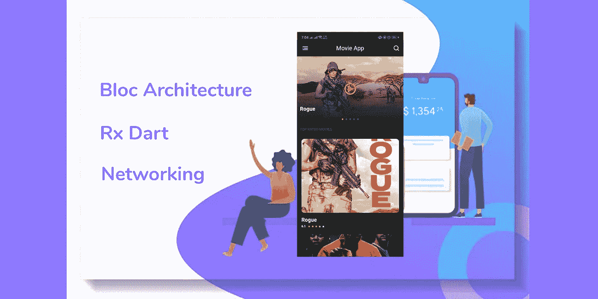
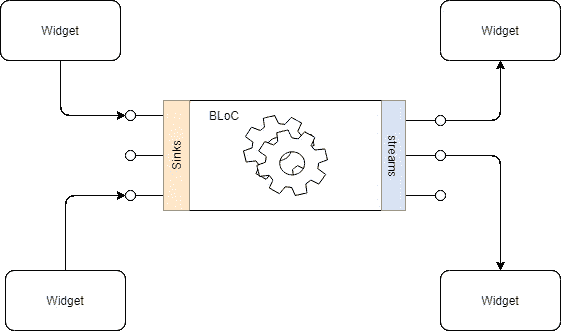
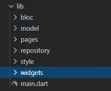

# 使用块模式架构的颤振网络

> 原文：<https://levelup.gitconnected.com/flutter-networking-using-the-bloc-pattern-architecture-cab2aa826a4c>



这篇文章是关于如何使用 bloc 架构模式在 flutter 中使用 API 的。这是一个循序渐进的指南，在这里你将学习 bloc 模式的基础，我将演示如何使用 Bloc 模式构建一个 Flutter 应用程序。

到本文结束时，您将能够使用反应式编程，并使用 Bloc 管理您的 Flutter 应用程序。

在本文中，我将使用一个免费的 MovieDB API 。
在继续之前，在这里注册[，并从我们将在项目中使用的电影数据库网站获取您的 API 密钥。你拿到了 API 密匙，在 movie DB 上注册了自己，对吧？在开始写代码之前，让我解释一下什么是 Bloc 模式以及它是如何工作的。](https://www.themoviedb.org/settings/api)

# **什么是集团架构**

Bloc architecture 代表业务逻辑组件，它允许我们将业务逻辑从用户界面中分离出来，并充当应用程序的 UI 和数据源之间的中间人。Bloc 模式作用于流和接收器，任何小部件都可以通过接收器向 bloc 发送数据，如果有任何更改或更新的数据，可以通过数据流通知 bloc。



# 开始编码吧！

开始编码前请等待，让我向您展示我们今天要构建的内容:)


在本文中，我们将构建一个包含前 5 部电影的图像转盘，并从电影数据库中获取一个顶级电影列表。所以不要浪费更多的时间，让我们进入代码。

**步骤 1 —创建新项目:**

使用带有以下命令的终端创建一个新的颤振项目:

```
flutter create moviedb_app
```

**步骤 2 —添加依赖关系**:

在您的 flutter 项目的 **pubspec.yaml** 文件中添加依赖项

```
**dependencies**:
  **flutter**:
    **sdk**: flutter
  dio: ^3.0.10
  bloc: ^6.0.2
  rxdart: ^0.24.1
  eva_icons_flutter: ^2.0.1
  flutter_rating_bar: ^3.0.1+1
  font_awesome_flutter: ^8.8.1
  page_indicator: ^0.3.0
```

让我们来讨论一下我们在这个应用程序中使用的依赖项和包，如果你是这个领域的新手，我会解释它们的用途。

**dio:**Dart 的强大 Http 客户端，支持拦截器、FormData、请求取消、文件下载、超时等。

**bloc:** Flutter Widgets，使实现 bloc(业务逻辑组件)设计模式变得容易。专为与块状态管理包一起使用而构建。

**rxdart:** Rxdart 是用于异步编程的流行的 reactiveX API 的实现，利用了本地 Dart 流 API。

**Eva _ Icons _ flutter:**Eva 图标的 Flutter 包。Eva Icons 是一个由 480 多个精美的开源图标组成的包，用于常见的动作和项目。

**font_awesome_flutter:** 作为 flutter 图标提供的 Font Awesome 图标包。提供 1500 个额外的图标用于您的应用程序。

**page_indicator:** 颤振浏览量指示器，好用。自定义位置、大小，但只能是圆形。

**第三步——项目结构**:

如下图所示，组织 lib 文件夹中的文件



项目结构

**步骤 4——创建模型类:**
我们将为我们的项目创建模型类，但是将声明本文所需的参数。但是，您可以根据需要更改和添加更多参数。所以我将创建两个模型类。

MovieResponse 是一个高级模型类，如果我们的 API 调用失败或返回错误响应，它将由一系列电影和错误字符串组成。

电影 _ 回应.镖

Movie 类包含列表中每部电影的所有信息，我们使用 dart 的 fromJson 方法将来自 API 的 JSON 数据映射到变量。

电影.飞镖

**步骤 5——为项目创建数据源:**

现在，我们将在项目的子目录 **repository** 中创建一个 **repository.dart** 类，我们将在其中定义我们的 **API 键**、**基本 URL** 、**端点**、 **https 客户端** **对象、**和我们的**网络调用方法**，它们将用于从 API 获取数据，并将 JSON 映射到它的模型。

存储库. dart

有一个网络调用函数 getMovies()将返回热门电影列表。这个调用返回一个 [Future](https://api.dartlang.org/stable/2.0.0/dart-async/Future-class.html) MovieResponse 对象。未来用于表示在未来某个时间可用的潜在值或误差。未来的接收者可以注册回调，在结果返回时处理值或错误。response 变量接收响应，根据其状态代码，将对电影响应进行解码，或者抛出一个异常，并打印一个日志用于调试。

**步骤 6 —创建一个区块:**

在项目中 **bloc** 的子目录下创建一个 dart 文件 **get_movies_bloc.dart** 。这个 bloc 类将负责我们应用程序的所有业务逻辑。

这里引入了反应式编程的概念。MoviesBlocList 类包含一个名为 getMovies()的方法，用于从存储库中获取数据。_subject 是一个[behavior subject](https://pub.dev/documentation/rxdart/latest/rx/BehaviorSubject-class.html)<MovieResponse>对象，该对象用于以 movie response 的形式从数据源获取数据，并将获取的数据以流的形式传递给 UI。

**行为主体是做什么的？**
一个特殊的 StreamController，它捕获添加到控制器中的最新项目，并将其作为第一个项目发送给任何新的侦听器。

该主题允许向侦听器发送数据、错误和 do 事件。添加到该主题的最新项目将被发送给该主题的任何新侦听器。之后，任何新事件都将被适当地发送给侦听器。可以提供一个种子值，如果没有项目添加到主题中，将会发出该种子值。

**第七步——构建应用的用户界面:**

现在，我们已经创建了数据源，并有了一个 bloc 组件来将数据从数据源传递到 UI，反之亦然。所以让我们开始构建我们的 UI。我们前端的文件结构将是页面，样式和部件。Pages 文件夹将包含我们的主页，Widgets 文件夹将包含主页上使用的小部件，Style 文件夹将包含我们的应用程序的主题，如颜色等。

**在 pages 的子目录下创建一个文件，命名为 home_page.dart，复制文件中的代码。**

主页. dart

**我们已经创建了两个用于主页的小部件。因此，在 widgets 的子目录中创建一个名为 now_playing.dart 的文件，并复制下面要点中的代码:**

now_playing.dart

**创建第二个小部件文件，命名为 top_movies.dart**

top _ films . dart

我不讨论 UI 部分，因为这篇文章是关于网络和 bloc 架构的。因此，我假设您对 UI 组件和小部件有所了解。让我给你一个简短的概述，看看我们是如何从 bloc 中获取数据并将流传递给 UI 的。如你所见，我们在屏幕的 **initState()** 函数中使用 bloc 对象调用了 **getmovies()** 函数。在这个函数中，我们从数据源获取 API 响应，并将其添加到 bloc 流控制器的接收器中，这样我们的小部件就可以监听屏幕上发出的流数据。我们还使用了 **StreamBuilder** 作为我们的主要小部件，在这里我们以 MovieResponse 的形式传递从 BehaviourSubject 对象获得的数据流。在这个 **StreamBuilder** 中，我们进行了多次检查，以确保数据是正确的，或者它有错误，或者数据正在被加载，在此基础上，我们将我们定制的 UI 小部件返回到 **StreamBuilder。**

感谢您阅读本文，我希望本文能帮助您理解 bloc 模式的实现，并演示如何在项目中使用它。你可以在这里获得与本文[相关的源文件](https://github.com/aasif1297/movieapparticle)

我已经使用相同的 API 和相同的设计创建了一个完整的电影应用程序。如果你想浏览完整的应用程序，你可以在我的 Linkedin 个人资料[这里](https://www.linkedin.com/feed/update/urn:li:activity:6701775775588220928/)获得源文件和应用程序演示。