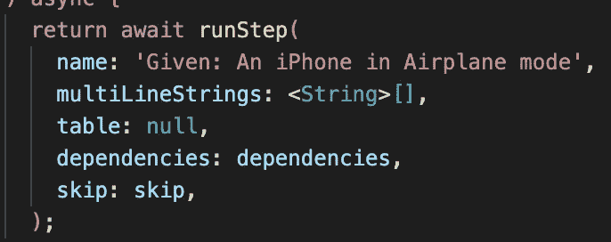

# 颤动—离线优先

> 原文：<https://levelup.gitconnected.com/flutter-offline-first-da871c36cfc0>


[加入媒体](/@simbu/membership)查看所有[文章](https://medium.com/@simbu/flutter-digestableme-articles-4b39de2d82fc)，或者查看[代码](/@simbu/flutter-digestableme-code-ecb5027fb7b1)。

> 离线是我的默认状态，连接是一个很好的补充
> 
> 克里斯蒂安·米勒

为了首先支持离线，我添加了一个新特性，它监视客户端设备连接，并用两个值“在线”和“离线”更新“连接”状态。


连接检测器—示例故事


连接检测功能测试

在 mini '_Offline First_ '系列的下一篇文章中，我将使用新的连接性检测，在脱机时将数据请求指向本地数据库，并在联机 API 可用时同步它们。

## 哒哒


特性测试报告


功能测试日志摘录

使用 [connectivity_plus](https://pub.dev/packages/connectivity_plus) 包很容易实现这个特性。

它只需要一个新的提供商:

```
// Package imports:
import 'package:connectivity_plus/connectivity_plus.dart';
import 'package:digestable_prologue/connection_detector/model/network_connection_state.dart';
import 'package:hooks_riverpod/hooks_riverpod.dart';

class NetworkConnectionStateNotifier
    extends StateNotifier<NetworkConnectionState> {
  NetworkConnectionStateNotifier(super.state);

  setNetworkStateByConnectivityResult(ConnectivityResult connectivityResult) {
    var onlineStates = <ConnectivityResult>[
      ConnectivityResult.wifi,
      ConnectivityResult.ethernet,
      ConnectivityResult.mobile
    ];

    var isOnlineState = onlineStates.contains(connectivityResult);

    state = isOnlineState
        ? NetworkConnectionState.online
        : NetworkConnectionState.offline;
  }
}

final networkConnectionStateProvider = StateNotifierProvider<
    NetworkConnectionStateNotifier, NetworkConnectionState>(
  (ref) => NetworkConnectionStateNotifier(NetworkConnectionState.offline),
);
```

和一个枚举:

```
enum NetworkConnectionState {
  offline,
  online
}
```

以及带有单个事件引导语句的 [connectivity_plus](https://pub.dev/packages/connectivity_plus) 包:

```
@override
void initState() {
   super.initState();
   ...
   subscription = Connectivity()
        .onConnectivityChanged
        .listen((ConnectivityResult connectivityResult) {
      ref
          .read(networkConnectionStateProvider.notifier)
          .setNetworkStateByConnectivityResult(connectivityResult);
    });
}
```

## 经验值

## 测试优先有助于改进和简化设计

我最初的设计草图是这样的:


初始设计

用一个可以在测试中被覆盖的服务来包装包调用是正确的。

但是当我开始编写引导程序和功能测试步骤时，它变得复杂了，特别是考虑到 GetConnectivity()方法是一个异步的未来，它很快就感觉像一个代码味道，糟糕，超过了复杂的代码。

最重要的是，我意识到我不需要在“_PrologueApp_”小部件中使用新的 ConnectivityServiceProvider。

取而代之的是，我可以简单地通过这个包监听一个连接性变化事件，然后调用 NetworkStateProvider，让它根据 ConnectivityResult 决定它是在线还是离线。

## 不重要的

## flutter_gherkin 步长匹配问题

这



摆动小黄瓜跑步

匹配这个


iPhone 的一步

而不是这个


飞行模式下的 iPhone 步骤

导致测试失败，因为网络连接设置为 wifi！


测试失败

我将创建一个针对 flutter_gherkin 的 PR 来解决这个问题。

为了解决这个问题，我把“一部 iPhone”改名为“一部苹果 iPhone”。

## 声音和视觉


波西海德——假人

## 链接

*   [先脱机再用颤振](https://medium.com/flutter-community/offline-first-with-flutter-be1e8335d976)

## -包裹

*   [连通性 _plus](https://pub.dev/packages/connectivity_plus)