# Flutter-首先离线，使用 Flutter_Data

> 原文：<https://levelup.gitconnected.com/flutter-offline-first-with-flutter-data-62bad61097be>


[加入媒体](/@simbu/membership)查看我所有的[文章](https://medium.com/@simbu/simbus-articles-d9b999b115a7)。

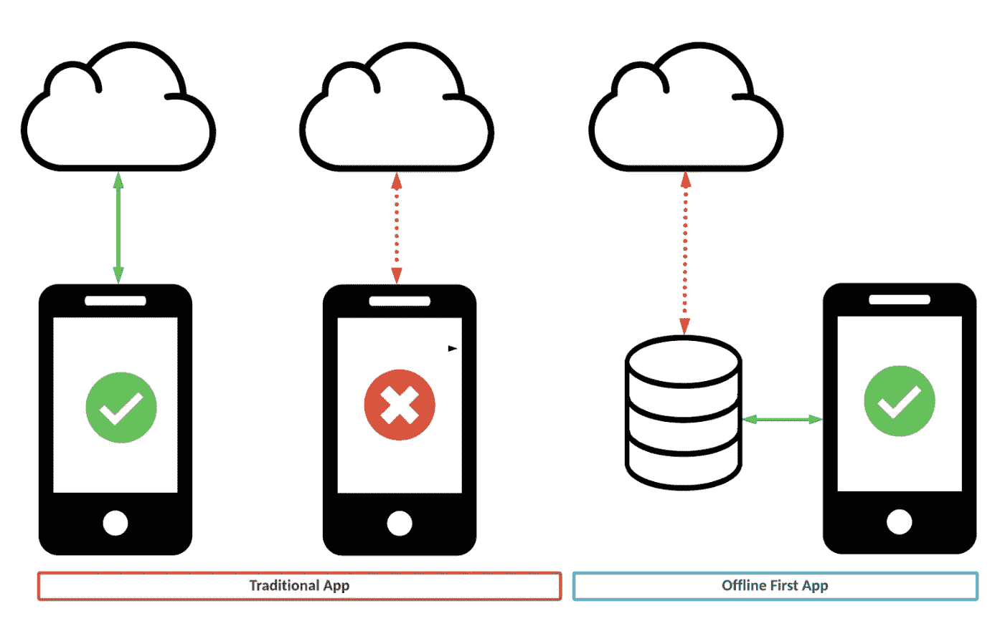

通过离线优先改善您的用户体验

[Flutter Data](https://flutterdata.dev) 是一个让你的应用先离线的包。

离线时，它使用设备上的配置单元存储，当与 API 的连接可用时，更改会自动同步。

在本文中，我们将添加并连接 [flutter_data](https://pub.dev/packages/flutter_data) 包，以便在应用程序启动时检索菜谱。

我花了一段时间才弄清楚自己想要什么，并勾画出设计草图:

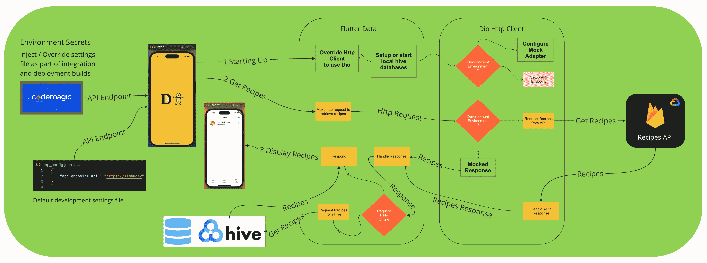

高级设计

发生了很多事情，要做好是很复杂的。

我用粗体字突出显示了一些需要编码或配置的操作，并用它们列出了任务列表:

*   步骤 1:启动时从 app_config.json 加载环境值。
*   步骤 2:添加新的包。
*   步骤 3:注释配方模型。
*   步骤 4:配置[颤振数据](https://flutterdata.dev)。
*   步骤 5:覆盖 Http 客户端以使用 Dio。
*   步骤 6:为开发和测试配置模拟适配器。

您可以在 XP 部分找到实现细节。

这篇文章中有很多细节，我的建议是充分阅读，以了解正在发生的事情，并在您决定或需要实现它时将其作为参考。

如果您有更好的方法或改进建议，请反馈。任何有助于改善这一关键发展任务的帮助都是受欢迎的。

## 哒哒

```
GlobalEnvironmentValues.instance
   .loadValues(await rootBundle.loadString("app_config.json"));
```

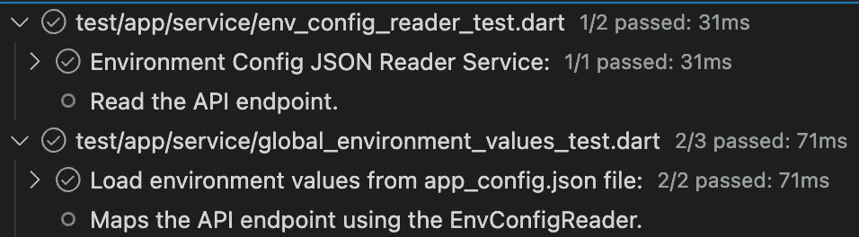

启动时从 app_config.json 加载环境值。

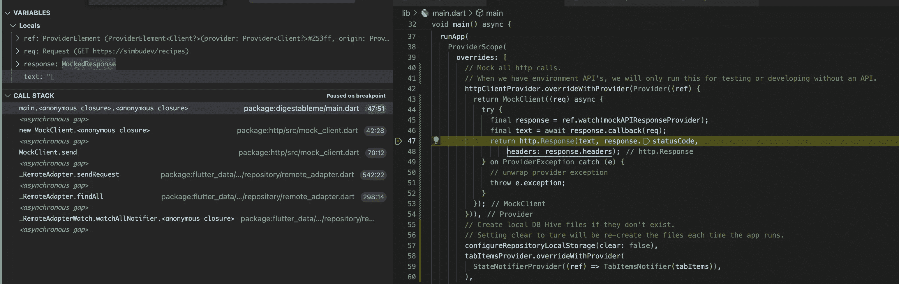

对请求使用模拟的 API 客户端

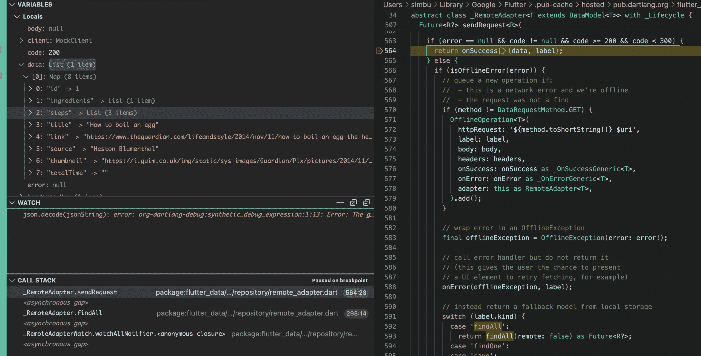

用于配方的颤动数据触发 FindAll 方法

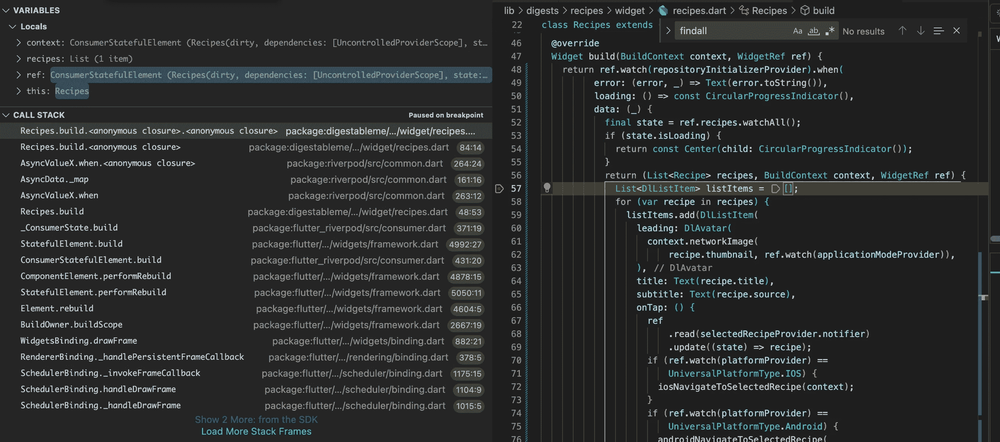

显示返回的配方

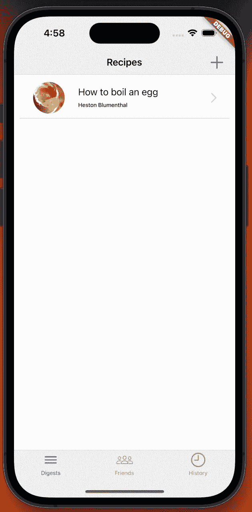

显示颤振数据返回的配方

感觉有点虎头蛇尾，因为我们刚刚配置了离线访问，但仍然使用模拟数据进行开发和测试。

但这是一个很大的进步，我们现在可以支持新实体的离线数据，我们有一个强大的编码模式来完成关键的开发任务，以添加或修改功能。

一旦我将身份验证设置到位，我将返回并使 Flutter Data 能够使用基于环境的云 API 服务，我希望设置一个 dev_online 和 dev_local 模式，并使用部署版本来配置 UAT 和实时版本。

## 经验值

## 实施细节

**步骤 1 —启动时加载环境值**

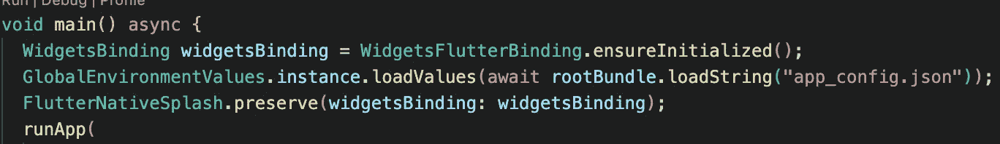

从 app_config.json 文件加载环境值

“GlobalEnvironmentValues”服务使用“EnvConfigReader”加载 app_config.json 值:

```
import 'dart:convert';

// Access to enviromental values that are loaded from a config file.
// The CI/CD injects the per environment files on deployment.
class EnvConfigReader {
  late Map<String, dynamic> _config;

  EnvConfigReader(String configFileJson) {
    _config = json.decode(configFileJson) as Map<String, dynamic>;
  }

  String value(String key) {
    return _config[key];
  }
}
```

**步骤 2 —添加新包**

```
# Offline-first data framework with a customizable REST client and powerful model relationships.
flutter_data: ^1.4.7

# A reactive state caching and data-binding framework
# Recommend replacement for provider: that is mentioned by flutter 
# https://docs.flutter.dev/development/data-and-backend/state-mgmt/options
hooks_riverpod: ^1.0.3+1

# Annotations used by code gen to create code for JSON serialization and deserialization
json_annotation: ^4.7.0

# Generate to/from JSON code for a class
json_serializable: ^6.5.4
```

**步骤 3——注释配方模型**

```
import 'package:flutter_data/flutter_data.dart';
import 'package:json_annotation/json_annotation.dart';
import 'package:simbucore/app/mixin/flutter_data_dev_api_server_adapter.dart';

part 'recipe.g.dart';

@JsonSerializable()
@DataRepository([FlutterDataApiServerAdapter])
class Recipe extends DataModel<Recipe> {
  @override
  final int? id;
  final String title;
  final String link;
  final String source;
  final String totalTime;
  final HasMany<Ingredient> ingredients;
  final HasMany<Step> steps;
  final String thumbnail;
```

它的导入将把**部分的**引用添加到将要生成的文件中，在下一步运行构建器之前，你会看到一个错误:

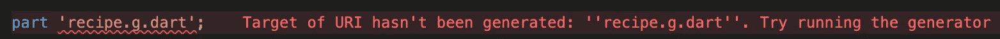

丢失文件错误

需要使用**的关系有许多**和**属于**更多信息见[文档](https://flutterdata.dev/docs/relationships/)。

mixin FlutterDataApiServerAdapter 使用我们现在在启动时加载的环境值来设置 API 基本 url。

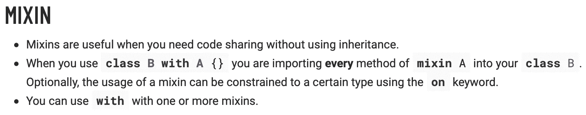

**步骤 4 —配置 Flutter_Data**

生成配方库

```
flutter pub run build_runner build
```

我们需要生成一个存储库，然后才能在启动时初始化它，因为代码生成会在它生成的文件中产生初始化方法:

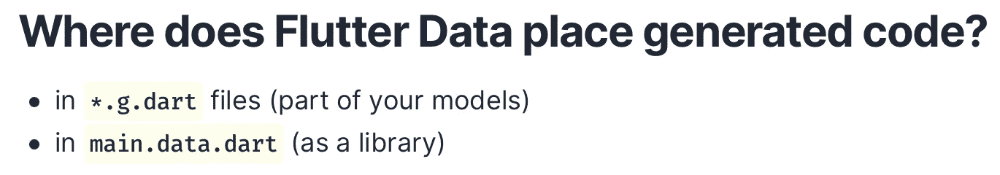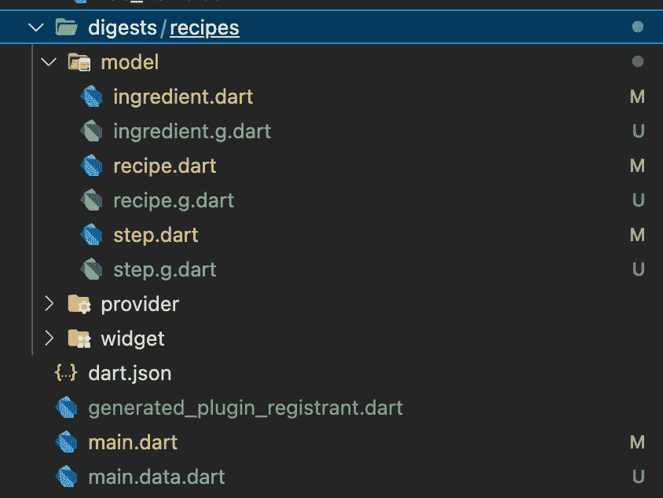

颤振数据生成的文件(Hive)

现在我们可以在应用程序启动时连接它:

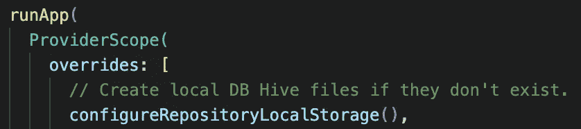

连接本地蜂箱存储器

**步骤 X —模拟 API 响应**

这个重新设计的**步骤 X——模拟 API 响应**,现在取代了两个计划步骤:

*   **步骤 5 —覆盖 Http 客户端以使用 Dio**
*   **步骤 6 —配置模拟适配器**

在更深入地研究了 Flutter 数据代码之后，很明显，尝试使用 Dio 将意味着对包进行操作，很多好处在于它用于 watchOne、Save、findAll 等方法的代码。

通过查看 Flutter Data 如何测试它自己的代码，我找到了我需要的东西，并决定重写 HttpClient:

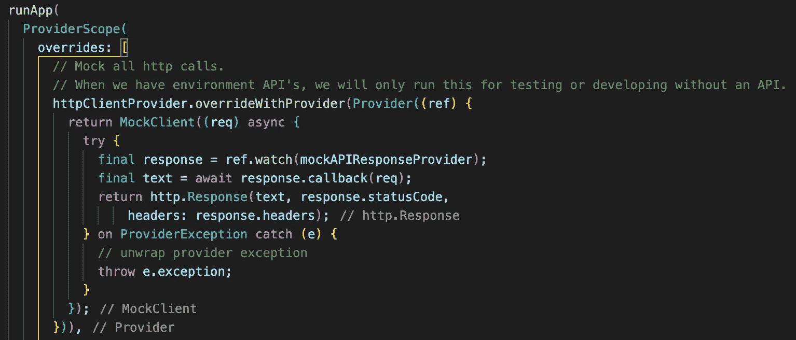

覆盖 HttpClient 提供程序以模拟 API 响应

Dio 还会带来其他一些好处，但是看起来 Flutter 数据可以很容易地被定制适配器扩展，以处理诸如认证令牌和重试之类的事情。在[颤振数据](https://flutterdata.dev/articles/)网站上有一些文章和代码样本。

## 为什么我选择使用 Flutter_Data

使用包是简化和减少项目代码的一个很好的方法，使它更容易维护。

当我们引入微应用 [DigestablePrologue](https://gitlab.com/simbu-mobile/digestableprologue) 时，我们看到了这一点，它允许我删除主项目 [DigestableMe](https://gitlab.com/simbu-mobile/digestibleme) 中的横切代码。

这简化了 [DigestableMe](https://gitlab.com/simbu-mobile/digestibleme) 中的代码，使其专注于应用程序功能，而 [DigestablePrologue](https://gitlab.com/simbu-mobile/digestableprologue) 处理所有启动操作，如布局和主题选择，以及连接状态管理包 [Riverpod](https://riverpod.dev) 。

但是没有什么是免费的，软件包会限制你，它们可能会停滞不前或者导致重大变化，依赖旧的软件包，有错误或者抽象漏洞。

对我来说，转折点是 Flutter_Data 提供了我一直在寻找的大量功能，并且与 [Riverpod](https://riverpod.dev) 非常契合:

*   使用代码生成从带注释的类创建 CRUD 存储库。
*   配置单元本地数据库。
*   离线检测。
*   反应式数据绑定。
*   失败并重试处理。
*   在线时自动与 RestAPI 同步。
*   可穿越的关系。
*   与 Riverpod 合作。
*   支持我想使用的 JSON:API。
*   JSON 序列化烘烤在。
*   用 Freezd 实现不变性的选项。

这是很多我们可以抽象出来的东西，我们可以创建一个新的学科来展示如何通过代码生成将新条目引入到应用程序中。

固执己见在一个团队中可能是一种真正的优势，你如何达成共识是一个难点，它通常涉及到更紧密的合作。

多年来，我发现结对编程在组建团队和项目开始时非常有用。


向同一个方向前进

## 根据环境 API

将一个文件添加到项目 app_config.json 的根目录，以保存开发 api 端点地址，这将被 CodeMagic build 覆盖以支持其他环境，请参见他们的文章[Environments in Flutter with code magic CD](https://blog.codemagic.io/environments-in-flutter-with-codemagic-cicd/)以了解详细信息。

然后我截取这个虚构的端点，指向我们模拟的开发数据。

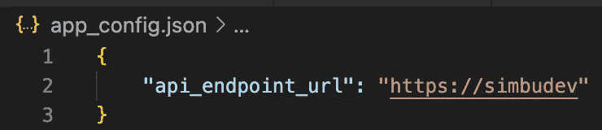

开发环境配置值

这些值可通过提供程序访问，该提供程序在应用程序运行时读取这些值。

## 灵活的学习和实验

在上一篇文章中，我添加了一个特性来检测客户端设备何时离线，目的是用它来同步离线数据。

当我在本文中介绍 Flutter_Data 时，我意识到它可以处理检测，并且可以为我节省一些时间。然而:

> 你无法把向前看的点点滴滴串联起来；你只能回头看才能把它们联系起来…
> 
> 史蒂夫·乔布斯

它只是提醒我去尝试，但是当更好的选择出现时，不要太珍惜扔掉我已经花了时间的工作。

## 颤振数据—关系

构建器强制对图中所有相关的模型进行注释:

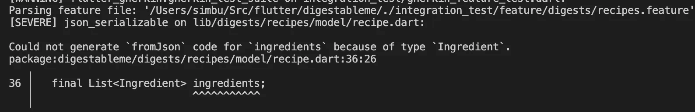

构建器错误-缺少相关配料模型

## 颤振数据—isoflineerror 标志

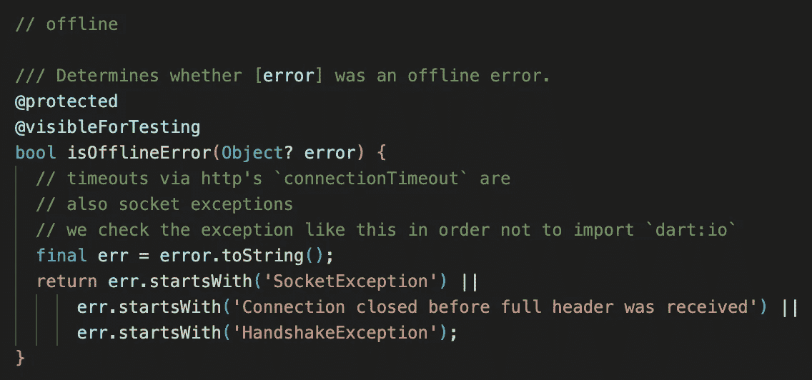

Flutter 数据如何决定设备是否离线。

## 配置单元本地数据库文件

配置单元在此处写入其本地数据库文件:

```
/Users/<user>/Library/Developer/CoreSimulator/Devices/060DB285-2820-411B-B5F7-76F9739DA934/data/Containers/Data/Application/A72C3081-43DD-4E03-82D0-DC49A3AF1317/Documents/flutter_data
```

基本目录是使用路径提供程序包中的 getApplicationDocumentsDirectory 函数获得的，您可以在生成的 main.data.dart 文件中找到代码。

```
...
if (!kIsWeb) {
    baseDirFn ??= () => getApplicationDocumentsDirectory()
    .then(
      (dir) => dir.path
      );
  } else {
    baseDirFn ??= () => '';
  }
...
```

如果在 configureRepositoryLocalStorage 初始化方法中重写 baseDirFn 参数，则可以设置自己的基目录。

## 单步执行外部包代码

为了找到 Hive 无权写入的目录路径，我必须打开调试包代码的功能

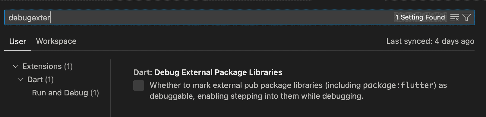

代码。首选项。设置菜单项

我重新启动了 Visual Studio 代码以使其工作，但您可能只需要重新启动应用程序。

## 不重要的

## 颤振数据诊断

我希望能够打开诊断日志，输出 Flutter 数据采取的关键操作，如从 Hive 中检索，因为脱机，并输出任何异常的信息，特别是从/到 json 的映射。

## 纪律和脚手架

一旦我验证了颤振数据并在行动中使用了几次，我将围绕它创建一个新的学科并改进脚手架。

这将是大多数新特性的核心部分，值得努力使过程简单和代码可维护。

## 延迟和聊天

如果我们遇到响应问题，我们可能需要考虑减少对 API 的调用(减少闲聊),我怀疑这只是通过一个更大的图或批量调用，我们将需要找出最好的方法来适应 [flutter_data](https://pub.dev/packages/flutter_data) 包。

## 包和依赖项

在介绍了 Flutter_Data 包之后，我试图将 Riverpod 升级到版本 2.1.1，结果是这样的:

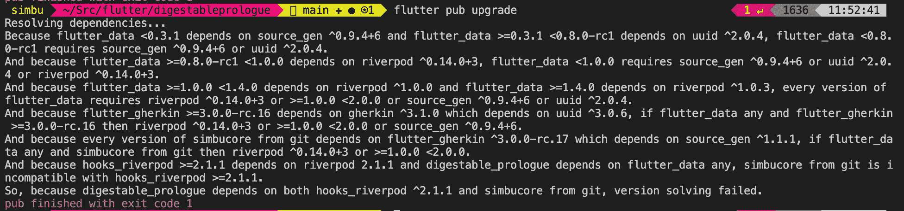

升级 Riverpod 时发生依赖冲突

随着您添加更多的包和微应用程序包，您的依赖项将变得更难处理和升级。

这是一些额外报告或工具的候选，以帮助我们扩展。

在这种情况下，Flutter_Data 需要 Riverpod 版本。

我通过在 pubspec.yaml 中为 simbucore 包中的 Riverpod 和 Flutter_Data 指定一些更高的版本号来解决这个问题，这简化了错误消息。

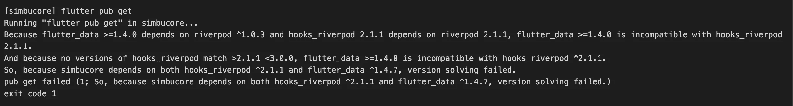

更清晰的信息

运行命令:

```
flutter pub outdated
```

向您显示可以解决的版本:

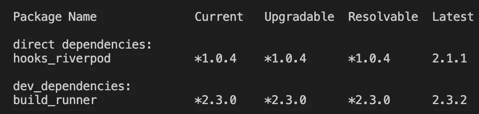

命令输出，显示可以解析的版本

## 链接

*   [下线先与旋舞](https://medium.com/flutter-community/offline-first-with-flutter-be1e8335d976)
*   [颤振数据](https://flutterdata.dev)
*   [颤振数据关系](https://flutterdata.dev/docs/relationships/)
*   [Reddit 关于 Flutter_Data 的讨论](https://www.reddit.com/r/FlutterDev/comments/ul0bqu/what_about_flutter_data_package/)
*   [聊天应用](https://www.mushroomnetworks.com/blog/called-chatty-application/)
*   [code magic CD](https://blog.codemagic.io/environments-in-flutter-with-codemagic-cicd/)中的颤振环境
*   [省道-延伸、执行和混合之间的差异](https://www.topcoder.com/thrive/articles/dart-differences-between-extends-implements-and-mixin)
*   [什么是 mixins？](https://medium.com/flutter-community/dart-what-are-mixins-3a72344011f3)

## 包装

*   [颤振 _ 数据](https://pub.dev/packages/flutter_data)
*   [json_annotation](https://pub.dev/packages/json_annotation)
*   [json_serializable](https://pub.dev/packages/json_serializable)