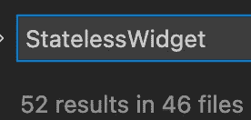
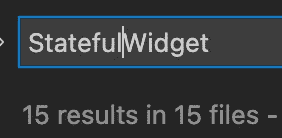
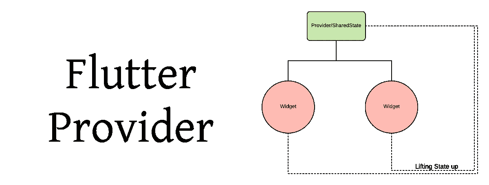

# 颤振状态管理:2022 版

> 原文：<https://levelup.gitconnected.com/flutter-state-management-2022-edition-2580d8095f0b>

今天对我来说标志着又一个颤振年——我已经深入颤振社区近 3 年了(时间过得真快！)现在。

如果你对我去年的建议感兴趣，请在这里随意阅读。

我将仔细检查我使用过的每个状态管理解决方案(我将在文章底部留下我没有使用或停止使用的解决方案的简短评论，并让您知道为什么),并写下它的优点和缺点——然后，您将看到评论并询问我的意见。

值得注意的是，你不必将自己局限于一种解决方案:我发现有些应用程序更容易使用，只需快速输入`Provider`，或者使用`setState`。其他的需要完全成熟的`Bloc`或者`Cubit`。我在这里的一般建议是，一旦你确定你需要状态，就从可行的最小状态管理解决方案开始:然后，慢慢地向上移动复杂性栈，直到你找到适合当前问题的解决方案。

对我来说，今年是“回归基础”的一年，经典的国家管理解决方案再次出现。以下是我对 2022 年州管理层的建议。

# 设置状态

设置状态

如果每次有人告诉我`setState`不足以作为国家管理解决方案时，我都能得到一枚硬币…

事实是，对于大多数小型应用程序来说,`setState`可能是一个很好的状态管理解决方案——如果你是一个单独的开发者，你可能正在构建这些应用程序。我一直在学习函数式编程，OCaml 很快成为我的首选脚本语言之一。

函数式编程的一个核心概念是不变性。按照这种思路，状态的存在实际上是负面的——理想情况下，我们拥有的状态越少，我们的应用程序就越容易管理和测试。

也就是说，几乎不可能有一个无状态的现代应用程序:比方说，我们如何无状态地表示文本字段的内容？

(我知道你可以——在我看来，这只是多劳多得。)

Flutter 已经为`setState`设置好了——如果你将一个(原始)状态变量传递给一个子部件，那么这个子部件会重新构建。(记住这一点——这是我们首先引入状态管理解决方案的原因)但是，我们越是在本地保存状态，应用程序就越好，也越不复杂。一般来说，如果 state 是 local，就使用`setState`！

**易用性:** ⭐⭐⭐⭐⭐

虽然状态不是一个容易理解的概念，但`setState`是迄今为止最简单的学习方法。

**可伸缩性/可测试性:** ⭐⭐

你*可以*只使用`setState`来构建大规模的应用。仅仅因为你能做某事并不意味着你应该做。测试有点痛苦，因为您不能直接操纵起始状态，所以每次测试都需要一些开销。

样本: ⭐⭐⭐

这一个可能会令人惊讶——这里有三颗星。将一个`StatelessWidget`转换成一个`StatefulWidget`会引入大量代码，并且会增加复杂性。我也不太喜欢`widget.<prop>`。

**总体:** ⭐⭐⭐

我发现我喜欢测试和编写`StatelessWidget` s，当我开始必须处理状态时，我更喜欢寻求不同的状态管理解决方案。我最大的项目总共有 67 个独特的小部件，其中 57 个是`StatelessWidget` s。

如果您的状态是本地化的，并且不会传递给多个小部件，请使用`setState`。比如动画，或者你在任何地方都可以使用的库部件。

如果我正在构建一个玩具项目，我会将`setState`作为一个完整的解决方案。除此之外，我开始关注软件包——但是即使是我最大的应用程序也至少在某些地方使用`setState`。

# **供应商**

我要第一个说，去年我确实给了他们很大的伤害。我认为这是一个多余的解决方案，覆盖了`InheritedWidget`已经做过的领域，没有任何新的东西。

然后我决定看看 Bloc 的依赖性——我惊讶地发现 Bloc 依赖于提供商！如果我决定在我的`pubspec.yaml`中添加 Provider，我的大小不会增加，所以我继续将它添加到 apps toolbart—*中，以防万一。*

嗯——它并不太具有开创性。我肯定是正确的，它涵盖了与`InheritedWidget`相同的领域——他们做类似的事情，除了提供者有很多额外的，允许一些灵活性。

提供商知识提供理想解决方案的一个地方是:

上面有一个块，提供了一个对象。那个物体是由一个低肘的建造者所依赖的。然而，cubit 并不监视它的构造函数属性，所以每当对象改变时，cubit 现在都会有该对象的旧版本。痛苦的调试——解决方案？`ProxyProvider`！

在其他情况下，提供商是一个简单的解决方案。也许你有一个引用相同属性的子树，你正在 [prop drilling](http://InheritedWidget) (一个从 React 借用的问题)。你可以建造一个完整的腕尺，但是当一个简单的`Provider`就足够了，你为什么要这样做呢？

**易用性:** ⭐⭐⭐⭐

提供商不是`setState`，但是很接近。有了`context.watch`，你节省了大量的时间，而且反应式的应用程序也能很好的工作*。*这是沿着小部件树提供值的最简单的方法。

**可伸缩性/可测试性:** ⭐⭐⭐

肯定比`setState`要好。但是提供商有它自己的一大堆问题——你把业务逻辑放在哪里？在小部件中，唯一的作用就是改变提供者的状态？也许吧，但是我更喜欢保持我的业务逻辑完全独立，这样它很容易测试。另外，`test`比`widgetTest`跑得快！

另一个问题是沿着树向下提供相同的对象——您用较低的对象完全遮蔽了顶部的对象。

它也比 Bloc 更难测试——但是我们可以注入依赖项，并且不需要测试提供者本身，所以你真的减少了样板文件。

样板文件: ⭐⭐⭐⭐⭐

来自提供商的绝对五星。我甚至不知道大多数 Bloc 都是使用 Provider 构建的。迄今为止最简单的状态管理解决方案！大多数时候，集成一个提供者是完全不可能的。

**总体:** ⭐⭐⭐⭐ + 0.5(无半星表情符号)

当 Bloc 太大而`setState`太小时，这是一个很好的解决方案。我在很多地方都不用提供商。我的大多数特征文件夹里都有一个 cubit 或者一个 bloc。但是，有时候，当我查看我的 cubit 时，会发现它是空的——它看起来像一个 java 类，只有 getters 和 setters。在那里，我宁愿去找一个简单的供应商，避免所有的锅炉板。

# BLoC(和 Cubit！)

我去年把我的集团板块命名为“集团(或肘？)”—区别在于运算符。这一次，我称之为集团*和*肘。

我完全被丘比特迷住了。这实际上只是一个更好的集团，处理了一些集团憎恨者提出的问题:即大量的锅炉板。

如果你以前没有讨论过这个问题，我来为你演示一下:Bloc 是 Flutter 的 FizzBuzzEnterprise，至少有 5 个(！) (每个块 1 个，抽象+具体事件，抽象+具体状态)类，以及`mapEventToState`中的大量样板文件。

后来 Cubit 出现了，完全去掉了`Event`类，去掉了`mapEventToState`，取而代之的是简单的函数调用。一开始我并没有被说服，因为我正好在“集团太复杂”的列车上。

然而，我很难找到合适的替代品:我真的很高兴我的业务逻辑从 UI 中抽象出来，并且非常容易测试，所以我不情愿地回到了 Bloc 的世界，并开始探索新的 Cubit。

我真的很喜欢丘比特！这使得国家管理起来简单多了，但也减少了很多麻烦。当要求 UI /逻辑分离时，只有这么多脂肪你可以修剪，直到你回到把你的逻辑放回 UI。

Bloc 本身(如 in，而不是 cubit)从 v8 开始有了新的版本:[我不打算深入研究它，但是如果你感兴趣的话，我已经写了另一篇文章。](/flutter-bloc-v8-0-is-here-and-will-change-the-way-you-handle-state-forever-72ddb4da9e1d)总之，Bloc 并没有完全被 Cubit 掩盖，它仍然有自己的位置——在 Bloc v8 中，我们去掉了`mapEventToState`,以支持发射器，使 Bloc 本质上成为一个 Cubit——只是用事件作为输入而不是函数调用，以及更多的可监控性等等。

**易用性:** ⭐⭐

这里要学的东西很多，有点让人目不暇接。熟练的阻塞器会觉得这是第二天性，但是回头看看一些阻塞代码，这些代码实际上做了什么并不直观。

更重要的是，bloc 在幕后使用了 provider，这意味着一旦您学习了 Bloc，您就对 provider 有了一定的了解——所以这有点像必须同时学习两种状态管理解决方案的细微差别。

**可伸缩性/可测试性:** ⭐⭐⭐⭐⭐

我一直向团队推荐 Bloc。阻塞的缺点是需要编写大量的代码。好处是它保持有组织性，并且易于测试。对于工程师团队来说，这是一个完美的权衡，因为他们有更多的人手——而更多的代码通常意味着更细粒度的工作单元！

Blocs 也非常擅长在项目中扩展。它们自然地有助于拥有“每个特性一个块”类型的架构，因此，您正走在一条阻力最小的道路上，允许您构建大型的、解耦的移动应用程序。如果你正在处理一个复杂的特性，那么 Bloc 就是状态管理之王。

**样板:** ⭐⭐

丘比特在这方面做得非常好，但毫无疑问，Bloc 是迄今为止最样板的。

**总体:** ⭐⭐⭐⭐ + 0.5

与此处的提供商得分相同。Bloc 擅长更复杂的特性，拥有大量的业务逻辑和存储库处理。它允许你将你的 UI 层与你的业务逻辑很好的分离，因此，对于一个相当复杂的应用程序，Bloc 是我第一个快速的选择。

## 其余的

看看我的名单与去年相比有什么变化，这很有趣。这里有一些关于其他状态管理解决方案的简短段落。

如果您正在使用这些解决方案中的一种，那很好！我不会用你使用的任何解决方案来评判你的应用程序——如果它对你有用，那就是完美的:使用你的解决方案，并感到快乐。

以上是我对其他一些国家管理方案的看法。

**InheritedWidget:** 完全被提供者盖过，句号。如果你走这条路，几乎没有理由的样板。如果你正在构建一个非常小的应用程序，并且只需要提供一两个值，那么就选择`InheritedWidget`！否则，打开您的`pubspec.yaml`并添加提供商。

**RiverPod:** Riverpod 还是很棒的。我仍然喜欢 Riverpod，喜欢回到使用它的旧项目中去。它不再是街区里的新成员了，但是它确实仍然做着它承诺要做的事情。我想在 RiverPod 上花更多的时间，但是我太迷恋 Bloc 了，因此不认为在同一个项目中包含 Bloc 和 Riverpod 是可行的。如果你是新手并且渴望学习，Riverpod 可能是你要去的地方！

**GetX:** 我试过 GetX。我真的尽力了。对我来说，当一个图书馆试图做太多的事情时，这是一种厌恶。请把我的主题和电子邮件验证器分开！我更喜欢我的库做一件事，并且做得很好，我感觉 GetX 做了很多。我不知道为什么，但是我看到很多新开发人员被 GetX 吸引——也许这是新的亮点，而我正在变成一个老格林奇。

后两种观点自去年以来没有改变，所以我将它们复制并粘贴到下面:

盒子上写着呢。get_it 不是一个状态管理解决方案——但是人们一直把它当作一个状态管理解决方案来使用。如果用作状态管理解决方案，它会非常混乱，老实说，在文件中声明浮动变量可能会更好。

**redux / fish_redux / mobx:** 这些都来自 React，并且具有非常相似的风格——但是我认为很快就可以看出 React 和 Flutter 是两种不同但相似的野兽。这些工作，如果你习惯了，那么你可以使用它们，但是为 Flutter 设计的状态管理工作得最干净。

原来如此！我的 2022 年州管理文章到此结束。有什么意见你认为我应该知道，或者你认为我做错了什么？给我和其他读者留言吧！