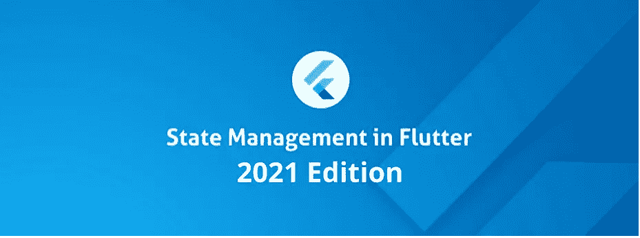
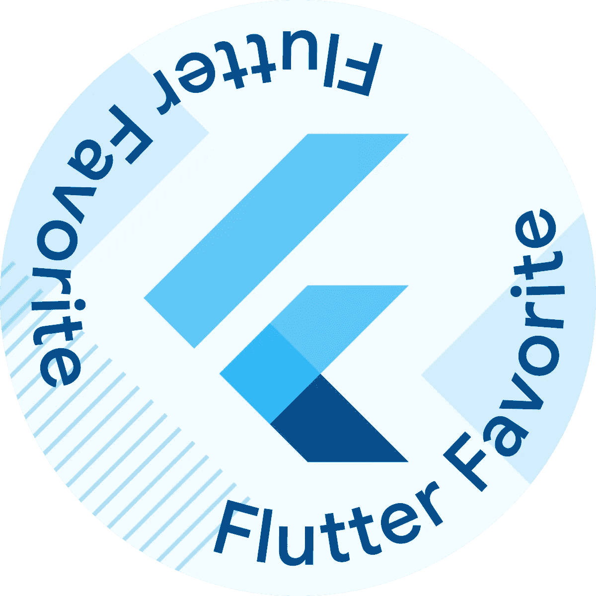
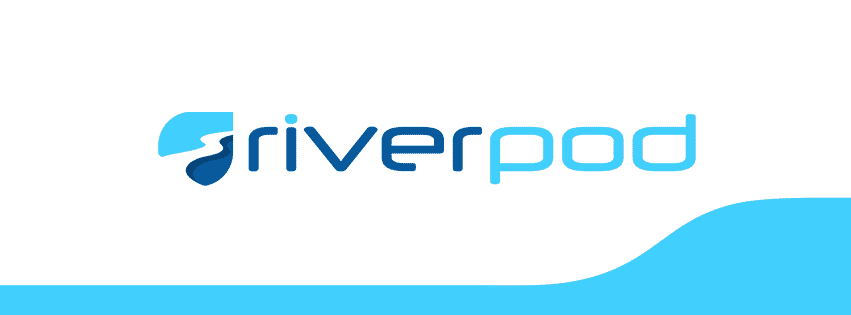

# 2021 年颤振状态管理:何时使用什么？

> 原文：<https://levelup.gitconnected.com/flutter-state-management-in-2021-when-to-use-what-98722093b8bc>



有时候，国家管理垄断是好的；在 React 中，实际上只有一两个常见的状态管理解决方案。随着 2020 年的野兽接近尾声，似乎每个月都有新的国家管理解决方案。这里列出了每个解决方案的优点，因此您可以确信您选择了满足您需求的最佳状态管理解决方案。

# 基础知识

有两种状态管理解决方案你可以不用接触你的`pubspec.yaml`文件就可以使用，有时(次数比你想象的要多！)够了。

## 设置状态


SetState 只在*本地*范围内有用。如果一个小部件正在改变它自己的状态，那么 SetState 100%是你想要使用的，不用担心其他任何事情。例如，也许你正在存储一个开关是开还是关，或者也许你正在存储一个文本字段输入的内容。SetState 在局部范围内无与伦比，你真的不应该考虑任何其他包。

我的经验是这样的:如果 stateful 变量只在这个小部件中需要，或者在树的上下 1 个小部件中需要，那么它属于局部范围。用个`StatefulWidget`就开心了。如果需要沿树向下传递状态，只需将变量放在子部件的构造函数中。如果同一个变量通过构造函数 2+ widgets 深入传递，那么是时候考虑更高范围的状态管理了。

## 固有宽度

你知道我们在 SetState 中讨论的那个开关吗？也许它控制着应用程序是处于黑暗模式还是光明模式。在这种情况下，您需要将状态提升到能够更好地沿树向下传播的位置。不过，在开始安装软件包之前，让我们先来看看 InheretedWidget。

InheretedWidget 允许它下面的任何小部件访问它的属性。这意味着您可以有一个类似于以下的变量:

```
enum Theme {
  dark,
  light 
}
```

在 InheretedWidget 内部，任何关心主题的小部件都可以通过`MyInheretedWidget.of(context).theme`来访问主题。小部件也将在主题更新时重建，这很好。

InheretedWidget 崩溃的地方在于有很多样板文件。小部件系统需要大量的代码不断重复，因此，如果您正在进行大量更高范围的状态管理，就会变得有些重复。

# 那些你必须安装的

## BLoC(丘比特？)


Bloc 可能是这个列表中最老的解决方案，并且仍然很棒。最近，BLoC 在组合中添加了 Cubit，这使得 BLoC 或多或少地过时了，因为 Cubit 降低了所需的样板文件——好的方面是它们都在同一个包中，这意味着移植非常容易。BLoC 擅长两个不同的领域，在我看来:
**1。与团队合作:**集团在让事情变得不灵活方面做得非常好。对于很多人来说，这是一件坏事:他们希望能够快速改变他们的应用程序，而不必写太多的代码，或者改变太多的代码。对于团队来说，情况并非如此:通过让事情变得有点不灵活，您可以保证一切都按照最初开发人员的意图运行——如果 BLoC 中的一个状态只打算具有值 1、2 和 3，您可以对 BLoC 进行编码，以便事件只将状态更改为这些值，这样其他程序员就不会意外地将其值移动到 4。因此，它也非常容易测试。

**2。事件驱动状态:** BLoC 是基于事件的，所以它在事件驱动状态方面做得非常非常好也就不足为奇了。我的意思是你必须定义你的事件。执行 API 调用可能会触发一个事件，从而推出一个状态`CallingAPIState`。然后，当 API 调用完成时，它会推出一个`HaveAPIResultsState`。

如果您喜欢严格定义事件和状态，那么 BLoC 适合您。如果您需要灵活性/开发速度，那么 BLoC 可能不是合适的选择。(我个人更喜欢我的应用中的 BLoC 和 cubit。)

## 供应者



激动人心的经典作品

出于传统原因，我将提供商放在此列表中。在一段时间内，提供商是必经之路。它很简单，很干净，很棒……但是也有一些不足之处，需要改进。

将提供者视为固有的，样板文件较少。事实上，提供者是建立在固有的边缘之上的。它只是减少了您必须编写的代码量，这太棒了。

如果你的应用已经在使用 Provider，你 100%可以继续使用它。就其功能而言，这是一个非常好的包，没有理由完全迁移到另一个解决方案。

但仍有一些改进的空间，我真的认为 RiverPod 在继续提供者的工作方面做得很好。

## RiverPod



在 RiverPod 的网站上，他们自称“提供商，但与众不同。”这听起来再真实不过了。提供商，即使它删除了许多样板文件，仍然有一些可以进一步减少。此外，Provider 依赖于 BuildContext——我认为在很多情况下这真的很好(它迫使您使用小部件树),但有时，就像应用程序生命周期一样，在您需要的地方获得 build context 是不实际的。

RiverPod 在提供商方面的优点和改进如下:

*   样板文件比提供者少:RiverPod 在减少提供者方面做得很好，允许您只注册一个顶级商店，然后就可以完成，而不必单独提供每个提供者。(想到所有东西都在一个地方，你们中的一些人可能会退缩——别担心！如有必要，您可以查看您的 pod。)
*   不依赖于 BuildContext:这也是一个很好的方法，原因已经提到过了。有时，您就是无法在需要的地方获得 BuildContext。这可能是您在`main`函数中设置的`onAppClose`监听器。
*   编译安全:到目前为止，这是国家管理中最好的创新。如果你的代码可以编译，你就很棒。我们不会再想为什么在树中找不到我们的提供者。这是一项巨大的创新，将为您节省大量时间。

RiverPod 只是换了一种皮肤——更光滑、更好的皮肤。如果你开始一个新的应用程序，并想走提供商路线，我强烈建议你考虑 RiverPod。

我考虑过这个列表的状态管理解决方案，但最终没有添加:

*   GetX。我不是 GetX 的粉丝。GetX 试图完成很多工作，这限制了您的灵活性。如果你想要一个“完整的应用”包，那么 GetX 是你的不二之选。我试过了，但不喜欢——但如果它对你有用，那就太好了！
*   盒子上写着呢。get_it 不是一个状态管理解决方案——但是人们一直把它当作一个状态管理解决方案来使用。如果用作状态管理解决方案，它会非常混乱，老实说，在文件中声明浮动变量可能会更好。
*   redux / fish_redux / mobx:这些都来自 React，并且具有非常相似的风格——但是我认为很快就可以看出 React 和 Flutter 是两个不同但相似的东西。这些工作，如果你习惯了，那么你可以使用它们，但是在我看来，为 Flutter 设计的状态管理工作得最干净。