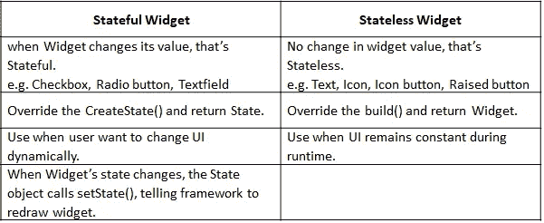
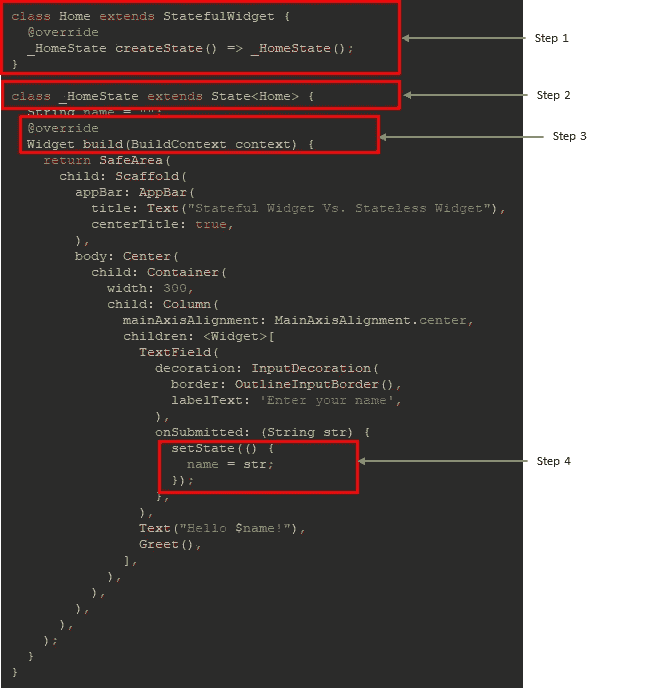
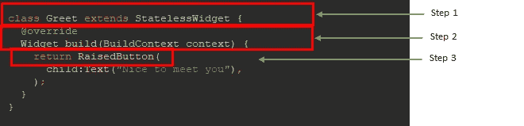
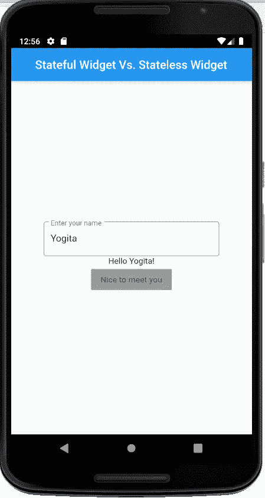

# Flutter:有状态窗口小部件与无状态窗口小部件

> 原文：<https://levelup.gitconnected.com/flutter-stateful-widget-vs-stateless-widget-c7baf0a3bbc1>

Flutter 是关于小部件的。如果你想开发一个应用程序，你必须首先决定你将使用哪些部件。每个部件都有自己的状态。

## 什么是状态？

状态是在构建小部件时可以同时读取的信息，并且可能在运行时改变，简而言之，我们可以说状态定义了小部件的当前属性。

继承有状态小部件的类是不可变的，但是状态是可变的。

(**不可变类**是指对象一旦被创建，我们就不能改变它的内容。一个**可变类**是一个在创建后可以改变其内部状态的类。)



有状态小部件与无状态小部件

## **实现有状态小部件的步骤？**

1.  创建一个扩展“StatefulWidget”的类，该类在“createState()”中返回状态
2.  为可能在运行时改变其值的小部件创建一个“状态”类。
3.  在“State”类中，实现“build()”方法。
4.  调用“setState()”函数。“setState()”函数实际上会重画小工具。

## 代码示例:



StatefulWidget 实现

## 实现无状态小部件的步骤？

1.  创建一个扩展“StatelessWidget”的类。
2.  为运行时从不改变值的小部件创建一个“build()”方法。
3.  “build()”方法返回小部件。

## 代码示例:



无状态小部件实现

## 完整代码和输出:

```
import 'package:flutter/material.dart';

void main() => runApp(MyApp());

class MyApp extends StatelessWidget {
  // This widget is the root of your application.
  @override
  Widget build(BuildContext context) {
    return MaterialApp(
      debugShowCheckedModeBanner: false,
      title: 'Flutter Demo',
      theme: ThemeData(
        primarySwatch: Colors.*blue*,
      ),
      home: Home(),
    );
  }
}

class Home extends StatefulWidget {
  @override
  _HomeState createState() => _HomeState();
}

class _HomeState extends State<Home> {
  String name = "";
  @override
  Widget build(BuildContext context) {
    return SafeArea(
      child: Scaffold(
        appBar: AppBar(
          title: Text("Stateful Widget Vs. Stateless Widget"),
          centerTitle: true,
        ),
        body: Center(
          child: Container(
            width: 300,
            child: Column(
              mainAxisAlignment: MainAxisAlignment.center,
              children: <Widget>[
                TextField(
                  decoration: InputDecoration(
                    border: OutlineInputBorder(),
                    labelText: 'Enter your name',
                  ),
                  onSubmitted: (String str) {
                    setState(() {
                      name = str;
                    });
                  },
                ),
                Text("Hello $name!"),
                Greet(),
              ],
            ),
          ),
        ),
      ),
    );
  }
}

class Greet extends StatelessWidget {
  @override
  Widget build(BuildContext context) {
    return RaisedButton(
      child: Text("Nice to meet you"),
    );
  }
}
```



最终输出的屏幕截图

如果您想参考完整的源代码，请访问:

[](https://github.com/yogitakumar/firstflutter) [## yogitakumar/firstflutter

### 理解有状态小部件和无状态小部件概念的 Fluuter 项目 GitHub 是超过 5000 万个…

github.com](https://github.com/yogitakumar/firstflutter) 

👋 [**今天就加入农牧之神，每周都会在你的收件箱里收到类似的故事！**](https://faun.dev/join) ️ **获得每周必读的科技故事、新闻和教程。**

**关注我们的** [**推特**](https://twitter.com/joinfaun) 🐦**和** [**脸书**](https://www.facebook.com/faun.dev/) 👥**和**[**insta gram**](https://instagram.com/fauncommunity/)**📷**并加入我们的** [**脸书**](https://www.facebook.com/groups/364904580892967/) **和**[**Linkedin**](https://www.linkedin.com/company/faundev)**群**💬**

**[](https://www.faun.dev/join?utm_source=medium.com/faun&utm_medium=medium&utm_campaign=faunmediumbanner)**

## **如果这篇文章有帮助，请点击拍手👏按钮下面几下，以示你对作者的支持！⬇**