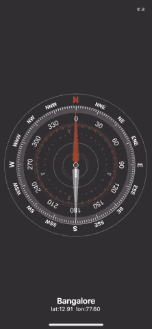

# flutter——您需要在 2021 年检验的框架

> 原文：<https://levelup.gitconnected.com/flutter-the-framework-you-need-to-checkout-in-2021-310900946695>

## 在单一代码库中构建流畅、快速、优雅的跨平台应用程序！


W 你会对一个框架感兴趣吗？这个框架可以让你一步到位地为 Android、iOS、桌面和 web 构建应用程序。同时提供超过 60 FPS 的 UI？多亏了 Flutter 框架，所有这些都成为可能**以及更多**。Flutter 于 2017 年 5 月由谷歌发布，距离它的第四个生日只有一步之遥！Flutter 还利用了 Dart 编程语言，这被认为是*最容易学习的语言之一*，并使您从数小时的像素扭曲中解脱出来，因为**代码库中没有原始 CSS 或 HTML**。

只要看看这个用 Flutter 构建的跑步应用程序:


波塞画廊应用程序

或者这个超级时尚的世界指南针应用程序:



胡泽彪的指南针

一些 **Flutter 的顶级津贴**包括:

*   以 60+ FPS 为标准基线的平滑用户界面
*   Dart 中适用于任何平台的单一代码库
*   热重启需要数毫秒才能在应用中呈现新代码
*   构建用户界面非常容易
*   项目编译到原生应用，没有 JS 桥！
*   通过 i18n 进行国际语言翻译
*   快速增长的社区支持

当然，您还拥有所有的标准框架功能，例如路由、测试和一系列用于预构建功能的软件包。

主要的一点是 **Flutter 让你在发展中** **变得极其快速和动态**。您可以通过单一代码库向任何特定于操作系统的应用版本提供更新。由于 Flutter 应用程序是本机编译的，所以您不必与 JavaScript 引擎交互，这在性能上是一个巨大的提升！

> 我在这里只是想让你相信，如果你是一个只关心结果的开发人员，是时候看看 Flutter 了。

***免责声明*** *:本文假设读者理解 CS 的基本原理，如对象、状态和枚举。*

# 应用程序开发又变得有趣了

用谷歌搜索大量 CSS 和 HTML 规则来让你的应用程序有一种干净的感觉的日子已经一去不复返了。相反，Flutter 允许你通过使用小部件以极快的速度构建你的应用。完全免责声明，在你创建 Flutter 应用程序之前有一点设置，因为你必须安装 Flutter SDK 以及 Android 或 iOS 的设置——这里是[文档](https://flutter.dev/docs/get-started/install)。

## 颤动的客户

一旦安装好了所有东西，只需运行:

```
$ flutter create <your cool project name>
```

Flutter 客户端非常适合你所有的标准项目需求，比如林挺或者用`flutter doctor`检查项目工作空间。

```
$ flutter doctor
Doctor summary (to see all details, run flutter doctor -v):
[✓] Flutter (Channel stable, 2.0.6, on macOS 11.2.3 20D91 darwin-x64, locale en-US)
[✓] Android toolchain - develop for Android devices (Android SDK version 30.0.3)
[✓] Xcode - develop for iOS and macOS
[✓] Chrome - develop for the web
[✓] Android Studio (version 4.1)
[✓] IntelliJ IDEA Ultimate Edition (version 2020.3.2)
[✓] IntelliJ IDEA Community Edition (version 2020.2.3)
[✓] Connected device (2 available)• No issues found!
```

您可以在各种环境中运行 Flutter 应用程序，如 Android 或 iOS 模拟器、桌面应用程序或 web！

```
$ flutter devices
2 connected devices:macOS (desktop) • macos  • darwin-x64     • macOS 11.2.3 20D91 darwin-x64
Chrome (web)    • chrome • web-javascript • Chromium 92.0.4488.0
```

## 运行演示应用程序

从头开始创建一个新的 Flutter 应用程序会给你一个计数器应用程序，其中有一个标题，一个点击按钮，以及一个你点击该按钮次数的计数器。非常标准，但是干净，有一个多设备的动态用户界面。我们可以用`-d`指定一个设备，然后选择`chrome`。

```
$ flutter run -d iPhone
```


颤动计数器应用程序

所有的代码包括样式、功能和一般结构都包含在`lib/main.dart`中。为了理解 Flutter 框架，我们将通过这个例子以及一些我们自己的定制更改来进行讲解。让我们分解主 Dart 文件的开头。

首先，我们`import` [材料设计](https://material.io/design)这是对旋舞镖的极大褒奖。然后我们有预定义的颤振方法`main()`和`runApp()`，它们实例化了`MyApp` `class`，我们可以自由定制。正如我们所看到的，MyApp 类扩展了 StatelessWidget。小部件可以是有状态的，也可以是无状态的，这取决于你是否想要持久化数据。

`MyApp` `class`是我们小部件树的根。在 Flutter 中覆盖`build()`方法是标准的，该方法接受一个`BuildContext`来跟踪应用程序的状态。我们还将`build()`的返回类型定义为`Widget`。在`build()`中，我们返回一个新的`MaterialApp`，在这里我们可以立即设置`title`和`theme`，并为`home`字段分配下一个自定义类`MyHomePage`。

## 热重装

Flutter 的一个非常棒的特性是能够在几秒钟内看到应用程序的变化。首先，点击按钮几次，查看计数器的增量。然后，把主题改成`primarySwatch: Colors.green`。在运行你的应用程序的终端中，输入`r`进行热重新加载，这应该不到一秒钟，你会注意到计数器应该是相同的值——应用程序没有重新启动**！**


## 了解状态、类和小部件

好了，我们已经了解了无状态的词根`MyApp` `class`。下一个要检查的类是`MyHomePage`，我们将它分配给`MaterialApp()`中的`home`字段。这是我们将通过扩展`StatefulWidget`来包含状态的地方。

现在我知道你在看什么了，2 号线到底是干什么的？基本上,`MyHomePage({Key key, this.title})`是说我们希望我们的`MyHomePage` `class`有两个参数，第一个是类型为`Key`的`key`,第二个是第 4 行声明中隐式类型为`String`的`this.title`。然后在`:`之后，`super(key: key)`正在调用超类`MyApp`并将`MyHomePage`的`key`从`MyApp`赋值给`key`。**这里的细节你不用管**，只要知道这是 Dart 版的 MyHomePage 类的构造函数就可以了。=)

每当我们创建一个小部件子类时，将字段如`title`设置为`final`也是标准的。第 7 行是我们如何在 Flutter 中更新状态，因为我们覆盖了`createState()`方法来更新`_MyHomePageState`以包含状态。

**最后我们有主逻辑**——第三个也是最后一个`class` `_MyHomePageState`扩展了`State` `class`，也是`MyHomePage`类型。这允许我们将状态合并到类中，并从 MyHomePage 中获取`title`字段作为输入。一个基调是将`_`添加到一个类或字段中会使其在 Flutter 中私有。

计数器逻辑很简单。我们有私有方法`_incrementCounter()`，它调用内置的颤振方法`setState()`，随后将`_counter`递增 1。我们将这个函数分配给`FloatingActionButton`小部件中的`onPressed`字段来添加功能，很简单！

主 UI 逻辑在`build()`方法中。在这里，Flutter 展示了它如何在嵌套结构中的同一代码库中组合样式和逻辑。我们从`Scaffold()`对象开始，它提供了预构建的小部件，如`appBar`、`body`和`floatingActionButton`。

对于每个窗口小部件字段，我们分配一个具体的窗口小部件——例如,`appBar`字段被分配一个具体的`AppBar()`,其中包含一个`title`字段，该字段被设置为一个具体的`Text()`对象，继承的`widget.title`值作为其文本值。多拗口啊！

这个原则在身体领域继续。使用这种模拟装饰模式，我们可以添加大量的 UI，分配简单到第 18 行。

## 通过轴对齐掌握用户界面

将`mainAxisAlignment`设置为枚举值`MainAxisAlignment.center`会将第 20 行和第 24 行上的两个`Text()`小部件设置在屏幕中央。如果您通过`MainAxisAlignment.start`将该值设置为，您可以将这两个`Text()`小部件移动到屏幕顶部。


让我们进一步探讨颤振中轴线对准的作用。将`Column()`的`mainAxisAlignment`字段设置回`MainAxisAlignment.center`。我们将为其子字段添加一个带有`Row()`小部件的`ColoredBox()`小部件。这里我们显示了一排三颗星星，同时将它们与`Row`容器的`start`(左侧)对齐。

现在我们有:


如果我们将`Row()`小部件更改为`Column()`，我们会得到:


把`Column`变回`Row`，我们可以把`ColoredBox`的`mainAxisAlignment`改成`MainAxisAlignment.spaceEvenly`来展开我们的星星。你能想象这在原始 CSS 和 HTML 中会有多烦人吗？！


让我们将中间星号的大小增加到 200，并添加 crossAxisAlignment 字段—将其设置为`start`枚举值。

```
child: Row(
  mainAxisAlignment: MainAxisAlignment.spaceEvenly,
  crossAxisAlignment: CrossAxisAlignment.start,
```

我们可以很容易地用`center`枚举值将下面的星星居中。这太简单了。


## 或者只是总体上掌握 UI

如果你必须选择任何一个通用框架，你认为用渐变调色板添加一个圆会有多难？嗯，颤动使它变得易如反掌。


> 我喜欢 Flutter 的第一点是它使跨平台应用程序的开发过程变得非常容易。无论你想要快速的图形，最小的发布开销，还是快速的开发时间——Flutter 将加速你整个团队的工作流程！

# 结论

虽然我认为每个开发者都应该至少尝试一下 Flutter，但我相信这个框架对于初创公司和有黑客心态的人来说有巨大的价值。在 Flutter 中创建快速、跨平台且看起来非常漂亮的应用程序实在是太容易了。如果你按照这样的教程，你可以在一个小时内完成 Spotify 的用户界面:

> 我告诉你，花点时间，给飞起一次机会。我知道一个事实，下次我有一个附带项目，我想快速原型，Flutter 将是我的选择框架。