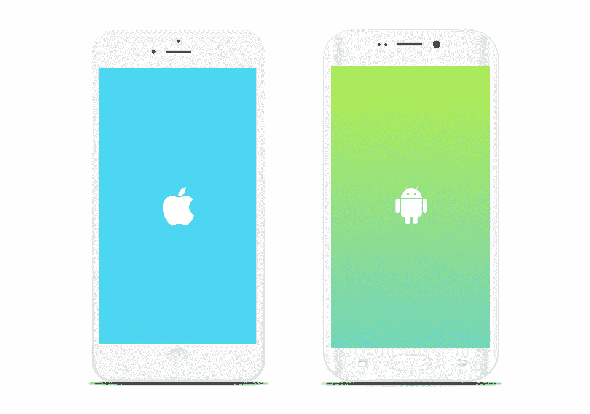
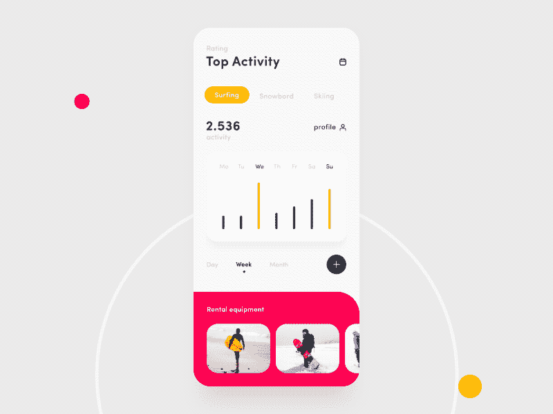
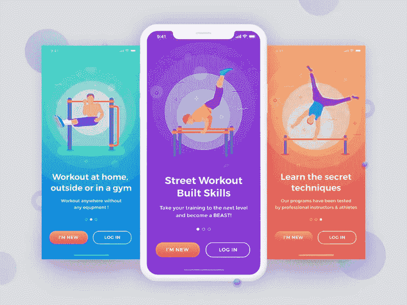
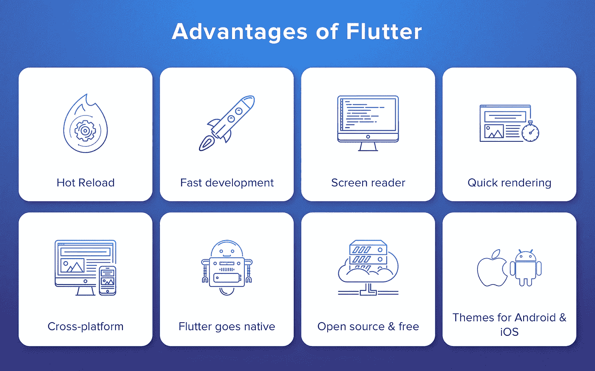
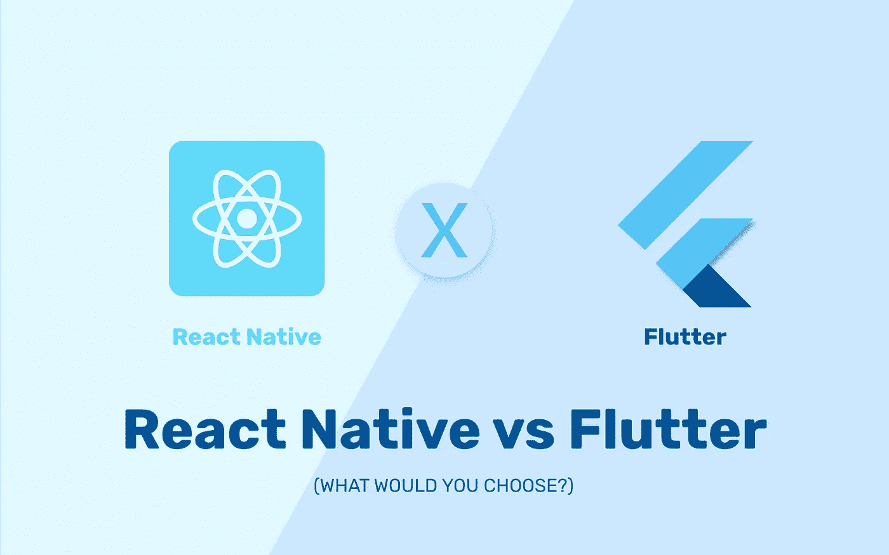

# 奋力打造 iOS 和 Android 应用

> 原文：<https://levelup.gitconnected.com/flutter-to-build-ios-android-apps-f8786d6fe987>

## Flutter 是 Google 的可移植 UI 工具包，用于从单一代码库为移动、web 和桌面构建漂亮的本地编译应用程序

> Flutter 由谷歌开发，其首个预览版 1 于 2017 年发布，在全球范围内获得了大量用户的关注。

# 什么是颤振？

[Flutter](https://flutter.dev/) 是一款开源、多平台的移动 SDK，可以用相同的源代码构建 iOS 和 Android 应用。它与 React Native 和 Xamarin 等其他跨平台框架的区别在于，它不使用本机小部件，也不使用 WebViews。

相反，Flutter 有自己的用 C/C++编写的渲染引擎，而用于实际编写 Flutter 应用程序的 Dart 代码可以在每个平台上编译成本机代码。

# **1。两个平台一个代码**

开发者只需为你的两个应用编写一个代码库，涵盖 Android 和 iOS 平台。Flutter 不依赖于平台，因为它有自己的小部件和设计。这意味着你在两个平台上有相同的应用。

# **2。开发时间**

Flutter 意味着更快更动态的移动应用开发。我们可以在代码中进行更改，并在应用程序中直接看到它们！这就是所谓的[热重装](https://flutter.dev/docs/development/tools/hot-reload)，通常只需要(毫秒)秒，帮助团队更快地添加功能、修复 bug 和实验。

# 3.漂亮的用户界面

Flutter 旨在使创建自己的小部件或定制现有的小部件变得容易。即使在旧版本的 Android 和 iOS 系统上，你的新应用程序看起来也是一样的。支持旧设备不需要额外费用。Flutter 运行于 Android Jelly Bean 或更新版本，以及 iOS 8 或更新版本。

# **4。性能**

就 Flutter 而言，您可以根据自己的选择定制一切。开发人员可以使用相同的现有代码开发应用程序。重要的是，Flutter 在这种情况下很有帮助，因为它由强大的 C++引擎提供支持。

# 5.文档和工具

这个 [flutter.dev](https://flutter.dev/docs) 网站设计得很好，很容易上手。Flutter 插件很容易安装，并且像宣传的那样工作。在遵循了这个简单的教程之后，我很快地在 iOS 模拟器和 Android 模拟器上运行了我的第一个 Flutter 本地应用程序。这种体验很好，足以让我觉得这可能真的值得追求。

# 6.技术架构

虽然 Flutter 和 Android 都在谷歌开发，但是两个平台的技术架构完全不同。Flutter 使用 Dart 作为编程语言，而原生 Android 开发使用 Java 或 Kotlin。

[架构概述:平台渠道](https://flutter.dev/docs/development/platform-integration/platform-channels)

Flutter 使用 Dart 框架，通常不需要桥来与本地模块通信。详细解释了颤振发动机的结构。([点击这里](https://github.com/flutter/engine))

F lutter 面向任何水平的移动应用开发者。目前的颤振版本有以下优点:

# **反应自然 vs 颤动**

> 开发人员不断讨论趋势技术，并对 Native vs Flutter 做出反应。

React native 和 Flutter 在各自的领域都拥有一些卓越的品质。但是，在讨论这个话题时，人们可以说 React Native 比 Flutter 更友好一些。

与此同时，出现了大量新技术，帮助用户和服务提供商根据用户需求优化服务。

原因是，颤振是非常新的，仍在发展过程中。所以，得出 React Native 永远保持最好的最终结论还不成熟。可能会改变。

**结论**

> 我发现非常令人惊讶的事情是，我们已经交流过，在 Flutter 中开发应用程序要比 native 快得多。
> 
> Flutter 是这些工具的一个独特之处，因为它不需要使用平台原生小部件或 WebViews。现在采用 Flutter 的一个主要缺点是缺乏第三方对特性的支持。然而，Flutter 仍然是一个很有前途的工具，可以在不牺牲性能的情况下编写出漂亮的跨平台应用程序。

**资源**

[官方扑网站](https://flutter.dev/)
[飞镖语言](https://dart.dev/)
[材质组件小工具](https://flutter.dev/docs/development/ui/widgets/material)

**发表于** [**迪内什·库马尔**](https://www.dineshk.me)