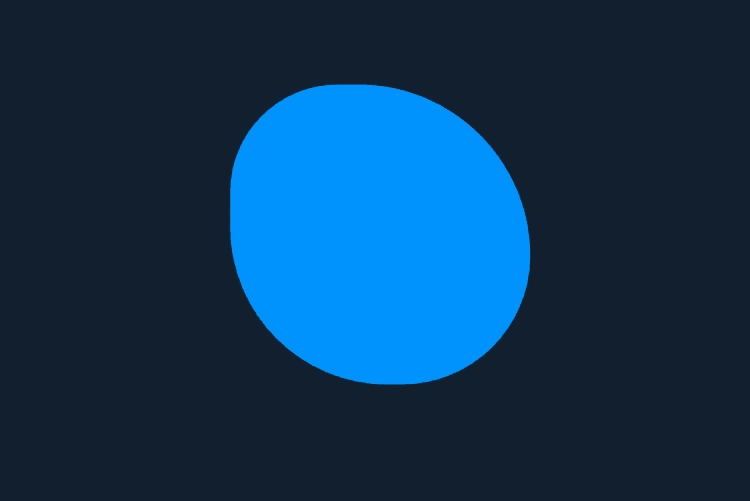
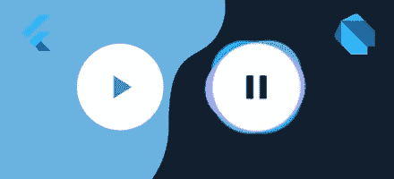

# 颤动教程:音乐按钮动画

> 原文：<https://levelup.gitconnected.com/flutter-tutorial-music-button-animation-744616b14501>

今天，我们将探讨如何使用 Flutter 创建下面的音乐按钮动画，以及如何将其抽象为可重用的`PlayButton`小部件。一个简单的好方法是使用令人敬畏的 [**dartpad.dev**](https://dartpad.dev) 让你在浏览器中运行 flutter 应用。让我们开始吧。

其工作方式是将多个不同颜色的斑点堆叠在一起，并以一个包含按钮的白色圆圈结束。图标本身包含在一个 [**动画开关**](https://api.flutter.dev/flutter/widgets/AnimatedSwitcher-class.html) 小部件中，这个小部件可以在不同的小部件之间切换(默认为淡入淡出)，同时不需要控制器工作。

让我们将我们想要实现的目标分成 3 个步骤:

1.  创建一个无状态的`Blob`小部件
2.  在一个`Stack`中使用`Blob`小部件，这个小部件被包装在我们主要的有状态`PlayButton`小部件中
3.  使用多个`AnimationController`添加缩放和旋转动画

让我们通过创建一个单独的 blob 来进入它。

# Blob 小部件

Blob 将是一个无状态的小部件，并将接受`color`，由于我们将在稍后的动画中旋转和缩放它，我们还将接受一个**旋转**和一个**缩放**值，它们将分别被提供给`Transform.rotate`和`Transform.scale`函数。

创建简单斑点的一种方法是使用`borderRadius`属性，并在所有边上使用不均匀的值。一个很好的形象化的例子可以在[这里](https://9elements.github.io/fancy-border-radius/)找到。

现在，让我们使用我们在新的 Flutter 应用程序中定义的 Blob。

结果是屏幕上出现一个蓝色的斑点。



学习了如何创建一个 blob，我们现在将专注于创建我们的主`PlayButton`小部件，我们将把 blob 堆叠在彼此之上，并包含所有的逻辑。

# 播放按钮部件

这是我们动画的核心部件，将包含按钮和动画状态，因此，必须扩展`StatefulWidget`。

`PlayButton`小部件本身将接受

1.  `initialIsPlaying`无论按钮最初是否正在播放，从外部对其的进一步更改`setState`都不会影响我们的按钮
2.  按钮播放/暂停时使用的`playIcon`、`pauseIcon`图标(默认为 Flutter 自带的`Icons.play_arrow` / `Icons.pause`)
3.  `onPressed` ( ***必选*** )回调通知用户状态变化

我们来剖析一下上面代码的`_PlayButtonState`部分。首先，我们定义我们的状态为:a `bool isPlaying`跟踪按钮播放/暂停，第二部分是应用于我们的`Blob`的`rotation`和`scale`值。稍后，我们将制作这些**旋转**和**缩放**值的动画。

`build`方法使用一个`ConstrainedBox` 来约束我们的按钮的最小高度和宽度，这些约束将让我们的按钮扩展到其父级的大小。继续往下，这是我们创建 Blob 小部件的`Stack`的地方，每个小部件都有不同的旋转乘数，以显示不同的速度和轻微的偏移，以防止开始时完全重叠。`Stack`的最后一个子元素是我们实际的圆形按钮。

`_onToggle`方法是我们更新状态以反映按钮按下的地方。

现在，我们将替换我们的应用程序主体`Blob`来使用下面的`PlayButton`小部件，并查看结果。

```
PlayButton(
 pauseIcon: Icon(Icons.pause, color: Colors.black, size: 90),
 playIcon: Icon(Icons.play_arrow, color: Colors.black, size: 90),
 onPressed: () {},
),
```

现在，我们缺少的只是动画。太好了！好戏开始了。

# 动画

除了使用内置的 [**隐式动画**](https://flutter.dev/docs/development/ui/animations/implicit-animations) 之外，在 flutter 中添加动画的基本模式是首先创建一个`AnimationController`，它需要`SingleTickerProviderStateMixin` mixin ( `TickerProviderStateMixin`用于使用多个控制器)、`addListener`来对有状态小部件执行`setState`操作，从而导致重建。

我们想要的两个动画是:

1.  斑点可见时的无限旋转
2.  按钮按下时发生的音阶转换(向内和向外)

由于我们已经定义了两个`double`值— **旋转**和**缩放**，我们将使用两个`AnimationController`来更新它们。我们需要两个控制器，因为旋转动画的运行独立于仅在`_onToggle`期间发生的缩放过渡。

让我们从向有状态小部件添加两个 AnimationControllers 开始，我们还将添加一些持续时间为两个的常量——每个控制器一个。我们将它们标记为`static const`，因为它们从不改变。

```
static const _kToggleDuration = Duration(milliseconds: 300);    static const _kRotationDuration = Duration(seconds: 5);// rotation and scale animations  
AnimationController _rotationController;  
AnimationController _scaleController;
```

我们需要用`initState`方法初始化控制器。由于**旋转**无限期运行，我们将在`_rotationController`上使用`repeat`方法，这也将立即开始我们的动画。`_scaleController`与此类似，但只会在按下按钮时运行。

```
@override
void initState() {_rotationController = AnimationController(vsync: this, 
duration: _kRotationDuration)
 ..addListener(() => setState(_updateRotation))
 ..repeat(); _scaleController = AnimationController(vsync: this,                                                                                                                                                                                                                  duration: _kToggleDuration)           
 ..addListener(() => setState(_updateScale));

super.initState();}
```

让我们在小部件上定义一些辅助方法来更新我们的**旋转**和**缩放。**基本上，我们是在映射 0..1 我们的控制器的默认范围到我们的属性想要的范围。

```
void _updateRotation() => _rotation = _rotationController.value * 2 * pi; void _updateScale() => _scale = (_scaleController.value * 0.2) + 0.85;
```

旋转现在应该可以独立运行了。现在剩下唯一要做的就是在`_onToggle`内触发尺度转换。让我们更新一下，在点击按钮时开始播放动画，如果已经播放了，就反转播放。

```
void _onToggle() {
    setState(() => isPlaying = !isPlaying); if (_scaleController.isCompleted) {
      _scaleController.reverse();
    } else {
      _scaleController.forward();
    }

    widget.onPressed();
  }
```

瞧啊。

我希望你能从这个例子中有所收获，如果你有任何问题，请随时提问。你可以使用 [dartpad.dev](https://dartpad.dev) 在这里 摆弄这个例子 [**。我跳过了图标淡入淡出过渡部分，但这只是一个简单的例子。**](http://bde67e8d1a295bbf4506ff3863addbab)

Flutter 有一个非常强大的反应式动画系统，可以用来构建精致的 ui。这是整个示例的最终代码。

