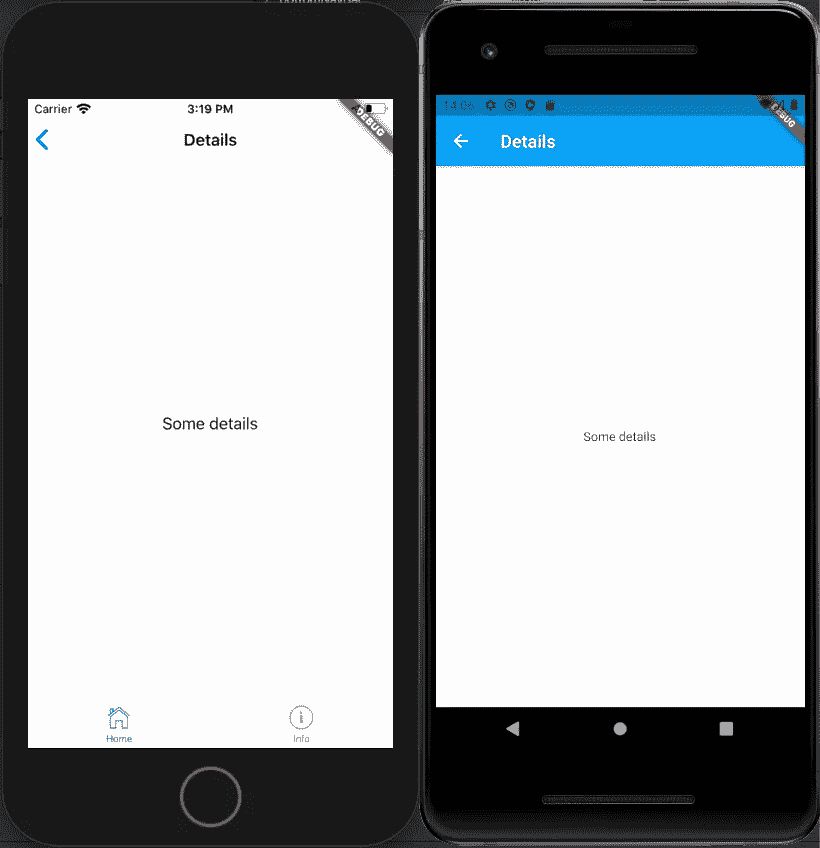

# Flutter:使用平台小部件来采用原生外观和感觉

> 原文：<https://levelup.gitconnected.com/flutter-use-platform-widgets-to-adopt-native-look-feel-c12bec89fffb>

就最终产品质量而言，我不太相信跨平台 UI 会成为现实(顺便说一句，我认为现实可能是 Kotlin 多平台逻辑+原生 UI 层)，如果我们谈论快速原型化和部署，没有人会怀疑像 Flutter 或 React Native 这样的工具确实有效。

尤其是 Flutter，它能帮助你用几行代码就能实现一个好看的材质设计应用。但是一个物质应用不是也永远不会是一个真正的 iOS 应用，所以你需要使用 [Cupertino widgets](https://flutter.dev/docs/development/ui/widgets/cupertino) 复制大量代码。如果有一个包可以使用自适应小部件，那不是很好吗？

## 平台部件

那个包是存在的，而且是`[flutter_platform_widgets](https://pub.dev/packages/flutter_platform_widgets)`。您可以在`pubspec.yaml`文件中轻松安装它:

主要的构建模块是`PlatformWidget`，它是一个小部件，能够感知目标平台的外观。

平台部件包公开了许多有用的自适应部件，所有东西都列在[项目的 read me](https://github.com/stryder-dev/flutter_platform_widgets/blob/master/README.md) 中。

## 将材料应用程序迁移到自适应应用程序

先说一个典型的素材 app，有一个抽屉，app 栏下面有一些内容。

如你所见，这不是 iOS 的正确外观。让我们在内容中使用自适应小部件。

瞧啊！你想要一个更大的旋转器吗？没问题:

让我们试着给应用程序栏一个更自然的外观。

开发技巧:将 PlatformApp 包含在 PlatformProvider 小部件中可能会很有用，以便能够通过 initialPlatform 属性在不同的环境中强制使用平台。

如你所见，我们在 iOS 中丢失了抽屉。那是因为`CupertinoApp`不支持，所以必须指示`PlatformScaffold`在物质环境中继续使用。这是正确的，因为苹果不鼓励汉堡菜单反模式。相反，您希望有一个标签栏。

然后…什么也没发生！平台小部件包忽略了此属性。显然它是故意这样做的:

> 这个库的目的是在 ios 和 android 之间提供一个类似的接口。
> —[https://github . com/stry der-dev/flutter _ platform _ widgets/issues/72 # issue comment-531204229](https://github.com/stryder-dev/flutter_platform_widgets/issues/72#issuecomment-531204229)

## 使用不同的范例

所以我们要直接用`PlatformWidget`来达到想要的结果。

`MaterialLayout`是一个小型无状态小部件，用于封装素材布局:

请注意，我并没有在这里定义一个应用程序栏，而是委托给`AppContent`小部件中的真实页面。如果我处理抽屉选择，这个小部件的复杂性会增加。

`TabbedLayout`有点复杂，因为为 Cupertino 范式定义了选项卡栏:

请注意特定于平台的图标的用法，并且每个选项卡都描述了一个独立的导航器，即使用户在选项卡之间切换，导航器也会保留导航堆栈。

`AppContent` widget 现在输出一个`PlatformScaffold`，带有 UI 的公共部分:

## 导航到第二个屏幕

支持开箱即用的导航。您只需在`Navigator.push()`调用中使用`platformPageRoute()`:

`Details`是一个简单的无状态小部件，它构建了一个`PlatformScaffold`:

## 主题

您还可以指定不同的应用程序级主题:

然后你可以调整一些特定的颜色，层次更深。例如，禁用的选项卡颜色不可读:

 [## 编写面试问题

### 一个完整的平台，在这里我会教你找到下一份工作所需的一切，以及…

技术开发](https://skilled.dev)