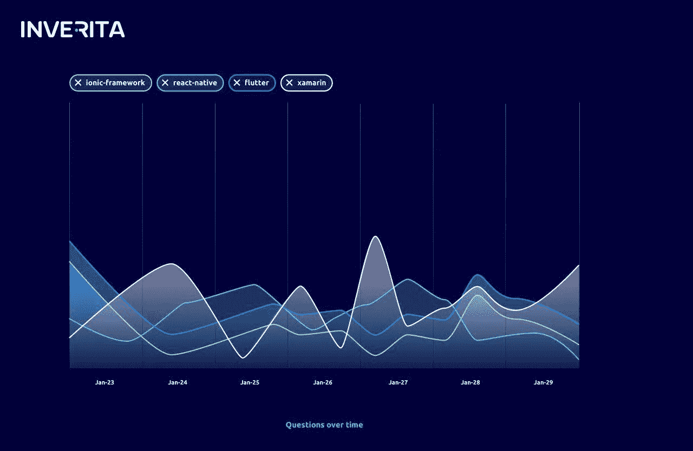
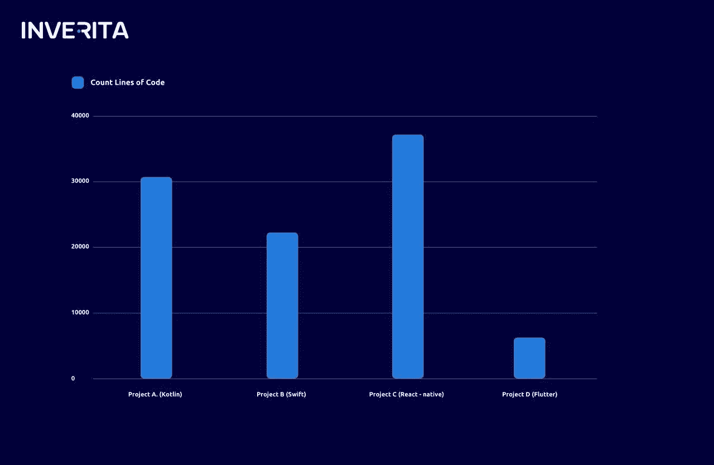
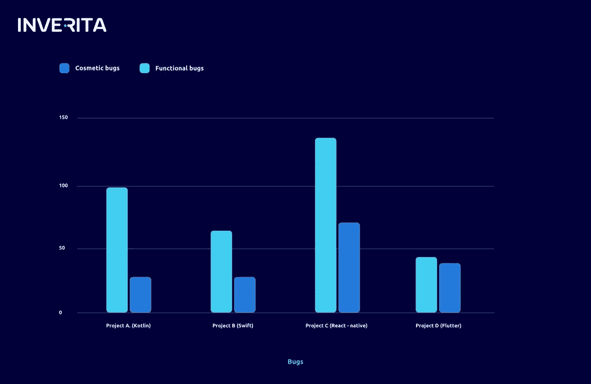

# 面向移动开发的 Flutter vs Native vs React Native:选择什么？

> 原文：<https://levelup.gitconnected.com/flutter-vs-native-vs-react-native-mobile-development-what-to-choose-fe3bc59910bc>

Flutter 是谷歌的移动应用 SDK，用于使用单一代码库为 iOS 和 Android 制作高质量的原生界面。Flutter 将帮助您创建漂亮、快速的应用程序，具有高效、可扩展和开放的开发模型。

InVerita 一直努力创新，紧跟前沿技术。自 2018 年春天以来，我们的技术专家一直在关注公开测试版的 Flutter。我们体验过使用跨平台解决方案，如 React Native、PWA 和 Xamarin。如果我们将它们与 Flutter 进行比较，我们会说，“它太美了！”

如果你想了解一下 Flutter 的技术优势，可以看下面:[Flutter 有什么革命性的](https://hackernoon.com/whats-revolutionary-about-flutter-946915b09514)。在这篇博客中，我们将描述 Flutter 的商业优势。

# 这是一个跨平台移动应用的解决方案

为一个移动平台发布产品是有风险的。最好的选择是为 iOS 和 Android 开发一个应用程序，最终让它面向更广泛的受众。选择原生开发，你面临着在 [Android](https://inveritasoft.com/technologies/android) 和 [iOS](https://inveritasoft.com/technologies/ios) 之间选择的两难境地。

一方面，你可以用一个 iOS 应用程序赚更多的钱。另一方面，Android 应用更常见。这似乎是一种平衡，但情况会保持不变吗？

Flutter 通过允许 Android、IOS、Web 和桌面使用相同的代码库解决了任何困境。在跨平台解决方案上下赌注将在未来使你受益。

# 支持当前项目

我使用 Swift、Kotlin、Scala 和 Typescript 的经验让我发现了所有原生开发的缺点，尤其是那些与代码可读性相关的缺点。太多的“语法糖”会使代码语义复杂化。

程序员花 80%的时间阅读代码，只花 20%的时间编写代码。如果是我支持的项目，阅读可以占全部时间的 90%左右。Flutter 应用程序是用 Dart 编写的。长话短说，Dart 是 JavaScript、C#和 Java 的混合体。如果您至少有使用这些语言中的一种的经验，那么用 Dart 编码将没有任何困难。

# 定制设计

项目的成功很大程度上取决于设计师的工作。如果说守门员是一个团队的一半，那么设计师就是一个 app 项目实施过程中的守门员。我崇拜乔纳森·伊夫创造的设计，相信苹果的成功在他身上。Flutter 允许实现任何复杂程度的设计，轻松创建屏幕之间的动画过渡或添加阴影。

# 技术债务问题

这个框架本身是作为一个实验而创建的，目的是看看如果一个应用程序界面以不同的方式构建会发生什么。任何技术的目标都是解决某一时期出现的问题。操作系统要求已经改变，因此您不能使用过时的技术来解决当前的问题。创造解决当前问题的新方案比使用行不通的旧方案更明智。

# 开源解决方案

[Flutter](https://inveritasoft.com/technologies/flutter) 由于开源软件，是一个值得信赖的框架。使用 Flutter 的人越多，他们就能越快发现所有的错误，从而让开发人员快速找到完美的解决方案。社区节省了开发时间。

根据 StackOverflow 的统计，Flutter 是替代技术中的佼佼者。

# 颤振与替代解决方案

让我们比较 4 个使用不同技术开发的项目。

*   项目 A——一家物流公司的移动应用程序(Android/Kotlin)。
*   项目 B —旅行社的移动应用程序(IOS/Swift)。
*   项目 C —旅行社的移动应用程序(React-Native)。
*   项目 D——诊所网络软件(Flutter/IOS+Android)。

Flutter 使得使用更少的代码并保持相同的功能成为可能。

与反应式原生应用程序相比，修饰性错误的数量减少了 4 倍，与原生应用程序相比减少了 2 倍。功能缺陷的数量没有减少。

# 包裹

在我们公司，我们对不同种类的“银弹”持怀疑态度。我们必须相信，我们使用的技术将使我们和我们的客户受益。这必须是一个长期的好处，而不是一个短期的好处，之后会有一个艰难的“后遗症”。考虑到 IT 发展的研究成果和前景，押注于 Flutter 很有可能是正确的决定。

作为一名 5 年的原生 Android 开发人员，我对“缓慢和限制性”的跨平台解决方案持怀疑态度，我必须承认，未来属于 Flutter。

如果您对跨平台解决方案感兴趣，请[联系 inVerita](https://inveritasoft.com/contact) ，我们将为您的项目提供一些有价值的建议！

**作者**:Nazar Cybulskij—Flutter team-lead @[inVerita](https://inveritasoft.com/)

*原载于 2019 年 10 月 31 日*[*inveritasoft.com*](https://inveritasoft.com/blog/flutter-vs-native-vs-react-native-mobile-development-what-to-choose)