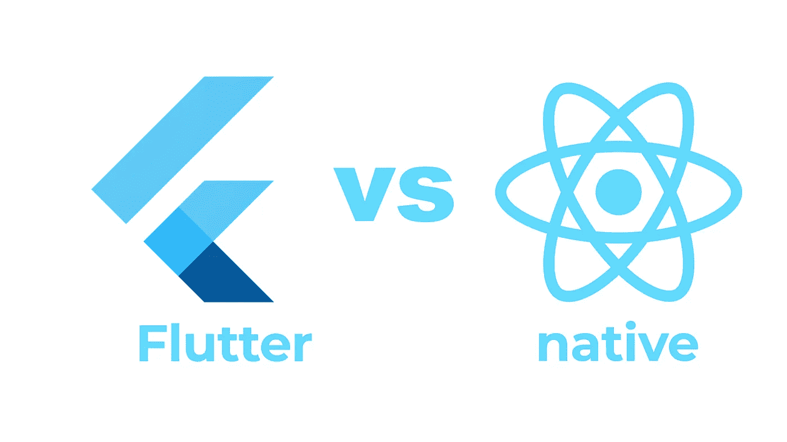
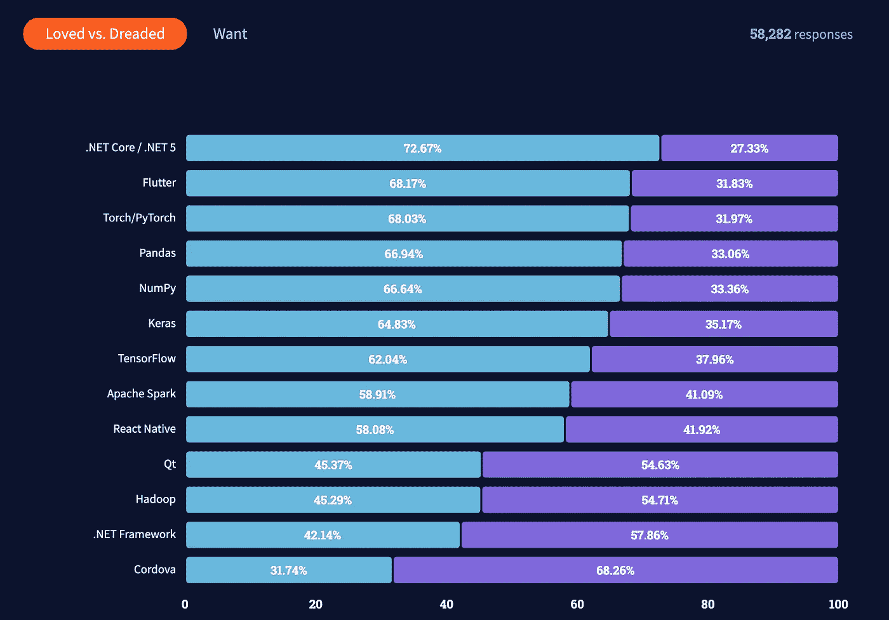

# 颤动 vs 自然反应

> 原文：<https://levelup.gitconnected.com/flutter-vs-react-native-2e29e9a919e7>

## 颤振与自然反应的共同点和不同点

Flutter 和 React Native 的区别、优点和缺点是什么？React Native 和 React JS 有很多共同点，但是 Flutter 和有自己的独到之处。特别是，我们将仔细研究 Dart，Flutter 的编程语言。

我的目标是让您更好地理解这两种解决方案。这种比较有什么意义？旋舞和反应土人都试图回答的问题是什么？

你有没有想过要开发一个 app？对于一些开发者来说，iOS 和 Android 应用商店是赚大钱的地方。如果你有一个伟大的想法，你可能会想知道实现这个想法的最佳方式？

您可能决定创建一个 web 应用程序……但是在移动设备上的性能不是很好。你可能想走当地人的路线。但这意味着要用两种不同的语言为 Android 和 iOS 编写两次代码。

还有第三种解决方案。对我来说，如果你没有一个大的团队或非常具体的需求，这是唯一有效的方法。

这个解决方案是使用软件开发工具包。这些 SDK 提供了一个通用的抽象层，允许相同的代码在 iOS 或 Android 上运行。

有几种这样的解决方案。我是 Solar2D 的粉丝，因为我创造了 2D 手机游戏。但是对于通用应用程序，有两个主要的竞争者。使用它们，应用程序开发与 web 开发并没有什么不同。

这两种解决方案是固有的。

在研究这个问题时，让我震惊的是这种比较是如何相似的(在某些方面！)有角和有反应之间的那个。在其他方面，这种对立是完全不同的。

我这么说是什么意思？

# 共享功能

嗯，首先，旋舞和 React Native 分享了 Angular 和 React 的一些共同点。

Angular，React JS，Flutter 和 React Native 都是命令式和反应式。这是什么意思？

在每个解决方案中，函数都采用一个状态，并使用它来呈现用户界面或 UI。(也就是说:它们是反应性的)。

当编码渲染时，我们只关心 UI 的最终结果。render 函数忽略或丢弃 UI 的初始状态。(也就是说:他们势在必行)。

(jQuery 是非命令式/声明式编码的一个例子。jQuery 主要是检索和修改 UI 的当前状态。)

具有渲染功能的对象是组件，即应用程序的构建块。(在 Flutter 中，我们称之为小部件。在 Flutter 中，一切都是小部件)。

这些是共有的特征。我们也有共同的差异。一边是 React (Native 和 JS)，另一边是 Flutter 和 Angular。

# 共同的对立

React JS 提供了一个集中的作用域，而 Angular 提供了广泛的特性。

React Native 专注于一个简单的核心，它遵循做一件事并把它做好的 Unix 哲学。Flutter 提供了广泛的功能。

例如，颤振和角手柄平移或布线。React (JS 和 Native)需要外部库。

另一个例子:React Native 总共提供了 25 个组件。这些封面块、文本、图像、列表、滚动…

然而，Flutter 只为动画提供了 21 种不同的组件。和 3 个不同的小部件来处理可访问性方面。诸如此类。

这一丰富的面向移动设备的特定组件库并没有反映在 Angular 中。在这里，React Native 和 Flutter 之间的比较有了自己的生命。

Flutter 和 React Native 有哪些具体的对立？

# 第一个具体区别:镖

第一个特别的区别是编程语言。与 Angular、React JS 和 React Native 不同，Flutter 使用 Dart。它是谷歌发明的一种编程语言。据我所知，除了 Flutter，它没有其他主要的流行用例。

那么，什么是 Dart，它的目标是什么？

Dart 与 JavaScript 共享许多语法。如果你会说 JavaScript，你可以读懂 90%的 Dart。

变量声明，“for”循环，“if”和“while”，可以从 JavaScript 复制/粘贴到 Dart。

Dart 中的类声明类似于 JavaScript 或 TypeScript。

像 TypeScript 一样，Dart 具有强大的静态类型，允许编译成 JavaScript。

那么 JavaScript 和 Dart 之间 10%的差异有什么意义呢？

TypeScript 的开发人员决定让 TypeScript 成为 JavaScript 的超集。换句话说，JavaScript 代码是有效的类型脚本代码。

这意味着 TypeScript 提供的改进是可选的。TypeScript 的第一个存在理由是“移植”到 JavaScript，所以这是有意义的。

TypeScript 的第二个目的是添加约束。这可以捕捉错误类型的变量并减少错误。

Dart 采用了同样的想法，并将其进一步推广。Dart 能够做到这一点是因为这种语言有不同的目的。它不一定是 JavaScript 的超集，所以它可以修复该语言的一些弱点。

我这么说是什么意思，Dart 的目的是什么？

Dart 的目标是以尽可能干净的方式为移动设备编译代码。

这就导致了一些意想不到的行为，剩下的 10%我上面提到了。我和一个“const”纠结了几个小时，因为我期望它像 JavaScript 一样运行。

在 Dart 中,“const”本质上必须是常量。它必须在每次程序启动时具有相同的值。

在 React 中，我们可以将“useState”钩子的返回声明为 const，在 JS 中，我们可以将当前时间戳赋给一个 const。在 Dart 中，这将失败:

const date =新的 DateTime.now()

在 Dart 中，此声明无效:日期本质上不是常数。这是有道理的。只是当你习惯了 JavaScript 的时候，会有些出乎意料。

Dart 和 JavaScript 还有其他不同之处。但是它们超出了本文的范围。如果你想让我进一步探索这个问题，请在评论中告诉我。

Flutter 和 React Native 还有什么区别？

# 第二个具体区别:本机小部件与特定小部件

第二个区别是每个解决方案如何在屏幕上绘制界面。颤动和反应会选择完全不同的策略。

React Native 将渲染的界面外包给原生 iOS 或 Android 组件。该解决方案确保最终结果符合每个操作系统的特定理念。它还确保渲染尽可能简单。

Flutter 使用名为 Skia 的 2D 渲染引擎。这个库也用于 Chrome 和 Firefox 以及 Android。我会让你计算有多少用户在运行这个库，我们就用“lots”吧。这包括这里超过 75%的读者。

简而言之，这种选择让 Flutter 在屏幕上拥有了 React Native 无法企及的灵活性。

# 第三个具体区别:性能问题

第三个大的不同是上面提到的架构选择的结果。

在 Flutter 中，Dart 代码和 Skia 库被编译成一个 iOS 或 Android 二进制文件。在反应本地的事情有点复杂。

React Native 有一个运行 JavaScript 的轻量级虚拟机(或 VM)。该虚拟机与应用程序的本机核心进行通信。

这不是一个混合解决方案(如 Cordova 或 Ionic ),其中应用程序捆绑了浏览器。运行 JavaScript 的 VM 在本地应用程序本身中。这样效率更高。

React Native 产生完全原生的应用程序。(名字里有线索)。

但是 React Native 确实有降低性能的风险。这是由于 JavaScript VM 和本机核心之间的通信。但这并不是必然的结果，这种差异往往是难以察觉的。

# 最后一个重要的区别是

最后一点需要解决。

React JS 受欢迎的一点是它比 Angular 受欢迎。

这部分是因为 React JS 在这种情况下是一个从 Angular 的错误中吸取教训的新来者。

但是对于颤振，这种情况是相反的。Stack Overflow 的 2021 年开发者调查显示，该公司位列第二。React Native 排名第九。

谷歌趋势讲述了一个相似的故事。

当我们比较颤动和自然反应时，我们看到位置颠倒。React Native 在 2018 年大受欢迎，但今天 Flutter 领先了。

那么，这一切对今天的我们意味着什么呢？

从 React 和 Angular 之间的比较中得出的一些结论适用，而一些则不适用。

例如，与 Angular 一样，Flutter 学习起来更复杂。有更多的东西要学，提供更多的服务。还有很多小部件。Flutter 也比较难学，因为它依赖 Dart。

另一方面，React Native 复制了 React JS 的机制。精神习惯是可以改变的。如果你有 React JS 的经验，React Native 比 Flutter 容易学得多。这使得 React Native 成为简单的解决方案。

但是如果 Flutter 学习起来更复杂，它也更强大，更通用。

对我来说，Angular 是确定和稳定的，React 是令人兴奋和具有破坏性的，而 Flutter 则相反。

反应本土是最简单的方法。它符合每个平台的标准。而 Flutter 是令人兴奋和颠覆性的解决方案，允许新的和令人兴奋的事情。

所以你的选择将取决于你是谁，你想做什么。如果你想要的东西不需要太多的精神努力，并且你不介意更少的自由，那么 React Native 就是你要走的路。

但是，如果你想投入时间和精力，并走得更远，我会推荐 Flutter。