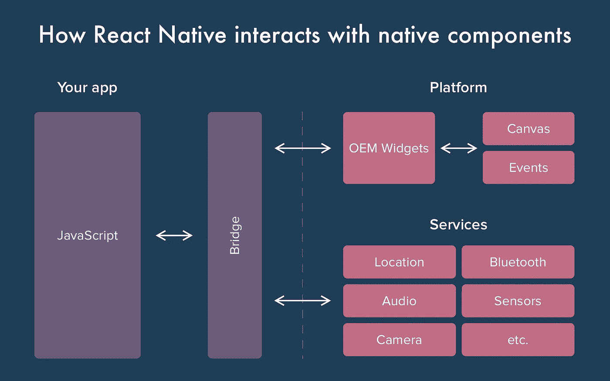
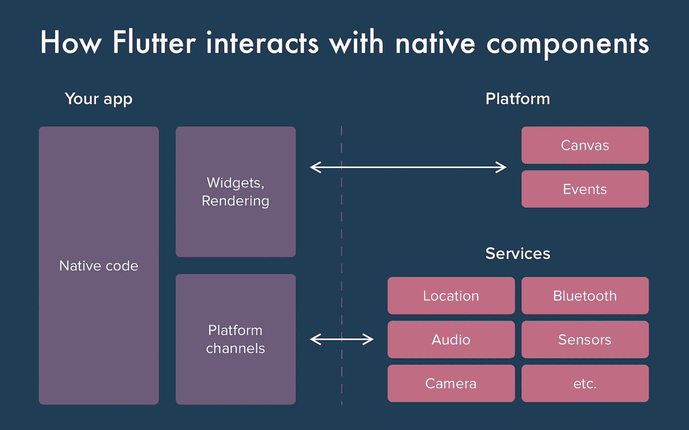
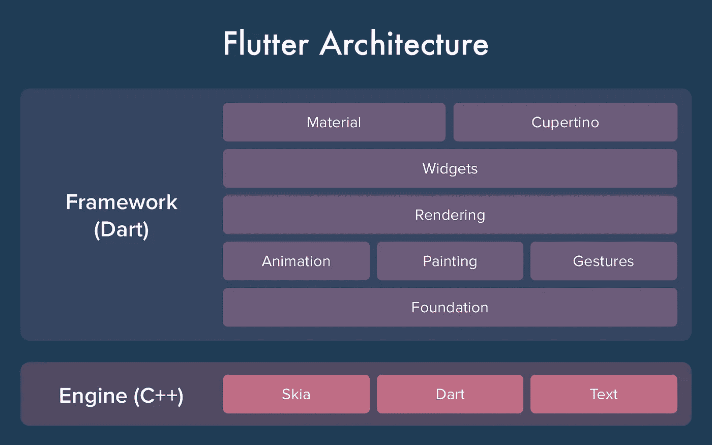

# flutter vs . React Native——比较每个框架的特性

> 原文：<https://levelup.gitconnected.com/flutter-vs-react-native-comparing-the-features-of-each-framework-f61bfd146a90>

同时为两个移动平台开发一个代码库既经济又方便。在 Flutter 或 React Native 等工具的帮助下，开发人员可以构建跨平台的应用程序。但是，有一个问题——用哪个框架比较好？我们已经创建了一个全面的指南，通过在多个方面比较这些框架来获得答案。

# 反应原生与颤动:生产力

最重要的因素之一是使用每个框架的便利性和开发人员的体验。为了评估每个框架的生产力，我们选择了五个标准。

*   **热重装支持**。当代码发生变化时，此功能会自动重新启动应用程序。此外，它保留了应用程序的前一阶段。React Native 和 Flutter 都支持这个特性。据开发人员称，这一功能使开发过程更加容易，并节省了时间。
*   **代码结构**。代码结构有很大的不同。首先，Flutter 的模板和数据在整个代码中没有分离。它利用 Dart 编程语言。此外，在 Flutter 中创建的 UI 布局不需要任何其他模板语言或可视化工具。这些过程节省了时间。React Native 将结构决策留给了开发人员，这是一个需要考虑的权衡。
*   **安装配置**。颤振是非常简单的安装和立即开始使用。此外，颤振医生协助解决系统问题。React Native 拥有帮助创建新应用程序的工具，并提供开发所必需的库。此外，这些将为代码提供一些结构。创建新的 React 原生应用最流行的工具是 Expo 和 Create React 原生应用。
*   **支持的 ide**。Flutter 支持的 ide 比较少，比如 IntelliJ IDEA，Android Studio，VS Code。另一方面，React Native 集成了许多 ide，所以很难选择使用哪一个。
*   **硬件专用 API** 。React Native 提供地理定位和 Wi-Fi 编程接口。此外，还有蓝牙、摄像头、生物识别和 NFC 选项。使用可定制图形进行绘制的解决方案并不多，只能借助本机代码来实现。对于 Flutter，现在正在构建许多特定于硬件的 API。因此，目前提出索赔颇具挑战性。Flutter 的成功取决于特定于硬件的 API 的质量。

# 反应原生和颤动:编程语言

React Native 使用 JavaScript 和 JSX 语法来构建视图。JavaScript 既可以用于移动开发，也可以用于 web 编程。此外，开发人员可以选择 Node.js 进行后端开发。它允许我们对堆栈的所有部分使用一种语言。

Flutter 利用了 Dart 编程语言。这种语言不像 JS 那样流行，但是 Google 使用并推广它。Dart 为本地和 React 本地开发人员提供了一个渐进的学习曲线。

# 反应原生与颤动:文档

Google 通常提供强大且结构良好的文档。当然，Flutter UI 框架也不例外。这里是颤振的[文档。](https://api.flutter.dev/)

另一方面，React Native 给用户提供的[文档](http://facebook.github.io/react-native/docs/getting-started.html)很差。有许多反应原生用户。然而，非结构化指南仍然是一个显著的缺点。

当然，Flutter 是一个新的框架，但是切换到它是非常容易的。Dart 语言类似于 Kotlin、Java 等等。所以，懂那些编程语言的开发者可以毫无障碍的开始使用 Dart。

# 颤振和反应原生:性能

让我们比较一下 React Native 和颤振性能。React Native 需要一个 JavaScript 桥来与本地元素交互。与 JavaScript 相比，Flutter 的 Dart 编程语言编译代码的速度更快。因此，它可以以 60 fps 的标准显示动画。

我们还需要讨论 React Native 的架构。它由两个主要部分组成:JavaScript 语言和原生。一开始，它只使用 JS。然而，为了与设备交互(例如通知)，有必要利用桥。它帮助将 JavaScript 变量转换为本机变量。

因此，React Native 是一项功能强大但速度缓慢的技术。动画速度上可见一斑。例如，您需要 60 fps 来拖放动画。但是 React Native 不能提供这种 fps 级别，因为需要将 JavaScript 转换为本机代码。

至于 Flutter，它不需要桥来与任何 OS 组件交互。这个框架可以最大限度地减少与它们的交互，因为 Flutter 可以在 Skia 引擎的帮助下解决很多问题。除了 Dart 编程语言，Flutter 还利用了 C++。因此，该应用程序提供了高 fps。

总结这一部分，React Native 和 Flutter 的性能对比是:

*   Flutter =本地实时应用
*   React Native = Native app 通过 Javascript 和 React

# 反应本机与颤振:用户界面组件

Flutter 最显著的优势之一是有机会利用它的 UI 组件，而不是操作系统的原生组件。因此，提供定制的 UI 组件和提高灵活性要容易得多。

有这样一些飘动的 UI 元素:

*   为 Android 提供了材料小部件。
*   Cupertino 面向 iOS 提供。
*   独立于平台的小部件。

使用 Flutter 的小部件，可以实现与 OS 组件以及原生屏幕的高度兼容。然而，对于 iOS 应用程序开发，例如 iOS 风格的表单组件，仍然需要 Cupertino 库。

另一方面，开发人员可以获得更加个性化的用户体验，因为 React 原生 UI 库非常广泛。

# 反应原生与颤动:社区

React Native 于 2015 年推出，Flutter 于 2017 年才发布。因此，在 React Native 的帮助下开发了许多流行的移动应用程序，如脸书、Skype、Instagram 等。此外，与 Flutter 相比，React Native 拥有更多用户。然而，Flutter 正在迅速流行起来。

让我们快速浏览一些统计数据。

*   Flutter 有[72675](https://github.com/flutter/flutter)GitHub 星，React Native 有[80034](https://github.com/facebook/react-native)(2019 年 8 月)。
*   根据 [Statista](https://www.statista.com/statistics/793843/worldwide-developer-survey-most-wanted-framework/) 的统计，React Native 是开发者第三大热门工具。截至 2019 年初，Flutter 排名第 6。
*   React Native 有[56808](https://stackoverflow.com/questions/tagged/react-native)栈溢出问题。Flutter 在[21357](https://stackoverflow.com/questions/tagged/flutter)题中被打上标签(2019 年 8 月)。

与前一年相比，颤振有了明显的增加。例如，Flutter 在 2018 年 5 月拥有 25，223 颗 GitHub 星。因此，恒星的数量大约增长了三倍。

Flutter 是一个比较新的工具，可以给移动应用开发带来很多好处。它甚至有可能变得比本土反应更广泛。

谷歌倾向于创造功能性工具，并投资于它们的推广。科特林就是最好的例子之一。它有可理解和深入的文档，使得开始使用这种编程进行 Android 开发变得容易。

# 结论

综上所述，Flutter UI 框架可以成为替代 React Native 进行混合移动应用开发的绝佳选择。因此，最好跟踪这项技术。

Flutter 为开发人员提供了所有必要的库，因此他们不必寻找第三方库。因为 Flutter 和 React Native 倾向于使用声明式编程，所以 React 工程师切换到 Flutter 框架会很容易和舒服。然而，许多 React 原生粉丝并不希望使用一个未知的工具。

当选择移动或[网络开发栈](https://www.cleveroad.com/blog/web-development-stacks)时，总是由你来决定使用什么强大的技术。你的选择将取决于你的目标和要求。