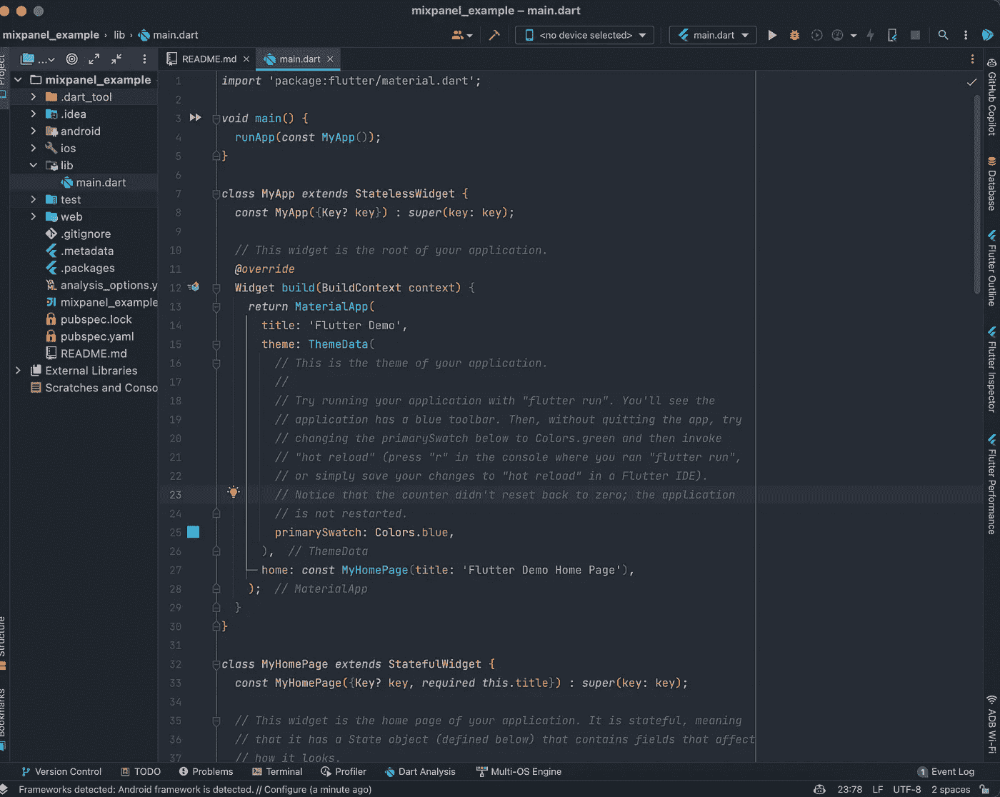
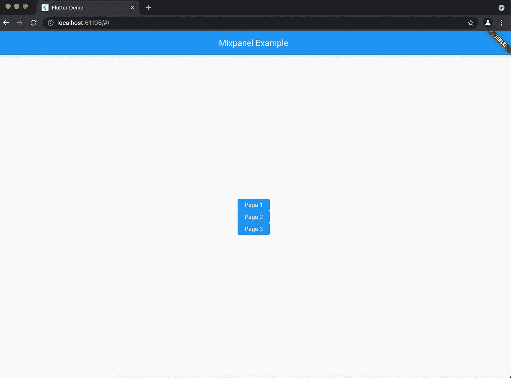
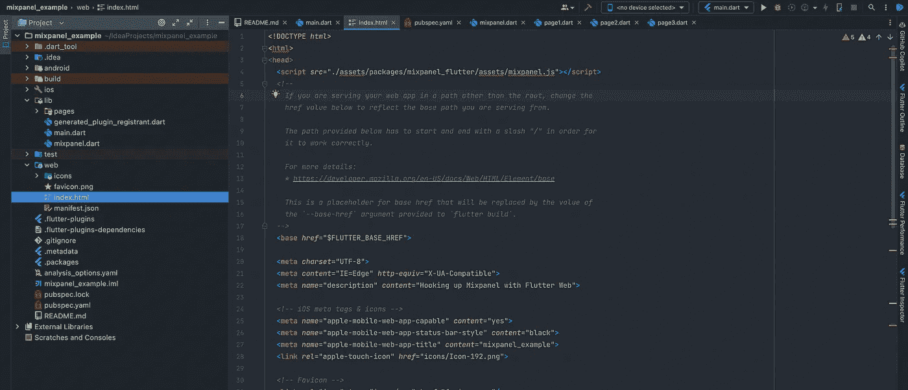

# 颤动网和混合面板

> 原文：<https://levelup.gitconnected.com/flutter-web-mixpanel-6046ffb664fb>

将颤振腹板与 Mixpanel 事件联系起来


MixPanel 于 2021 年 12 月 3 日发布了颤振腹板支持:

[](https://github.com/mixpanel/mixpanel-flutter) [## GitHub-mixpanel/Mixpanel-Flutter:用于 Mixpanel 分析的官方颤振跟踪库

### 欢迎来到官方 Mixpanel Flutter SDK。Mixpanel Flutter SDK 是一个开源项目，我们希望看到…

github.com](https://github.com/mixpanel/mixpanel-flutter) 

利用这些信息，我们将把 Mixpanel 和 Flutter Web 连接起来。值得注意的一件很酷的事情；Flutter Web 支持也适用于移动版本——谈论一下同时做两件事！

我们将从头开始做这件事，但是我将假设你在开始本教程之前至少知道如何安装 flutter 并让它工作。如果你还没有……查看一下 [Flutter 网站](https://flutter.dev/),让它运行起来，一旦你完成了就回来这里！

此外，我将使用 IntelliJ 作为我的 IDE 选择，但你可以随意使用。

**说到这里……让我们开始吧！**

1.  开始一个空白的 Flutter 项目，想怎么叫就怎么叫。确保您启用了 web！


使用 IntelliJ 设置项目。



标准锅炉板与开始一个新的颤振项目。

2.清理锅炉板！我们将删除所有的评论和旧的计数器应用程序代码！


清理了锅炉板！

3.我们将在 lib 文件夹中创建 3 个单独的页面。这一步将帮助我们在后面的步骤中展示 Mixpanel 的威力！所以让我们做些准备。每个页面将包含非常通用的代码，以保持这个超级简单。


创建我们的页面(目录)和 3 个单独的文件，第 1 页，第 2 页和第 3 页


这是通用代码，我们没有每个新页面。它们都是无状态的，与文件同名。

4.创建到我们每个普通页面的导航路线。我们很快将通过 MixPanel 用这些路径演示页面中的事件！


我们为基础应用程序创建了路线。

5.我们准备步骤的最后一部分，我们将在所有页面中创建基本按钮，以便在它们之间进行路由！

下面是代码的要点——您可以复制和粘贴！将此应用于所有(4)页面—主页、第 1 页、第 2 页和第 3 页。请确保调整代码以匹配要粘贴的页面。

```
// Make sure you change the route names and titles according to the page you are copying and pasting this code to!*return* Scaffold(
  appBar: AppBar(
    title: *const* Text('Mixpanel Example'),
  ),
  body: Center(
    child: Column(
      mainAxisAlignment: MainAxisAlignment.center,
      children: <Widget>[
        ElevatedButton(
          child: *const* Text('Page 1'),
          onPressed: () {
            Navigator.pushNamed(context, '/1');
          },
        ),
        ElevatedButton(
          child: *const* Text('Page 2'),
          onPressed: () {
            Navigator.pushNamed(context, '/2');
          },
        ),
        ElevatedButton(
          child: *const* Text('Page 3'),
          onPressed: () {
            Navigator.pushNamed(context, '/3');
          },
        ),
      ],
    ),
  ),
);
```


复制并粘贴上面的代码示例。这是我们应用程序的第 1 页。



基本的 web 应用程序。它不漂亮，但也不是故意的！这是我们为网络路线做的基本准备。

6.设置 mixpanel_flutter 包！现在我们已经做好了准备——让我们把 mixpanel 包下载到我们的 pubspec.yaml 上。

[](https://pub.dev/packages/mixpanel_flutter) [## mixpanel_flutter | Flutter 包

### 欢迎来到官方 Mixpanel Flutter SDK。Mixpanel Flutter SDK 是一个开源项目，我们希望看到…

公共开发](https://pub.dev/packages/mixpanel_flutter) 

转到“安装”选项卡，找到 flutter_mixpanel 依赖项。


回到应用程序，进入你的 pubspec.yaml 文件。将依赖项粘贴到 cupertino_icons 依赖项下，并运行 Pub get。

7.在网站上启动一个 Mixpanel 项目，并找到你的项目令牌。

[https://mixpanel.com/](https://mixpanel.com/)


在 mixpanel 上创建一个项目将允许你访问项目令牌。这位于项目中的设置下。

8.现在你已经知道了 Mixpanel 项目的令牌，让我们在项目中使用它吧！首先，我们需要创建一个自定义类，在 main()函数上初始化它。(比听起来容易)。


让我们创建另一个文件:mixpanel.dart。这个文件将包含我们新的未来 initMixpanel。

```
*import* 'package:mixpanel_flutter/mixpanel_flutter.dart';

Future initMixpanel(String message) *async* {
  Mixpanel mixpanel;
  mixpanel = *await* Mixpanel.init('mixpanel_project_token', optOutTrackingDefault: *false*);

  mixpanel.track(message);
}
```

分解如下:

> a.我们正在导入新的包*“mixpanel _ flutter”*
> 
> b.我们创建了一个名为 initMixpanel 的新未来，它需要一个名为“message”的字符串。我们使用这个字符串来调用另一个名为 mixpanel.track 的 mixpanel 方法。
> 
> c.然后我们要调用 mixpanel 令牌函数，这样无论何时调用这个类，我们都可以初始化我们的 Mixpanel。
> 
> d.最后，在这个阶级内部；我们调用 mixpanel.track。这将从我们的应用程序触发一个事件到 mixpanel！使用我们需要的字符串消息——我们可以指定我们想要在 mixpanel 上显示什么。

9.在我们的主应用上初始化我们的 mixpanel 类。将这一点包括在内也很重要:

```
WidgetsFlutterBinding.ensureInitialized();
```


在我们的 main.dart 中，我们将在主类中调用我们的新类“initMixpanel ”!首先确保它是异步的。

10.我们 Mixpanel 调用的最终设置！在我们的 index.html 中运行脚本。

```
<script *src*="./assets/packages/mixpanel_flutter/assets/mixpanel.js"></script>
```



位于我们的网站-index.html，添加上面的 mixpanel 脚本。

11.测试一下！执行热重启，然后查看 Mixpanel 事件的结果！


新重启的 App！


因为我们在应用程序启动时初始化了我们的类——只要我们的 main()被触发，它就会出现在这里！

12.每当我们想看到一个事件时，调用 initMixpanel 类。


我们所需要做的就是用所需的字符串调用 initMixpanel 类，它会在树重建时出现！


这些是我们从 initMixpanel 类中创建的新捕获的事件！

这结束了我们的颤振网络与 Mixpanel 教程！

从这里可以做几件事情，例如环境特定的触发器，隐藏令牌和 api 信息的正确方法，当按钮被按下时触发事件等等！

一定要检查 Mixpanel 文档，看看你还能做什么！

我希望这篇教程对你的帮助和对我的一样多！

干杯，