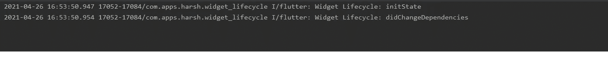
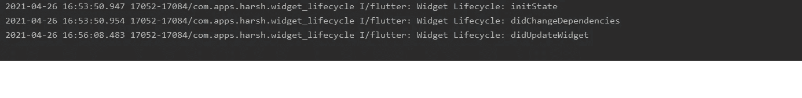
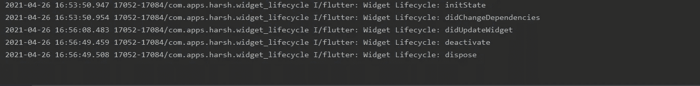

# Flutter 小部件生命周期

> 原文：<https://levelup.gitconnected.com/flutter-widget-lifecycle-33cb67459d0>

## 在 Flutter 中探索小部件生命周期方法

Flutter 小部件生命周期

像应用程序生命周期一样，flutter 中的小部件也有与之相关的生命周期方法。在本文中，我们将看看 flutter 中的小部件生命周期方法。

如果你正在寻找 Flutter 应用程序生命周期的方法，请查看这篇文章:

 [## 颤振中的应用生命周期

### 探索具有可重用逻辑的应用生命周期方法

levelup.gitconnected.com](/app-lifecycle-in-flutter-e4ba686d16fe) 

# 小部件生命周期方法

Flutter 中的小部件有以下相关的生命周期方法:

*   initState: 当这个对象被插入到树中时，这个方法被调用。这将对每个状态对象调用一次。这里我们可以初始化小部件所需的变量，比如 *AnimationController* 。
*   **build:** 每次重新构建小部件时都会调用这个方法。这可以在调用 *initState* 、 *didChangeDependencies、diddupdatewidget*之后，或者通过调用 *setState 来改变状态。*
*   **didChangeDependencies:** 在 *initState* 之后，当状态对象的依赖关系通过 InheritedWidget 改变时，立即调用该方法。
*   **didUpdateWidget:** 每当小部件配置发生变化时，就会调用这个方法。一个典型的例子是当一个父部件通过构造函数传递一些变量给子部件。
*   **停用:**当对象从树中移除时，调用该方法。
*   **dispose:** 当这个对象从树中永久移除时，这个方法被调用。这里我们应该释放这个对象保留的任何资源，比如停止动画。调用该方法的一个例子是使用导航器的 *pushReplacement()* 用一个新的小部件替换当前的小部件。

让我们借助一个简单的例子来更好地理解它。

# 履行

让我们首先设置项目，这样我们就可以更多地关注小部件生命周期方面。

使用以下代码在`main.dart`文件中创建一个新的有状态小部件`MyApp`:

这里我们创建一个整型变量`counter`，初始值设为 0。我们还有`resetCounter()`，它将值重置为 0。我们把柜台递给`MyHomePage`。这里没什么特别的。

让我们继续创建一条新路线`ExamplePage`。这只是为了让我们可以看到`deactivate`和`dispose`的动作。

向其中添加以下代码:

我希望代码是不言自明的。让我们进入主要部分。

用一个整数`counter`和一个最终函数`onPress`创建一个新的有状态小部件`MyHomePage`。还要加上`AnimationController`需要的`SingleTickerProviderStateMixin`。添加一个私有方法`_incrementCounter`，它将计数器的值增加 1。代码应该如下所示:

> 从不可变类扩展而来的类中不应该有非最终字段(在这个例子中是 `***counter***` **变量)。这只是用于演示目的。**

现在让我们覆盖所有的小部件生命周期方法，如下所示:

> **为简洁起见，本文仅包含必要的代码，您可以在文章末尾找到 GitHub 到完整源代码库的链接。**

这里我们在`initState()`中初始化`AnimationController`，并在`dispose()`中处理它，如开始所述。我们只是提供了用于日志记录的打印语句，并调用适当的`super()`构造函数。

在`didUpdateWidget`中，我们检查从父小部件接收的当前计数器值与当前小部件的值是否相等。如果不同，我们只需记录它。

让我们检查一下构建方法:

当按下`floatingActionButton`时，我们提供来自父节点的初始值并增加 1。我们还有一个重置按钮，它将父节点的值重置为 0。这样，我们就可以看到`didUpdateWidget`在起作用。

这是用户界面的样子:

当你打开应用程序时，你会看到`initState`和`didChangeDependencies`方法被调用。

点击浮动动作按钮增加计数器，然后按下*重置计数*按钮。您将看到调用了`didUpdateWidget`方法，因为我们正在从父节点重置计数器值。

现在，点击*导航到新路线*按钮，您将看到`deactivate`和`dispose`被调用。这也将处理掉我们创建的`AnimationController`。

# 结论

在本文中，我们通过一个简单的例子探索了 Flutter 中不同的小部件生命周期方法。

完整的源代码可以在下面的链接中找到:

 [## harsh shinde 07/Flutter-Widget-生命周期

### 这个项目是一个 Flutter 应用程序的起点。一个…

github.com](https://github.com/harshshinde07/Flutter-Widget-Lifecycle) 

## 感谢您阅读这篇文章。如果你喜欢这篇文章或者学到了新的东西，尽可能多地鼓掌以示支持。👏

## 这真的激励我继续写更多！:)

## 如果有错误，请随时纠正。

## 我们来连线:

*   [GitHub](https://github.com/harshshinde07/)
*   [领英](https://www.linkedin.com/in/harshshinde07/)

# 分级编码

感谢您成为我们社区的一员！[订阅我们的 YouTube 频道](https://www.youtube.com/channel/UC3v9kBR_ab4UHXXdknz8Fbg?sub_confirmation=1)或者加入 [**Skilled.dev 编码面试课程**](https://skilled.dev/) 。

 [## 编写面试问题+获得开发工作

### 掌握编码面试的过程

技术开发](https://skilled.dev)