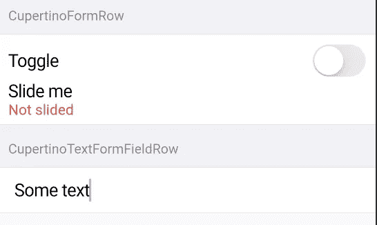
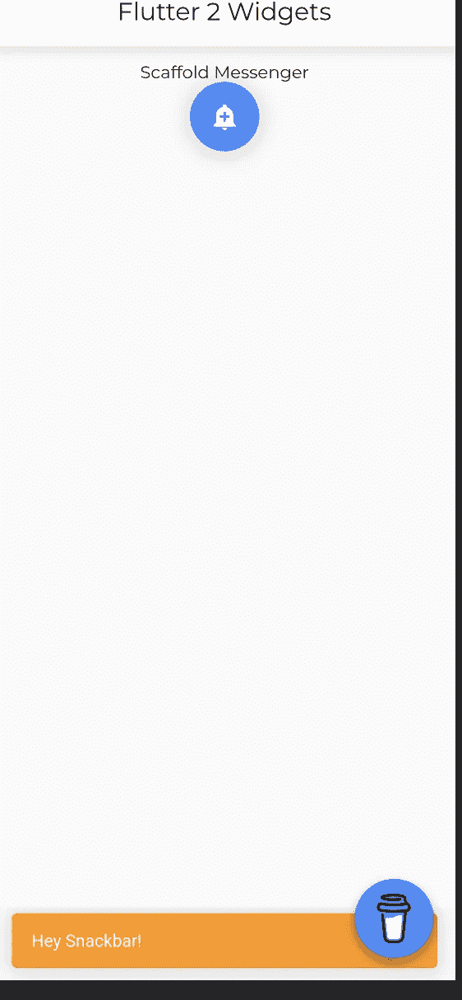
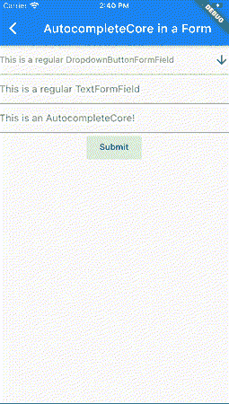

# Flutter2 小部件—链接| raw autocomplete | CupertinoFormSection

> 原文：<https://levelup.gitconnected.com/flutter2-widgets-link-rawautocomplete-cupertinoformsection-6e75f8f1127a>

link | raw autocomplete | CupertinoFormSection 等

> Flutter2 中有哪些新的小部件？

此处:[https://flatteredwithflutter.com/widgets-in-flutter2/文章](https://flatteredwithflutter.com/widgets-in-flutter2/)

Flutter2 小部件—链接| raw autocomplete | CupertinoFormSection

# 介绍

***等级:初级***

## 点击此处观看演示

***网址:***[***https://web.flatteredwithflutter.com/#/***](https://web.flatteredwithflutter.com/#/)

我们将简要介绍

1.  [链接](https://pub.dev/documentation/url_launcher/latest/link/Link-class.html)
2.  [CupertinoSearchTextField](https://api.flutter.dev/flutter/cupertino/CupertinoSearchTextField-class.html)
3.  CupertinoFormSection
4.  [CupertinoFormRow](https://api.flutter.dev/flutter/cupertino/CupertinoFormRow-class.html)
5.  [CupertinoTextFormFieldRow](https://api.flutter.dev/flutter/cupertino/CupertinoTextFormFieldRow-class.html)
6.  [脚手架信使](https://api.flutter.dev/flutter/material/ScaffoldMessenger-class.html)
7.  [RawAutoComplete](https://api.flutter.dev/flutter/widgets/RawAutocomplete-class.html)


Flutter2 小部件—链接| raw autocomplete | CupertinoFormSection

## 环

正如 Flutter 的产品经理 Chris Sells 所说

> Flutter 为构建丰富的交互式 web 应用程序奠定了基础。我们主要关注性能和渲染保真度的改进。

其中一个 web 特有的特性是[链接小部件](https://pub.dev/documentation/url_launcher/latest/link/Link-class.html)

```
Link(
   uri: Uri.parse('[https://flatteredwithflutter.com'](https://flatteredwithflutter.com')),
   builder: (_, followLink) {
     return ElevatedButton(
        onPressed: followLink,
        child: Text('Click me!!'),
     );
   },
);
```

> 注意:这个小部件存在于 [**url_launcher 包**](https://pub.dev/packages/url_launcher) 中

## CupertinoSearchTextField

Cupertino 设计语言实现中添加了很少的 iOS 小部件。

其中之一就是[CupertinoSearchTextField](https://api.flutter.dev/flutter/cupertino/CupertinoSearchTextField-class.html)


CupertinoSearchTextField

```
CupertinoSearchTextField(
  onChanged: (value) {
    print('Search text: ' + value);
  },
  onSubmitted: (value) {
    print('Search Submitted text: ' + value);
  },
  suffixIcon: const Icon(Icons.search),
);
```

*   当用户开始输入时，onChanged 被调用
*   当用户按下 done 按钮(键盘)时，onSubmitted 被调用。

## CupertinoFormSection 和 CupertinoFormRow

一个 iOS 风格的表单部分。

根据文件:

> [CupertinoFormSection](https://api.flutter.dev/flutter/cupertino/CupertinoFormSection-class.html) 的基本构造函数构造了一个边到边样式的部分，它包括 iOS 样式的标题、行、行之间的分隔符以及行顶部和底部的边框。



CupertinoFormSection 和 CupertinoFormRow

```
CupertinoFormSection(
   header: Text('CupertinoFormRow'),
   children: <Widget>[
      CupertinoFormRow(
         child: CupertinoSwitch(
            value: toggleValue,
            onChanged: (value) {
              setState(() => toggleValue = value); 
            ),
            prefix: Text('Toggle'),
            helper: Text('Slide me'),
            error: toggleValue ? null : Text('Not slided'),
      ),
   ],
),
```

*   初始化 CupertinoFormSection，它有一个**必需的子参数**
*   该窗体具有页眉和页脚属性。

**库比蒂诺福莫**

*   创建一个带有标准前缀和子部件的 iOS 风格的分割表单行。
*   它为出现在表单下的错误和助手小部件提供了空间。

**CupertinoTextFormFieldRow**

根据文件

> 创建一个 [CupertinoFormRow](https://api.flutter.dev/flutter/cupertino/CupertinoFormRow-class.html) ，其中包含一个[表单字段](https://api.flutter.dev/flutter/widgets/FormField-class.html)，该表单字段包装了一个 [CupertinoTextField](https://api.flutter.dev/flutter/cupertino/CupertinoTextField-class.html) 。

```
CupertinoFormSection(
   header: Text('CupertinoTextFormFieldRow '),
   children: <Widget>[
     CupertinoTextFormFieldRow(
       controller: _textController,
       onChanged: (value) {
          print('TextFormField text: ' + value);
       },
       onFieldSubmitted: (value) {
          print('TextFormField Submitted text: ' + value);
       },
     ),
   ],
),
```

*   我们传入 TextEditingController 的一个实例。
*   当用户开始输入时，onChanged 被调用
*   当用户按下 done 按钮(键盘)时，onFieldSubmitted 被调用。

# 脚手架信使

这用于为后代[脚手架](https://api.flutter.dev/flutter/material/Scaffold-class.html) s 管理[小吃店](https://api.flutter.dev/flutter/material/SnackBar-class.html) s。该类提供显示小吃店的 API。

**创建脚手架信使的原因:**

脚手架信使的创建是为了处理一些与 SnackBar 相关的问题，

*   轻松创建 SnackBar 以响应 AppBar 操作的能力，
*   创建 SnackBars 以在脚手架转换之间持续存在，
*   能够在异步操作完成时显示 SnackBars，即使用户已经导航到具有不同框架的页面。



脚手架信使

```
FloatingActionButton(
  child: const Icon(Icons.add_alert),
  onPressed: () {
    final messenger = ScaffoldMessenger.of(context); messenger.showSnackBar(
      SnackBar(content: Text('Hey Snackbar!')),
    );
  },
);
```

*   我们通过的 [ScaffoldMessenger .获取当前](https://api.flutter.dev/flutter/material/ScaffoldMessenger/of.html) [BuildContext](https://api.flutter.dev/flutter/widgets/BuildContext-class.html) 的 [ScaffoldMessengerState](https://api.flutter.dev/flutter/material/ScaffoldMessengerState-class.html) 。
*   为了显示 snackbar，我们使用了[scaffoldmessengerstate . showsnackbar](https://api.flutter.dev/flutter/material/ScaffoldMessengerState/showSnackBar.html)函数。

# 原始自动完成

帮助用户通过输入一些文本并从选项列表中进行选择的小部件。



原始自动完成

```
// RawAutocomplete<T>RawAutocomplete<String>(
   optionsBuilder: (TextEditingValue textEditingValue) {
      // YOUR LOGIC
   },
   onSelected: (String selection) {
     // YOUR LOGIC 
   },
   fieldViewBuilder: (_,
        TextEditingController textEditingController,
        FocusNode focusNode,
        VoidCallback onFieldSubmitted) {
     // YOUR LOGIC
   },
   optionsViewBuilder: (_,
         AutocompleteOnSelected<String> onSelected,
         Iterable<String> options) {
     // YOUR LOGIC  
   ),
)
```

*   类型参数 T 表示选项的类型。在我们的例子中，这是一个字符串。
*   在用 [fieldViewBuilder](https://api.flutter.dev/flutter/widgets/RawAutocomplete/fieldViewBuilder.html) 参数构建的字段中接收用户的文本输入。
*   使用[选项生成器](https://api.flutter.dev/flutter/widgets/RawAutocomplete/optionsBuilder.html)确定要显示的选项
*   最后，使用 [optionsViewBuilder](https://api.flutter.dev/flutter/widgets/RawAutocomplete/optionsViewBuilder.html) 显示选项。


```
[*Source code.*](https://github.com/AseemWangoo/flutter_programs/blob/master/flutter_2.zip)or [*Gist*](https://gist.github.com/AseemWangoo/d9e6317d9d3e5a010fafaff5a9871f94)
```

与 Flutter 相关的有趣文章在这里:

[](/testing-bloc-in-flutter-2deb1a1758ff) [## 颤振试验阻塞

### 如何测试颤振中的阻塞

levelup.gitconnected.com](/testing-bloc-in-flutter-2deb1a1758ff) [](https://medium.datadriveninvestor.com/flutter-engage-flutter-2-2b4e8dde016f) [## 颤振啮合—颤振 2

### 颤振啮合—颤振 2

颤动接合——颤动 2medium.datadriveninvestor.com](https://medium.datadriveninvestor.com/flutter-engage-flutter-2-2b4e8dde016f) [](/github-search-and-bloc-523d51848c68) [## Github 搜索和拦截

### 使用 bloc 实现 Github 搜索

levelup.gitconnected.com](/github-search-and-bloc-523d51848c68)