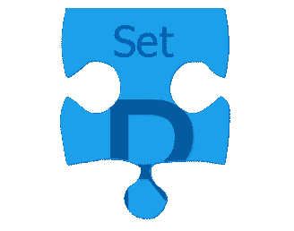
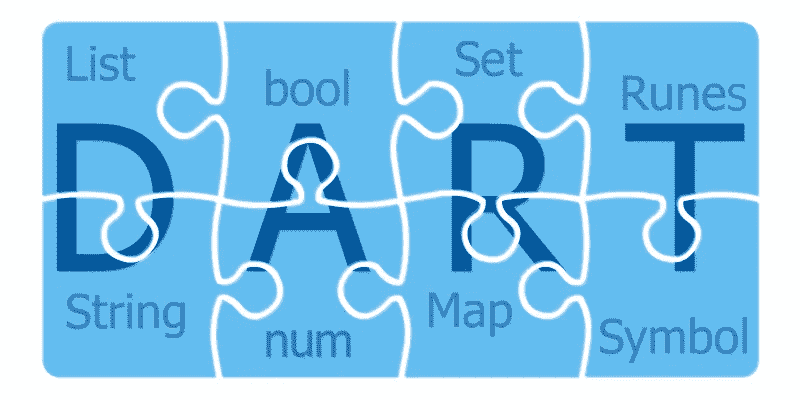

# 飞舞的飞镖:内置数据类型

> 原文：<https://levelup.gitconnected.com/fluttering-dart-9a3e74b0d9c5>

## [飘动的飞镖](https://levelup.gitconnected.com/fluttering-dart/home)

## 达特的螺母和螺栓


**Dart** 的内置数据类型

[Flutter](https://flutter.dev) 项目可以使用特定平台和跨平台代码。后者是用 [Dart](https://dart.dev) 写的，而且，构建 Flutter apps，需要一些 Dart 的基础知识。

在第一部分中，我们将发现 Dart 的内置数据类型。

代码示例可以使用[](https://dartpad.dev)**进行试验和测试。**

## **内置数据类型**

**数据类型是一种特定的信息，它允许某些[操作](https://medium.com/@constanting/fluttering-dart-ee493f4b0440)。**

****

**type**num**(int 和**double**的超类型)**

****Dart 中的数字**有两种类型:**

*   **代表不大于 64 位的整数(取决于平台)**
*   **64 位**双**-精确浮点( [IEEE 754 标准](https://en.wikipedia.org/wiki/IEEE_754))-用于表示带小数位的数字**

**他们的超类型是类型**编号**。**

**所有的数字也是对象，每个都有特定的方法。**

```
void main() {
  int x = 4;
  print(x.**toRadixString**(2) == '100');
  double y = 19.861004;
  print(y.**toStringAsFixed**(4) == '19.8610');
}
```

**在上面的例子中，我们首先定义了一个名为 **x** 的 **int** 来获取值 **4** ，然后我们利用 **int** 的方法 **toRadixString** 来获取 **x** 的二进制表示(作为一个字符串)。我们可以用十六进制的基数 16 来代替 2。二进制基中 4 的表示之间的等式是' **100** '是**真**，这就是 **print** 方法将显示的内容。**

**然后我们定义一个名为 **y** 的 **double** ，并给它赋值( **19.8610** )。然后我们使用 **double** 的内置函数**tostriangasfixed**来获取 **y** 的仅有的 4 位小数(也作为一个字符串)。等式也被满足，因此**打印**方法将再次显示**真**。**

****

**键入**字符串****

**一个**字符串**是一系列 UTF-16 代码单元。**

**字符串用于表示任何可以作为语句编写或表达的内容，以及单个字符。对于特殊字符的表示，你可以查看下面的**符文**。**

**要创建一个字符串，我们可以使用单引号`'`或双引号`"`(使用哪一个并不重要，只要我们在代码中保持一致)。**

**飞镖内置串**插补**。表达式可以用`${expression}`的形式嵌入到字符串中，并在我们使用它们的时候被求值。如果表达式是一个标识符，那么我们可以省略`{}`:**

```
void main() {
  String dartLang = 'Dart';
  String javaLang = 'Java';
  print('Saying that $dartLang is identical to $javaLang might be a bit too much... At least when we count the letters in their names we get ${dartLang.length} in both cases.');
}
```

****多行**字符串可以使用三重引号(单引号或双引号)创建:**

```
void main() {
  String multiLine = '''
This 
is
nice!
''';
  print('$multiLine');
}
```

**字符串**串联**只需将不带 **+** 符号的字符串文字相邻放置即可:**

```
void main() {
  String concatenated = 'This ''is ' '(kind ''of) '
'odd'
'...'; 
  print('$concatenated');
}
```

****

**布尔型**布尔型****

****布尔**类型代表布尔。**

**它只有两个值:**真**或**假****

**像 **if** 、 **while** 或 **assert** 这样的条件只能与 **bool** s 一起使用。**

**Dart 的类型安全意味着我们不能使用像`if(*nonBooleanValue*)`或`assert(*nonBooleanValue*)`这样的代码。相反，应显式检查值，如下所示:**

```
void main() {
  String emptyName = ''; 
  if(emptyName.isEmpty) {
    print('Like the name says, it is empty!');
  }
  String nullName;
  if(nullName == null) {
    print('Like the name says, it is null!');
  }
}
```

****

**类型**列表****

****列表**是常用的集合类型。**

**数组(对于来自其他编程语言的人来说)是列表对象。**

**在下面的例子中，同时使用了列表文字和列表构造函数。建议尽可能使用文字:**

```
void main() {
  *// the literal way*
  List oneWay = [1,2,3]; 
  *// the constructor way*
  List orAnother = List<int>(3);
}
```

****

**类型**地图****

****贴图**是另一种常用的采集类型。**

**在下面的例子中，使用了一个映射文字和一个映射构造函数。建议尽可能使用文字:**

```
void main() {
  *// the literal way*
  Map oneWay = {'a': 0, 'b': 1, 'c': 2}; 
  *// the constructor way*
  Map orAnother = Map<String, int>(); 
}
```

****

**类型**设置****

**Dart 中的集合是唯一项目的无序集合。**

**要创建一个空集，使用前面带有类型参数的`{}`，或者将`{}`赋给类型为 **Set** 的变量。**

****映射**文字的语法类似于集合文字的语法。因为**映射**文字首先到达 Dart，`{}`默认为这种类型。如果您忘记在`{}`上添加类型注释，或者没有将`{}`赋给类型为 **Set** 的变量，那么默认情况下，Dart 会创建一个类型为 **Map < dynamic，dynamic >** 的对象。**

```
void main() {
  *// the literal way*
  Set oneWay = {};
  *// the constructor way*
  Set orAnother = <String>{};
  Set petTypes = {'cat', 'dog', 'bird', 'reptile', 'other'};
  print('There are ${petTypes.length} pet types defined.');
}
```

****

**类型**符号****

****符号** s 代表一个操作符或标识符。**

**它们可以使用构造器符号**(**名称’**)**或符号文字 **#** 来创建**

**很少使用符号。它们在构建通过名称引用标识符的 API 时大放异彩，因为缩小会改变标识符名称，但不会改变标识符符号。**

**用相同名称创建的符号是相等的:**

```
void main() {
  print(Symbol('a') == #a); 
  *// the above prints* ***true***
}
```

****

**类型**符文****

****符文**是字符串的 UTF-32 码点。要表达字符串中的 32 位 Unicode 值，我们可以使用`**\u******`的形式，其中`****`是码位的四位十六进制值。**

**如果代码点大于 4，我们将使用`{}`来包装数字(`\u{*****}`)。**

```
void main() {
  Runes heart = Runes('\u2665');
  Runes laugh = Runes('\u{1f600}');
  print(String.fromCharCodes(heart) + ' ' + String.fromCharCodes(laugh));
}
```

**上面的版画:'♥😀'**

**除了上述内置类型，我们还有**枚举**和**动态**类型。**

**枚举类型可以使用 **enum** 关键字声明，并允许我们以类型安全的方式定义一组常量值(通常用于 **switch** 语句)。每个值都有一个**索引**获取器来返回该值的从零开始的位置。**值**让我们可以访问一个枚举中的所有值。**

```
enum Pet { cat, dog, bird, reptile, other }void main() {
  print('${Pet.values.length} pet types');
  dynamic myPet = Pet.cat;
  switch(myPet) {
    case Pet.cat:
      print('meow');
      break;
    case Pet.dog:
      print('woof');
      break;
    case Pet.bird: 
      print('tweet');
      break;
    case Pet.reptile: 
      print('ssSss');
      break;
    case Pet.other: 
      print('');
      break;
  }
}
```

**当我们不知道(或不关心)对象的类型时，使用**动态**类型。**

****is** 操作符可用于检查动态对象是否属于某种类型(runtime type**getter 可让我们访问实际类型)。****

**有时**动态**类型会与**对象**混淆(当我们想要表示所有对象都被接受时应该使用)。**

```
void main() {
  dynamic value = false;
  print(value.runtimeType);
  value = 'Dart';
  if(value is String) {
    print(value.runtimeType);
  }
}
```

**所有这些内置类型都是 Dart 编程语言的一部分，为我们的对象类型化提供了灵活性和选项。**

****

****Dart** 的内置数据类型**

**在 [**颤动飞镖**](https://medium.com/tag/fluttering-dart/archive) 系列的下一部分，我们将深入研究[函数](https://medium.com/@constanting/fluttering-dart-b37110f4d1bf)，构建健壮颤动应用程序所需的另一个飞镖基础。**

**[](https://medium.com/@constanting/fluttering-dart-b37110f4d1bf) [## 飞舞的飞镖:功能

### 如何在 Dart 中编写、使用和滥用函数

medium.com](https://medium.com/@constanting/fluttering-dart-b37110f4d1bf) 

就这些！**