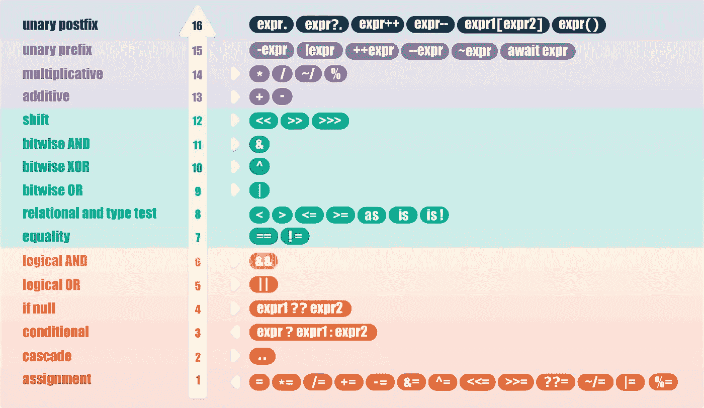

# 飞舞的飞镖:操作符

> 原文：<https://levelup.gitconnected.com/fluttering-dart-ee493f4b0440>

## [飘动的飞镖](https://levelup.gitconnected.com/fluttering-dart/home)

## Dart 的操作员…一个接一个


[Flutter](https://flutter.dev) 项目既可以使用特定平台代码，也可以使用跨平台代码。后者是用 [Dart](https://dart.dev) 写的，而且，构建 Flutter apps，需要一些 Dart 的基础知识。

在本系列的前两部分中，我们介绍了 Dart [**内置数据类型**](https://medium.com/@constanting/fluttering-dart-9a3e74b0d9c5) 和 [**函数**](https://medium.com/@constanting/fluttering-dart-b37110f4d1bf) 。

在这一部分中，我们将发现 Dart 的操作员:如何使用和滥用甚至覆盖他们的行为。

使用[](https://dartpad.dev)**，可以对一些代码示例进行试验和测试。**

## **经营者**

**运算符是我们在代码中使用的任何符号，它允许我们进行数学计算、执行布尔逻辑或做其他事情，如字符串连接或计算交集。**

**运算符的行为类似于函数，尽管它们的语法或语义与我们对函数的预期不同。**

**根据它们的位置，有**前缀**、**中缀**或**后缀**运算符，并且根据它们的操作数，它们被分类为**一元** —一个操作数、**二元** —两个操作数或**三元** —三个操作数。**

**对于处理两个操作数的运算符，使用最左边操作数版本的运算符。例如，如果我们有一个 String 对象和一个 int 对象，`sVal + iVal`使用 String 版本的`+`，并且需要使用 **int** 的`toString()`方法将整数值转换为 **String** 。**

```
// unary prefix operator
**++**one// infix binary operator
one **+** two// unary postfix
one**++**// ternary operator
one **?** two **:** three
```

**运算符的语义因求值策略和参数传递模式而异。包含运算符的表达式以某种方式进行计算，结果可能只是一个值，也可能是一个允许赋值的对象。与 Dart 一样，我们已经发现[所有结果都是对象](https://medium.com/@constanting/fluttering-dart-9a3e74b0d9c5)。**

```
// example of operator
**a + b** // and equivalent function
**add(a, b)**
```

## ****先例****

**正如我们在下面看到的，Dart 有许多操作符。它们的**优先级**决定了在执行我们漂亮的代码时每个操作符的优先级。**

****

****运算符优先级和结合性****

****结合律**适用于具有相同优先级的运算符。大多数操作符都有从左到右的结合性(方向由一个小箭头指示)。赋值运算符和条件运算符从右向左，前面没有箭头的运算符没有结合性。**

**举例来说，我将使用乘法优先于加法的原则(你可能在数学课上还记得):**

```
r = a + b * c;
```

**上面的表达式在执行时，将检测所有操作符，并按优先顺序执行它们。如果我们看上面的列表，我们会发现 3 个操作符(按出现的顺序):**

*   **第一个也是最不重要的**
*   **`**+**`是第二个，比`**=**`更“重要”**
*   **`*`是最后也是最“重要”的**

**因此，按照重要性的顺序，我们有`*`、`**+**`和`**=**`(讽刺的是，它们的出现正好相反)。**

**首先，`b`会乘以`*`与`c`。然后，结果将被加到`**+**`到`c`上，最后，结果将被分配给`**=**`到`r`。**

**为了更容易理解，我们通常按照表达式求值的方式来编写表达式:**

```
// easier to read
r = a + (b * c);
```

## **种类**

****

****算术运算符****

*   **`**+**` 添加`assert(5 + 3 == 8);`**
*   **`**-**`减去`assert(5 - 3 == 2);`**
*   **`**-expr**`一元减号——反转表达式的符号`assert(-(5 + 3) == -8);`**
*   **`*****`乘`assert(5 * 3 == 15);`**
*   **`**/**`划分`assert(5 / 3 == 1.6666666666666667);`**
*   **`**~/**` 除法返回整数结果`assert(5 / 3 == 1);`**
*   **`**%**` 模—返回整数除法的余数`assert(5 % 3 == 2);`**
*   **`**expr++**` 后缀增量—表达式值为`**expr**`**
*   **`**++expr**` 前缀增量—表达式值为`**expr** + 1`**
*   **`**expr--**` 后缀增量—表达式值为`**expr**`**
*   **`**--expr**` 前缀增量—表达式值为`**expr** - 1`**

**前缀和后缀的递增和递减运算符有点难以理解:**

```
var a, b;
a = 0;
b = ++a; // increments **a** **first,** then assigns the value to **b**
assert(b == a); // 1 == 1
a = b++; // **first** assigns the value to **a**, then increments a 
assert(b != a); // 2 != 1
print('a=$a and b=$b'); // prints **a=1 and b2**
```

**后缀运算`**expr++**`或`**expr--**`比前缀运算`**++expr**`或`**++expr**`效率稍低。在不使用后缀创建的临时值的情况下，应该使用前缀。**

**这打破了以前的优先规则。我能说什么？规则就是用来打破的！**

**Dart 编程语言规范([版本 2.2](https://dart.dev/guides/language/specifications/DartLangSpec-v2.2.pdf) )解释:**

> ***评估一个后缀表达式****e******v++****分别为* ***v -*** *，其中* ***v*** *是一个标识符，收益如下:评估* ***v* 分别评估***v = y+1****v = y-1****。然后* ***e*** *求值为* ***r*** *。***
> 
> **上面的代码确保了如果求值涉及到一个 getter，那么它只被调用一次。同样在下面的例子中。**

****

****等式和关系运算符****

*   **`**==**` 等于`assert(3 == 3);`**
*   **`**!=**`不等于`assert(5 != 3);`**
*   **`**>**`大于`assert(5 > 3);`**
*   **`**<**`小于`assert(5 < 8);`**
*   **`**>=**`大于或等于`assert(5 >= 5);`**
*   **`**<=**`小于或等于`assert(5 <= 5);`**

**测试对象是否代表相同的东西。为了验证两个对象是否完全相同，我们应该使用`identical()`函数。**

**在第一个操作数上调用该操作。**

****

****类型测试操作员****

*   **`**as**` 类型演员表**
*   **`**is**`类型测试— **真**如果对象具有指定的类型**
*   **`**is!**`类型测试— **假**如果对象具有指定的类型**

**后两个运算符基本上是测试两个对象是否是同一类型(相当于`==`和`!=`)。**

```
// because this operators work with objects, we'll use the fictional **Cat** and **Dog** these classes extend the **Pet** classList pets = <Pet>[Cat('Simba'), Cat('Micuta')]; 
Cat oneCat = (pets[0] **as** Cat);
Cat anotherCat = (pets[1] **as** Cat);
assert(oneCat.name == 'Simba');
assert(anotherCat.name == 'Micuta');
assert(anotherCat **is** Cat);
assert(oneCat **is!** Dog);
```

****

****赋值运算符****

**可以使用`**=**`运算符赋值。要仅在被赋值变量为空时赋值，请使用空操作符。**

**除了实际的`**=**` 操作员以外，上面的每个操作员都是一个**复合操作员**。**

**这意味着操作与赋值相结合。实际操作说明可以在它们各自的类别中找到。**

****

****逻辑运算符****

*   **`**!expr**` 反转表达式(在假与真之间切换)`assert(!true == false);`**
*   **`**&&**`逻辑与`assert(true && false == false);`**
*   **`**||**`逻辑或`assert(true || false == true);`**

**我们可以用这些来反转或合并布尔表达式。**

****

****按位和移位运算符****

*   **`**&**` **和**取两个等长的二进制表示，对每一对对应的位进行**逻辑与**运算，相当于将它们相乘。如果比较位置的两位都是 1，则结果二进制表示中的位是 1 ( `assert(1 & 1 == 1);`)，否则结果是 0 ( `assert(0 & 1 == 0);`、`assert(1 & 0 == 0)`和`assert(0 & 0 == 0);`)**
*   **`**|**` **或**取两个等长的二进制表示，并对每对相应的位执行**逻辑异或**运算。如果两位都为 0 ( `assert(0 | 0 == 0);`)，则每个位置的结果为 0，否则结果为 1 ( `assert(0 | 1 == 1);`、`assert(1 | 0 == 1)`和`assert(1 | 1 == 1);`)**
*   **`**^**` **XOR** 取两个等长的二进制表示，对每对对应的位进行**逻辑异或**运算。如果只有一位为 1 ( `assert(0 ^ 1 == 1);`和`assert(1 ^ 0 == 1);`)，则每个位置的结果为 1，但如果两位都为 0 或都为 1 ( `assert(1 ^ 1 == 0);`和`assert(0 ^ 0 == 0);`)，则结果为 0**
*   **`**~expr**` **一元按位补码**切换 **0** 和 **1** 之间的所有位。(`assert(1 & ~1 == 0);`)**
*   **`**<<**` **左移**将位左移，零作为新数字移入。(`assert(1 << 1 == 2);`)**
*   **`**>>**` **右移**将数字右移，移入零以替换丢弃的位。(`assert(1 >> 1 == 0);`)**

**在 Dart 中，我们可以使用按位和移位操作符来操作二进制数据的位。**

**4294967295 是我们对 0 求补后得到的数。即(2 的 32 次方)-1，或无符号 int 32 位的最大值。**

```
assert(~0 == math.pow(2,32) — 1);
```

**4294967295(十进制)的实际二进制表示为:**

```
11111111111111111111111111111111
```

**我打算在现实生活的用例中详细讨论按位和移位操作。如果有兴趣，请关注我。**

**[](https://medium.com/@aflutterdev/bit-masking-a-practical-example-657ea8b621a8) [## 位屏蔽:一个实际例子

### 在简短的二进制介绍之后，在极小的比特上存储数据

medium.com](https://medium.com/@aflutterdev/bit-masking-a-practical-example-657ea8b621a8) [](https://medium.com/@aflutterdev/bit-masking-control-movement-8d5c743cb076) [## 位屏蔽:控制移动

### 一点一点地移动部件

medium.com](https://medium.com/@aflutterdev/bit-masking-control-movement-8d5c743cb076) 

**条件表达式**

*   `**expr ? expr1 : expr2**`如果`expr`为真，则对`expr1`求值(并返回其值)；否则，评估并返回`expr2`的值
*   `**expr1 ?? expr2**` 如果`expr1`非空，则返回其值；否则，评估并返回`expr2`的值。例如，当您希望确保在第一个表达式为 **null** 的情况下使用默认值时，这个支持 null 的操作符非常有用:

```
class Cat {
  String name;
}void main() {
  // we create a generic cat
  Cat **genericCat** = Cat(); // we create a stray cat
  Cat **strayCat** = Cat(); // we set the stray cat's name 
  // to the generic cat's name value 
  // that will be null so our stray cat
  // name will be **Catonymous**
  strayCat = genericCat.name ?? 'Catonymous';
}
```


**级联符号(..)**

级联(`..`)允许我们对同一对象进行一系列操作。除了函数调用，我们还可以访问同一个对象上的字段。这通常使我们免于创建临时变量，并允许我们编写更流畅的代码。

```
// we'll use the fictional **Cat** class we used beforeCat()
  ..name = 'Simba'
  ..feed()
  ..pet();
```

上面的例子用简单的英语读起来相当流利(瀑布之美):我们不知从哪里弄来一只流浪猫，给它取名辛巴，然后喂养和抚摸它，让它快乐地喵喵叫和咕噜咕噜叫。


**其他操作员**

*   `**()**` 函数应用——代表一个函数调用
*   `**[]**`列表访问—指列表中指定索引处的值
*   `**.**`成员访问——指表达式的属性
*   `**?.**` 条件成员访问——一个空操作符，其行为与上述类似，但最左边的操作数可以是**空值**

在前面的例子中，我们到处都在使用这些方法(`?.`是一个例外，也可能帮助我们避免捕捉到一个例外)。

当我们想要(或需要)在不抛出异常的情况下使用可以为空的对象时，条件成员访问`?.`非常有用。

```
class Cat {
  String name;
}
void main() {
  Cat strayCat;
  // prints **null**
  print(t?.name);
  // throws **null is not an object** exception
  print(t.name);
}
```


**还没完呢！**

## 最重要的

你有没有梦想过为某些操作者定义你的自定义行为？Dart 允许你通过超越来实现你的梦想。

请注意，只有 Dart 操作符的子集可以被覆盖。这些是`[]`、`[]=`、`~`、`*`、`/`、`~/`、`%`、`+`、`-`、`<<`、`>>`、`&`、`^`、`|`、`<`、`>`、`<=`、`>=`和`==`。

`!=`不是可重写的运算符。表达式`expr1 != expr2`只是`!(expr1 == expr2)`的一个快捷方式，所以如果我们覆盖了`==`，我们也覆盖了`!=`。

对于某些类，使用运算符比使用方法更简洁。例如，List 类覆盖了列表连接的`+`操作符。代码`[a, b, c] + [d, e, f]`非常容易理解。

我们最终定义了一个猫类，并想比较我们的猫的体重。我们通过重写关系和等式操作符来做到这一点。

```
class Cat {

  final String name;
  final double weight;

  Cat({this.name, this.weight});

  bool operator ==(Object cat) => this.hashCode == cat.hashCode; String operator <(Cat cat) => (weight < cat.weight)?'$name is lighter than ${cat.name}.':'$name is heavier than ${cat.name}.'; String operator >(Cat cat) => (weight > cat.weight)?'$name is heavier than ${cat.name}.':'$name is lighter than ${cat.name}.'; String operator >=(Cat cat) => (weight >= cat.weight)?((this==cat)?'$name is as heavy as ${cat.name}.':'$name is heavier than ${cat.name}.'):'$name is lighter than ${cat.name}.'; String operator <=(Cat cat) => (weight <= cat.weight)?((this==cat)?'$name is as light as ${cat.name}.':'$name is lighter than ${cat.name}.'):'$name is heavier than ${cat.name}.';

  [**@override**](http://twitter.com/override)
  int get hashCode => weight.hashCode;

}void main() { // create our cats 
  Cat oneCat = Cat(name: 'Simba', weight: 4.1);
  Cat anotherCat = Cat(name: 'Micuta', weight: 3.8);
  Cat yetAnotherCat = Cat(name: 'Saki', weight: 3.8);
  Cat meowCat = Cat(name: 'Klein', weight: 5.0); // and compare them
  print(oneCat>anotherCat);
  print(yetAnotherCat<=anotherCat);
  print(meowCat<=oneCat);

}
```

这些覆盖的例子有点复杂，因为它们甚至将表达式的求值结果类型从 **bool** 更改为 **String** ，并且`>=`和`<=`甚至使用了两个混合条件运算符。我们这样做是为了克服我们不能改变`==`的返回类型这一事实，它必须保持布尔值。

注意，我们已经覆盖了 **hashCode** getter(当覆盖`==`操作符时，这是必须的)。

上面代码的结果是:

```
Simba is heavier than Micuta. 
Saki is as light as Micuta. 
Klein is heavier than Simba.
```

在 [**颤动飞镖**](https://medium.com/tag/fluttering-dart/archive) 系列的下一部分中，我们将深入研究[控制流语句](https://medium.com/@constanting/fluttering-dart-the-flow-7be2080763ad)构建健壮颤动应用程序所需的另一个飞镖基础。

[](https://medium.com/@constanting/fluttering-dart-the-flow-7be2080763ad) [## 飞舞的飞镖:流动

### 所有关于控制流的语句

medium.com](https://medium.com/@constanting/fluttering-dart-the-flow-7be2080763ad) 

就这些！**