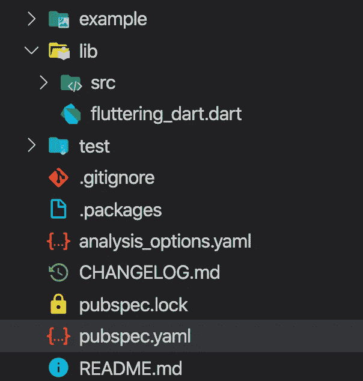

# 飞舞的飞镖:库和包

> 原文：<https://levelup.gitconnected.com/fluttering-dart-libraries-and-packages-972edf864ff9>

## [飘动的飞镖](https://levelup.gitconnected.com/fluttering-dart/home)

## 如何使用、构建、重用和共享您的代码


照片由[海顿·戈尔登](https://unsplash.com/@goldensson?utm_source=unsplash&utm_medium=referral&utm_content=creditCopyText)在 [Unsplash](https://unsplash.com/collections/9242643/m/0267731cfd50cb7de643e1e165a506cd?utm_source=unsplash&utm_medium=referral&utm_content=creditCopyText) 上拍摄

如果你需要在模块化的基础上构建你的项目，库将会帮助你。

它们允许你将一些代码或模块分割成多个文件，并与其他开发者共享。

除了代码结构化之外，库的另一个好处是它们允许库封装(确定什么对其他库可见或不可见)。

# Dart 库

要定义一个库，所有需要做的就是创建一个包含一些代码的 Dart 文件。

为了**导入**它，我们可以在文件的开头添加`import path_to_your_library;`语句。

当导入时，我们可以使用`show`和`hide`关键字来导入我们将在代码中使用的一些标识符，或者分别排除那些我们确定不想导入的标识符。

例如，为了只使用 Dart 数学核心库中的 Point 类，我们将编写:

```
import 'dart:math' **show** Point**;**
```

或者使用除 Point 类之外的所有其他类，我们将编写:

```
import 'dart:math' **hide** Point**;**
```

当我们想要导入定义相同标识符的库时，我们还必须使用`as`关键字。这样我们可以避免潜在的冲突。

```
import 'dart:math' **as** Math**;**
```

仅此而已！

## 导入库的方式

要导入库，我们有多种选择:

*   **文件的相对路径**—当库在同一文件夹中时使用
*   **文件的绝对路径**——通过添加`file://` URI 前缀，我们可以引用计算机上的库文件
*   **一个 web URL**——与绝对路径的情况相同，但是使用了`http://`协议
*   **一个包** —这是导入库的最流行和推荐的选项；我们指定从`package`根到库文件的路径

## 创建库

Dart 库可以由单个文件(最常见和推荐的方式)或多个文件组成。

正如所料，我们得到了可选的关键字`library`来定义一个库。这在创建分布在多个文件中的库或在发布库之前为库创建文档时非常有用。

小型库由单个文件组成。可以将库定义拆分为多个文件，但如果没有必要，不建议这样做。拆分对[封装](https://medium.com/@constanting/fluttering-dart-oop-8b92cd89a7f0)以及库本身的导入和使用方式都有影响。

在 Dart 中，默认情况下，一切都是公开的。为了标记私有的东西，我们使用了`_`(下划线)字符。我们也可以使用由**元** Dart 包提供的`@protected`注释。当添加到类成员时，它指示该成员应该只在类或其子类型中使用。

两种方式(或者是`_`或者是`@protected`)都将被标记的成员设置为私有，私有会阻止其外部访问。

当定义单个文件库时，我们只需在一个文件中编写所有代码，仅此而已。

当定义多文件库时，我们可以使用组合的`part`、`part of`和`library`语句:

*   `part` —允许库提及其组成的库部件
*   `part of` —在库部件中使用，说明它属于哪个库
*   `library`-在`part`语句之前，将零件链接到库的`main`零件

更好的方法是完全避免使用上述语句进行组合，而只是将库拆分成小的单个库。之后，使用`export`语句在库的`main`中创建组合。通过这种方式，库用户只需导入一个文件，所有在其中导出的较小的库也将可用。

# 镖包

每个 Dart 项目都有一个相应的 Dart 包。

使用包的主要好处是包内的代码可以重用和共享。使用`pub`工具将依赖项发送和提取到 pub.dartlang.org 网站和存储库。

在我们的项目中使用一个库包使得这个包和**直接依赖**。这种依赖性可能有自己的依赖性，这些依赖性被称为**传递依赖性**。

在 Dart 中，有两种类型的包:

*   **应用**包
*   **库**包

应用程序本身就是包。这些包并不意味着依赖于其他包。

库包是可以重用和共享的包。这些可以用作依赖项。

这些类型的包的推荐结构几乎是相同的。用途和目的是不同的。



Dart 包装工具

让我们看一下上面的每一项:


在已发布的软件包中用于用法演示。


这些是源代码所在的文件夹。


这通常与包的名称相同。它可以用来**导出**本地 **src** 库。


单元测试和基准分析将放在这个文件夹中。


声明将要从 Git 中排除的文件。


映射本地系统的 pub 缓存中的依赖关系。


对于自定义 lint 检查、样式分析和其他预编译检查非常有用。


提供变更日志信息的降价文件。


锁定的包兼容依赖项。


向发布库描述它的基本包文件。


提供关于包的一般信息的降价文件。

正如我们将在未来看到的，一个 Flutter 项目结构类似于一个 Dart 包。

## pubspec.yaml 文件

这是飞镖包的核心。理解这种文件结构对于描述包是至关重要的。

该文件使用了`[YAML](https://en.wikipedia.org/wiki/YAML)`语法。这种格式通常用于配置文件，具有可读的结构。

```
**name**: fluttering_dart
description: A starting point for Dart libraries or applications.
version: 1.0.0
homepage: [https://www.constanting.com](https://www.example.com)
author: Constantin Stan <aflutterdev+medium@gmail.com>environment:
  sdk: '>=2.7.0 <3.0.0'dependencies:
  path: ^1.6.0dev_dependencies:
  pedantic: ^1.8.0
  test: ^1.6.0
```

这个文件提供了包元数据信息，当我们想要发布包时很有用，定义了第三方依赖和 Dart [SDK](https://en.wikipedia.org/wiki/Software_development_kit) 版本。

让我们检查一下`pubspec`组件:

*   `name`—**必需的**包的标识符，应该只包含小写字母、数字和`_`字符；它也应该是一个有效的 Dart 标识符(不以数字开头，并且不是一个[保留字](https://dart.dev/guides/language/language-tour#keywords)
*   `description` —用于描述软件包用途的可选组件(仅在发布软件包时需要)
*   `version` —如果没有发布到`pub`存储库也是可选的，并且有助于跟踪当前的包版本
*   `homepage` —可选，但很重要，因为一旦发布，它将链接到包的页面上
*   `author` —也是可选的，但对于提供联系信息很重要；如果有不止一个作者，那么应该使用 [YAML 列表语法](https://en.wikipedia.org/wiki/YAML#Syntax)来提供`authors`
*   `environment` —指定任何 Dart 包的主要依赖，即 Dart SDK 利用这一点，我们提到了目标和支持的 SDK 版本
*   `dependencies`和`dev_dependencies` —它们定义了库的使用和开发所需的第三方包

上述组件在`pubspec`文件中最常见。有关完整的概述和其他组件，您可以在此处进一步阅读。

## 属国

`pubspec.yaml`文件最重要的作用是添加依赖关系。

在开始我们的项目后，使用像 Stagehand 这样的生成器工具或者手动操作，运行`pub get`命令是要做的第一件事。

下面我们来考虑一下`pubspec`:

```
**name**: fluttering_dart
```

对其运行`pub get`命令将为我们提供以下输出:

```
Resolving dependencies...
Got dependencies!
```

它还会生成两个新文件:

*   `.packages` —如前所述，这映射了系统的 pub 缓存中的依赖关系；在包被映射后，它们可以被导入并在我们的 Dart 代码中使用；这个文件应该从像 Git 这样的代码管理系统中排除
*   `pubspec.lock` —此文件包含包的所有依赖图(所有直接和传递依赖及其确切版本和额外元数据)；这个文件应该包含在版本控制系统中，因为它有助于复制精确的环境

以上文件由 pub 工具自动生成，不建议手动编辑。

在`pubspec.yaml`示例中，我们添加了`[path](https://pub.dev/packages/path)`包依赖关系。

我们使用来自`pubspec`文件的`dependencies`来指定依赖关系。这样做的语法是:

```
<package>**:** <constraints>
```

应该使用**包**名称和**约束**(版本和源代码)来指定依赖关系。如果没有提供约束，那么将使用该包的任何可用版本(最新版本)，默认源代码将是[**【pub.dartlang.org】**](https://pub.dartlang.org)(重定向到 [**pub.dev**](https://pub.dev) )

**版本**约束有多种提及方式:

*   **任何/空** — `path:`或`path: any`
*   **具体版本**——`path: 1.6.0`
*   **最小界限**——`path: '>1.6.0'`或`path: '>=1.6.0'`
*   **最大界限** — `path: '<1.6.0'`或`path: '<=1.6.0'`
*   **范围** — `path: '>=1.6.0 <=1.6.4'`
*   **语义范围** — `path: ^1.6.0`类似于`path: '>=1.6.0 <2.0.0'`(最小指定版本到不再兼容的版本)

**源**约束也有多种指定方式:

*   **主持**来源:

```
dependencies:
 **path**:
    **hosted**:
      **name**: path
      **url**: https://private-pub-api-compliant-server.com
```

*   **路径**源(由于我们的示例包名，这可能会有点混乱):

```
dependencies:
 **path**: # package is on this line 
    **path**: /some/path/to/path
```

*   **Git** 源代码(从 Git 存储库中指定一个包):

```
dependencies:
 **path**:
    **git**:
      **url**: git://github.com/dart-lang/path.git
      **path**: /
      **ref**: master
```

*   **SDK** 来源:

```
dependencies:
  **flutter_driver**:
    **sdk**: flutter
    **version**: ^0.0.1
```

最后一种方法仅用于 Flutter SDK 依赖项。

在提高生产率方面，第三方依赖至关重要。

[Flutter](https://flutter.dev) 项目既可以使用特定平台代码，也可以使用跨平台代码。后者是用 [Dart](https://dart.dev) 写的，而且，构建 Flutter apps，需要一些 Dart 的基础知识。

在本系列的前几部分中，我们介绍了 Dart [**内置数据类型**](/@constanting/fluttering-dart-9a3e74b0d9c5) **，** [**函数**](/@constanting/fluttering-dart-b37110f4d1bf) **，** [**运算符**](/@constanting/fluttering-dart-ee493f4b0440) **，** [**控制流语句**](/@constanting/fluttering-dart-the-flow-7be2080763ad) **，** [**面向对象编程**](/@constanting/fluttering-dart-oop-8b92cd89a7f0) **(类、对象等等)**

在这一部分中，我们深入研究了 Dart 库和包。

在 [**飘飘镖**](https://medium.com/tag/fluttering-dart/archive) 系列的下一部分，我们将深入探讨[单元测试](https://medium.com/@constanting/fluttering-dart-unit-testing-f58dae6bc1f)。

[](https://medium.com/@constanting/fluttering-dart-unit-testing-f58dae6bc1f) [## 飞舞的飞镖:单元测试

### 如何编写模块化、高效、无 bug 的代码

medium.com](https://medium.com/@constanting/fluttering-dart-unit-testing-f58dae6bc1f) 

就这些！