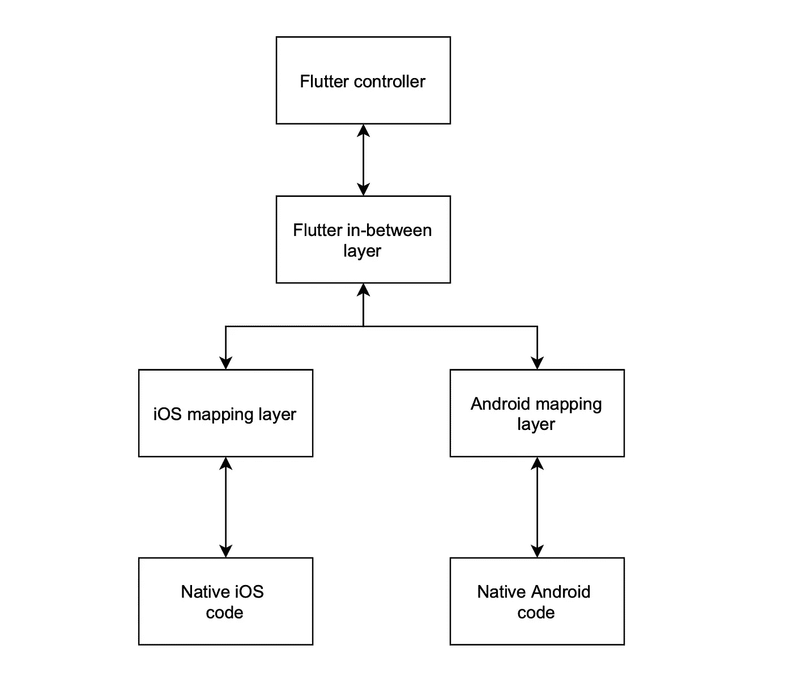
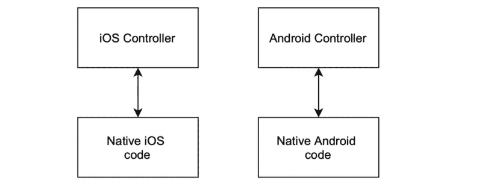

# 探索 Flutter 与本机代码的通信

> 原文：<https://levelup.gitconnected.com/flutters-communication-flow-with-native-1672495e239f>

Flutter 与原生 iOS 和 Android 代码对话有多无缝？


# 介绍

这篇博客研究了 Flutter 如何与本机代码通信，并探讨了其中涉及的复杂性、挑战和风险。例如，我们想从本地 SDK 获得一个任务列表，并将它们显示在屏幕上。

大多数跨平台框架也遵循相似的通信路径，因此这里学到的经验也适用于它们。

# **颤振通信流程**

## 颤振实现

我们希望获得任务并在一个小部件中显示它们:

```
class MyApp extends StatelessWidget {  
    @override  Widget build(BuildContext context) {
        let tasks = TasksTarget.getTasks(5931)
        setTasks(tasks)
    }
}
```

这要求我们创建一个中间目标，处理本地函数的调用并从 JSON 解码它们。

```
class TasksTarget { static Future<List<Task>> getTasks(int userId) async {
      const platform = const MethodChannel('samples.flutter.dev/tasks'); try {
        **final** List<dynamic>? tasks = **await** _channel.invokeMethod<List<dynamic>>('getTasks', userId);
        return tasks?.map(Task.fromJson).toList() ?? <Task>[];
    } on PlatformException catch (e) {
        // TODO handle the error here
    }
    return <Task>[]
  }
}
```

## 本机实现

在我们开始本机端之前，我们需要注册一个通道来进行通信:

```
// In App delegate's didFinishLaunchingWithOptions:let controller : FlutterViewController = window?.rootViewController as! FlutterViewController
let taskChannel = FlutterMethodChannel(name: "samples.flutter.dev/tasks",
binaryMessenger: controller.binaryMessenger)
```

现在，我们必须注册调用处理程序，表明我们可以在新的任务通道上接受`getTasks`调用，并实现调用时发生的情况:

```
taskChannel.setMethodCallHandler({
  [weak self] (call: FlutterMethodCall, result: FlutterResult) -> Void in
  guard call.method == "getTasks" else {
    result(FlutterMethodNotImplemented)
    return
  }
  self?.receiveTaskRequest(result: result)
})
```

然后，解码参数并确保它们符合我们的期望，然后调用所需的本机 SDK 函数。如果参数不符合我们的期望，那么我们必须通过一个错误。

```
private func receiveTaskRequest(request: FlutterMethodCall, result: FlutterResult) {
  guard let userId = call.arguments as? Int else {
      // Handle error if no user id passed in as arguments
      let error = FlutterError(code: "INVALID_PARAM",
                               message: "No user id passed in"
                               details: nil) result(error)
      return
    } let tasks = NativeModule.getTasks(forUserId: userId)
    result(tasks)
}
```

这个呼叫链可以用下图来总结:



flutter 和本机代码之间的通信通道

从本地应用的角度来看，这是怎样的？

# iOS 通信流程

这将获得一个用户任务并设置它们:

```
import UIKit
import NativeModuleclass TaskViewController: UIViewController {override func viewDidLoad() {
        super.viewDidLoad()
        let tasks = NativeModule.getTasks(forUserId: 5931)
        setTasks(tasks)
    }
}
```

这可以用下面的 iOS 和 Android 图表来表示



# 最后

由此可以清楚地看到，Flutter 与本机代码的通信通道需要大量的 boiler plate 代码。接口层之间的这些是通信和数据无缝传输的巨大障碍。它需要更多的时间和精力来开发，并且会留下许多额外的代码需要维护。

这还意味着所有模型都需要是可序列化的(能够与 JSON 相互转换),这在所有平台上都增加了额外的工作，并且会影响运行时性能，导致应用程序整体速度变慢。

静态类型的缺乏意味着所有本地执行的类型检查在前端和通信层都是多余的，也意味着 Android、iOS 和 Flutter 代码都需要有完全相同的变量名，这导致运行时异常发生的几率很高。

很明显，Flutter 应该尽可能地减少与本机代码的通信，并将其留给访问基本服务，如平台特定的 SDK。根据经验，如果你在做一个混合应用，最好尽可能用混合代码，并在需要的地方使用插件来访问原生 API。只有当一个任务不能使用它们中的任何一个来完成时，你才应该实现你自己的通信层来定制本地代码。