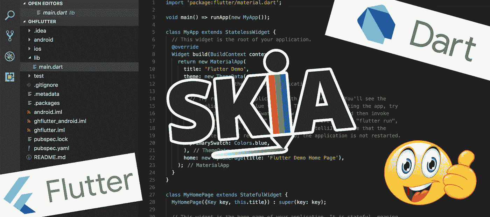

# Flutter 的 Skia 引擎将跨平台应用开发提升到了一个新的高度

> 原文：<https://levelup.gitconnected.com/flutters-skia-engine-takes-cross-platform-app-development-to-a-new-level-85cc5f92ca9b>

我被网络骂了。令人惊叹的、热情的技术爱好者和软件工程专业人士。我犯了一个*【重大错误】*忽略了我最近的软件开发女主人——Flutter——身份中无可争议的核心部分。我一直被*指责忘记提到 [Skia](https://en.wikipedia.org/wiki/Skia_Graphics_Engine) ，这个图形引擎让谷歌的新框架成为应用程序开发模块上的酷酷的新成员。*

*只不过，在我最后一篇激动人心的文章中，既不是健忘也不是无知让我轻易地掩饰了 Skia。我这样做有几个真正的原因，在这一篇中，我将试图逐一解开这些原因，并希望至少从我的角度给你一个关于 Skia 的更深入、更真实的看法。我认为对于设计者和开发者来说，理解这个引擎的优缺点并把技术术语转化成有用的和可操作的东西是很重要的。*

*我还认为，现在，经过大约一年的独立颤振发展，是时候和绝对值得有一个更详细的关于 Skia 的谈话。当然，我会努力保持公正，忠实于我的客观使命。*

*我很确定，到目前为止，任何至少建立了一个网站或原生应用程序的人都有过浏览器或操作系统方面的挫折。有些人默默忍受，有些人喜欢 StackOverflow，而[像我这样的人，把橡皮鸭扔向墙壁](https://hmh.engineering/accessibility-is-hard-toasts-popovers-jumbotrons-pills-are-ya-kidding-me-208e4b453036)，试图弄清楚事情，然后在博客上写下他们的发现，也许，仅仅是也许，对谷歌的新渲染引擎是否能在真正的跨平台 ui 中产生效果提供一些额外的启示。*

# *真的是 Skia 让 Flutter 很酷吗？*

*绝对不行。如果说我们从苹果、吉尼斯和耐克那里学到了什么的话，那就是一个好的广告很少或者从来都不是关于规格和技术术语的，即使那是一个 UI 框架。Flutter 的第一个也是最大的卖点是，现在是，将来也仍然是它无与伦比的开发者体验和浅薄的学习曲线。当我第一次坐在野马的方向盘后面时，我一点也不关心它的发动机的大小和活塞的周长。一切都是关于那辆车给我的感觉，以及当我转动点火钥匙时它发出的甜甜的咕噜声。当然，引擎提供了这一点，但最终它归结为经验。我伟大的开发者体验和发布的应用中如黄油般光滑的 UX。*

*当然，以上所述并不能抹杀 Skia 的巨大价值，但这绝不是这个框架最酷的地方。事实上，乍一看，有些人甚至会觉得它令人不快，所以谷歌对 Flutter 的营销没有 Skia 的左右和中间有点道理。可以理解。以*“这是一个由 OpenGL 驱动的画布”*开始销售一个新的跨平台框架，几乎与以*“这是一个由火花塞和一氧化二氮罐驱动的氢气球”*作为开场白销售一个假想的新一代保时捷引擎一样不负责任。没有灌输太多的信心，我脑海中浮现的第一个画面是兴登堡撞车事故，而不是速度或任何令人惊叹的东西！告诉应用程序开发人员，尤其是 web 开发人员，他们将在 Canvas 中构建应用程序，他们脑海中闪现的第一件事是…猜猜会发生什么？双关语——闪光！*

# *那么，Flutter 的 Skia 方法有多稳健呢？*

*在最初 15 分钟的狂热和关于你的新发现的不受控制的推文泛滥之后，我认为非常重要的是后退一步，问一个诚实的问题，这是一个由 OpenGL 驱动的 Canvas 应用程序，它实际上是一个好主意，还是对你、你的组织或整体而言。我并不鼓励任何人持怀疑态度，但是我们这些过去构建“跨平台”应用程序的人已经知道，承诺和推销往往远远超出了框架的真正功能和特性。不幸的是，过度销售技术是技术领域的一个趋势，所以更深入的挖掘总是值得的，尤其是如果你想用你的应用程序赚钱的话。*

## *更新。冒险，还是不冒险？*

*在跨平台应用程序开发中选择正确的框架时，首先要考虑的不仅仅是它的跨平台程度，还有操作系统更新是否会破坏应用程序。在应用程序的生命周期中，低维护需求或可忽略的维护需求可能是一个巨大的卖点，因为每一个与业务逻辑无关的更新都是公司理想情况下希望花在新功能上的成本。从长远来看，这也是一个更安全的赌注，因为突然转向一个新的框架，甚至进行本地化的风险要小得多。*

*如前所述，Skia 使用了由 OpenGL 支持的 Canvas。或者，至少，这是你在肤浅的谷歌搜索后得到的第一印象。看起来 Flutter 真的想在应用开发生态系统中分得一杯羹，因为在 2020 年中期，随着 1.17 版本的发布，它还引入了对 iOS ' Metal 的支持，这是苹果更现代的图形 API。这意味着 Flutter 应用程序现在可以智能地选择依赖哪个 api，从而为苹果 A7 和 iOS v . 8 芯片提供最佳的 GPU 支持！那是不可轻视的。与混合应用程序开发相比，webkit 功能和旧设备上的兼容性总是以这样或那样的方式阻碍你，这对设计师、开发人员和企业来说都是一个好消息。*

# *为什么以前没有这样做？*

*这是一个很好的问题，虽然我觉得自己没有足够的知识来提供一个明确的答案，但我确实有一些有根据的猜测，为什么会这样。我很乐意在评论中听到你更多的想法甚至反驳！*

## ***进化。***

*每一项新技术都必须考虑到时间，这往往会导致进化，而在迄今为止的技术中，从来没有失败过。如果我说我不认可 Xamarin ( [、MAUI](https://github.com/dotnet/maui) )、Ionic 和 React Native 等项目在应用开发领域做出的重大贡献，那我是在撒谎。所有这些都将应用程序开发推向了新的高度，并揭示了哪些有效，哪些无效。这种学习是技术和工程的关键。仅仅是前面提到的三个项目就产生了二十年的经验！Skia 和 Flutter 似乎是这种演变的下一步，他们试图从以前的错误中吸取教训，不仅解决问题，而且加以改进，目前为止基本上成功了。*

## ***硬件。***

*毫无疑问，到 2020 年，我们口袋里和桌子上的设备将比 5 年或 10 年前强大得多。我们的应用程序趋向于更加复杂，更加依赖于与网络和其他设备的连接。所有今天被称为廉价手机的东西，在 5 年和 10 年前要么不存在，要么被认为是旗舰硬件。当时，在一个 iOS 和 Android 都还不成熟的世界里，提出一个像 Flutter 这样的带有 Skia 这样的渲染引擎的库几乎没有任何意义。这一点，再加上最佳硬件的稀缺，不会让它成为一个好的商业案例。*

## ***社区。***

*我觉得这是更重要的原因之一。如果你没有开发人员社区的支持，你可以尝试推出有史以来最棒的框架或库；你要么死在水里，要么不太受欢迎，也就是迎合一个非常小的利基市场。纵观过去十年的应用程序开发趋势，开发应用程序的软件工程师和开发人员已经被许多趋势分散了注意力。一些人跳上了 Android 或 iOS 的潮流，一些人在 hybrid 上投入了大量资金，而另一些人只是坚持上网，祈祷有一天它能为他们提供原生开发体验所能提供的一切。结合我的第一点，很明显气候不适合发射 Flutter 或者任何基于 Skia 的东西。*

*然而今天，这种情绪有所改变。首先，应用程序商店在接受任何种类的源代码生成的任何应用程序方面有点挑剔。要求更加严格，用户对应用程序的期望也高得多，因此混合解决方案在工作时可能会落后，或者需要繁琐的工作区来实现应用程序商店所需的和用户预期的结果。这反过来会让开发人员感到沮丧，随后会让那些希望离开并寻找更强大的解决方案的公司感到沮丧。*

## ***工业。***

*正如我在我的[苹果 M1 可访问性文章](https://hmh.engineering/why-the-apple-silicon-m1-is-a-big-win-for-accessibility-part-one-34bf038182b6)中强调的，移动和桌面应用之间的差距似乎有缩小的趋势。一种方法是从根本上改变硬件，就像苹果那样，创造一种既能运行桌面应用又能运行移动应用的 CPU 和操作系统。*

*另一种方法——也可以说是更无摩擦的方法——是创建一个能迎合所有操作系统甚至网络的框架。虽然 10 年前的应用普遍性被认为是近乎荒谬的，5 年前是开发者的梦遗，但今天我们开始将它视为一般软件行业的期望，为 Skia 通过 Flutter 变得流行创造了最合适的时机。自从 Flutter 2 推出以来，情况更是如此，因为它现在可以在 MacOS、Windows、Linux、ChromeOS、iOS、Android 和 web 上运行。见鬼，甚至嵌入式硬件！你知道那种到处都可以穿的万能鞋吗？自从第二版发布以来，Flutter 基本上就是这样。*

# *可访问性呢？*

*与 10 年甚至 5 年前相比，2020 年的 Robust 有了全新的含义。虽然工程师、开发人员和公司在将可访问性作为应用程序设计和开发的核心支柱方面仍然相当缓慢，但它正在获得牵引力，并且只会有所改善。因此，对于公司来说，选择一个能够交付易访问性兼容应用的框架是非常重要的。*

*在旋舞 Skia 的背景下听到“Canvas”的那一刻，我有点慌了。Canvas 本身，在 web 上，是一个被充分证明的可访问性的瓶颈，所以我很自然地去*“哦不……”*并快速搜索以查看 Flutter 本身是否有一个[可访问性专用页面](https://flutter.dev/docs/development/accessibility-and-localization/accessibility)。确实如此。通读一遍，然后看下面的视频，很明显谷歌对可访问性进行了认真的思考，我的经验也证明了这一点。*

*所有开箱即用的组件都是可访问的。如果您认为这些对您来说还不够好，那也不是问题，因为它提供了一个[语义小部件](https://api.flutter.dev/flutter/widgets/Semantics-class.html)，允许您用必要的信息标记您的自定义小部件。把它想象成网络上的咏叹调。有了 Flutter 2，可访问性变得更好了，值得注意的是…*

# *满足颤振 2 和类固醇斯基亚！*

*你们当中那些今年早些时候观看了颤振主题活动的人，很可能已经注意到了 Skia 的一个重要更新，这次是 WASM 的增压。值得注意的是，谷歌并没有花太多时间——事实上，几乎没有时间——关注 Skia，而是关注 WASM 与 Skia 结合后能够实现什么。我个人认为这是经过深思熟虑的，这又回到了我的*“Skia 本身就是一种强行推销”*的论点。着眼于最终结果，并行平稳地运行四个高计算负载的浏览器窗口感觉像是更好地利用营销努力，我不得不同意这一点。没有比观看主题演讲中特定于性能的部分更好的说明方式了:*

*事实是，大多数应用程序开发人员只想开发能在尽可能多的操作系统上运行的应用程序。很少有人是技术专家，他们不仅想看发动机的活塞，还想分析制造活塞的材料。只要 Skia 不对 UX 造成实际限制，除了少数铁杆狂热分子或反对者，没人会在意。这种情况一直存在，对于大多数 UI 框架来说也是如此。*

# *我们能得出结论了吗？*

*我很高兴最终解决了 Skia 的问题，并且不是通过阅读其他人的文章并背诵它们，而是通过使用 Flutter 的第一手经验来了解和测试它的功能以及从版本 1 到版本 2 的演变。根据我的经验和发现，[的 Flutter 文档](https://flutter.dev/docs/resources/faq)对 Skia 和 Flutter 在应用渲染方面的成就是诚实的。大多数 2D 应用程序和游戏都运行良好，甚至在网络上也能流畅运行。Skia 做不到的是 3D，因此在 Dart 和 Flutter 中很难实现。虽然有添加这一功能的长期计划，但我不会屏住呼吸或在不久的将来围绕 Flutter 计划一个 3D 应用程序。*

*我认为 Flutter 有一个美好的未来，Skia 有助于实现这一目标，但它绝不是节目的明星，而仅仅是 Flutter 车轮上的一个重要齿轮。我甚至会说，忽略 Skia 和你正在构建运行在 Canvas 技术上的应用的事实。好处远远超过一些人在想到*【绘图】*应用程序而不是*它们时可能会感觉到的*【古怪】*。归根结底，成本、开发者体验和用户体验才是真正重要的，Skia 在这三个方面都做得很好。**

**保持安全，并快乐编码！**

****Attila Vago**——*高级软件工程师打造令人惊叹的 ed-tech 软件。永远的酷呆子，代码和博客的作者。网络无障碍倡导者，乐高迷，黑胶唱片收藏家。喜欢精酿啤酒！***