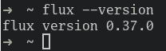
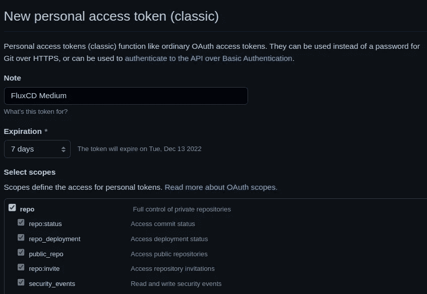
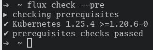
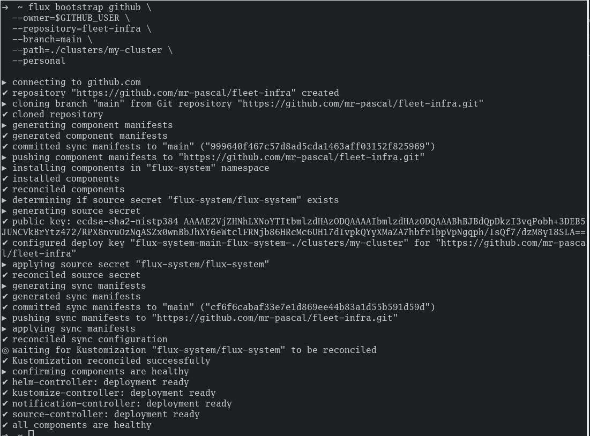
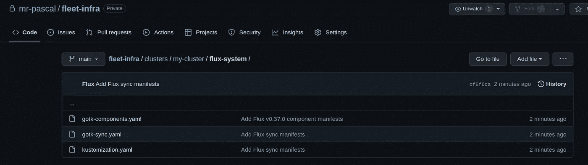
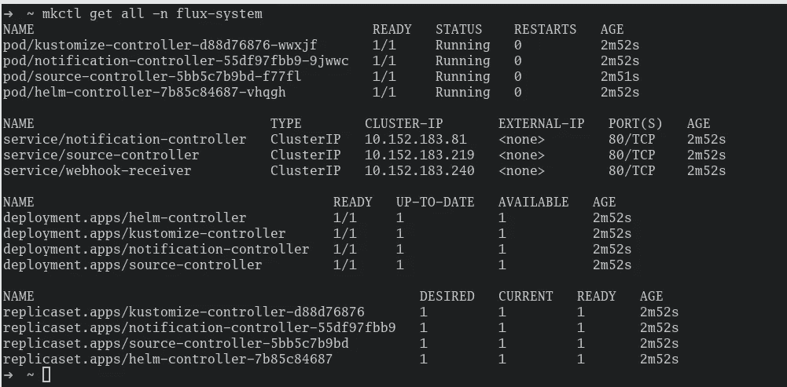
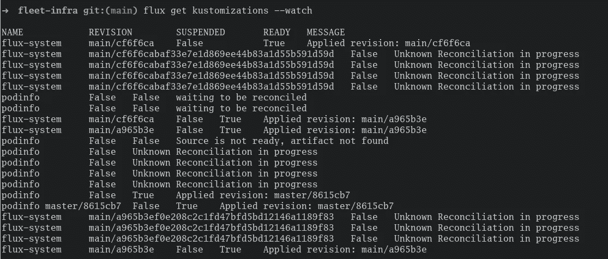
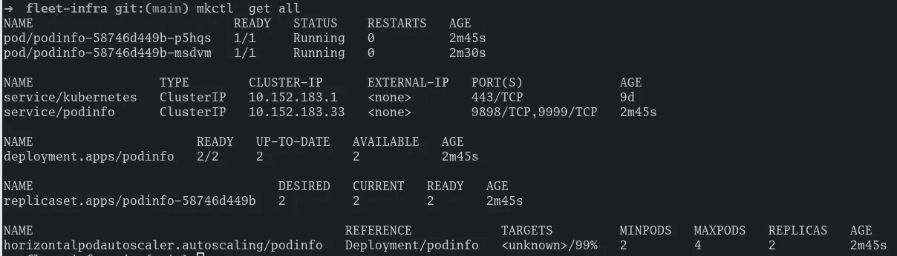

# Flux CD:入门

> 原文：<https://levelup.gitconnected.com/flux-cd-getting-started-1a06671d718f>

本简明教程将向您展示在本地集群上引导 Flux CD，并从 GitHub 库部署您的应用程序。


# 要求

*   用于测试的本地 Kubernetes 集群。例如，您可以非常快速地设置 [MicroK8s](/kubernetes-installing-microk8s-on-your-local-machine-in-5-minutes-30f9a7b48795)
*   [GitHub 帐户的个人访问令牌。](https://docs.github.com/en/authentication/keeping-your-account-and-data-secure/creating-a-personal-access-token)
*   应该为 GitHub 存储库启用 SSH(但无论如何应该是默认的)

[](/kubernetes-installing-microk8s-on-your-local-machine-in-5-minutes-30f9a7b48795) [## kubernetes:5 分钟内在本地机器上安装 MicroK8s

### 这篇简明的教程将向您展示如何在您的本地机器上使用 MicroK8s，只需 5 分钟。

levelup.gitconnected.com](/kubernetes-installing-microk8s-on-your-local-machine-in-5-minutes-30f9a7b48795) 

如果您使用的是 [MicroK8s](/kubernetes-installing-microk8s-on-your-local-machine-in-5-minutes-30f9a7b48795) ，请确保您启用了`dns`插件。否则，您可能会遇到许多网络问题。

# 简单来说什么是 Flux CD？

[Flux](https://fluxcd.io/) 是一个在 Kubernetes 上部署和管理应用的工具。它的工作原理是监视源代码库中的变化，并自动触发部署以保持您的应用程序是最新的。Flux 使用一个名为 GitOps 的概念来管理部署，这意味着您的应用程序所需的状态是在源代码中定义的，并使用 Git 进行版本控制。这种方法使得跟踪部署的变化以及与其他团队成员协作变得容易。简而言之，Flux 允许您在 Kubernetes 上自动化和管理应用程序的部署。

除此之外，它最近(2022 年 12 月初)在云计算原生计算基金会中被提升为“已毕业”状态，这清楚地表明它不仅仅是“又一个闪亮的工具”。

# 开始

首先，本教程将使用 Flux CLI 工具。我建议通过 Terraform 在进一步开发的企业架构中进行设置。一篇关于如何通过 Terraform 设置 Flux CD 的文章将随后发表。

## flux CLI

提供的 flux CLI 是一个很好的入门方式，因为它有助于引导 GitHub 存储库，设置集群的初始配置，并且只需几个命令就可以添加第一批资源。

首先，您必须在您的机器上安装 CLI。

```
# Homebrew (macOS)
brew install fluxcd/tap/flux

# Bash (macOS + Linux)
curl -s https://fluxcd.io/install.sh | sudo bash
```

之后，验证 CLI 是否按预期安装:

```
flux --version
```



通量—版本

## GitHub 凭证

首先，您必须在您的终端上导出您的 GitHub 凭证，以便 Flux 能够使用它们来引导您的 GitHub 库。

```
# Your Personal Access Token
# https://docs.github.com/en/authentication/keeping-your-account-and-data-secure/creating-a-personal-access-token
export GITHUB_TOKEN=<your-token>

# Your GitHub username
export GITHUB_USER=<your-username>
```

创建个人访问令牌时，请确保选择了“回购”部分:



## 验证 Kubernetes 集群支持

接下来，您应该运行以下命令对您的集群进行 Flux 检查，看它是否满足 Flux 正常工作的要求。

```
flux check --pre
```



通量检查-预

## 自举通量

现在有趣的部分开始了，自举。

以下命令做了很多工作:

*   代表您创建一个新的私有 GitHub 库
*   定义已创建存储库的主分支
*   在存储库中创建 Flux 样板文件，以便以后通过 Flux CD 管理 Flux CD
*   在集群上的`flux-system`名称空间中创建 Flux 资源

```
flux bootstrap github \
  --owner=$GITHUB_USER \
  --repository=fleet-infra \
  --branch=main \
  --path=./clusters/my-cluster \
  --personal
```

运行该命令应该大致如下所示:



此外，它将创建`fleet-infra`存储库，您可以随意在 bootstrap 命令中使用另一个名称来配置 Flux CD 集群。



您还可以检查您的集群，看到现在有相当多的资源在`flux-system`名称空间中启动和运行:

```
kubectl get all -n flux-system
```



## 通过 GitOps 添加新资源

接下来，我们希望通过只向 GitHub 存储库提交新的定义来利用 GitOps 方法，并让 Flux CD 处理其余的事情。Flux CD 应该自动从存储库中提取新的资源定义，并将它们应用到集群中。

让我们检查一下存储库，向其中添加更多的资源定义。

```
git clone https://github.com/$GITHUB_USER/fleet-infra
cd fleet-infra
```

现在，我们可以通过纯粹的声明性方法配置集群的第一个应用程序，并让 Flux CD 负责部署。

出于演示的目的，我们可以使用公共存储库[https://github.com/stefanprodan/podinfo](https://github.com/stefanprodan/podinfo)，它由一个用 Go 编写的小型 web 应用程序组成。

即使您可以使用任何其他带有有效 kustomize 应用程序定义的存储库(如果您手头有一个的话)。

为了让 Flux CD 知道在哪里部署应用程序，您需要定义两个 Kubernetes 资源。

一个是`GitRepository`类，它定义了 git 存储库和应该查看的分支。

第二个是`Kustomization`类型的，它定义了上述 git 存储库中的路径，以检查用于部署应用程序的`Kustomization`文件。

为了生成 Kubernetes 资源，Flux CD 需要创建的 GitHub 存储库中的 YAML 文件。您可以直接添加 YAML 文件并将其推送到存储库，或者让 Flux CD CLI 为您创建这些文件。最终，这两种方式都会导致一组 YAML 文件。

**通过 CLI 生成 YAML**

如果您想使用 CLI，您可以使用下面两个命令来生成两个必要资源的 YAML 声明。

```
# Generate GitRepository Resource YAML
flux create source git podinfo \
  --url=https://github.com/stefanprodan/podinfo \
  --branch=master \
  --interval=30s \
  --export > ./clusters/my-cluster/podinfo-source.yaml

# Generate Kustomization Resource YAML
flux create kustomization podinfo \
  --target-namespace=default \
  --source=podinfo \
  --path="./kustomize" \
  --prune=true \
  --interval=5m \
  --export > ./clusters/my-cluster/podinfo-kustomization.yaml
```

因此，现在您的计算机上应该有如下两个文件。

```
-- ./clusters/my-cluster/podinfo-source.yaml

apiVersion: source.toolkit.fluxcd.io/v1beta2
kind: GitRepository
metadata:
  name: podinfo
  namespace: flux-system
spec:
  interval: 30s
  ref:
    branch: master
  url: https://github.com/stefanprodan/podinfo
```

```
-- ./clusters/my-cluster/podinfo-kustomization.yaml

apiVersion: kustomize.toolkit.fluxcd.io/v1beta2
kind: Kustomization
metadata:
  name: podinfo
  namespace: flux-system
spec:
  interval: 5m0s
  path: ./kustomize
  prune: true
  sourceRef:
    kind: GitRepository
    name: podinfo
  targetNamespace: default
```

应用程序的最终代码结构应该如下所示:

```
fleet-infra
└── clusters/
    └── my-cluster/
        ├── flux-system/                        
        │   ├── gotk-components.yaml
        │   ├── gotk-sync.yaml
        │   └── kustomization.yaml
        ├── podinfo-kustomization.yaml
        └── podinfo-source.yaml
```

现在，您可以添加和推送两个新的资源文件，并观看 Flux CD 自动更新您的集群。

```
git add -A && git commit -m "Added podinfo application"
git push
```

在等待您的资源被应用时，您可以运行下面的命令来观察 Flux CD 如何工作。

```
flux get kustomizations --watch
```



通量获得 kustomizations 观看

正如您将在上面的图像中注意到的，Flux CD 注意到有新的变化，开始协调，然后应用修订版`master/8615cb7`。

再次在默认名称空间中显示您的所有资源将显示您有两个新的 pod，一个服务、部署和副本集，它们的名称中带有`podinfo`。



## **通过 GitOps 移除现有资源**

删除刚刚添加的资源就像添加它们一样简单。
导航至生成的`podinfo-*.yaml`文件，删除它们并提交更改。

您可以再次使用`flux get kustomizations --watch`来观察更改，并注意到在您提交 YAML 配置的删除后不久，Flux CD 将检测并删除之前创建的所有“podinfo”资源。

## 你想联系吗？

如果你想联系我，请在 LinkedIn 上打电话给我。

另外，请随意查看[我的书籍推荐](https://medium.com/@mr-pascal/my-book-recommendations-4b9f73bf961b)📚。

[](https://mr-pascal.medium.com/my-book-recommendations-4b9f73bf961b) [## 我的书籍推荐

### 在接下来的章节中，你可以找到我对所有日常生活话题的书籍推荐，它们对我帮助很大。

mr-pascal.medium.com](https://mr-pascal.medium.com/my-book-recommendations-4b9f73bf961b) [](https://mr-pascal.medium.com/membership) [## 通过我的推荐链接加入 Medium—Pascal Zwikirsch

### 作为一个媒体会员，你的会员费的一部分会给你阅读的作家，你可以完全接触到每一个故事…

mr-pascal.medium.com](https://mr-pascal.medium.com/membership)