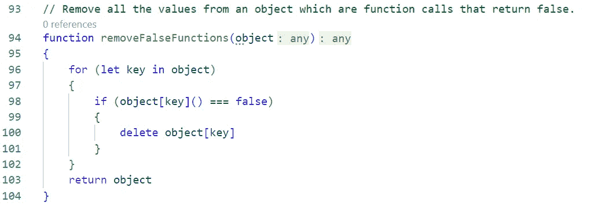
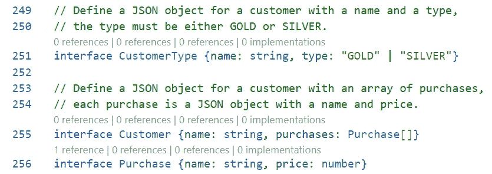

# 使用 GitHub Copilot 飞行

> 原文：<https://levelup.gitconnected.com/flying-with-github-copilot-cab566ee5d9>

今天，我在 VSCode 中安装了 [GitHub Copilot](https://github.com/features/copilot/) ，并决定看看它能对只有自然语言提示的完整功能的 Typescript 做什么。看看结果吧。我印象深刻！

# 我是如何测试的

对于所有这些例子，我只输入了介绍该函数的注释。我接受了副驾驶关于函数定义的第一个建议，以及关于(完整的)函数体的第一个建议。这里我用截图，因为 Medium 没有合适的代码块。

> Copilot 的 **#1 用例**有助于处理愚蠢、简单、样板文件，你可以写但不必写。

# 从基础开始

从基础开始，Copilot 使用 JavaScript 的内置排序函数来解决我的问题。

有一件事给我留下了很深的印象，那就是 Copilot 倾向于使用“最佳实践”和简化的做事方式，这是我非常欣赏的！我将切到 TL；DR 现在告诉你，这是 Copilot 的第一个用例:帮助编写你可以写但不必写的愚蠢、简单、样板文件。

Copilot 建议的简单代码也起到了**教导**功能的作用，因为它揭示了多少有用的 JS 工作，比如在这种情况下的排序。这个例子告诉我们，你可以用一个定制的内联函数来测试数组中的两个值。简单的阅读也显示了定制函数如何导致结果的重新排序(通过返回-1、1 或 0)。即使您不在实际代码中使用它，这个“即时复习课程”就像一个活生生的 JavaScript 精灵，如果您能把事情简化成一些简单的文字，它会向您展示一个正确的工作示例。

您还会注意到，尽管 Copilot 了解 Typescript，但它在推断(或强制)类型方面做得不太好。在这个例子中，`array`不应该是`any`，而是`string[]`。当然，按照任何像样的编码风格，这个函数的*返回类型*也不应是`any`。它也是一个字符串数组或`string[]`，但是 Copilot 还没有意识到这一点——或者至少我还没有想出如何提示/强制它这样做。

# 删除重复项

通过测试该项在数组中是否已经存在来删除重复项。

删除重复是多个解决方案的共同任务。这两种解决方案都非常优秀，展示了有趣的编码技术。

在数组的例子中，使用`.indexOf()`来测试一个项目是否已经在数组中存在是非常聪明的。当与`.filter()`结合使用时，它成为通过映射、过滤和归约来使用数组的最佳实践的一个例子——而不是遍历它们。因为这些映射函数返回修改后的数组，所以整个函数只包含了`return`语句。

巧妙地删除重复值的键！

我最喜欢的消除重复的技巧之一是将值合并成一些“测试对象”中的对象键因为对象不能有重复的键，所以不管你这样做多少次，每个对象都只有一个。显然，Copilot(以及它所学习的代码库)也喜欢这项技术，因为他们在这里使用了它。测试对象是`newObject`，仅用于强制原始值的唯一性。它没有被归还。按照要求，返回原始值，并清除重复值(特别是第二个和随后的匹配值)。如果值是新奇的，就写入测试对象来记住它。

# 转换成十六进制

Copilot 用 map()遍历数组，而不是像它应该的那样循环。

这个简单的例子展示了当您可能只是因为忘记了您知道 JavaScript 可以做的事情的确切语法而使用 Copilot 的时候。在这种情况下，事情是转换成十六进制。请注意“最佳实践”使用了`.map()` 来遍历阵列。

# 玩弄提示性措辞

副驾驶很擅长从提示中推断出你的意思。它似乎理解人类谈论代码的正常方式。换句话说，你不必有条不紊地对待每一个小部分。在这个例子中，我说“一个键、值对的数组”,它知道这意味着一个数组的数组。

奇怪的是，副驾驶用一个`for`环走阵列，这是相当*老 skool* 。我喜欢新对象的键和值是如何用嵌套数组引用赋值的。

# 描述你想要的语法

大家都知道 array.join()带分隔符吧？

这是我看到 Copilot 非常有用的另一个例子——实际上不在您的代码中，而是在附近。我不会仅仅为了找到像`.join()`这样的命令的名称或语法而用奇怪的东西污染我的代码库。但是我会把它输入到 IDE 的空白区域，这样我就可以意识到我已经知道在我真正的代码中应该写什么了。请注意，完整的、有效的语法已经显示出来了——比您在 MDN 上查找或自己动手制作例子还要快。

# 那是必然的

副驾驶理解物体上下文中的术语“给定钥匙”。

副驾驶善于理解“给定”以及它与给予者的关系。在第一个例子中，它正确地将“given”键解析为一个单独的参数，然后使用该参数获取值进行排序。排序本身显示了一个返回第一项和第二项之差的巧妙技巧。如果第二个项目大于第一个项目，这将导致排序返回小于 1 的值，就像我之前尝试的字母排序示例一样。

在第二个例子中，我们添加了删除特定值的键的需求。在这种情况下，Copilot 知道我们需要第三个参数作为值。在使用`Object.keys()`将键转换为数组，然后对它们进行排序之后，这个版本继续添加一个`.filter()`来从测试或谓词中删除不返回 true 的项——在这种情况下，键不等于*禁止的*值。

# 棘手的函数调用

在这里，我想看看我是否能欺骗 Copilot 接受文字值`false`，而不是返回`false`的函数调用。但是仔细检查发现 Copilot 用`object[key]()`给对象的值引用加了函数调用括号！这加强了我的请求中的函数调用部分。相当聪明。

# 创建 HTML

Copilot 可以轻松创建 HTML，甚至自定义元素。

在我创建 web 应用程序的工作中，我经常需要以编程方式创建的 HTML 元素。我想看看 Copilot 能不能给我做一些，包括定制的。这些结果太棒了！这正是医生吩咐的。再次注意给出的对*的正确解释。如果你像和一个学生开发者交谈一样和 Copilot 交谈，它会做得很好。*

IDE 在这里用红色波浪线抱怨，因为我没有导入`html`(或`css`)前缀。在一个真实的文件中，我会这样做，因为我整天都在使用[和](https://lit.dev)，这使得它们被大量使用。尽管没有声明，Copilot 还是正确地使用了它们，包括用于填充值的反斜杠和`${className}`花括号语法。非常好。这是一个没有例子的文件。

# 快速打字测试

先生，副驾驶知道你在说什么。

Copilot 似乎知道什么是类型，至少对于这个简单的例子是这样的。这将使定义复杂类型变得更加容易，特别是当 Copilot 开始更好地理解自定义类型和接口名称时，现在看来还不是这样。稍后会有更多的介绍。

# 复制 CSS

但是它做 CSS 吗？是啊！

CSS 是一个让人又爱又恨的东西。不是非此即彼。**都是！CSS 非常酷，也非常可怕。我喜欢网格系统，但是很难记住所有的部分。在第一个例子中，这些都是零件。Copilot 很有帮助地添加了一个`gap`(尽管使用了旧的`grid-gap`语法)来使我的专栏不会相互干扰。**

在第二个例子中，无可否认是一个高空飞行的挑战，副驾驶无法让我们完全离开地面。这里的问题是要求结果*充满屏幕。据我所知，做到这一点的唯一方法是用一个填充屏幕的容器来包围元素——通常是像`height: 100vh`这样的杂牌。恶心。反正由于 Copilot 不知道这一招或者至少没有在这里表现出来，所以横向分割的结果不会充满屏幕。*

# 业务逻辑

当书写清晰时，Copilot 在理解业务逻辑方面做得很好。

这是另一种情况，“你应该可以这样做，但是……”现在你不必这样做了。但是，*买者自负，*该函数采用您对面值折扣的定义。通过写“超过 500 美元”，正好 500 美元的购买没有资格享受折扣，这可能不是你想要的。

Copilot 将 15%的折扣变成乘以 0.85，因为我们只要求*折扣价格，*不是折扣金额。很好。为了达到这个目的，它进行了过滤以确保商品价格在 500 美元以上，然后映射过滤结果以获得折扣价。Copilot 非常擅长贴图和滤镜的组合，你也应该如此！

# 更多商业逻辑

当你写多行注释时，Copilot 从你的完整描述中推断出功能。

在这里，我尝试了稍微复杂一点的逻辑。我还使用了多行和非常随意的术语，比如，“每个客户都有一个名字。”我也给出了如何合计的说明(但没有说明放在哪里，所以没有保存)。最后，我希望为我的高级客户“打开”一个特定的钥匙。这个可爱的功能使用`.reduce()`将所有的购买组合成一个`total`。数组是用`.map()`走的。

# 非此即彼的业务逻辑

副驾驶能比你更快地处理“非此即彼”的情况。

这里有一个例子，Copilot 将一个正常人关于如何确定销售区域的描述转化为一组正确的`if, else if, else`测试。你能自己做这个吗？当然了。你能这么快吗？不。请务必检查您的工作(或者在本例中是 Copilot 的工作)，但是快速浏览一下生成的代码就会发现，它确实按照我指定的方式分配了销售区域。我可以比编写嵌套语句和多部分测试更快地阅读和验证这一点。

# 更多多部分测试

包括删除数据的业务逻辑测试。

在本例中，Copilot 接受了我的请求，在对象遍历数组中的所有客户时，通过从对象中删除该键来删除事件开始日期。注意，引用`premium`键的两种方式(“has premium set true”和“is premium”)被理解为是指同一件事。结果读起来很清楚，可以被人类理解。

# 运行函数列表

Copilot 完全理解我的请求，在这个数组上调用我已经设计好的所有函数。

在做最后一步之前，通常有必要对一系列项目做几个“准备步骤”。在这里，我想看看副驾驶是否能解决这个问题。当我在注释中写`addPremium()`作为函数调用时，下一个建议的*注释*是`setRegion()`，下一个是`setEventStartDate()`。所以在这里，Copilot 用注释提示我创建代码，而不仅仅是代码。相当狡猾。

函数体使用`.map()`处理传入的数组，并按照我们指定的顺序，正确地将单个客户对象作为`item`参数提供给每个函数调用。该数组随所做的更改一起返回。

# 简单的界面

我很高兴地看到，副驾驶可以制作一个独立的界面。

接口是 Typescript 真正伟大的事情之一，所以我想看看 Copilot 是否能制作一些。第一个相当简单。第二个更复杂。Copilot 正确地指出`Purchase`对象必须有自己的接口。在我接受第一行代码后，它立即建议了第二行代码。

请注意，虽然在其他地方 Copilot 没有尝试使用自定义类型，但在这个例子中，它显然使用了自定义类型，而且使用得很好。它明确定义并使用了`Purchase`类型，而不是依赖于一个通用数组。似乎需要短语“一个 JSON 对象”来生成它。也许这就是为什么它没有在其他地方这样做。或者，它只能在接口定义中集成类型，而不能在函数定义中集成类型。

# 复杂、依赖的接口

在这里，我使用了“JSON object”这个短语和几行业务逻辑，以得到我想要的东西:一个接口，或者更准确地说，一组接口。Copilot 正确地推断出我们需要*四个接口*,并且它主动提出编写所有的接口，每一个接口都是在接受了之前的接口之后编写的。Copilot 做得很好，把日常用语如“有多个学生”变成了一个数组，而“学生数”是一个简单的数字。它也没有被“每个教室”和“教室有”之间的不同措辞所迷惑，也没有被这些相互分开的指示所迷惑。

就像这个简单的例子一样，这些更复杂的接口，比如 Classroom，恰当地使用了`Student[]`语法来强制使用一个`Student`数组，而不是一个`any`数组，然而我们在我的函数定义例子中看不到这种行为。

# 把所有的放在一起

尽管我尽了最大努力，我还是无法让副驾驶列出一系列学校，只能列出一系列学校。

在我的最终测试中，我希望 Copilot 能够理解我的学生和教室对象，因为它刚刚定义了它们。我很失望，它没有。我甚至尝试了不同的用法，比如使用“学校对象”或者“上面定义的学校对象”它甚至提示这些注释，但没有交付承诺的代码，它不使用我的任何自定义接口。

所以最后，这在某种程度上是生产中的一大败笔。Typescript(相对于普通 JS)提供的最重要的优势是创建和实施自定义接口的能力。如果 Copilot 让我手动这样做，它也会让我在尝试手动将该函数参数中的每个`any`转换为具有适当 TS 类型的变量时引入错误。

有趣的是，代码将正确工作，并且它实际上依赖于前面的定义。只有当带有那个键的项是一个数组时，`item.teachers.length`的赋值才能用来计算教师的数量。的确如此，但这仅仅是因为它是在界面中定义的 Copilot 没有将该界面添加到代码中。

# 结论和后续步骤

我喜欢与副驾驶一起工作，并给它这个小试验。在上下文中，我认为它非常有用，我打算继续尝试。但对我来说，这里最重要的一点是，像任何复制/粘贴代码一样(你可以把 Copilot 想象成*robot to*copy/paste，它为你改变函数和参数名)，你需要完全理解它写了什么。

我会说一个很好的试金石是，“你能理解 Copilot 写的东西足以向另一个程序员解释吗？”如果没有，那么在将这个建议添加到您的产品代码之前，将它作为学习的起点(MDN 文档仍然是 T2 的天下)。

相比之下，如果建议的解决方案显然是正确的，并且您可以自己编写和理解它，那么 Copilot 就为您节省了大量时间，并且可能会减少一些由打字错误、缺少参数、错误测试或我们都会犯的其他小错误引起的错误。

在我的下一轮试验中，我想看看我是否能迫使 Copilot 在使用定制界面方面做得更好，这将是在生产代码中使用它的最重要的方面。

暂时结束，感谢您的阅读！我很想听听你对[黑客新闻](https://news.ycombinator.com/item?id=31914360)的评论。

*— D*