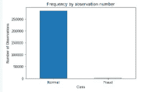

# 焦点缺失:专注于困难的事情

> 原文：<https://levelup.gitconnected.com/focal-loss-focus-on-whats-hard-aa603197cc04>

## 一种解决目标检测中类别不平衡的新损失方法

***您将了解焦点损失，如何在对象检测中使用它来检测硬负样本，然后对不平衡数据集实施焦点损失。***


照片由[埃琳娜·塔拉年科](https://unsplash.com/@elenatrn?utm_source=unsplash&utm_medium=referral&utm_content=creditCopyText)在 [Unsplash](https://unsplash.com/s/photos/focus?utm_source=unsplash&utm_medium=referral&utm_content=creditCopyText) 拍摄

焦点损失是基于这样的前提，即训练集中在一组稀疏的硬例子上，并且防止大量的易底片在训练期间淹没对象检测器。

## 物体探测器的类型

**一级检测器是一种简单、高效且优雅的架构；因此它们更快更简单。目标检测网络的输出是每个空间位置的分类概率和盒子偏移。**

**例子:YOLO、SSD、RetinaNet、CenterNet、CenterNet 等。**

**两级探测器的管道更加复杂**。第一阶段使用区域提议网络从整个图像中过滤出具有包含物体的高概率的区域，并且生成候选物体位置的稀疏集合。这些 RPN 然后被馈送到第二阶段，其中区域卷积网络(R-CNN)获得分类分数和空间偏移。

**示例:R-CNN、快速 R-CNN、更快 R-CNN、R-FCN 和 Libra R-CNN**

与两级检测器相比，一级对象检测器的准确性受到影响，因为很少图像位置包含对象。**密集检测器的训练遇到极端的前景-背景类别不平衡，导致训练不充分。**

一级检测器中前景类和背景类之间的类不平衡导致两个问题。

*   培训效率低下，因为大多数地点或班级都是容易被否定的，无助于有用的学习。
*   容易否定的课程会淹没训练并导致退化的模型

> **通过将损失函数从交叉熵损失改为焦点损失，可以提高一级物体检测器的精度。**

***什么是焦损？***

焦点损失通过对分配给分类良好的示例的损失进行向下加权来重塑标准交叉熵损失，从而解决了类别不平衡问题。

> 焦点损失通过降低简单例子的权重，将培训集中在一组稀疏的硬例子上，以防止大多数容易否定的例子淹没培训

***焦点丢失如何解决阶层失衡问题？***

**聚焦损失是一种新的损失函数，它在交叉熵损失函数中增加了一个调制因子，聚焦参数γ ≥ 0。**


**聚焦参数** γ **在训练期间自动降低简单示例的权重，同时将模型训练聚焦在困难示例上。**


焦点损失和交叉熵损失

焦损失的超参数γ用于调整不同样本的权重。当γ > 0 时，它减少了分类良好的例子的相对损失。

随着γ的增加，更少的容易分类的样本导致训练损失。当γ达到 0 时，焦损失与交叉熵损失相同。


来源:[密集物体探测的焦点损失](https://arxiv.org/pdf/1708.02002.pdf)

在上图中，我们观察到焦点损失的两个特性。

1.  当一个例子被错误分类，并且 pt 很小时，调制因子接近 1，并且损失不受影响。当 pt → 1 时，调制因子变为 0，对于分类良好的示例，损耗被向下加权。
2.  聚焦参数γ平滑地调整简单示例向下加权的速率。

当γ = 0 时，FL 相当于 CE，随着γ的增加，调制因子的效果也增加(我们发现γ = 2 在我们的实验中效果最好)。

**焦点损失的α平衡变体**


**α平衡焦损失**

其中α可用于分别缩放不同的类。

α平衡的变体比非α平衡的形式产生稍好的精确度。

**α平衡变体**加权焦点损失用于处理前景和背景类别不平衡以及硬阴性样本的梯度显著性。

实验表明，焦点损失使得能够训练高精度一级检测器，该检测器显著优于诸如自举或硬示例挖掘之类的训练的替代技术来处理类别不平衡。

**在这里** 学习其他处理不平衡数据集的技术[](https://towardsdatascience.com/techniques-for-handling-imbalanced-classification-datasets-5ee58b0b5e7a)

**在非平衡数据集上为结构化数据实现无焦点。**

**[信用卡欺诈数据集](https://www.kaggle.com/mlg-ulb/creditcardfraud/data)**

****读取数据集****

```
**import pandas as pd
import numpy as np
df = pd.read_csv("creditcard.csv")**
```

**在数据中绘制正常交易和欺诈交易**

```
**import matplotlib.pyplot as plt
LABELS = ["Normal","Fraud"]
count_classes = pd.value_counts(df['Class'], sort = True)
count_classes.plot(kind = 'bar', rot=0)
plt.xticks(range(2), LABELS)
plt.title("Frequency by observation number")
plt.xlabel("Class")
plt.ylabel("Number of Observations");**
```

****

**我们有 284315 笔正常交易，只有 492 笔欺诈交易**

****实现焦损****

**创建从***TF . keras . losses . Loss*a**继承的类 FocalLoss，并基于[**密集对象检测的焦点损失**](https://arxiv.org/abs/1708.02002) 实现如上所述的 FocalLoss**

```
**import tensorflow as tf
from keras.callbacks import ModelCheckpoint, TensorBoard
from keras import regularizers
class FocalLoss(tf.keras.losses.Loss):
    def __init__(self, gamma=2., alpha=4.,
                 reduction=tf.keras.losses.Reduction.AUTO, name='focal_loss'):**
        """Focal loss for multi-classification
        FL(p_t)=-alpha(1-p_t)^{gamma}ln(p_t)
        Notice: y_pred is probability after softmax
        gradient is d(Fl)/d(p_t) not d(Fl)/d(x) as described in paper
        d(Fl)/d(p_t) * [p_t(1-p_t)] = d(Fl)/d(x)
        Focal Loss for Dense Object Detection
        [https://arxiv.org/abs/1708.02002](https://arxiv.org/abs/1708.02002)Keyword Arguments:
            gamma {float} -- (default: {2.0})
            alpha {float} -- (default: {4.0})
        """
        **super(FocalLoss, self).__init__(reduction=reduction,
                                        name=name)
        self.gamma = float(gamma)
        self.alpha = float(alpha)****def call(self, y_true, y_pred):**
        """
        Arguments:
            y_true {tensor} -- ground truth labels, shape of [batch_size, num_cls]
            y_pred {tensor} -- model's output, shape of [batch_size, num_cls]Returns:
            [tensor] -- loss.
        """
        **epsilon = 1.e-9
        y_true = tf.convert_to_tensor(y_true, tf.float32)
        y_pred = tf.convert_to_tensor(y_pred, tf.float32)****model_out = tf.add(y_pred, epsilon)
        ce = tf.multiply(y_true, -tf.math.log(model_out))
        weight = tf.multiply(y_true, tf.pow(
            tf.subtract(1., model_out), self.gamma))
        fl = tf.multiply(self.alpha, tf.multiply(weight, ce))
        reduced_fl = tf.reduce_max(fl, axis=1)
        return tf.reduce_mean(reduced_fl)**
```

****创建训练和测试数据集****

```
**from sklearn.model_selection import train_test_split
RANDOM_SEED = 314 
TEST_PCT = 0.4 
batch_size = 128****def feature_normalize(dataset):
    mu = np.mean(dataset, axis=0)
    sigma = np.std(dataset, axis=0)
    return (dataset - mu) / sigma** **X, y = df.iloc[:,:-1], df.iloc[:, -1]
y = tf.keras.utils.to_categorical(y, num_classes=0)
X = feature_normalize(X)
X_train, X_test, y_train, y_test = train_test_split(X, y, test_size=TEST_PCT, random_state=RANDOM_SEED)****X_train = X_train.values
X_test = X_test.values**
```

****创建模型****

```
**input_dim = X_train.shape[1]
nb_classes = y_train.shape[1]****model_f = tf.keras.Sequential(
 [tf.keras.layers.Dense(10, input_dim=input_dim, activation='relu', name='input'),
  tf.keras.layers.Dense(20, activation='relu', name='fc1'),
tf.keras.layers.Dense(10, activation='relu', name='fc2'),
tf.keras.layers.Dense(nb_classes, activation='softmax', name='output')])****model_f.summary()**
```

****

****编译模型****

```
**cp_f = tf.keras.callbacks.ModelCheckpoint(filepath=”FL.h5",
 mode=’max’, monitor=’val_accuracy’, verbose=2, save_best_only=True)****model_f.compile(metrics=[‘accuracy’],
 loss=FocalLoss(alpha=.25, gamma=4.3),
 optimizer=tf.keras.optimizers.Adam(1e-2))**
```

****拟合模型****

```
**history = model_f.fit(X_train, y_train,
                    epochs=5,
                    batch_size=batch_size,

                    validation_data=(X_test, y_test),
                    verbose=1,
                    callbacks=[cp_f]
                    ).history**
```

****评估模型性能****

```
**from sklearn.metrics import confusion_matrix, precision_score, recall_score, accuracy_score, f1_score
predictions = model_f.predict(X_test)****act_test=[0 if y_test[i][0] == 1\. else 1 for i in range(len(y_test))]
pred_f = [0 if predictions[i][0] > 0.5 else 1 for i in range(len(predictions))]****print(" Accuracy: ",accuracy_score(act_test, pred_f))
print(" Recall: ",recall_score(act_test, pred_f))
print(" Precision: ",precision_score(act_test, pred_f))
print(" F1-Score: ",f1_score(act_test, pred_f))
print(confusion_matrix(act_test, pred_f))**
```

****

**考虑到数据集不平衡，我们有 284315 个正常交易，只有 492 个欺诈交易，准确度、精确度、召回率和 F1 值都很好。**

## **结论:**

**焦点损失通过降低分配给分类良好的示例的损失的权重来解决类别不平衡。它使用超参数“γ”来调整不同样品的重量。**

## **参考资料:**

**[密集物体探测的焦损失](https://arxiv.org/pdf/1708.02002.pdf)**

**[联邦学习中不平衡数据分类的聚焦损失](https://arxiv.org/pdf/2011.06283.pdf)**