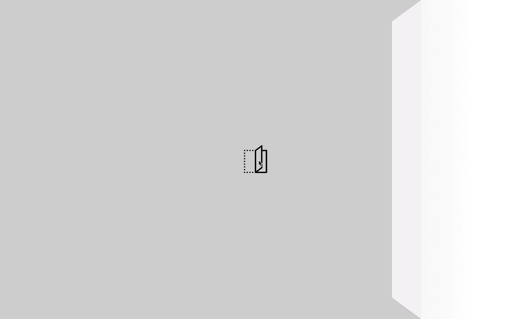
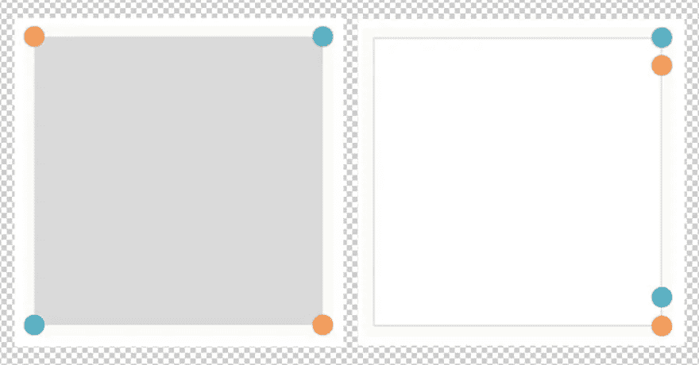

# 用 CSS 折叠平面

> 原文：<https://levelup.gitconnected.com/folding-the-flat-with-css-3a88bd0ecd0b>

## 一种纯粹的 CSS 方法，将屏幕外的面板折叠成平面。



[演示](https://elmahdim.github.io/OffScreenPanel/)

在本文中，我们将创建一个屏幕外面板，它具有折叠效果和内部内容的弹性运动。

这些年来，我在互联网上看到了很多很酷的演示，都是用 Canvas、Threejs 和所有这些沉重的技术完成的。从那以后我一直在寻找更简单的方法！

前几天我有一个任务，为我正在做的项目建立一个聊天面板，点击用户个人资料上的“发送消息”按钮就会出现，这样用户就可以互相交流了。在完成主要功能并充分工作后，基于我们的工作流程，我必须在完成后将其转发给 QA 团队，以便他们开始测试！在这种情况下，我有足够的时间，我想用较少的努力使聊天成为一个可折叠的动画面板🦸‍♂️.片刻之后，我刮了刮胡子，决定使用一点 CSS `transition`和[剪辑路径](https://developer.mozilla.org/en-US/docs/Web/CSS/clip-path) `polygon(...)`来完成这个功能/任务。

# 演示

我在这个演示中使用了一个 [CRA](https://github.com/facebook/create-react-app) 样板来创建一个[反应](https://reactjs.org/)组件。但你可以坚持使用你觉得合适的筹码。

演示链接:[https://elmahdim.github.io/OffScreenPanel/](https://elmahdim.github.io/OffScreenPanel/)

# 屏幕外面板组件

```
import React, { useState } from 'react';
import classNames from 'classnames';
import PropTypes from 'prop-types';import styles from './OffScreenPanel.module.css';export const OffScreenPanel = (props) => {
  const [open, toggleVisibility] = useState(false);
  const toggle = () => toggleVisibility(!open); return (
    <div className={classNames('offScreenPanel', {
      [styles.open]: open
    })}>
      <button type="button" className={styles.button} onClick={toggle}>
        ....
      </button>
      <div className={styles.panel}>
        <div className={styles.body}>{open && props.children}</div>
      </div>
      <div role="presentation" className={styles.overlay} onClick={toggle} />
    </div >
  );
};OffScreenPanel.propTypes = {
  children: PropTypes.any,
};export default OffScreenPanel;
```

上面的代码代表了一个使用[钩子](https://reactjs.org/docs/hooks-intro.html)和 [CSS 模块样式表](https://facebook.github.io/create-react-app/docs/adding-a-css-modules-stylesheet)的功能性`OffScreenPanel`组件。

# 普通 HTML

我们需要折叠/展开面板的主要元素没有反应。

```
<div class="offScreenPanel open">
  <div class="panel">
    <div class="body">...</div>
  </div>
  <div role="presentation" class="overlay"></div>
</div>
```

在`offScreenPanel`元素上`open`类是可切换的(通过 JavaScript)。它没有关联的样式。

`panel`元素负责折叠/展开其布局。我们有两个选择来达到这个效果:添加两个额外的元素，或者使用一个 CSS 伪元素！

我将选择第二个选项，它使用伪元素(`::before`，`::after`)。它使我们的标记更干净，HTML 代码更少。

内部内容将由元素`body`包装。

# 风格

```
/*
 * panel:
 * is out of screen (offset right) by default
 */
.panel {
  position: fixed;
  top: 0;
  right: 0;
  width: 450px;
  bottom: 0;
  z-index: 2;
  transform: translateX(450px);
}/*
 * panel:
 * on open we set its horizontally offset to "0"
 */
.open .panel {
  transform: translateX(0);
  transition: all 400ms ease;
}/*
 * panel - the folding element [[]]
 * make each element half width of its parent (panel) size
 */
.panel::before,
.panel::after {
  content: '';
  position: absolute;
  top: 0;
  bottom: 0;
  width: 225px;
  transition: all 400ms ease-out;
}/*
 * panel - the folding element []]
 */
.panel::before {
  clip-path: polygon(100% 10%, 100% 0, 100% 100%, 100% 90%);
  left: 0;
}/*
 * panel - the folding element []]
 */
.panel::after {
  background: #f0f0f0 linear-gradient(to right, #f7f7f7 0%, #fff 100%);
  clip-path: polygon(100% 50%, 100% 0, 100% 100%, 100% 50%);
  right: 0;
}/*
 * panel - the folding element []]
 */
.open .panel::before,
.open .panel::after {
  clip-path: polygon(0 0, 100% 0, 100% 100%, 0 100%);
}/*
 * panel - the folding element [[]
 * giving the left panel a paper book like background,
 * off-white and light grey
 */
.open .panel::before {
  transition-delay: 400ms;
  background: #f0f0f0 linear-gradient(to right, #f3f3f3 0%, #f1f1f1 48%, #f1f1f1 100%);
}/*
 * body, one thin line centered by default
 */
.body {
  position: absolute;
  top: 0;
  right: 0;
  height: 100%;
  left: 0;
  background-color: #fff;
  transition: all 300ms cubic-bezier(0.22, 0.61, 0.36, 1);
  z-index: 1;
  clip-path: polygon(50% 50%, 50% 50%, 50% 50%, 50% 50%);
}/*
 * body, folded and fits its parent with on open
 */
.open .panel .body {
  transition-delay: 0.8s;
  clip-path: polygon(0 0, 100% 0, 100% 100%, 0% 100%);
}/*
 * overlay, hidden by default. to overlap the content behind
 * and closes the panel on click outside
 */
.overlay {
  background-color: rgba(0, 0, 0, 0.2);
  position: fixed;
  visibility: hidden;
  top: 0;
  right: 0;
  bottom: 0;
  width: 100%;
  height: 100%;
  z-index: 1;
  opacity: 0;
}/*
 * overlay, visible on open
 */
.open .panel + .overlay {
  opacity: 1;
  visibility: visible;
  transition: all 400ms ease;
}
```

这是它在两种状态下的样子:默认和打开

