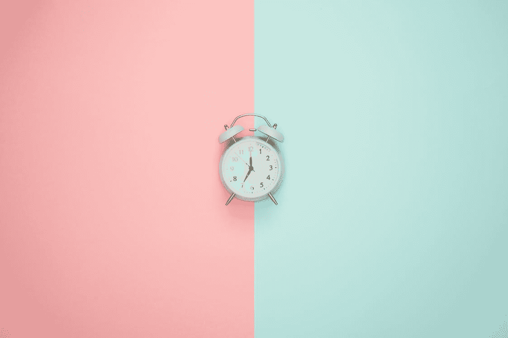
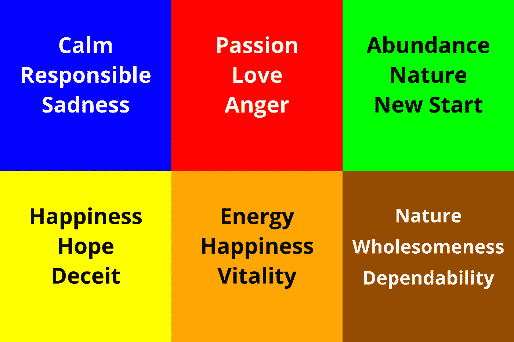
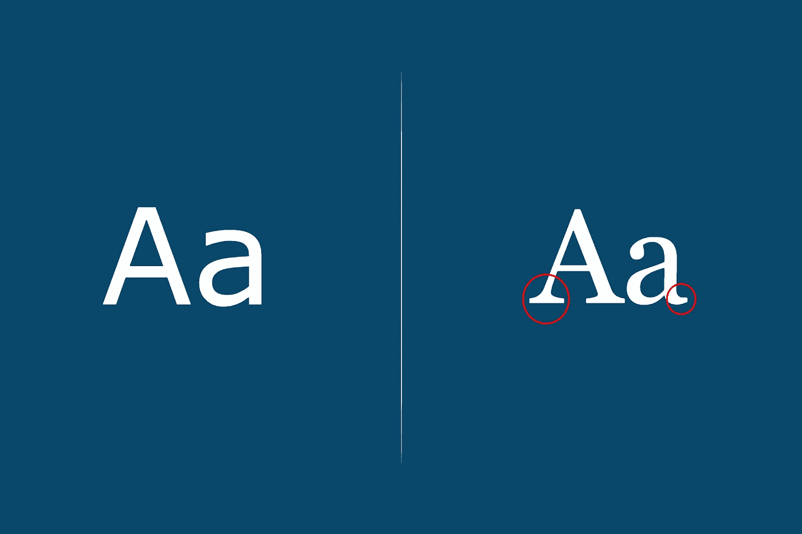

# 前端:用 CSS 增强样式

> 原文：<https://levelup.gitconnected.com/font-end-enhancing-styling-with-css-31fb81a4ae27>

由[驼鹿照片](https://www.pexels.com/@moose-photos-170195/)

在用 HTML 创建了一个网页的结构，然后添加了一些风格，例如一些显示变化和屏幕上元素的一些重新排列，即使在你感觉好像已经完成了你的项目之后，它看起来仍然有点乏味。

当涉及到改进你的网页的样式时，会涉及到许多不同的因素。在你的网页中，你需要添加颜色、字体、按钮样式、链接样式等...当谈到改进你的页面风格时，这个列表应该已经在你的线框和/或[设计系统](https://devart1st.github.io/Design-System/)中完成了。我只是涵盖了除链接之外的列出的项目，目前，如果你对[线框](http://LINK)感兴趣，我有另一个帖子更深入地讨论它是什么，它如何工作，以及如何开始。

深入了解在进一步设计网站风格时可以做出哪些改进。

# 颜色

网页中的颜色起到了使内容流行或赋予页面意义的作用。在颜色如何有意义以及它的基础是什么的背后，有一套完整的理论。我只是简单介绍一下颜色在网站设计中的主要作用。当你用颜色创建一个网站时，你通常会有一套颜色，也就是你为整个网站或网页挑选出来的调色板。您的方案可以包括诸如主要颜色、次要颜色和强调颜色等内容。

在你的网页中使用颜色赋予[以](https://www.adobe.com/creativecloud/design/discover/color-meaning.html)的含义。

# 排印

除了你的颜色选择，你还想包括排版来显示你的意思的深度。在你的网站开发中有两种主要的字体类别。那些是衬线和无衬线字体。这两者是有区别的。无衬线字体用于网站标题、标题、副标题等。另一种字体叫做衬线字体，最适合用在信息文本或段落文本上，比如这篇中号文章，这样更容易阅读和/或浏览文本文档。

被我

这两种字体的区别在于，在无衬线字体中，左边的字体没有脚，而在有衬线字体中，右边的字体底部有小脚。

# 小跟班

让用户浏览你的网站。按钮是一个很好的选择，或者你在问卷中使用了一个按钮，你想告诉用户什么是可点击的答案，什么不是。最常用的按钮有两种:方形按钮和扁平按钮。在 20 世纪 80 年代后期流行的 skeuomorphic 按钮设计中，有一种风格看起来是 3D 的，但是当你点击按钮时，它会给人一种你正在按下按钮的感觉。外形设计不再常用，但一些设计师今天仍在使用它。

而异形按钮设计是一种选择。现在被过度使用的最常见的按钮样式是平按钮设计。使用伪类 *:hover* 和 *:active* 创建起来很简单，不像 skeuomorphic 只使用了 *:active* 伪类。下面是一个平面按钮设计的例子。

考虑到所有这些改进，作为开发人员，您现在可以回顾项目，甚至是您现在正在处理的当前项目，并可能用本文中提到的一些设计原则来增加它的趣味。