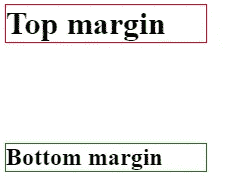

# 前端:边距折叠

> 原文：<https://levelup.gitconnected.com/font-end-margin-collapse-c54cceba8b01>

在最近的[文章](https://medium.com/@artistdev/front-end-box-modeling-101-3e4be4f4a282)中，我谈到了页边空白以及如何将页边空白相加来创造空间。当您在两个垂直平行的元素之间创建边距时。然后将这两个元素相加，在它们之间创建一个空间总和。

另一方面，垂直元素，意思是一个在另一个之上，一个在另一个之下，完全消除了计算。网页如何计算这两个元素的边距是通过取具有最大顶部或底部边距值的元素，并将空间值设置为等于较大的值。

```
//HTML<h1>Top margin</h1>
<h2>Bottom margin</h2>____________________________________________________________________//CSSh1{
  border: solid 1px red;
  margin-bottom: 100px;
  width: 200px;
}h2{
  border: solid 1px green;
  margin-top: 50px;
  width: 200px;
}
```

如果我们看一下上面的示例代码，输出结果会是这样的:



在这两个元素之间，在这个 h2 之上的 h1 元素具有 **100px** 的*边距底部*，而 h2 具有 **50px** 的*边距顶部*。这就是发生边距塌陷的地方，h1 元素被计算为两个元素之间的整个间距，因为它的边距为 100 像素，而 h2 的边距为 50 像素。

> h1{
> 边框:纯色 1px 红色；
> 边距-底部:100px
> 宽度:200px
> }
> 
> h2{
> 边框:纯色 1px 绿色；
> margin-top:0；
> 宽度:200px
> }

因此，如果我们将 h2 上的*页边距顶端*设置为 ***0px*** ，您会注意到结果将保持不变。这也是因为利润率大幅下降。


在我看来，在上下两个元素之间使用边距可以归结为在它们之间使用边距。我宁愿选择顶部元素，并添加底部边距。就这样，我在自上而下的努力着！