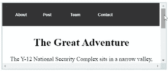

# 前端:定位你的元素

> 原文：<https://levelup.gitconnected.com/font-end-positioning-your-elements-23407ce8e343>


由 [**阿克松萨特**翁](https://www.pexels.com/@aksonsat-uanthoeng-393797)

控制元素的位置和它们的显示形式真的可以改变网页的风格！

在 CSS 内部，您可以使用名为*位置*的属性来定位您的元素。属性允许您指定元素的位置。该属性可以设置的值有*静态*、*相对*、*绝对*、*固定*和*粘性*。

这些值中的每一个都有自己独特的方式来控制网页上的显示位置。当涉及到使用*位置*属性的布局时，它可能会变得有点混乱，但是，我将使用一些措辞解释来更深入地探讨这个主题。默认情况下，页面上的每个元素都设置了*静态*值，这意味着所有元素都遵循它们在 HTML 文档中的位置顺序，并随网页正常滚动。

# 相对和绝对

通过将元素的位置设置为相对于的*位置，您将设置其相对于页面上默认位置的位置，这也使您能够使用*顶部*、*右侧*、*底部*和*左侧*属性来偏移移动元素。当将该值设置为子元素的父元素的位置时，这将在您决定更改子元素的位置值而不是相对值时，将子元素的位置*相对于父元素的位置*。*

```
//HTML<div class="parent">
  <div class="child"></div>
</div>____________________________________________________________________//CSS.parent{
  background-color: red;
  position: relative;
  width: 500px;
  height: 100px;
}.child{
  background-color: green;
  position: absolute;
  width: 150px;
  height: 100px;
  top: 100px;
}
```


但是如果我们将 parents 元素设置回默认值，那么看看绿色块会发生什么！

> 。母体{
> 背景色:红色；
> **位置:静态；**
> 宽度:500px
> 高度:100px
> }


子页面不再与父页面相关，这意味着它的位置偏离了基于页面正文的位置。

导致进入所谓的绝对*位置*。设置该值时，元素的位置相对于其最近的父元素。您也可以移动具有偏移属性的元素。以及从文档流中移除的元素，但是当页面滚动时，它仍将与文档的其余部分一起移动。

# 固定的；不变的

假设你想让你的导航条在你滚动的时候保持在你网页的顶部，不管发生什么。嗯，这就是*固定*的位置值发挥作用的地方。这个值的概念与绝对值非常相似，只是它总是在视图中。

```
<div class="parent">
  <header>
    <nav>
          <ul>
            <li> About </li> <li> Post </li> <li> Team </li> <li> Contact </li>
          </ul>
        </nav>
  </header>
 <main>
  <h1>The Great Adventure</h1> <p>The Y-12 National Security Complex sits in a narrow valley, surrounded by wooded hills, in the city of Oak Ridge, Tennessee. Y-12 and Oak Ridge were built secretly, within about two years, as part of the Manhattan Project, and their existence wasn’t publicly acknowledged until the end of the Second World War. By then, the secret city had a population of seventy-five thousand. Few of its residents had been allowed to know what was being done at the military site, which included one of the largest buildings in the world. Y-12 processed the uranium used in Little Boy, the atomic bomb that destroyed Hiroshima. Seven decades later, Y-12 is the only industrial complex in the United States devoted to the fabrication and storage of weapons-grade uranium. Every nuclear warhead and bomb in the American arsenal contains uranium from Y-12.</p> </main>
</div>
```

> 页眉{
> 背景色:# 333333；
> **位置:固定；**
> z-index:10；
> 宽度:25%；
> }

下面是我将标题部分设置为固定时发生情况:



# 粘的

有一种类似于固定位置的东西，叫做*粘性*。sticky 值的作用与 fixed 值相同，但是当您到达文档中的容器时，它将会消失。

```
<div class="parent">
 <main>
  <h1>The Great Adventure</h1>
   <p>The Y-12 National Security Complex sits in a narrow valley, surrounded by wooded hills, in the city of Oak Ridge, Tennessee. Y-12 and Oak Ridge were built secretly, within about two years, as part of the Manhattan Project, and their existence wasn’t publicly acknowledged until the end of the Second World War. By then, the secret city had a population of seventy-five thousand.</p> 
   <header>
    <nav>
          <ul>
            <li> About </li> <li> Post </li> <li> Team </li> <li> Contact </li>
          </ul>
        </nav>
     </header>

   <p>Few of its residents had been allowed to know what was being done at the military site, which included one of the largest buildings in the world. Y-12 processed the uranium used in Little Boy, the atomic bomb that destroyed Hiroshima. Seven decades later, Y-12 is the only industrial complex in the United States devoted to the fabrication and storage of weapons-grade uranium. Every nuclear warhead and bomb in the American arsenal contains uranium from Y-12.</p>
 </main>
</div>
```

> 页眉{
> 背景色:# 333333；
> **位置:粘性；**
> z 指数:10；
> 宽度:100%；
> 底部:80px
> }

将位置设置为 stick，然后移动到文档的中心，这就是结果。


定位可能是一个挑战，但通过一点点练习和努力，你可以很快理解，并且能够在任何项目中流利地使用定位！