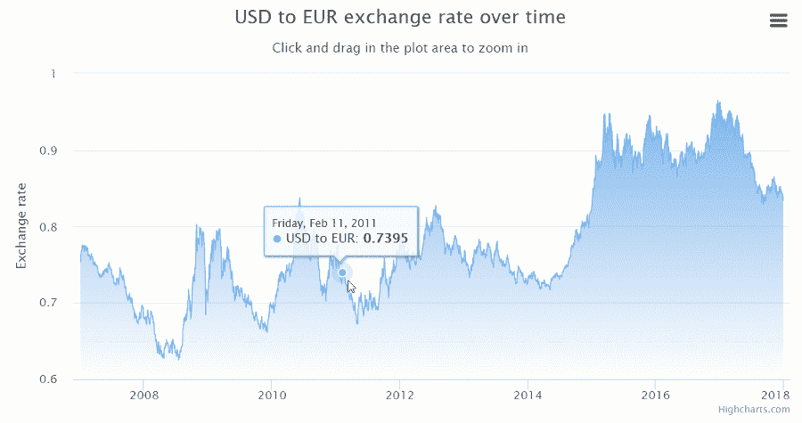
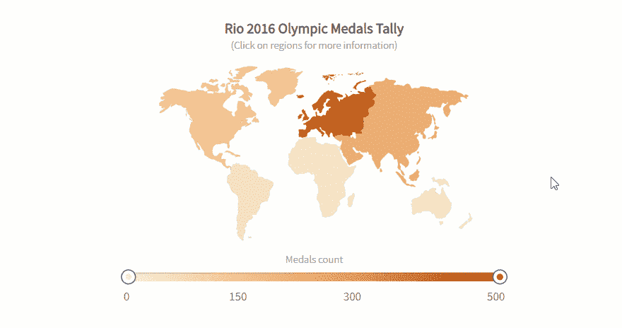
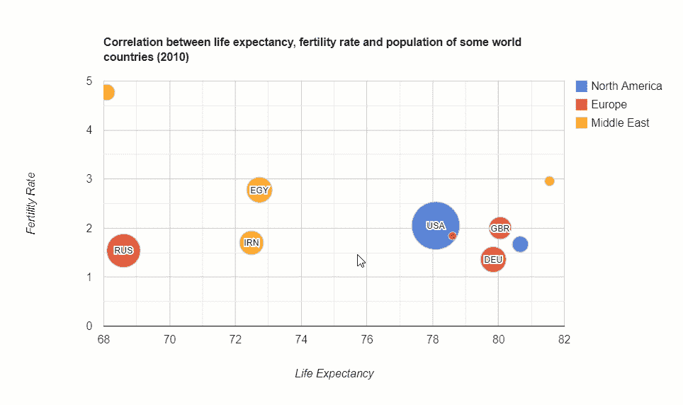
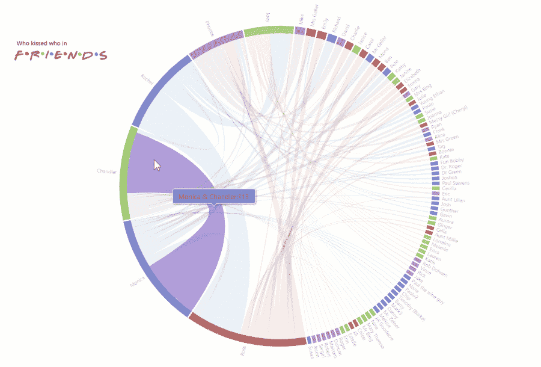
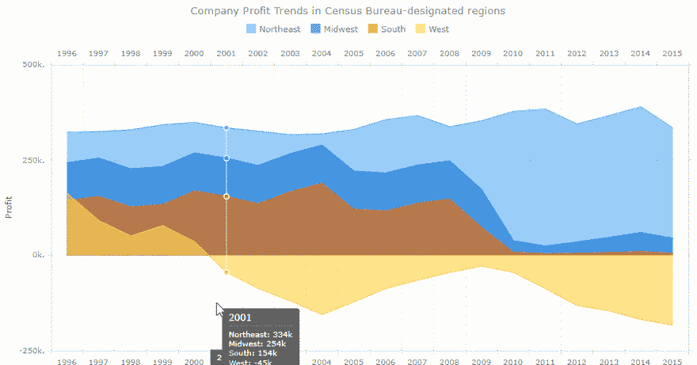
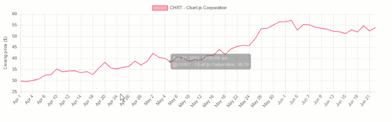

# 用 JavaScript 构建仪表板的图表库

> 原文：<https://levelup.gitconnected.com/for-developers-charting-libraries-to-build-dashboards-with-62475bd2db98>

员工经常花费数小时试图用不方便的工具编写有意义的报告，这极大地消耗了团队的效率。

为了防止这种情况发生，你可以为他们提供**随时可用的数据仪表盘**，配备**互动功能**和**可理解的可视化**。

作为一名开发者，你可以借助 JavaScript 库在你的应用中构建一个数据仪表板。

这种方法的优点是它使开发变得灵活——您可以控制仪表板的所有方面(包括视觉和功能方面),并在需要时对其进行定制。

# 从哪里开始

首先，了解你的问题和目标。

由于任何仪表板的**核心目的**都是传达一目了然的可操作信息，因此您需要找出影响深远的分析目标，并定义特定部门要衡量的指标或 KPI。

其次，定义仪表板的**结构**。数据仪表板可以由不同复杂性的许多元素组成:*图表、表格、地图、图形、网络、图表、文字云、时间线、小部件*等。

全功能仪表板的关键特征是*易于定制*和显示数据趋势。

记住这一点，我们决定为您提供流行的 **JavaScript 数据可视化** **库**的概述，这些图表可以用作仪表板的组件。我们还将关注“**数据透视表+图表**的组合，并展示如何使用 **WebDataRocks Pivot** 和任何列出的图表库来构建仪表板。

但是首先，说几句关于 WebDataRocks 的话。

[**web data rocks**](https://www.webdatarocks.com/?r=gb)**是一个免费的轻量级 JavaScript 数据透视表组件，运行在任何浏览器上，集成了任何**前端**和**后端**技术。其功能主要旨在以快速高效的方式创建**表格报告**。**

**最酷的事情是，您可以将该组件集成为**嵌入式商业智能**解决方案的一部分。**

**其**核心特征**是:**

*   **聚合函数。**
*   **通过**拖放**将数据切片。**
*   **用于跟踪自定义指标的计算值功能。**
*   ****基于成员和值的过滤**。**
*   ****可以应用于整个报告的报告过滤器**。**
*   **通过**条件格式**突出显示单元格。**
*   ****数字格式化**。**
*   ****穿透钻取**功能有助于了解聚合值背后的记录。**

**还有很多！**

**所有这些报告功能都可以通过用户界面获得，这使得 **WebDataRocks Pivot** 对于数据分析来说至关重要。**

**数据透视表有一条*平滑的学习曲线*。要探索更多功能，请参考我们的 [UI 指南](https://www.webdatarocks.com/doc/ui-guide/)。如果你喜欢代码优先的方法，欢迎你更深入地研究 [API 参考](https://www.webdatarocks.com/doc/api-list/)。**

## **集成**

**可用的集成教程将指导您在 [React](https://www.webdatarocks.com/doc/integration-with-react/) 、 [Angular](https://www.webdatarocks.com/doc/integration-with-angular/) 、 [AngularJS](https://www.webdatarocks.com/doc/integration-with-angularjs/) 和 [jQuery](https://www.webdatarocks.com/doc/integration-with-jquery/) 项目中使用枢轴。**

**另一个引人注目的特性是，您可以将 pivot 控件用于您选择的任何图表库。**

# **图表**

**我们很高兴向您展示我们的 **top of charting libraries** ，您可以使用 WebDataRocks。📊**

****

**[GitHub](https://github.com/highcharts/highcharts) 上有超过 8K 颗星，[**high charts**](https://www.highcharts.com/)**库在市场上的免费和商业图表解决方案中占据领先地位。它被广泛应用于不同的行业:从计算机软件和 It 到高等教育和金融服务。它也受到脸书、微软、StackOverflow、万事达卡等顶级公司的青睐。****

****您可以在 jQuery 或其框架上运行它。****

****很容易上手——只需通过 CDN、npm、Bower 或本地安装软件包。****

## ****数据****

****您可以从 CSV 文件、HTML 表格或 Google Sheets 加载数据。您甚至可以可视化服务器上的实时数据。****

## ****图表类型****

****Highcharts 库提供了一整套图表: **Highstock** ， **Highmaps** ， **Highcharts Gantt** 。****

****基本图表包括仪表图、面积图、面积线、条形图、柱形图、误差线、箱线图、漏斗图、热图、折线图、饼图、极坐标范围图、瀑布图、散点图、样条图、树状图等。****

********

## ****集成选项****

****支持 TypeScript，React，Django 集成。****

## ****证明文件****

****文档分为包含逻辑链接教程的主题。您可以很快习惯所有主要概念，并着手创建更复杂的图表。****

****一个特别的兴趣点是[用例](https://www.highcharts.com/use-cases/)部分。在这里，您可以查看行业特定用法的真实示例。****

## ****用户化****

****您可以通过选项配置许多方面:****

*   ****通过更改颜色、渐变、轴、标题、预定义的样式来自定义图表的设计，甚至创建您的主题。****
*   ****添加向下钻取，缩放功能，工具提示，气泡图例，滚动条。****
*   ****使图表具有响应性。****

****还可以通过编写[定制插件](https://www.highcharts.com/docs/extending-highcharts)来扩展 Highcharts 功能。****

## ****总印象****

****Highcharts 脱颖而出，这要归功于各种各样适用于各种用途的响应图表和易用性——该代码对开发人员非常友好。****

****如果你想有效地交流你的数据，这个库是一个完美的选择。****

> ****带有**high chart**和 **WebDataRocks** 的仪表盘:****
> 
> ****[销售仪表板](https://codepen.io/webdatarocks/pen/gExZoP)****
> 
> ****[带有 WebDataRocks 的仪表板& Highcharts:探索“巧克力棒评分”数据集](https://codepen.io/webdatarocks/pen/gdzWPJ)****

********

****[**FusionCharts**](https://www.fusioncharts.com/) 是用 JavaScript 编写的最广泛使用的图表库之一。****

## ****图表类型****

****它提供三种类型的安装:通过 CDN，npm 或本地。****

****一旦您开始使用 FusionCharts，大量的图表可供您使用:地图、柱形图、条形图、折线图、面积图、饼图、圆环图、堆积图、气泡图、散点图、热图、甘特图、折线图、项目符号图、仪表图等等。****

********

****所有图表都按用途分类，并附有您可以使用的代码。****

****大多数图表都有 3D 版本。还有他们的实时图表，这意味着你可以通过图表流实时数据。另一个好处是有很多用于时间序列分析的图表。****

## ****集成选项****

****它很容易与 **React** 、 **Angular** 、 **jQuery** 、 **Vue** 、 **Ember** 、 **AngularJS** 、 **React Native** 等前端技术集成。此外，它还能很好地与用 Java、PHP、Ruby on Rails、Django、ASP.NET 和 T23 编写的应用兼容。****

****如果你想把 FusionCharts 和 **Highcharts** 整合起来——也不是问题。****

## ******定制选项******

****通过更改颜色、标题、标签、添加工具提示、动画和导出选项、应用主题来个性化图表。使用 API 事件，您可以围绕组件构建自定义场景。****

****你甚至可以添加一个特殊的扩展，使图表更容易被任何终端用户访问，并且在任何屏幕和设备上都非常好看。****

## ****证明文件****

****文档是用户友好的—它引导您从基础到高级自定义图表的创建。更重要的是，您可以看看如何使用各种框架来构建每个图表。****

****如果您想发展讲故事的技巧并学习如何交流信息，我们强烈建议您深入研究 [**数据故事**](https://www.fusioncharts.com/datastories/worlds-top-cities-for-people-and-planet) 部分，在那里您可以找到许多面向行业的演示。****

## ****总印象****

****无论您的专业水平如何，都需要花一点时间来弄清楚图表是如何工作和配置它们的。这都要归功于大量的例子。****

> ****带有 **FusionCharts** 和 **WebDataRocks** 的仪表盘:****
> 
> ****[用数据透视表和图表进行销售分析](https://codepen.io/webdatarocks/pen/KEeprz)****
> 
> ****[带有数据透视表和图表的仪表盘:黑暗主题](https://codepen.io/webdatarocks/pen/qvpjGm)****
> 
> ****[三维条形图和数据透视表](https://codepen.io/webdatarocks/pen/yrxzrX)****

********

****[**谷歌图表**](https://developers.google.com/chart/) 是创建基于网络的数据可视化最流行的服务之一。它由谷歌创建和维护。****

****您可以通过简单地在您的 web 页面中包含 JS 脚本和加载器来安装它。****

## ****数据****

****使用 Google Charts 最简单的方法是在图表配置中设置 JSON 数据。在引擎盖下，它将由**数据表**和**数据视图**类表示。****

****其他选项包括从您的数据库连接数据，从 **Salesforce** 、 **Google Fusion Tables** 或 **Google Sheets** 导入数据。作为一个高级选项，您可以实现数据源协议，用来自自定义数据源的数据填充图表。****

****此外，您可以在电子表格中嵌入图表。****

## ****图表类型****

****它提供了用于各种目的的预构建可视化:条形图、柱形图、组合图、面积线、地理图、饼图、圆环图、气泡图、散点图、直方图、仪表图、时间线、烛台图、单词树等等。****

********

## ******集成选项******

****没有官方的框架集成指南，但是你可以找到热情的开发人员贡献的 [Angular](https://github.com/FERNman/angular-google-charts) 、 [React](https://github.com/rakannimer/react-google-charts/tree/cc749cf9ec8f8072c9965b1436b9f9547e147196) 、 [Vue](https://www.npmjs.com/package/vue-google-charts) 和 [TypeScript 定义](https://www.npmjs.com/package/@types/google.visualization)的包装器。****

## ****用户化****

****您可以通过在图表的`draw()`方法中设置选项来轻松定制每个图表的外观。****

****改变坐标轴、格式化器、线条、十字线、点、叠加、工具提示、动画、添加工具栏——一切皆有可能。****

****如果你想根据用户的动作运行某些场景，或者描述放置在同一网页上的图表和小部件之间的复杂交互，你可以用[事件](https://developers.google.com/chart/interactive/docs/events)来完成。****

****选择的图表在材料设计中可用，这使得图表在任何应用程序中看起来都很现代。****

## ****证明文件****

****该库的功能是有据可查的，堪称典范。文档的结构很直观，由许多教程组成。它指导您完成可视化数据的所有重要方面:从安装库到创建高级 web 仪表板。****

## ****总印象****

****对于初学者和熟练的开发人员来说，图表都很容易使用。****

> ****查看如何使用 **WebDataRocks Pivot** 和 **Google Charts** 构建仪表板:****
> 
> ****[销售分析](https://codepen.io/webdatarocks/pen/VRmpXx)****
> 
> ****[带有谷歌图表地图的 WebDataRocks 数据透视表](https://codepen.io/webdatarocks/pen/aPyNJW)****
> 
> ****[利用 WebDataRocks 和谷歌图表进行营销分析](https://codepen.io/webdatarocks/pen/QzbdKa)****
> 
> ****[WebDataRocks 与谷歌图表:气泡图](https://codepen.io/webdatarocks/pen/GPBRwW)****

********

****[**am charts**](https://www.amcharts.com/)**是一个图表库，可以用真正**吸引眼球的可视化效果**照亮任何项目。在客户中，有亚马逊、易贝、微软、思科、苹果、贝宝等一大批杰出的公司。******

****该库可以在任何平台和浏览器上运行，并且可以在移动平台上使用。****

****您可以通过 CDN、npm 包含它，或者直接安装在您的服务器上。****

****请注意，您的浏览器必须支持 SVG 技术(这适用于所有现代浏览器)。****

## ******图表类型******

****为了让它在移动设备上完美工作，你可以激活触摸特定的 UX 功能。****

****一系列图表包括饼图、折线图、柱形图、金字塔图、极坐标图、哑铃图、气泡图、堆积柱形图、甘特图、直方图等等。它还带有大量图表，用于可视化**时间序列数据**。你也可以用地图可视化地理数据。****

********

****使用最少的代码行和基于对象的方法，您可以构建任何图表。****

## ****集成选项****

****可以配合香草 JavaScript、 [React](https://www.amcharts.com/docs/v4/getting-started/integrations/using-react/) 、 [Angular2+](https://www.amcharts.com/docs/v4/getting-started/integrations/using-angular2/) 项目使用。它还集成了 [Ember](https://www.amcharts.com/docs/v4/getting-started/integrations/using-ember/) 、[requires js](https://www.amcharts.com/docs/v4/getting-started/integrations/using-requirejs/)、 [Cordova / PhoneGap](https://www.amcharts.com/docs/v4/getting-started/integrations/using-cordova/) 、 [webpack](https://www.amcharts.com/docs/v4/getting-started/integrations/using-webpack/) 。你可以把它作为 [WordPress](https://www.amcharts.com/docs/v4/tutorials/using-amcharts-wordpress-plugin/) 的插件。****

****最新版本是用 TypeScript 编写的，因此，与这种语言集成没有问题。****

## ****用户化****

****您可以定制颜色、渐变、图案、主题、缩放和本地化图表。此外，可以启用图表的响应设置，使它们在任何设备的屏幕上看起来都很准确。适配器可用于覆盖默认功能。****

****此外，图表支持从右到左(RTL)语言，如阿拉伯语、阿拉姆语、希伯来语、波斯语等。****

****为了用新特性补充现有功能，您可以加载额外的插件(例如，回归趋势线、切片分组器)****

## ****证明文件****

****我们想指出的是，该产品有很好的文档记录，并且文档由逻辑部分很好地组织起来。此外，每个演示都包含源代码，有助于理解如何在框架中使用图表。您可以简单地复制粘贴并创建一个图表。****

## ****总印象****

****总而言之，这个图书馆绝对值得你关注。请在您的数据可视化项目中随意使用它。****

> ****查看如何使用 **amCharts** 和 **WebDataRocks Pivot** 创建仪表板:****
> 
> ****[WebDataRocks 和 amCharts:带有圆环图的数据透视表](https://codepen.io/webdatarocks/pen/xoLZPv)****

********

****[**AnyChart**](https://www.anychart.com/) 是一个 JavaScript 库，提供了一组漂亮的图表，可以在任何设备和浏览器上运行，包括 IE 6，可以与任何 app 集成。****

****世界各地的许多公司、创业公司、政府和教育机构都选择 AnyChart。在最大的公司中，有微软、福特、三星、美国电话电报公司、诺基亚、博世、甲骨文、麦当劳、花旗银行等等。****

## ****图表类型****

****有一系列产品有不同的用途。您可以使用 **AnyStock** 可视化财务数据，使用 **AnyMap** 在地图中显示数据，使用 **AnyGantt** 跟踪组织内部的绩效。****

****您可以尝试的其他类型的图表和地图有面积图、条形图、条形图、饼图、排列图、折线图、误差图、气泡图、樱桃图、项目符号图、柱形图、仪表图、地图、烛台图和项目符号图等等。都值得关注。****

********

****此外，图表列表也在不断更新。****

## ****集成选项****

****与脚本语言(PHP、ASP、ColdFusion、Perl)配合良好。****

****计划与 Elasticsearch 和 Backbone 集成。****

## ****用户化****

****您可以手动或通过使用脚本自定义所有内容。****

## ****证明文件****

****该文档允许轻松地浏览使用图表的所有一般概念。它分为几个部分:[通用用户指南](https://docs.anychart.com/Quick_Start/Quick_Start)是一个很好的起点，包含所有属性和方法的 [API 参考](https://api.anychart.com/)，运行图表的沙箱[游乐场](https://playground.anychart.com/)，以及发现各种图表的 [Chartopedia](https://www.anychart.com/chartopedia/usage-type/) 。****

## ****总印象****

****这个轻量级的图表库提供了活泼的可视化，值得成为您的数据可视化项目的一部分。****

> ****带有 **WebDataRocks** 和 **AnyChart** 的仪表盘:****
> 
> ****[AnyChart 仪表和 WebDataRocks 枢轴](https://codepen.io/webdatarocks/pen/BXaddK)****

********

****[**ChartJS**](https://www.chartjs.org/) 是一个免费开源的 **JavaScript** 图表库。****

****开始很容易:您可以通过 CDN、Bower、jsDelivr 或 npm 安装它并创建您的第一个图表。****

## ****数据****

****要用信息填充图表，您应该确保您的数据符合特定类型的可视化所需的结构。在大多数情况下，它是一个数字或对象的数组。****

## ****图表类型****

****您可以添加到项目中的图表有八种:**条**、**线**、**饼**、**雷达**、**面积**、**气泡**、**散点**和一个**极区。******

********

****所有图表都以所有现代浏览器都支持的`canvas`元素呈现。****

## ****用户化****

****您可以配置字体、颜色、文本、工具提示、刻度、图表大小、渐变，以及添加可脚本化的属性和过渡。****

****特别酷的是能够**配置动画**。有许多缓动功能可以修改图表的运动。****

****此外，尝试使用[插件](https://www.chartjs.org/docs/latest/developers/plugins.html)——它们代表了改变图表的额外方式。****

## ****集成选项****

****您可以将 ChartJS 与 plain JS 和各种捆扎机一起使用。还有[反应](https://www.npmjs.com/package/react-chartjs-2)、[流星、](https://github.com/romyngo/meteor-chartjs)、【Vue】、[余烬](https://github.com/aomran/ember-cli-chart)、[棱角](https://jtblin.github.io/angular-chart.js/)糖纸可供选择。****

****我们建议尝试 ChartJS 的[扩展，它扩展了原始图表库的功能。这些扩展是由开发人员贡献的——您可以支持这一趋势，并提出您的改进图表的想法。](https://github.com/chartjs/awesome)****

## ****证明文件****

****最重要的信息在[文档](https://www.chartjs.org/docs/l)中触手可及，该文档简短而全面。****

## ****总印象****

****ChartJS 是轻量级和简单的。它所提供的可视化对于基本的数据探索已经足够了。但是如果您需要更多样的图表(例如，用于统计分析或可视化地理空间数据)，最好坚持使用本文列表中的其他解决方案。****

> ****查看如何使用 **WebDataRocks Pivot** 和 **ChartJS** 创建数据仪表板:****
> 
> ****[带极坐标图和透视网格的销售仪表板](https://codepen.io/webdatarocks/pen/bJyrmG)****

# ****把所有的放在一起****

****在这篇博文中，我们介绍了顶级的 JavaScript 数据可视化库，并展示了如何将它们结合起来。我们鼓励您花些时间探索交互式仪表盘中的数据。希望这些将有助于改善您的数据分析，并为您的企业带来价值。****

# ****额外:数据透视表个性化****

****我们认为定制应该很容易。因此，我们准备了大量教程来使您的数据透视表组件具有独特的外观和工作方式:****

*   ****[如何改变数据透视表的主题](https://www.webdatarocks.com/doc/changing-report-themes/)****
*   ****[如何给透视表的单元格着色](https://www.webdatarocks.com/doc/colorizing-cells/)****
*   ****[如何定制透视表工具栏](https://www.webdatarocks.com/doc/customizing-toolbar/)****
*   ****[如何为透视表创建自定义主题](https://www.webdatarocks.com/doc/custom-report-themes/)****
*   ****[如何本地化数据透视表](https://www.webdatarocks.com/doc/language-localization/)****

## ****🤓如何成为更好的开发者****

****寻找提高编程技能的方法？试试 [**GitConnected**](https://gitconnected.com/learn) —在这里你可以找到丰富的最新编码教程集合。****

*****最初发表于*[*https://www.webdatarocks.com*](https://www.webdatarocks.com/blog/best-6-charting-libraries-to-build-dashboards-with/)*。*****